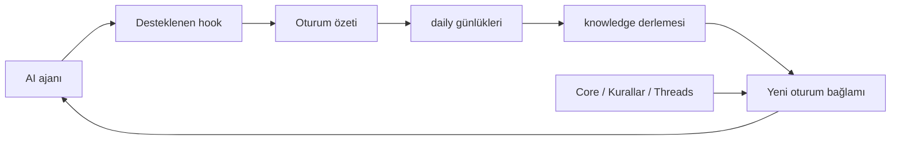

<div align="center">

# 🧠 Respected Brain

### Ajanlar değişir. Ortak hafıza sizin kasanızda kalır.

Claude Code · Codex · Cursor · Antigravity · Gemini CLI

</div>

Respected Brain, yerel bir Markdown not kasasını AI araçlarına bağlayan açık kaynak bir hafıza programıdır. Desteklenen hook olayları sohbetlerden günlük özet üretir; bilgi derleyicisi bunları bağlantılı notlara dönüştürür. [Obsidian](https://obsidian.md) kasayı okumak ve düzenlemek için kullanılabilir.

**Taşınan şey iş bağlamıdır:** kararlar, kurallar, günlük özetleri ve notlar. Sağlayıcıların özel sohbet ekranları, hesapları ve bütün ham geçmişleri birbiriyle birleştirilmez. Model çağrıları yerel CLI üzerinden sağlayıcıya gider; “yerel kasa” bütün AI işlemlerinin çevrimdışı olduğu anlamına gelmez.

---

## 1. Nasıl çalışır?



Örnek: Antigravity ile çalışırken alınan karar ortak kasaya yazılır. Codex aynı kasaya bağlandığında bu notlardan bağlam alabilir. Bunun çalışması için ilgili entegrasyonun kurulmuş, hook'un etkin/güvenilmiş ve özetleme CLI'ının kullanılabilir olması gerekir. Her sohbetin eksiksiz yakalandığı veya otomatik özetlerin hatasız olduğu garanti edilmez.

## 2. Program, ayarlar ve notlar nerede?

| Alan | Windows varsayılanı | İçerik |
| --- | --- | --- |
| **Program — AppRoot** | `%LOCALAPPDATA%\Programs\RespectedBrain` | `respectedbrain.exe`, `app/` içindeki paket/çalışma ortamı, hazır içerikler, `uninstall/` |
| **Teknik veri — DataRoot** | `%LOCALAPPDATA%\RespectedBrain` | `config.json`, sahiplik manifesti, log, işlem yedekleri, kasa UUID'sine bağlı state/cache/overrides |
| **Not kasası — VaultRoot** | Kurulumda seçtiğiniz yol | İnsan notları, daily, knowledge, Companion, projeler, Templates, `.obsidian`, `.respected.json` |

```text
Program klasörü                  Teknik veri klasörü          Seçtiğiniz not kasası
RespectedBrain/                  RespectedBrain/              BenimBeynim/
├── respectedbrain.exe           ├── config.json              ├── daily/
├── app/                         ├── logs/                    ├── knowledge/
│   └── respectedbrain/          ├── backups/                 ├── 🔮 850-Companion/
│       └── resources/           └── vaults/<UUID>/           ├── 🏰 300-Projects/
└── uninstall/                       ├── state/               └── .respected.json
                                    ├── cache/
                                    └── overrides/
```

**Runtime** programı çalıştıran motor ve bağımlılıklardır; kurulu paketin içindedir. **Template** yeni boş kasaya bir kez verilen başlangıç notlarıdır. Güncelleme mevcut notları şablonla yeniden yazmaz. **Kasa adı** sizin seçiminizdir; `RespectedOS` olmak zorunda değildir. Tam platform yolları [mimari rehberinde](docs/ARCHITECTURE.md).

## 3. Kurulum ve ilk kullanım

Windows native kurucu adı `RespectedBrain-Windows-Setup.exe`; macOS dağıtımı DMG, Linux dağıtımı `.run` olarak üretilir. Native program kendi çalışma ortamını içerir; son kullanıcı ayrıca Python kurmak zorunda değildir. AI özetleme için kullanmak istediğiniz yerel sağlayıcı CLI'ında oturum açmanız gerekir.

| Yapacağınız iş | Rehber |
| --- | --- |
| İlk kurulum / kaynak ile native paket farkı | [Kurulum](docs/guides/SETUP.md) |
| Windows program ve kasa seçimi | [Windows kurulumu](docs/guides/SETUP-WINDOWS.md) |
| macOS / Linux paket ve konumları | [POSIX kurulumu](docs/guides/SETUP-POSIX.md) |
| Kurulumdan sonraki ilk konuşma | [İlk çalıştırma](docs/guides/BOOTSTRAP.md) |
| Notlar, günlük, brifing, arama, panel | [Günlük kullanım](docs/guides/DAILY_USE.md) |
| Claude Code, Codex, Cursor, Antigravity, Gemini CLI bağlantıları | [Çoklu AI](docs/guides/MULTI_AI.md) |
| Ayarların yeri ve kasa seçimi | [Yapılandırma](docs/guides/CONFIGURATION.md) |
| Güncelleme / onarım / eski kurulum | [Güncelleme](docs/guides/UPDATE.md) |
| Veri yedekleme | [Yedekleme](docs/guides/BACKUP.md) |
| Kaldırma | [Kaldırma](docs/guides/UNINSTALL.md) |
| Bir şey çalışmıyorsa | [Sorun giderme](docs/guides/TROUBLESHOOTING.md) |

Paket üretim tarifi, indirilebilir bir sürümün yayımlandığı kanıtı değildir. Kaynak `main`, CI artifact'ı ve herkese açık release farklı şeylerdir. [Güncel durum](docs/PROJECT_STATUS.md) bunların kapsamını ayırır.

## 4. Sık sorulanlar

**Ek API anahtarı gerekir mi?** Çekirdek ek anahtar deposu istemez; model işleri yerel sağlayıcı CLI'ını kullanır. CLI'ın hesabı, aboneliği/kotası ve ağ erişimi geçerlidir. Arka plan işlemleri ücretsiz/sınırsız model kullanımı sağlamaz.

**Özetleyiciyi değiştirebilir miyim?** `respectedbrain configure --summary-provider codex` tercihi ayarlara kaydeder. Bu komut kod yazdığınız ajanı değiştirmez. `auto` ve hata/fallback ayrımı [çoklu AI rehberinde](docs/guides/MULTI_AI.md).

**İki ajan aynı kasayı kullanabilir mi?** Evet; program yazıcıları ortak kilit protokolünü kullanır. Aynı notu iki editörde elle değiştirmek yine çakışabilir. Başka programların kilit protokolüne uyduğu garanti edilmez.

**Arama anlamsal mı?** Mevcut motor SQLite FTS5/BM25 tam metin aramasıdır; embedding/vector veritabanı değildir. Model derlemesi ve bilgi bağlantıları, aramanın kendisini embedding araması yapmaz.

**Programı güncellersem/kaldırırsam?** Güncelleme sahipli program dosyalarını yönetir. Kaldırma not kasasını hedeflemez; teknik veri varsayılan korunur. Çakışmış veya sonradan değişmiş dosyalarda işlem durabilir; “her durumda hiçbir hata olmaz” garantisi verilmez.

**Platform doğrulandı mı?** Tarihli [test kanıtına](docs/TEST-MATRIX.md) bakın. CI'da gerçek OS çalıştırması, fixture ve giriş yapılmış sağlayıcı oturumu farklı doğrulamalardır. Sadece Windows testi fiziksel macOS/Linux/WSL kanıtı sayılmaz.

## 5. Geliştirici için

```text
secondbrain/
├── src/respectedbrain/     Program modülleri ve resources
├── packaging/             Windows / macOS / Linux paket tarifleri
├── tools/                 Build, dağıtım doğrulama, atlas araçları
├── tests/                 Kaynak / paket / platform testleri
├── docs/                  Kullanım, mimari, kanıt ve tarihli kayıtlar
└── pyproject.toml         Paket sürümü ve bağımlılık tanımı
```

Kaynak geliştirme **Python 3.10+** ister. Çekirdek zorunlu üçüncü taraf Python bağımlılığı içermez; build araçları `dev` extras, sağlayıcı CLI'ları/Restic ise kullanılan özellik için harici programlardır.

```powershell
python -m pip install -e ".[dev]"
python -m respectedbrain --version
python tools/build_installer.py --platform windows --output dist
python tools/verify_distribution.py --distribution dist/RespectedBrain --platform windows
```

Bu build komutlarını uygun Windows geliştirme ortamında çalıştırın; Inno Setup gerekir. Diğer platformların native paketi o platformda üretilir. Geliştirme ayrıntıları [geliştirici rehberinde](docs/development/README.md).

[📚 Belge merkezi](docs/README.md) · [🗺️ Eksiksiz dosya atlası](docs/REPOSITORY_MAP.md) · [🔐 Güvenlik sınırları](docs/SECURITY.md)

## Atıf ve lisans

Bilgi derleme yaklaşımı [Andrej Karpathy'nin LLM bilgi tabanı deseninden](https://gist.github.com/karpathy/442a6bf555914893e9891c11519de94f) ilham alır. Proje [Avenox Beyin](https://github.com/avenoxai/avenoxbeyin) MIT lisanslı geçmişinden doğdu; commit geçmişi ve atıf korunur. [MIT lisansı](LICENSE).

Hazır paket içeriğinin kaynak yolu `src/respectedbrain/resources/` olur.
