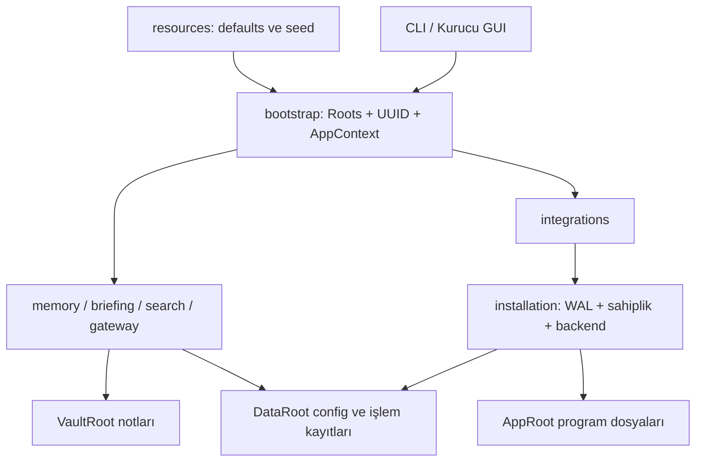

# 🏗️ Respected Brain — Güncel Mimari

> Tek program paketi, ayrı teknik veri alanı ve kullanıcıya ait not kasası. Bu rehber mevcut kaynak düzenini açıklar; onaylı tasarımın geçmişi [karar kaydında](decisions/MODULAR_FOUNDATION.md), aktif durum [proje durumunda](PROJECT_STATUS.md) bulunur.

## 1. Üç ayrı kök

| Alan | Windows | macOS | Linux |
| --- | --- | --- | --- |
| AppRoot | `%LOCALAPPDATA%/Programs/RespectedBrain` | `~/Applications/RespectedBrain.app` | `~/.local/lib/respectedbrain` |
| DataRoot | `%LOCALAPPDATA%/RespectedBrain` | `~/Library/Application Support/RespectedBrain` | `$XDG_DATA_HOME/respectedbrain`, yoksa `~/.local/share/respectedbrain` |
| VaultRoot | Kullanıcının seçtiği mutlak yol | Kullanıcının seçtiği yol | Kullanıcının seçtiği yol |

Windows Known Folders, yönlendirilmiş Documents/LocalAppData konumlarını çözmek için kullanılır. Varsayılan kasa adı `RespectedOS`; macOS/Linux'ta Documents yoksa kullanıcı kökü baz alınır. Kasa adı değişebilir. AppRoot/DataRoot/VaultRoot birbirini içermemelidir. Linux kurulumunda kullanıcı launcher'ı `~/.local/bin/respectedbrain` olur.

AppRoot, çalışabilir paket ve hazır kaynakları içerir. Windows'ta çalışma ortamı `app/`, macOS'ta launcher `Contents/MacOS`, bağımlılıklar `Contents/Frameworks` içindedir. Kaynak projenin `runtime/`, `installer/`, `template/` kökleri kaldırılmıştır; DataRoot'ta ayrı motor/scripts ağacı yoktur.

DataRoot'ta `config.json`, `install-manifest.json`, log/işlem yedekleri ve `vaults/<UUID>/{state,cache,overrides}` bulunur. Kullanıcı notları ve `.obsidian` kasadadır; marker `.respected.json` taşınabilir UUID/schema içerir, makine yolları config registry'sinde yaşar.

## 2. Programın kaynak modülleri

| Modül | Sorumluluk |
| --- | --- |
| `__main__.py`, `cli.py` | Module/console/frozen giriş, argümanlar ve servis çağrıları |
| `bootstrap.py`, `core/` | Roots, UUID bağlamı, config, kilit, platform ve kaynak erişimi |
| `vault/` | Kasa kaydı/seçimi ve not/skill haritaları |
| `providers/` | Yerel CLI çalıştırma, çıktı normalizasyonu ve fallback |
| `memory/` | Transcript özetleme, daily upsert, derleme, olaylar/Companion projeksiyonu, graph/recall |
| `briefing/` | Zamanı gelmiş günlük sabah brifingi |
| `search/` | SQLite FTS5/BM25 tam metin arama ve indeks |
| `integrations/` | Provider hook/adaptörleri, MCP, global bağlantı, scheduler ve backend |
| `installation/` | Setup, update, repair, uninstall, migration, hash sahipliği, WAL/recovery |
| `gateway/` | Loopback HTTP kontrol paneli |
| `orchestration/` | Açık kod projesinde ajan/işçi ve worktree akışı |
| `maintenance/` | Not bakım/onarım, ingestion, Restic ve Git snapshot yardımcıları |
| `resources/` | Immutable defaults, instructions, skills, provider şablonları, panel UI, vault-template |

Paket yolu `src/respectedbrain/` olur. `packaging/` OS kurulum tarifleri, `tools/` geliştirici araçları, `tests/` doğrulama, `docs/` belgelerdir. Her dosyanın tam işi [atlasın dosya kayıtlarında](REPOSITORY_MAP.md).

## 3. Bağımlılık ve veri akışı

Core özellik modüllerini import etmez. Özellikler CLI'ı import ederek çalışmaz; gerekli AppContext/ModelRunner servislerini alır. Import sırasında kullanıcı klasörü oluşturma veya sağlayıcı çalıştırma yapılmaz. AppRoot kaynaklarına günlük/state yazılmaz.

## 4. Hafıza döngüsü

1. Desteklenen başlangıç hook'u ilişkisel notları, haritaları ve sınırlandırılmış bağlamı hazırlar.
2. Desteklenen turn/kapanış/compaction olayları transkripti ortak biçime dönüştürür; arka plan flush modelden özet alır.
3. Geçerli çıktı session/provider kimliğiyle daily içindeki yönetilen bloğa yazılır. Teknik tekrar kontrolü kasa UUID'sine bağlı state'tedir.
4. Compiler günlüklerden bilgi üretir. Oturum kapanışı (`compile_catch_up`), `before_date=now.date()` ile tamamlanmış önceki günleri derler. CLI `compile`, `--before-date` verilmezse günün devam eden günlüğünü de kapsayabilir. Sabah brifinginin iç derlemesi de filtresizdir; `briefing` komutunda `--before-date` seçeneği yoktur. Derleme terfisinde uygulama yalnız allowlist çıktıları, kilit/hash/eşzamanlı değişiklik kontrollerinden sonra knowledge alanına aktarır.
5. Zamanlayıcı açılmışsa sabah pipeline'ı derleme ve brifing üretir. Sabah brifingi derleme adımı başarısız olsa da brifing dosyası yazıp exit 1 dönebilir; dosyanın varlığı tek başına tüm pipeline'ın hatasız tamamlandığının kanıtı değildir.

Bu akış modelin çıkardığı bilgilerin doğru olduğunu kanıtlamaz. Staging, sağlayıcı sürecinin bütün bilgisayardan yalıtıldığı anlamına gelmez; [güvenlik sınırlarını](SECURITY.md) okuyun. Derleme `--dry-run` bayrağıyla çalıştırılsa bile kilit ve sağlık durumu gibi teknik I/O işlemleri yapabilir.

## 5. Kurulum, template ve override

Yeni boş kasaya başlangıç template'i bir kez uygulanır. Yeniden kurulum/güncelleme mevcut notları template ile yenilemez. Paket instructions/skills varsayılanı tek kaynaktır; migration ile korunan kişiselleştirmeler UUID `overrides/` alanında öncelik kazanır. İnsan kimlik ve hafıza notları kasada kalır.

Kurulum işlemleri ortak installation hizmetlerini kullanır. İsim veya `.py` uzantısı sahiplik kanıtı değildir; manifest, hash ve external registration kanıtları kullanılır. Recovery sonradan değişmiş kullanıcı dosyasını zorla ezmez. Ayrıntılı [davranış sözleşmesi](SPECIFICATION.md) ve [işletim kararı](decisions/OPERATIONS.md) ayrı tutulur.

## SSS

**Runtime hâlâ var mı?** Programı çalıştıran runtime kavramı var; eski kök `runtime/` kaynak klasörü yok. Paket içindeki Python/bağımlılıklar bunun bir parçasıdır.

**Template ayrı program mı?** Hayır. `resources/vault-template/` yeni not kasasının başlangıç içeriğidir.

**Kod projesi ile kasa aynı mı?** Hayır. Orchestration açık kod projesini kullanır; kaynak checkout ve kişisel hafıza kasası birbirinden ayrılır.
