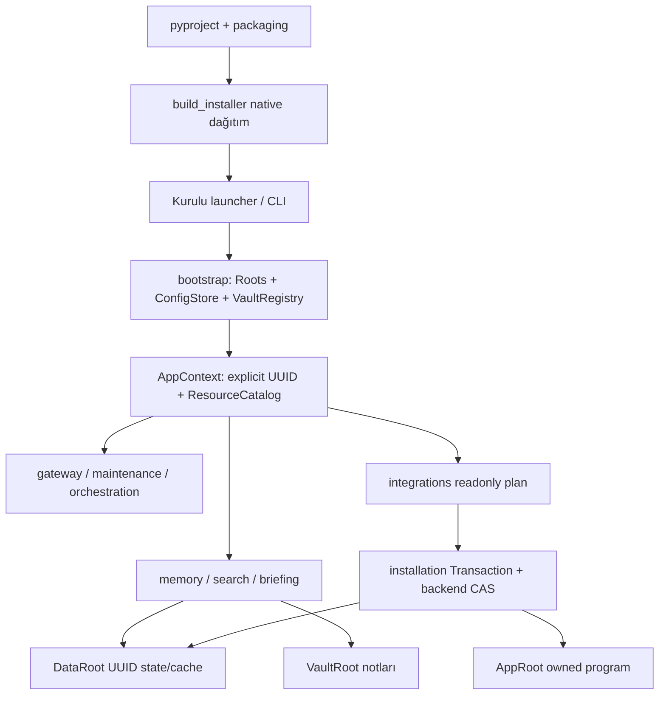

# Respected Brain — Ayrıntılı Depo ve Mimari Atlası

> Bu belge `tools/repository_map.py` tarafından `docs/repository_inventory.json` içindeki gözden geçirilmiş açıklamalardan üretilir. Doğrudan bu Markdown dosyasını düzenlemeyin.

**Kapsam:** 292 proje dosyası. Git indeksindeki dosyalar ve henüz eklenmemiş, ignore edilmeyen proje dosyaları dahildir. Bağımlılık/üretim önbellekleri ayrı kategoriler olarak açıklanır.

## Nasıl okunur ve nereden başlanır

Bu atlas kaynak deposunun tek ayrıntılı dosya haritasıdır. Kullanıcı ürünü kuracaksa `README.md → docs/guides/SETUP.md → ilgili platform rehberi`; geliştirici davranışı anlayacaksa `docs/decisions/MODULAR_FOUNDATION.md → docs/decisions/OPERATIONS.md → aşağıdaki dosya kayıtları` rotasını izler. İlk kez kod okunuyorsa `pyproject.toml → src/respectedbrain/__main__.py → cli.py → bootstrap.py → core/context.py` akışı giriş sağlar.

Dosya ağaçta yoksa önce Git indeksini ve `.gitignore` kuralını kontrol edin. Bu atlas depo dışındaki kurulu uygulamayı veya kişinin gerçek vault içeriğini taramaz. Kaynak depoda canlı kişisel hafıza, kimlik bilgisi ve günlük bulunmamalıdır. Büyük tek atlas, kullanıcı açıkça bütün dosyaları tek belgede istediği için repository artifact olarak tutulur; vault note bölme kuralı kişisel bilgi note'larına uygulanır.

Belge merkezi `docs/README.md`; aktif durum yalnız `docs/PROJECT_STATUS.md` içinde tutulur. Tarihli kararlar `docs/decisions`, uygulama/kanıt kayıtları `docs/records` altında korunur.

## Üç kök: kaynak, kurulu program ve kullanıcı hafızası

| Alan | Windows varsayılanı / kaynak yolu | Sahibi ve içerik |
| --- | --- | --- |
| Kaynak checkout | Bu Git deposu | `src/`, `packaging/`, `tools/`, `tests/`, `docs/`; geliştirici düzenler. Canlı program dizini değildir. |
| AppRoot | `%LOCALAPPDATA%\Programs\RespectedBrain` | Frozen `respectedbrain.exe`, `app/` bundled runtime/paket/resources, owned `uninstall/`. Program dosyaları hash/mode manifest'iyle yönetilir. |
| DataRoot | `%LOCALAPPDATA%\RespectedBrain` | `config.json`, `install-manifest.json`, `logs/`, `backups/`, UUID'ye bağlı `vaults/<UUID>/state`, `cache`, `overrides`. Teknik durumu uygulama sürümünden ayırır. |
| VaultRoot | Kullanıcının seçtiği herhangi bir mutlak yol | İnsan notları: daily, knowledge, Companion, projeler, Templates, `.obsidian` ve taşınabilir `.respected.json`. Adının RespectedOS olması gerekmez. |

Furkan'ın `C:\Users\Furkan\Documents\RespectedOS` kasası bir kullanıcı seçimi örneğidir; bu atlası üretmek veya kaynak kodu geliştirmek o kasayı taşımak, silmek ya da üzerine kurulum yapmak değildir. Windows Documents Known Folder yönlendirilmiş olabilir. Linux/macOS default'ları `core.paths.resolve_roots` ve `bootstrap.application_roots` içinde platforma göre çözülür; bunları Windows diziniyle karıştırmayın.

Kasa marker'ı UUID/pure-vault schema taşır; makine yolu registry/config'te yaşar. Aynı UUID'li iki canlı kasa çakışır. Setup yeni boş kasayı bir defa üretir; update/repair mevcut insan notlarını template ile yenilemez. Uninstall vault'u hedeflemez. Açık `--purge-data` yalnız kanıtlı owned teknik veriyi yönetir; bilinmeyen dosyalar veya user edit'leri otomatik owned sayılmaz.

## Mimari katmanlar ve bağımlılık yönü

| Katman | Kaynak dizini | Ne yapar? | Ne ile konuşur? |
| --- | --- | --- | --- |
| Dağıtım tanımı | pyproject, packaging, tools/build_installer | Tek src paketini native launcher ve OS installer'a dönüştürür. | resources, CLI, payload manifest |
| Giriş ve composition | __main__, cli, bootstrap | Komut/GUI seçeneklerini parse eder; explicit roots/UUID/context seçer. | ConfigStore, VaultRegistry, feature servisleri |
| Temel sözleşme | core | Pure paths/context, resources, atomic config, errors, lock ve platform uyarlaması. | stdlib/OS; feature implementasyonu import etmez |
| Kimlik ve haritalar | vault | Register/select UUID ve kompakt note/skill maps. | core, resources, VaultRoot note adları |
| Model çalıştırıcı | providers | Yerel CLI, response/fallback/policy ve Windows/WSL environment. | AppContext config, subprocess; API key store tutmaz |
| Hafıza | memory, search, briefing | Transcript summary/upsert, compile, event projection, FTS ve günlük brifing. | ModelService, AppContext, DataRoot state ve VaultRoot notes |
| Ajan/OS adaptörleri | integrations | Provider schemas, MCP, global managed block ve scheduler/shortcut plan/CAS I/O. | core context ve immutable kaynaklar; installation WAL ile apply |
| İşlem sınırı | installation | Hash sahipliği, setup/update/repair/uninstall/migration, journal/recovery. | payload + backend + quiesce; note'ları owned app dosyası saymaz |
| Ürün araçları | maintenance, orchestration, gateway | Sağlık/ingestion/backup, explicit code worktree ve yerel HTTP dashboard. | Bound feature services; code project ile vault'u ayırır |
| Salt okunur içerik | resources | Defaults, UI, instructions, provider adapters, skills, new-vault seed. | ResourceCatalog; DataRoot UUID override ayrı önceliktedir |

Kaynakta emekli kök `runtime/`, `installer/`, `template/` ve `setup.py/setup/setup.command` girişleri bulunmaz. `resources/vault-template/` paket içindeki seed'dir; ayrı motor değildir. İşlevsiz eski `.claude/hooks/` shell/PowerShell kopyaları kaldırılmıştır; güncel rendering native installed `respectedbrain hook` komutları üretir. Legacy okuma kodu eski canlı kurulum için kalır; bu kaynak yerleşiminin eski ağaçlara dönmesi anlamına gelmez.



Sürümün tek paket kaynağı `pyproject.toml` ve kurulu metadata'dan sunulan `__version__` değeridir. Çekirdek runtime zorunlu üçüncü taraf Python bağımlılığı içermez; kaynak geliştirme Python >=3.10, native build araçları dev optional dependency'dir. Restic ve provider CLI'ları kullanılan özellik için harici araçlardır.

## Önemli çalışma akışları

1. **Komut:** module/console/frozen launcher → CLI → bootstrap → kayıtlı UUID AppContext → tek feature servisi. Hook ve MCP protokol stdout'ı bilgi mesajıyla kirletilmez.
2. **Oturum:** provider hook → bridge/notify normalization → lifecycle context/count/turn → detached package flush → transcript extraction/model summary validation → locked daily upsert → immutable event → Companion projection. Teknik idempotency/state vault note'undan ayrıdır.
3. **Derleme:** compile changed daily hashes → UUID cache isolated stage → allowlisted knowledge çıktıları → concurrent source/live revalidation → atomic promotion → ingest receipt/health. Terfi sırasında izin dışı staging değişiklikleri ve eşzamanlı not değişiklikleri reddedilir; bu kontroller sağlayıcı sürecinin staging dışında yazmasını önleyen genel bir OS sandbox değildir.
4. **Sabah:** UUID scheduler installed launcher'ı çalıştırır → run_if_due 08:00/gün/lock gate → validated briefing → yalnız Dashboard managed section. Provider scheduler'da sabitlenmez, config'ten okunur.
5. **Kurulum/bakım:** payload manifest/hash doğrulama → sahiplik/kök ve external readonly plan → writer quiescence → durable WAL before-image → apply/checkpoint/health → commit manifest. Hata/crash recovery compare-and-swap rollback uygular; kullanıcı sonradan değiştirmişse korur.
6. **Eski geçiş:** readonly LegacyInventory + hash'li MigrationPlan → açık apply ve source/target/external tekrar proof → owned app aktivasyonu ve kişisel override/state taşıma → kanıtlı cleanup. Unknown eski dosya kalır, eski uninstaller çalıştırılmaz.
7. **Kod işçisi:** explicit code project ve owned dosya kapsamı → isolated worktree baseline → worker → acceptance/scope → patch evidence → açık apply/reject. Worker ana checkout'u veya note kasasını çalışma alanı yapmaz.

## Yerel ve ignore edilen artifact’ler

Aşağıdaki kategoriler dosya bazında atlas kapsamı dışındadır. Bunlar kaynak sayfası değildir; her checkout'ta bulunmaları gerekmez. `.gitignore` ve üretim komutları kategorinin yetkili tanımıdır. Üçüncü taraf runtime/venv içindeki binlerce dosyayı proje implementasyonu gibi belgelemek amaç değildir.

| Yerel konum/tür | Kaynak mı? | Nereden gelir / nasıl düşünülür? |
| --- | --- | --- |
| `.git/` veya worktree `.git` pointer | Hayır | Commit/index/ref/object metadata; elle silinmez. Index staged deletion envanter kapsamını belirler. |
| `.venv/`, `venv/`, `env/` | Hayır | pip/development Python ortamı; üçüncü taraf interpreter/site-packages. Yeni checkout'ta yeniden oluşturulur. |
| `__pycache__/`, pyc, unittest/pytest/coverage/typecheck caches | Hayır | Import/test/tool hızlandırma ve raporları; kaynakla karıştırılmaz. |
| `build/` | Hayır | PyInstaller/setuptools ara tree, spec/work/intermediate dosyaları; tools/build_installer oluşturur. |
| `dist/` | Hayır | Native RespectedBrain veya .app tree, distribution.json hashes, installer/archive/wheel çıktıları. Kaynak değişince yeniden üretip verify edin. |
| `release-assets/`, `release-stage/`, kök setup.exe | Hayır | Yayın üretimi/staging çıktıları; ordinary source commit'e eklenmez. |
| `*.egg-info/` | Hayır | Editable install metadata; paket version/console script çözümü içindir, generated'dır. |
| `.local/archives/` | Hayır | Hash doğrulamalı yerel test/log/yedek ZIP ve manifestleri; tarihsel sanal ortamlar aktif kurulum değildir. |
| tmp, logs, *.tmp/*.log, *.bak/*.orig/*.yedek | Hayır | Yerel geçici tanı/rollback/backup; yedeği doğrulamadan silme gerekçesi değildir. |
| `.env`, keys/certs, token/auth/local-settings JSON | Hayır | Secret ve kişisel auth; atlas bunların içeriğini okumaz/yayımlamaz. |
| state/cache/DB/sqlite ve eski .beyin teknik çıktıları | Hayır | Kurulu ürünün teknik durumu normalde DataRoot'tadır; legacy örnekler yalnız migration/test uyumluluğudur. |
| `.obsidian/workspace*`, editor local settings, OS garbage | Hayır | Cihaz/oturum arayüz durumu; package seed CSS ile ayrı tutulur. |

Kaynağa yeni eklenen ignore edilmeyen proje dosyası otomatik keşfedilir. Ignore edilen yeni bir artifact kategorisi mimari olarak anlamlı hale gelirse bu tabloyu JSON section'ında aynı görev içinde güncelleyin. İstenmeyen ignore dosyası Git'e force-add edilirse bilinen dependency/build ağaçları yine kapsam dışıdır; kaynak dosyaları yanlış bir kategoriye saklamayın.

## Değişiklik için gezinme rehberi

| Yapılacak iş / sorun | İlk dosyalar | Kanıt ve etkilediği sınır |
| --- | --- | --- |
| CLI/GUI seçimi kayboluyor | src/respectedbrain/cli.py, src/respectedbrain/installation/wizard.py, src/respectedbrain/installation/setup.py | wizard_options_test, wizard_test; explicit false/package/profile |
| Kasa/ayar yolu veya UUID yanlış | bootstrap.py, core/paths.py, core/config.py, vault/registry.py | foundation_paths/vault_registry; üç kök/identity |
| Flush/summary kaybı veya tekrar | memory/flush.py, lifecycle.py, events.py | turn_log_pipeline/output_normalization/event_log; durable daily/projection |
| Compiler yanlış note yazıyor | memory/compile.py | foundation_memory/adversarial/knowledge_domain; allowlist/concurrent edits |
| Model/fallback/WSL | providers/runner.py, core/platform.py | adversarial/runtime_platform/multiai; auth/output sınırlaması |
| Hook/global/MCP/editor bağlantısı | integrations/rendering.py, global_config.py, hooks/, mcp/ | foundation_integrations/profile_render/mcp_registration; kullanıcı ayar koruması |
| Brifing/scheduler | briefing/service.py, scheduling/service.py, backend.py | morning_briefing/briefing_schedule; günde tek çıktı/native task |
| Setup/update/migration/uninstall | installation/{setup,update,migration,ownership,transaction,windows}.py | foundation_*; hash/mode/WAL/recovery/user-note koruması |
| Arama/graph/recall | search/engine.py, memory/graph/, bounded_recall.py | graph_and_session/smart_tools/mcp_and_features; index/cache/prompt bütçesi |
| Web görünümü/yerel API | gateway/server.py, resources/gateway/web/index.html | foundation_services/maintenance_orchestration; explicit UUID/context |
| Yeni seed/talimat/skill | resources/, core/resources.py, pyproject.toml package-data | package_contract/foundation_packaged_commands; immutable seed/override ayrımı |
| Native package veya yayın | packaging/, tools/build_installer.py, verify_distribution.py, workflows | distribution/native_install/smoke; platform üzerinde gerçek binary kanıtı |
| Depo büyüdü veya file moved | repository_inventory.json, tools/repository_map.py | repository_map_test ve --check; güncel tek dosya atlası |

Testlerin ayrıntılı açıklaması aşağıdaki her dosya kaydında bulunur. Python discovery için `python -m unittest discover -s tests -p '*test*.py'`; bütün native/shell/host kapıları için önce package build/verify sonra `python tests/run_all.py` kullanılır. Mevcut Windows çalıştırması diğer platformları doğrulamaz. Tarihli verification/audit belgelerini bugünkü canlı kurulum durumu olarak kopyalamayın.

## Eksiksiz kaynak ağacı

```text
secondbrain/
├── .gitattributes
├── .github/
│   └── workflows/
│       ├── ci.yml
│       └── release.yml
├── .gitignore
├── .vscode/
│   ├── extensions.json
│   └── settings.json
├── AGENTS.md
├── LICENSE
├── README.md
├── docs/
│   ├── ARCHITECTURE.md
│   ├── PROJECT_STATUS.md
│   ├── README.md
│   ├── REPOSITORY_MAP.md
│   ├── SECURITY.md
│   ├── SPECIFICATION.md
│   ├── TEST-MATRIX.md
│   ├── decisions/
│   │   ├── MODULAR_FOUNDATION.md
│   │   ├── OPERATIONS.md
│   │   ├── README.md
│   │   └── SECURITY_HARDENING.md
│   ├── development/
│   │   ├── CLI.md
│   │   └── README.md
│   ├── guides/
│   │   ├── BACKUP.md
│   │   ├── BOOTSTRAP.md
│   │   ├── CONFIGURATION.md
│   │   ├── DAILY_USE.md
│   │   ├── MULTI_AI.md
│   │   ├── SETUP-POSIX.md
│   │   ├── SETUP-WINDOWS.md
│   │   ├── SETUP.md
│   │   ├── TROUBLESHOOTING.md
│   │   ├── UNINSTALL.md
│   │   └── UPDATE.md
│   ├── records/
│   │   ├── 2026-10-documentation/
│   │   │   └── REORGANIZATION.md
│   │   ├── 2026-10-installer-release/
│   │   │   ├── EXECUTION.md
│   │   │   └── REPOSITORY_AUDIT.md
│   │   ├── 2026-10-modular-foundation/
│   │   │   ├── IMPLEMENTATION.md
│   │   │   └── VERIFICATION.md
│   │   ├── 2026-10-security-hardening/
│   │   │   ├── F7_TRANSCRIPT_REMEDIATION.md
│   │   │   ├── FIFTH_REVIEW_REMEDIATION.md
│   │   │   ├── FOURTH_REVIEW_REMEDIATION.md
│   │   │   ├── IMPLEMENTATION.md
│   │   │   └── WINDOWS_LIFECYCLE_REVIEW.md
│   │   ├── 2026-10-source-cleanup/
│   │   │   ├── SOURCE_ACCEPTANCE.md
│   │   │   ├── SOURCE_REVIEW.md
│   │   │   └── VERIFICATION.md
│   │   └── README.md
│   └── repository_inventory.json
├── packaging/
│   ├── entrypoint.py
│   ├── linux/
│   │   └── setup.sh
│   ├── macos/
│   │   └── setup.command
│   └── windows/
│       └── respected_setup.iss
├── pyproject.toml
├── src/
│   └── respectedbrain/
│       ├── __init__.py
│       ├── __main__.py
│       ├── bootstrap.py
│       ├── briefing/
│       │   ├── __init__.py
│       │   └── service.py
│       ├── cli.py
│       ├── core/
│       │   ├── __init__.py
│       │   ├── config.py
│       │   ├── context.py
│       │   ├── coordination.py
│       │   ├── errors.py
│       │   ├── legacy_names.py
│       │   ├── locking.py
│       │   ├── paths.py
│       │   ├── platform.py
│       │   └── resources.py
│       ├── gateway/
│       │   ├── __init__.py
│       │   └── server.py
│       ├── installation/
│       │   ├── __init__.py
│       │   ├── common.py
│       │   ├── deferred.py
│       │   ├── legacy.py
│       │   ├── migration.py
│       │   ├── operations.py
│       │   ├── ownership.py
│       │   ├── payload.py
│       │   ├── provenance.py
│       │   ├── repair.py
│       │   ├── setup.py
│       │   ├── transaction.py
│       │   ├── uninstall.py
│       │   ├── update.py
│       │   ├── windows.py
│       │   └── wizard.py
│       ├── integrations/
│       │   ├── __init__.py
│       │   ├── backend.py
│       │   ├── global_config.py
│       │   ├── hooks/
│       │   │   ├── __init__.py
│       │   │   ├── bridge.py
│       │   │   └── codex_notify.py
│       │   ├── legacy_registration.py
│       │   ├── mcp/
│       │   │   ├── __init__.py
│       │   │   └── server.py
│       │   ├── notes.py
│       │   ├── rendering.py
│       │   └── scheduling/
│       │       ├── __init__.py
│       │       └── service.py
│       ├── maintenance/
│       │   ├── __init__.py
│       │   ├── _atomic.py
│       │   ├── architect_scan.py
│       │   ├── backup/
│       │   │   ├── __init__.py
│       │   │   ├── backup_restic.py
│       │   │   └── publish_git_snapshot.py
│       │   ├── ingestion/
│       │   │   ├── __init__.py
│       │   │   ├── defuddle.py
│       │   │   ├── mine_agent_history.py
│       │   │   └── url_safety.py
│       │   ├── repair_daily.py
│       │   ├── smart_merge.py
│       │   ├── tiling_check.py
│       │   └── vault_linter.py
│       ├── memory/
│       │   ├── __init__.py
│       │   ├── bounded_recall.py
│       │   ├── compile.py
│       │   ├── events.py
│       │   ├── flush.py
│       │   ├── graph/
│       │   │   ├── __init__.py
│       │   │   ├── graph_analysis.py
│       │   │   └── graphrag.py
│       │   ├── lifecycle.py
│       │   ├── session_brain.py
│       │   └── session_viz.py
│       ├── orchestration/
│       │   ├── __init__.py
│       │   ├── antigravity_orchestrator.py
│       │   ├── orchestrate.py
│       │   └── runner.py
│       ├── providers/
│       │   ├── __init__.py
│       │   └── runner.py
│       ├── resources/
│       │   ├── __init__.py
│       │   ├── defaults.json
│       │   ├── gateway/
│       │   │   └── web/
│       │   │       └── index.html
│       │   ├── instructions/
│       │   │   └── default.md
│       │   ├── integrations/
│       │   │   ├── .agents/
│       │   │   │   ├── hooks.json
│       │   │   │   └── rules/
│       │   │   │       ├── beyin.md
│       │   │   │       ├── software-quality-1.md
│       │   │   │       └── software-quality-2.md
│       │   │   ├── .claude/
│       │   │   │   └── settings.json
│       │   │   ├── .codex/
│       │   │   │   └── hooks.json
│       │   │   ├── .cursor/
│       │   │   │   ├── hooks.json
│       │   │   │   └── rules/
│       │   │   │       ├── beyin.mdc
│       │   │   │       ├── software-quality-1.mdc
│       │   │   │       └── software-quality-2.mdc
│       │   │   ├── .gemini/
│       │   │   │   ├── GEMINI.md
│       │   │   │   └── settings.json
│       │   │   ├── AGENTS.md
│       │   │   └── CLAUDE.md
│       │   ├── skills/
│       │   │   ├── ajan-gecmis-tara/
│       │   │   │   └── SKILL.md
│       │   │   ├── beyin-doktor/
│       │   │   │   └── SKILL.md
│       │   │   ├── beyin-meydan-oku/
│       │   │   │   └── SKILL.md
│       │   │   ├── beyin-oruntu/
│       │   │   │   └── SKILL.md
│       │   │   ├── gecmis-import/
│       │   │   │   └── SKILL.md
│       │   │   ├── inbox-duzenle/
│       │   │   │   └── SKILL.md
│       │   │   ├── kod-orkestrasyon/
│       │   │   │   └── SKILL.md
│       │   │   ├── obsidian-layout/
│       │   │   │   └── SKILL.md
│       │   │   ├── otonom-arastirma/
│       │   │   │   └── SKILL.md
│       │   │   └── yazilim-kalite/
│       │   │       └── SKILL.md
│       │   └── vault-template/
│       │       ├── .gitignore
│       │       ├── .obsidian/
│       │       │   └── snippets/
│       │       │       └── secondbrain-layout.css
│       │       ├── .respected.json
│       │       ├── daily/
│       │       │   └── .gitkeep
│       │       ├── knowledge/
│       │       │   ├── concepts/
│       │       │   │   └── .gitkeep
│       │       │   ├── connections/
│       │       │   │   └── .gitkeep
│       │       │   ├── index.md
│       │       │   └── log.md
│       │       ├── 🎯 100-Command-Center/
│       │       │   ├── Briefings/
│       │       │   │   └── .gitkeep
│       │       │   ├── Dashboard.md
│       │       │   ├── Skills-Map.md
│       │       │   └── Vault-Map.md
│       │       ├── 🏰 300-Projects/
│       │       │   └── .gitkeep
│       │       ├── 📋 Templates/
│       │       │   ├── Base.base
│       │       │   ├── Canvas.canvas
│       │       │   └── Note.md
│       │       ├── 📥 000-Inbox/
│       │       │   └── Dump/
│       │       │       └── .gitkeep
│       │       ├── 📦 900-Archive/
│       │       │   └── .gitkeep
│       │       ├── 🔮 850-Companion/
│       │       │   ├── Core.md
│       │       │   ├── Journal.md
│       │       │   ├── Kurallar.md
│       │       │   ├── Last-Session.md
│       │       │   ├── Threads.md
│       │       │   └── events/
│       │       │       ├── .gitkeep
│       │       │       └── archive/
│       │       │           └── .gitkeep
│       │       ├── 🛠️ 600-Arsenal/
│       │       │   └── .gitkeep
│       │       └── 🧠 500-Knowledge/
│       │           └── .gitkeep
│       ├── search/
│       │   ├── __init__.py
│       │   └── engine.py
│       └── vault/
│           ├── __init__.py
│           ├── maps.py
│           └── registry.py
├── tests/
│   ├── __init__.py
│   ├── adversarial_quality_test.py
│   ├── antigravity_orchestrator_test.py
│   ├── any_to_any_orchestrator_test.py
│   ├── auto_updater_test.py
│   ├── backup_and_snapshot_test.py
│   ├── boundary_regression_test.py
│   ├── briefing_schedule_test.py
│   ├── briefing_schedule_windows_test.ps1
│   ├── dns_pinning_transport_test.py
│   ├── e2e_fresh_install_linux_test.py
│   ├── entry_review_test.py
│   ├── event_log_test.py
│   ├── f7_transcript_integrity_test.py
│   ├── foundation_cli_test.py
│   ├── foundation_deferred_test.py
│   ├── foundation_distribution_test.py
│   ├── foundation_features_test.py
│   ├── foundation_inno_service_test.py
│   ├── foundation_install_support.py
│   ├── foundation_integrations_test.py
│   ├── foundation_locking_test.py
│   ├── foundation_maintenance_orchestration_test.py
│   ├── foundation_memory_test.py
│   ├── foundation_migration_apply_test.py
│   ├── foundation_migration_preview_test.py
│   ├── foundation_native_install_test.py
│   ├── foundation_operations_test.py
│   ├── foundation_packaged_commands_test.py
│   ├── foundation_paths_test.py
│   ├── foundation_posix_distribution_test.py
│   ├── foundation_posix_install_test.py
│   ├── foundation_services_test.py
│   ├── foundation_setup_test.py
│   ├── foundation_support.py
│   ├── foundation_transactions_test.py
│   ├── foundation_uninstall_proof_test.py
│   ├── foundation_writer_coordination_test.py
│   ├── global_brand_migration_test.py
│   ├── graph_and_session_test.py
│   ├── hooks_test.sh
│   ├── hybrid_wsl_smoke.ps1
│   ├── install_windows_test.ps1
│   ├── knowledge_domain_test.py
│   ├── lifecycle_test.py
│   ├── maintenance_review_test.py
│   ├── maps_test.py
│   ├── mcp_and_features_test.py
│   ├── mcp_registration_test.py
│   ├── morning_briefing_test.py
│   ├── multiai_test.py
│   ├── naming_contract_test.py
│   ├── orchestration_recovery_test.py
│   ├── orchestration_review_test.py
│   ├── output_normalization_test.py
│   ├── package_contract_test.py
│   ├── profile_render_test.py
│   ├── provenance_lifecycle_transport_test.py
│   ├── provider_permissions_test.py
│   ├── regression_matrix_test.py
│   ├── release_provenance_test.py
│   ├── release_workflow_security_test.py
│   ├── repair_daily_test.py
│   ├── repair_writer_coordination_test.py
│   ├── repository_map_test.py
│   ├── run_all.py
│   ├── runtime_layout_test.py
│   ├── runtime_platform_test.py
│   ├── scenario_matrix_test.py
│   ├── scripts_test.py
│   ├── secret_scanner_test.py
│   ├── security_hardening_fifth_fix_test.py
│   ├── security_hardening_fourth_fix_test.py
│   ├── security_hardening_third_fix_test.py
│   ├── smart_tools_test.py
│   ├── smoke/
│   │   ├── README.md
│   │   ├── lifecycle_driver.py
│   │   ├── linux.sh
│   │   ├── macos.sh
│   │   ├── platform_smoke.py
│   │   ├── windows-native.ps1
│   │   └── wsl.sh
│   ├── snapshot_immutable_publish_test.py
│   ├── source_cleanup_test.py
│   ├── transaction_performance_test.py
│   ├── turn_log_pipeline_test.py
│   ├── uninstall_test.py
│   ├── update_cli_test.py
│   ├── update_respected_test.py
│   ├── upstream_sync_test.sh
│   ├── vault_hygiene_test.py
│   ├── vault_registry_test.py
│   ├── windows_launchers_test.ps1
│   ├── windows_native_test.py
│   ├── wizard_options_test.py
│   ├── wizard_test.py
│   └── zero_trust_security_test.py
└── tools/
    ├── build_installer.py
    ├── repository_map.py
    ├── upstream_sync.sh
    └── verify_distribution.py
```

## Dosya dosya sorumluluk ve ilişkiler

Her kayıt bir dosyayı açıklar; boş `.gitkeep` ve paket `__init__.py` dosyaları da dahildir. Aşağıdaki yollar depo köküne göredir. Tarihsel belgeler canlı davranışın yetkili kaynağı değildir.

### Depo kökü

#### [`.gitattributes`](../.gitattributes)

**Rol:** Depo sözleşmesi.

**Amaç / sorumluluk:** Metin dosyalarının satır sonlarını türlerine göre LF/CRLF olarak sabitler, ikili dosyalara metin dönüşümünü kapatır ve dağıtım export sınırlarını tanımlar. Tarihli records metinlerindeki korunmuş whitespace için istisna tanımlar.

**İlişkiler ve sınır:** Shell shebang'leri, Windows PowerShell ve tarihsel belge bütünlüğünü Git checkout/commit sırasında korur.

### .github/workflows

#### [`.github/workflows/ci.yml`](../.github/workflows/ci.yml)

**Rol:** Depo sözleşmesi.

**Amaç / sorumluluk:** Windows, Linux ve macOS üzerinde native dağıtım üretir, doğrular, regresyon ve host smoke kapılarını çalıştırır; PR/main değişikliklerinin kalite kapısıdır. Python suite tests/run_all.py --python-only üzerinden çalışır ve başarısız public test kimliklerini güvenli annotation ile gösterir. Native kapılar sonrası Windows EXE, macOS DMG ve Linux makeself arşivi oluşturulur; disk/arşiv bütünlüğü, açılan payload ve executable izinleri gerçek hostta yeniden doğrulanır. Üç hostta erken 3.10 import/wheel/adapter kapısı native üretimden önce çalışır. Tam Python dizisi native aşamada tekrar edilmez; altı source host/sürüm işi her sürümü native artifact ile tam sınar; tüm native kabul ve shell kapıları korunur.

**İlişkiler ve sınır:** tools/build_installer.py, verify_distribution.py ve tests komutlarını bağlar; atlas --check kaynak/inceleme drift'ini yakalar. Python keşfi tests/run_all.py --python-only üzerinden tam stderr ve doğrulanmış public başarısız test kimliği annotasyonlarını korur.

#### [`.github/workflows/release.yml`](../.github/workflows/release.yml)

**Rol:** Depo sözleşmesi.

**Amaç / sorumluluk:** v* etiketi veya elle tetikleme için üç platformun native yayın paketlerini üretir, actions/attest-build-provenance ile SLSA kriptografik build attestation oluşturur, gh attestation verify ile doğrular ve sürüm etiketini paket metadata'sıyla eşleştirir.

**İlişkiler ve sınır:** PyInstaller/Inno çıktılarını doğruladıktan sonra release artifact'lerini ve provenance attestation'larını hazırlar. tools/verify_distribution.py ve tests/run_all.py kapılarıyla bağlanır.

### Depo kökü

#### [`.gitignore`](../.gitignore)

**Rol:** Depo sözleşmesi.

**Amaç / sorumluluk:** Kimlik bilgileri, kişisel ayarlar, teknik state, veritabanı, sanal ortam ve build çıktılarının Git'e girmesini engeller; paketlenmiş başlangıç kaynaklarını dışlamaz. Yerel geliştirici kanıtı .local/ altında dışlanır.

**İlişkiler ve sınır:** Git keşif aracı --exclude-standard ile bu kuralları kullanır; vault-template/.gitignore yeni kullanıcı kasası için ayrı kurallardır.

### .vscode

#### [`.vscode/extensions.json`](../.vscode/extensions.json)

**Rol:** Depo sözleşmesi.

**Amaç / sorumluluk:** Python/Pylance, PowerShell, EditorConfig ve GitHub Actions eklentilerini geliştiriciye önerir.

**İlişkiler ve sınır:** VS Code'un geliştirme ortamını kolaylaştırır; runtime bağımlılığı veya otomatik eklenti kurulumu değildir.

#### [`.vscode/settings.json`](../.vscode/settings.json)

**Rol:** Depo sözleşmesi.

**Amaç / sorumluluk:** UTF-8 ve dosya sonu politikasını, unittest keşfini, Python analiz arama yollarını ve izleyici dışlamalarını ayarlar.

**İlişkiler ve sınır:** src paketi ve tests dizinindeki geliştirme deneyimini etkiler; ürünün kurulu yollarını belirlemez.

### Depo kökü

#### [`AGENTS.md`](../AGENTS.md)

**Rol:** AGENT RULE / DOCUMENTATION.

**Amaç / sorumluluk:** Atlasın her dosya değişikliğinde anlamsal incelemeyle güncellenmesini zorunlu kılar; onaylı mimari, aktif ürün durumu ve yerel rollout otoritelerini ayırır; canlı veri sınırı ve kullanıcı CI/ajan tercihlerini tutar.

**İlişkiler ve sınır:** docs/decisions onaylı mimari, docs/PROJECT_STATUS.md aktif ürün durumu, Git dışındaki .local/ROLLOUT.md kişisel tercihtir; tools/repository_map.py atlas bakımını yönetir.

#### [`LICENSE`](../LICENSE)

**Rol:** Depo sözleşmesi.

**Amaç / sorumluluk:** MIT kullanım, değiştirme ve dağıtma iznini ve sorumluluk sınırlamasını tutar; özgün atfın korunmasını gerektirir.

**İlişkiler ve sınır:** README lisans bağlantısını verir; kaynak ve dağıtımda atıf gereği sürer.

#### [`README.md`](../README.md)

**Rol:** Güncel belge / rehber.

**Amaç / sorumluluk:** Ürün girişini eski anlatım tarzıyla yeniden kurar; ortak hafıza sınırı, üç kök, runtime/template, maliyet, arama, platform kanıtı, komutlar, rehber rotası ve özgün atfı açıklar.

**İlişkiler ve sınır:** Belge merkezi docs/README.md; aktif durum docs/PROJECT_STATUS.md. Git origin ile doğrulanan GitHub kaynak deposuna bağlantı verir; gerçek dosya/komut davranışı src, packaging, tools ve tests kaynaklarıyla karşılaştırılır.

### docs

#### [`docs/ARCHITECTURE.md`](../docs/ARCHITECTURE.md)

**Rol:** Güncel belge / rehber.

**Amaç / sorumluluk:** Üç platformun AppRoot/DataRoot/VaultRoot konumlarını, modül/veri akışını, template/override ayrımını açıklar; compile tarih filtresi ile filtresiz briefing ve hata sonrası dosya varlığı sınırlarını belirtir.

**İlişkiler ve sınır:** Belge merkezi docs/README.md; aktif durum docs/PROJECT_STATUS.md. Gerçek dosya/komut davranışı src, packaging, tools ve tests kaynaklarıyla karşılaştırılır.

#### [`docs/PROJECT_STATUS.md`](../docs/PROJECT_STATUS.md)

**Rol:** Süreç otoritesi.

**Amaç / sorumluluk:** Projenin tek aktif durum kaynağıdır; kaynak düzeltmeleri, yerel doğrulama, native paket/rollout ve kalan dış kabul sınırlarını tarihli kayıt bağlantılarıyla ayırır.

**İlişkiler ve sınır:** docs/SECURITY.md ve docs/decisions/SECURITY_HARDENING.md kararlarıyla doğrudan bağlantılıdır.

#### [`docs/README.md`](../docs/README.md)

**Rol:** Güncel belge / rehber.

**Amaç / sorumluluk:** Belge gruplarının okuma rotasını ve bakım standardını verir; güncel ürün durumu, onaylı mimari, yerel kişisel rollout, tarihli kanıt ve otomatik atlasın ayrı sorumluluklarını açıklar.

**İlişkiler ve sınır:** Belge merkezi docs/README.md; aktif durum docs/PROJECT_STATUS.md. Gerçek dosya/komut davranışı src, packaging, tools ve tests kaynaklarıyla karşılaştırılır.

#### [`docs/REPOSITORY_MAP.md`](../docs/REPOSITORY_MAP.md)

**Rol:** Depo sözleşmesi.

**Amaç / sorumluluk:** Depo ağacını, mimari katmanları, tüm dosyaları, kurulum köklerini, yerel artifact türlerini ve bakım kurallarını tek ayrıntılı belgede birleştirir.

**İlişkiler ve sınır:** JSON envanterinden deterministic üretilir; README buraya yönlendirir; doğrudan düzenleme --check render drift üretir.

#### [`docs/SECURITY.md`](../docs/SECURITY.md)

**Rol:** Güvenlik sözleşmesi.

**Amaç / sorumluluk:** Yerel sağlayıcı izinlerini, DNS/HTTP transport sınırlarını, Git snapshot sır taramasını, SLSA release provenance doğrulamasını ve dördüncü inceleme düzeltmelerinin güvenlik sözleşmesini açıklar.

**İlişkiler ve sınır:** src/respectedbrain/providers/runner.py, ingestion/url_safety.py, ingestion/defuddle.py, backup/publish_git_snapshot.py ve installation/provenance.py ile birebir eşleşir.

#### [`docs/SPECIFICATION.md`](../docs/SPECIFICATION.md)

**Rol:** Güncel belge / rehber.

**Amaç / sorumluluk:** Mevcut schema3 UUID/config, kasa seçimi, kurulum yaşam döngüsü, işlem korumaları, protokol/hafıza ve test kanıtı sözleşmelerini açıklar; kabul edilen karar kayıtlarına bağlanır.

**İlişkiler ve sınır:** Belge merkezi docs/README.md; aktif durum docs/PROJECT_STATUS.md. Gerçek dosya/komut davranışı src, packaging, tools ve tests kaynaklarıyla karşılaştırılır.

#### [`docs/TEST-MATRIX.md`](../docs/TEST-MATRIX.md)

**Rol:** Güncel belge / rehber.

**Amaç / sorumluluk:** Son CI ürün kodunu, yerel dördüncü inceleme doğrulama zincirini ve test kanıtlarının sınırlarını indeksler.

**İlişkiler ve sınır:** Belge merkezi docs/README.md; aktif durum docs/PROJECT_STATUS.md. Gerçek dosya/komut davranışı src, packaging, tools ve tests kaynaklarıyla karşılaştırılır.

### docs/decisions

#### [`docs/decisions/MODULAR_FOUNDATION.md`](../docs/decisions/MODULAR_FOUNDATION.md)

**Rol:** Tarihli karar kaydı.

**Amaç / sorumluluk:** Yetkili modüler tasarım sözleşmesi: AppRoot/DataRoot/VaultRoot, sahiplik, src modülleri, UUID/config ve dependency sırasını tanımlar. Bağlantıları 2026-10-05 düzenine uyarlanmıştır; bugünün yapılacaklar listesi değildir.

**İlişkiler ve sınır:** Aktif durum docs/PROJECT_STATUS.md; karar ve kayıt indeksleri bu dosyanın tarihsel bağlamına yönlendirir.

#### [`docs/decisions/OPERATIONS.md`](../docs/decisions/OPERATIONS.md)

**Rol:** Tarihli karar kaydı.

**Amaç / sorumluluk:** Tek CLI/entegrasyon, template/kişisel override, setup/update/repair/uninstall ve eski kurulum migration güvenlik/kabul davranışını tanımlar. Bağlantıları 2026-10-05 düzenine uyarlanmıştır; bugünün yapılacaklar listesi değildir.

**İlişkiler ve sınır:** Aktif durum docs/PROJECT_STATUS.md; karar ve kayıt indeksleri bu dosyanın tarihsel bağlamına yönlendirir.

#### [`docs/decisions/README.md`](../docs/decisions/README.md)

**Rol:** Güncel belge / rehber.

**Amaç / sorumluluk:** İki kabul edilmiş modüler tasarım/işletim kararını indeksler; tasarım kabulünün otomatik uygulama/test kanıtı olmadığını belirtir.

**İlişkiler ve sınır:** Belge merkezi docs/README.md; aktif durum docs/PROJECT_STATUS.md. Gerçek dosya/komut davranışı src, packaging, tools ve tests kaynaklarıyla karşılaştırılır.

#### [`docs/decisions/SECURITY_HARDENING.md`](../docs/decisions/SECURITY_HARDENING.md)

**Rol:** Mimari karar.

**Amaç / sorumluluk:** Üçüncü ve dördüncü güvenlik incelemelerinin mimari kararlarını, doğrulama sınırlarını ve kapanış kanıtlarını tanımlar.

**İlişkiler ve sınır:** docs/SECURITY.md ve docs/records/2026-10-security-hardening altındaki kayıtlarla doğrudan bağlıdır.

### docs/development

#### [`docs/development/CLI.md`](../docs/development/CLI.md)

**Rol:** Güncel belge / rehber.

**Amaç / sorumluluk:** Public/iç argparse komutları, dokuz bakım aracı ve yan etki/çıkış kodlarını açıklar. Flush yönetilen girdisinin başarı ve değişmemiş bayt koşuluyla temizlenmesini stale-input expiry kuralından ayırır.

**İlişkiler ve sınır:** src/respectedbrain/cli.py ve araç parserları sözleşme kaynağıdır; aktif durum PROJECT_STATUS ve çalışma sınırları AGENTS içinde kalır.

#### [`docs/development/README.md`](../docs/development/README.md)

**Rol:** Güncel belge / rehber.

**Amaç / sorumluluk:** Windows ve POSIX için venv/editable geliştirme ve venv çalıştırıcılı build/test/atlas komutlarını, kod okuma sırasını, native doğrulama kapsamını ve yayın/canlı veri sınırlarını açıklar.

**İlişkiler ve sınır:** Belge merkezi docs/README.md; aktif durum docs/PROJECT_STATUS.md. Gerçek dosya/komut davranışı src, packaging, tools ve tests kaynaklarıyla karşılaştırılır.

### docs/guides

#### [`docs/guides/BACKUP.md`](../docs/guides/BACKUP.md)

**Rol:** Güncel belge / rehber.

**Amaç / sorumluluk:** Kasa/teknik veri/transaction/geliştirici yedeğini ayırır; bağımsız ZIP restore kontrolü, Restic preview/apply ve doğrulama sınırı ile Git snapshot yayın/secret sınırını gösterir.

**İlişkiler ve sınır:** Belge merkezi docs/README.md; aktif durum docs/PROJECT_STATUS.md. Gerçek dosya/komut davranışı src, packaging, tools ve tests kaynaklarıyla karşılaştırılır.

#### [`docs/guides/BOOTSTRAP.md`](../docs/guides/BOOTSTRAP.md)

**Rol:** Güncel belge / rehber.

**Amaç / sorumluluk:** Kurulum sonrası doğru UUID ve maps kontrolü, Companion kişiselleştirmesi, CLI oturumu/hook güveni ve gerçek konuşma kabulü adımlarını açıklar.

**İlişkiler ve sınır:** Belge merkezi docs/README.md; aktif durum docs/PROJECT_STATUS.md. Gerçek dosya/komut davranışı src, packaging, tools ve tests kaynaklarıyla karşılaştırılır.

#### [`docs/guides/CONFIGURATION.md`](../docs/guides/CONFIGURATION.md)

**Rol:** Güncel belge / rehber.

**Amaç / sorumluluk:** Config/manifest/marker/state/cache/override rollerini, yazan ve okuyan komutları, kasa seçim sırasını, gerçek environment değişkenlerini ve mevcut CLI tercih sınırını açıklar.

**İlişkiler ve sınır:** Belge merkezi docs/README.md; aktif durum docs/PROJECT_STATUS.md. Gerçek dosya/komut davranışı src, packaging, tools ve tests kaynaklarıyla karşılaştırılır.

#### [`docs/guides/DAILY_USE.md`](../docs/guides/DAILY_USE.md)

**Rol:** Güncel belge / rehber.

**Amaç / sorumluluk:** Kasa alanlarını, FTS/maps, compile tarih filtresini, teknik I/O yapabilen dry-run ve filtresiz briefing davranışını açıklar; hata sonrası yazılmış brifingin tekrar denemeyi atlatmasını ve panel/bakım/kod işçisi komutlarını belirtir.

**İlişkiler ve sınır:** Belge merkezi docs/README.md; aktif durum docs/PROJECT_STATUS.md. Gerçek dosya/komut davranışı src, packaging, tools ve tests kaynaklarıyla karşılaştırılır.

#### [`docs/guides/MULTI_AI.md`](../docs/guides/MULTI_AI.md)

**Rol:** Güncel belge / rehber.

**Amaç / sorumluluk:** Beş sağlayıcının kaynak adaptörlerini, tek instruction/skill ve overrides düzenini, dört bağlantıyı, genel auto ile açık tercih fallback farklarını, windows-native/windows-wsl/posix profil kimliklerini ve yedi MCP aracını açıklar.

**İlişkiler ve sınır:** Belge merkezi docs/README.md; aktif durum docs/PROJECT_STATUS.md. Profil varsayılanları installation.common.installed_profile, WSL launcher ve aynı UUID/Linux DataRoot kontrolü integrations.rendering.validate_profile/launch_argv ile karşılaştırılır; gerçek dosya/komut davranışı src, packaging, tools ve tests kaynaklarıyla doğrulanır.

#### [`docs/guides/SETUP-POSIX.md`](../docs/guides/SETUP-POSIX.md)

**Rol:** Güncel belge / rehber.

**Amaç / sorumluluk:** macOS/Linux native köklerini, mevcut setup.command/setup.sh ve .run kabuklarını, aktarılan CLI seçeneklerini, POSIX bağlantı/izin sınırlarını ve ilk kontrol/kanıt kapsamını açıklar.

**İlişkiler ve sınır:** packaging/macos/setup.command ve packaging/linux/setup.sh ortak CLI setup hizmetine bağlanır; guides/SETUP.md ve MULTI_AI.md profil/ortam ayrımını açıklar.

#### [`docs/guides/SETUP-WINDOWS.md`](../docs/guides/SETUP-WINDOWS.md)

**Rol:** Güncel belge / rehber.

**Amaç / sorumluluk:** Inno dizin penceresi ile Python GUI seçeneklerini ayırır; program/veri/kasa yerleşimi, gerçek /VAULT /DATA silent parametreleri ve tx_id üzerinden pending makbuz kontrolünü açıklar.

**İlişkiler ve sınır:** Belge merkezi docs/README.md; aktif durum docs/PROJECT_STATUS.md. Gerçek dosya/komut davranışı src, packaging, tools ve tests kaynaklarıyla karşılaştırılır.

#### [`docs/guides/SETUP.md`](../docs/guides/SETUP.md)

**Rol:** Güncel belge / rehber.

**Amaç / sorumluluk:** Native dağıtım ile kaynak geliştirmeyi ayırır; boş/kayıtlı kasa, dört BooleanOptional kurulum seçeneği, platform kökleri ve ilk kontrol akışını gösterir.

**İlişkiler ve sınır:** Belge merkezi docs/README.md; aktif durum docs/PROJECT_STATUS.md. Gerçek dosya/komut davranışı src, packaging, tools ve tests kaynaklarıyla karşılaştırılır.

#### [`docs/guides/TROUBLESHOOTING.md`](../docs/guides/TROUBLESHOOTING.md)

**Rol:** Güncel belge / rehber.

**Amaç / sorumluluk:** Kök/UUID/executable kontrolü, belirtiye göre hook/model/panel/recovery tanısı, mevcut bakım araçları ve kişisel bilgiden arındırılmış hata raporu alanlarını gösterir.

**İlişkiler ve sınır:** Belge merkezi docs/README.md; aktif durum docs/PROJECT_STATUS.md. Gerçek dosya/komut davranışı src, packaging, tools ve tests kaynaklarıyla karşılaştırılır.

#### [`docs/guides/UNINSTALL.md`](../docs/guides/UNINSTALL.md)

**Rol:** Güncel belge / rehber.

**Amaç / sorumluluk:** Sahipli unchanged program/global/yerel AI hook kayıt kaldırılması, değişmiş hook/dosya conflict ve korunacak notlar/teknik veri ayrımını; varsayılan kanıtlı teknik kayıt temizliği ile `--keep-data` opt-out'unu ve Windows pending/receipt sınırını açıklar. Yerel hook sahipliği global entegrasyon bayrağından bağımsızdır.

**İlişkiler ve sınır:** Belge merkezi docs/README.md; aktif durum docs/PROJECT_STATUS.md. Gerçek dosya/komut davranışı src, packaging, tools ve tests kaynaklarıyla karşılaştırılır.

#### [`docs/guides/UPDATE.md`](../docs/guides/UPDATE.md)

**Rol:** Güncel belge / rehber.

**Amaç / sorumluluk:** Verified native update, OperationResult ve pending makbuzu, repair/recovery, salt okunur migration ve açık apply akışlarını açıklar; yeni boş kasa seçimiyle genel kurulum sınırını ve yerel kişisel rollout kaydını ayırır.

**İlişkiler ve sınır:** Belge merkezi docs/README.md; aktif durum docs/PROJECT_STATUS.md. CLI migrate varsayılanında plan_document döner; --apply verilince apply_migration çağrılır. Güncelleme ve geçiş davranışı src, packaging, tools ve tests kaynaklarıyla karşılaştırılır.

### docs/records/2026-10-documentation

#### [`docs/records/2026-10-documentation/REORGANIZATION.md`](../docs/records/2026-10-documentation/REORGANIZATION.md)

**Rol:** Tarihli uygulama/kanıt kaydı.

**Amaç / sorumluluk:** Belge mimarisinin düzenlenmesini, taşınan belgeleri, yerel arşiv yedeğini ve ikinci aşama sadeleştirmesini kaydeder; bağımsız incelemenin otorite, brifing, görev 14 ve venv açıklama düzeltmelerini tarihli tutar.

**İlişkiler ve sınır:** Belge merkezi docs/README.md; aktif durum docs/PROJECT_STATUS.md. Gerçek dosya/komut davranışı src, packaging, tools ve tests kaynaklarıyla karşılaştırılır.

### docs/records/2026-10-installer-release

#### [`docs/records/2026-10-installer-release/EXECUTION.md`](../docs/records/2026-10-installer-release/EXECUTION.md)

**Rol:** Tarihli uygulama/kanıt kaydı.

**Amaç / sorumluluk:** GUI seçim düzeltmesi, measured transaction throughput, ayrıntılı atlas/audit ve doğrulanmış GitHub publication işlerinin plan/kısıt/kanıt sırasını tutar. Harici AI bağımlılık düzeltmesinin bağımsız doğrulamasını, detached worker tamamlama yarışı düzeltmesini ve worktree arşivleme öncesi editable bağlantı sınırını kaydeder. Son CI job kanıtını, fast-forward birleşme doğrulamasını ve editable bağlantıların giderilmesini ve tamamlanan çalışma ağacı arşivini kaydeder. Bağlantıları 2026-10-05 düzenine uyarlanmıştır; bugünün yapılacaklar listesi değildir.

**İlişkiler ve sınır:** Aktif durum docs/PROJECT_STATUS.md; karar ve kayıt indeksleri bu dosyanın tarihsel bağlamına yönlendirir.

#### [`docs/records/2026-10-installer-release/REPOSITORY_AUDIT.md`](../docs/records/2026-10-installer-release/REPOSITORY_AUDIT.md)

**Rol:** Tarihli uygulama/kanıt kaydı.

**Amaç / sorumluluk:** Bu değişiklikte dosya/reference/paket kapsamı incelemesini, düzeltilmiş bulguları, performans ve test kanıtını ve açık doğrulama sınırlarını kaydeder. Dev backend RED/GREEN kanıtını ve global editable kurulum bulgusunu tarihlendirir. Son 12 başarılı platform kapısı ile birleşmiş ana checkout doğrulamasını tarihlendirir. Kullanıcı onaylı editable bağlantı düzeltmesi ve geri yüklenebilir çalışma ağacı arşivinin kanıtını kaydeder. Bağlantıları 2026-10-05 düzenine uyarlanmıştır; bugünün yapılacaklar listesi değildir.

**İlişkiler ve sınır:** Aktif durum docs/PROJECT_STATUS.md; karar ve kayıt indeksleri bu dosyanın tarihsel bağlamına yönlendirir.

### docs/records/2026-10-modular-foundation

#### [`docs/records/2026-10-modular-foundation/IMPLEMENTATION.md`](../docs/records/2026-10-modular-foundation/IMPLEMENTATION.md)

**Rol:** Tarihli uygulama/kanıt kaydı.

**Amaç / sorumluluk:** Modüler dönüşümün görev 1–13 kaynak/paket sözleşmelerini ve görev 14 salt okunur önizlemesini özetler; uygulanmamış canlı kurulumu ve ayrıntılı planların yerel arşivini ayırır; tarihli yürütme, CI, bütünleştirme ve temizlik kayıtlarını tutar.

**İlişkiler ve sınır:** Aktif durum docs/PROJECT_STATUS.md; karar ve kayıt indeksleri bu dosyanın tarihsel bağlamına yönlendirir.

#### [`docs/records/2026-10-modular-foundation/VERIFICATION.md`](../docs/records/2026-10-modular-foundation/VERIFICATION.md)

**Rol:** Tarihli uygulama/kanıt kaydı.

**Amaç / sorumluluk:** Modüler temel için çalıştırılmış test/build/native senaryo, read-only canlı preview, netleşmiş sözleşme ve kalan platform sınırlarını tarihli kaydeder. Bağlantıları 2026-10-05 düzenine uyarlanmıştır; bugünün yapılacaklar listesi değildir.

**İlişkiler ve sınır:** Aktif durum docs/PROJECT_STATUS.md; karar ve kayıt indeksleri bu dosyanın tarihsel bağlamına yönlendirir.

### docs/records/2026-10-security-hardening

#### [`docs/records/2026-10-security-hardening/F7_TRANSCRIPT_REMEDIATION.md`](../docs/records/2026-10-security-hardening/F7_TRANSCRIPT_REMEDIATION.md)

**Rol:** Tarihli uygulama/kanıt kaydı.

**Amaç / sorumluluk:** F7 ilk uygulamanın tarihsel bildirimlerini bağımsız inceleme ve takip düzeltmelerinden ayırır. Ortak state/pending alan sözleşmesi, durable günlük bloğu, bozuk health JSON, native kimlik/snapshot/provenance ve uninstall tercih/yerel hook sahipliği düzeltmelerinin RED/GREEN kanıtını ve kabul matrisini kaydeder. Yeniden üretilen frozen kaynak eşitliği, genel gate ve gerçek dış yayın kabul sınırlarını ayırır; kişisel kayıtlar Git dışındaki rollout kaydına yönlendirilir.

**İlişkiler ve sınır:** Aktif durum docs/PROJECT_STATUS.md; kayıt indeksi docs/records/README.md bu dosyaya bağlanır. Uygulama ve regresyonlar src/respectedbrain/memory/flush.py, src/respectedbrain/integrations/hooks/bridge.py, tests/f7_transcript_integrity_test.py, tests/multiai_test.py, tests/scripts_test.py ve tests/turn_log_pipeline_test.py ile eşleşir.

#### [`docs/records/2026-10-security-hardening/FIFTH_REVIEW_REMEDIATION.md`](../docs/records/2026-10-security-hardening/FIFTH_REVIEW_REMEDIATION.md)

**Rol:** Tarihli uygulama/kanıt kaydı.

**Amaç / sorumluluk:** Beşinci bağımsız incelemede açık kalan tek bulgunun kapanışını; yeniden üretilen native paketin 84/84 semantik eşitliğini, gömülü SessionBrain exclusive_lock kanıtını ve kısa distribution/GUI smoke sonuçlarını tarihler. Güncel frozen paket hash'lerini tutar; dış imza/provider sınırlarını NOT VERIFIED olarak ayırır.

**İlişkiler ve sınır:** docs/records/2026-10-security-hardening/FOURTH_REVIEW_REMEDIATION.md önceki turu tarihler; docs/PROJECT_STATUS.md aktif duruma bağlar; docs/REPOSITORY_MAP.md ile birlikte üretilir.

#### [`docs/records/2026-10-security-hardening/FOURTH_REVIEW_REMEDIATION.md`](../docs/records/2026-10-security-hardening/FOURTH_REVIEW_REMEDIATION.md)

**Rol:** Tarihli uygulama/kanıt kaydı.

**Amaç / sorumluluk:** Dördüncü bağımsız inceleme bulgularının kapanışını, uygulanan kök düzeltmeleri ve yerel doğrulama kanıtlarını kayıt altına alır.

**İlişkiler ve sınır:** docs/decisions/SECURITY_HARDENING.md, docs/PROJECT_STATUS.md ve .local/handoffs altındaki test loglarıyla bağlıdır.

#### [`docs/records/2026-10-security-hardening/IMPLEMENTATION.md`](../docs/records/2026-10-security-hardening/IMPLEMENTATION.md)

**Rol:** Süreç kanıtı.

**Amaç / sorumluluk:** Dört güvenlik sertleştirmesinin uygulama ayrıntılarını, 25 yeni testi, 840 testlik tam paket koşusunu ve gerçek sağlayıcı kabul sonuçlarını belgeler.

**İlişkiler ve sınır:** docs/decisions/SECURITY_HARDENING.md ve .local/handoffs/ altındaki test loglarıyla bağlıdır.

#### [`docs/records/2026-10-security-hardening/WINDOWS_LIFECYCLE_REVIEW.md`](../docs/records/2026-10-security-hardening/WINDOWS_LIFECYCLE_REVIEW.md)

**Rol:** Tarihli bağımsız doğrulama kaydı.

**Amaç / sorumluluk:** 2026-10-08 Windows yaşam döngüsü tesliminin hedefli testlerini, paket/kaynak farkını, gerçek preflight reddini ve iki kaldırma bulgusunu kanıtlarıyla belgeler; tek düzeltme ve artifact kabul sırasını verir.

**İlişkiler ve sınır:** docs/PROJECT_STATUS.md aktif durum otoritesidir; docs/records/README.md bu kaydı indeksler. installation/cli, windows, uninstall, rendering ve paket üretimiyle ilişkilidir; yerel kanıtlar .local/archives/2026-10-08-lifecycle-review/ altındadır.

### docs/records/2026-10-source-cleanup

#### [`docs/records/2026-10-source-cleanup/SOURCE_ACCEPTANCE.md`](../docs/records/2026-10-source-cleanup/SOURCE_ACCEPTANCE.md)

**Rol:** Tarihli uygulama/kanıt kaydı.

**Amaç / sorumluluk:** 2026-10-06 tam kaynak kabul ve doğrulama sonuçlarını kaydeder: 815 test keşfi (800 geçen, 15 platform skip, 0 failure, 0 error), Tcl/Tk wizard bootstrap runtime teşhisi, izole wheel ve frozen yaşam döngüsü kabulü, arama motoru karşılaştırmalı benchmarkı ve güvenlik/hardening sınırları.

**İlişkiler ve sınır:** PROJECT_STATUS ve kayıt indeksi buraya bağlanır; başlangıç hash'leri .local/handoffs/SOURCE_ACCEPTANCE_START.json içinde, güncel dosya ilişkileri repository atlasında bulunur.

#### [`docs/records/2026-10-source-cleanup/SOURCE_REVIEW.md`](../docs/records/2026-10-source-cleanup/SOURCE_REVIEW.md)

**Rol:** Tarihli uygulama/kanıt kaydı.

**Amaç / sorumluluk:** 2026-10-06 kaynak modül incelemesi ve son giriş turunun düzeltmelerini, 175 testlik fixture seçkisini, atlanan testleri ve gerçek ürün kabulü sınırlarını kaydeder.

**İlişkiler ve sınır:** PROJECT_STATUS ve kayıt indeksi buraya bağlanır; son test ve hash koruma ayrıntıları Git dışı SOURCE_ENTRY_* yerel kanıtlarında, güncel dosya ilişkileri repository atlasında bulunur.

#### [`docs/records/2026-10-source-cleanup/VERIFICATION.md`](../docs/records/2026-10-source-cleanup/VERIFICATION.md)

**Rol:** Tarihli uygulama/kanıt kaydı.

**Amaç / sorumluluk:** Son kaynak temizliğinin yürütme hedeflerini, kaynak/yayın kontrollerini, gerçek komut sonuçlarını, yerel recovery backup ve bütünleştirme sınırlarını tarihli kaydeder.

**İlişkiler ve sınır:** Aktif durum docs/PROJECT_STATUS.md; karar ve kayıt indeksleri bu dosyanın tarihsel bağlamına yönlendirir.

### docs/records

#### [`docs/records/README.md`](../docs/records/README.md)

**Rol:** Tarihli uygulama/kanıt kaydı.

**Amaç / sorumluluk:** Tarihli modüler temel, kaynak temizliği, güvenlik sertleştirme, kurucu/yayın ve belge düzenleme kayıtlarını indeksler; geçmiş kanıtın yorumlanmasını açıklar.

**İlişkiler ve sınır:** Aktif durum docs/PROJECT_STATUS.md; tarihli kayıtlar docs/records altındaki dosyalara yönlendirir.

### docs

#### [`docs/repository_inventory.json`](../docs/repository_inventory.json)

**Rol:** Depo sözleşmesi.

**Amaç / sorumluluk:** Her proje dosyasının gözden geçirilmiş Türkçe sorumluluğunu, ilişkilerini ve kaynak içerik SHA256 inceleme damgasını tutar; atlasın giriş bölümleri de burada yaşar.

**İlişkiler ve sınır:** repository_map.py otomatik keşif yapar; yeni kodun açıklamasını insan/ajan doldurur; JSON kendisini hash'lememek için generated damgasındadır.

### packaging

#### [`packaging/entrypoint.py`](../packaging/entrypoint.py)

**Rol:** Depo sözleşmesi.

**Amaç / sorumluluk:** PyInstaller frozen executable için yalnız respectedbrain.cli.main fonksiyonunu çağıran küçük giriş noktasıdır.

**İlişkiler ve sınır:** Kaynakta python -m respectedbrain ve kurulu console script ile aynı dispatcher'ı paylaşır.

### packaging/linux

#### [`packaging/linux/setup.sh`](../packaging/linux/setup.sh)

**Rol:** Depo sözleşmesi.

**Amaç / sorumluluk:** Arşivdeki native Linux launcher'ını bulur ve argümanları ortak setup komutuna aktarır.

**İlişkiler ve sınır:** Dağıtım executable'ını çağırır; sistem Python'una veya vault içinde motor kopyasına ihtiyaç duymaz.

### packaging/macos

#### [`packaging/macos/setup.command`](../packaging/macos/setup.command)

**Rol:** Depo sözleşmesi.

**Amaç / sorumluluk:** macOS .app içindeki frozen launcher'a setup argümanlarını ileten çift tıklanabilir shell girişidir.

**İlişkiler ve sınır:** RespectedBrain.app paketini kullanır; installation.setup ortak servisi veri/kurulum davranışını taşır.

### packaging/windows

#### [`packaging/windows/respected_setup.iss`](../packaging/windows/respected_setup.iss)

**Rol:** Depo sözleşmesi.

**Amaç / sorumluluk:** Inno Setup kabugudur: staged payload'dan `_inno-prepare --package` ile strict provenance on denetimini AppRoot/DataRoot/VaultRoot yazimindan once calistirir, `_inno-deploy`/`_inno-seal` ile ortak servisi surer, her adimin receipt'ini DataRoot/logs/inno-*-result.json altinda birakir, `GetCustomSetupExitCode` ile hata sonrasi nonzero doner ve basarisiz deploy'da ssDone'i yinelemez. Uninstaller'a `--purge-data`/`--no-purge-data` gecirir; gorunur setup kisisel bilgi toplamaz, ilk kullanim personalizasyonunu `welcome`'a birakir.

**İlişkiler ve sınır:** installation.windows shell sahipligini muhurler; installation.setup/update/uninstall transaction ve kayit islemlerini yonetir. tests/foundation_native_install_test.py gercek Setup zincirini ve unsigned fail-closed sonucunu dogrular.

### Depo kökü

#### [`pyproject.toml`](../pyproject.toml)

**Rol:** Depo sözleşmesi.

**Amaç / sorumluluk:** respectedbrain 0.0.1 paketini, Python >=3.10 sınırını, sıfır zorunlu üçüncü taraf bağımlılığını, build-system gereksinimleriyle eşleşen dev geliştirme araçlarını (setuptools>=69, build, wheel, pyinstaller, tomli) ve console script'i tanımlar; resources dosyalarını açıkça paketler.

**İlişkiler ve sınır:** Setuptools src yerleşimini kurar; respectedbrain.cli:main kurulu giriş olur; build_installer sürümü buradan edinir.

### src/respectedbrain

#### [`src/respectedbrain/__init__.py`](../src/respectedbrain/__init__.py)

**Rol:** Uygulama giriş noktası.

**Amaç / sorumluluk:** Kurulu paket metadata'sından __version__ sunar; import kullanıcı setup veya kasa keşfi başlatmaz.

**İlişkiler ve sınır:** pyproject.toml sürüm sözleşmesi CLI/gateway/MCP tarafından ortak kullanılır; giriş incelemesinde kod değişmedi.

#### [`src/respectedbrain/__main__.py`](../src/respectedbrain/__main__.py)

**Rol:** Uygulama giriş noktası.

**Amaç / sorumluluk:** python -m respectedbrain çağrısını CLI main dispatcherına aktarır ve süreç çıkış kodunu korur.

**İlişkiler ve sınır:** Kurulu console script ve packaging entrypoint ile aynı CLI sözleşmesini kullanır; fixture module/console testi karşılaştırır.

#### [`src/respectedbrain/bootstrap.py`](../src/respectedbrain/bootstrap.py)

**Rol:** Uygulama giriş noktası.

**Amaç / sorumluluk:** Platform ve frozen executable köklerinden AppRoot/DataRoot çözer; ConfigStore ve kayıtlı UUID kasa üzerinden AppContext oluşturur. Launcher argv source/frozen kipini korur.

**İlişkiler ve sınır:** core.paths ile vault.registry birleşimidir; Windows, macOS bundle ve Linux frozen seçimleri geçici fixture testiyle doğrulanır, fiziksel host kabulü değildir.

### src/respectedbrain/briefing

#### [`src/respectedbrain/briefing/__init__.py`](../src/respectedbrain/briefing/__init__.py)

**Rol:** Python paket sınırı.

**Amaç / sorumluluk:** briefing altındaki günlük morning briefing servisini tek import namespace altında toplar; kullanıcı dosyasına erişmeden paket import edilebilmesini sağlar.

**İlişkiler ve sınır:** Alt modüller explicit AppContext/roots ile çalışır; initializer kurulum, süreç başlatma veya state yaratma işlemi yapmaz. Setuptools namespace=false paket keşfi için __init__.py gereklidir.

#### [`src/respectedbrain/briefing/service.py`](../src/respectedbrain/briefing/service.py)

**Rol:** Bağlamla çalışan ürün servisi.

**Amaç / sorumluluk:** Yerel gün başına 08:00 sonrası en fazla bir doğrulanmış sabah brifingi oluşturur; açık işler/Journal/daily bağlamını okuyup Dashboard managed bölümünü günceller. Windows sharing/access çakışmasında hazırlanmış byte çıktısını en fazla beş kez yayımlamayı dener; modeli yeniden çağırmaz, ilk deneme dahil her replacement öncesinde hedef byte değişikliğinde yazmayı durdurur. Model sırasında oluşturulan günlük brifingi korur; UUID cache yolundaki link/reparse bileşenlerini reddeder.

**İlişkiler ve sınır:** ModelService ve memory.compile.compile_memory wrapper'ı kullanılır; çağrı before_date filtresi geçirmez. Derleme başarısız olsa da geçerli brifing yazılıp exit 1 dönebilir; aynı günün dosyası varsa sonraki çağrı derlemeyi tekrar denemez. core.locking.exclusive_lock, UUID state/lock ve hazırlanmış çıktı staging alanı DataRoot'tadır; CLI briefing ve schedule aynı run_if_due girişine bağlanır. guarded_writer ortak yazıcı lease ile aktivasyon kilidine uyar; Dashboard expected_before byte değeriyle, yeni brifing ise beklenen yoklukla yayımlanır.

### src/respectedbrain

#### [`src/respectedbrain/cli.py`](../src/respectedbrain/cli.py)

**Rol:** Uygulama giriş noktası.

**Amaç / sorumluluk:** Public komutlari ve ic kurulum protokollerini tek parser/dispatcherda toplar. `_inno-*` protokolleri receipt'i DataRoot/logs altina yazar; receipt yazimi timeout/subprocess ve diger beklenmeyen calisma zamani hatalarinda da uretilir, hata mesaji loga ve receipt'e duser ve receipt yazilamazsa cikis kodu sifir olmaz. `_inno-prepare` `--package` ve strict provenance gerektirir; `_inno-launch` canli Inno uninstaller'i tercih eder. `welcome` profil tamamsa sessizce cikar, eksikse gizli `--app-root`/`--data-root` ile personalizasyon sihirbazini acar. Flush hook-input'un available provider/workspace/session/transcript metadata'sini ortak dogrulamaya tasir; ret girdisini korur. Uninstall varsayilani, --keep-data ve uyumluluk --purge-data ayni tercihi dogrudan servis ve deferred helper'a tasir.

**İlişkiler ve sınır:** bootstrap servis baglamini secer; Foundation/OS ve arguman hatalari cikis kodlarina cevrilir. Hook/MCP stdout protokolu korunur; stale-input expiry memory.flush sorumlulugundadir. tests/wizard_options_test.py, tests/uninstall_test.py ve tests/security_hardening_fifth_fix_test.py welcome/purge ve receipt sinirini sinar.

### src/respectedbrain/core

#### [`src/respectedbrain/core/__init__.py`](../src/respectedbrain/core/__init__.py)

**Rol:** Python paket sınırı.

**Amaç / sorumluluk:** core altındaki ortak errors/paths/context/config/resource/lock sözleşmelerini tek import namespace altında toplar; kullanıcı dosyasına erişmeden paket import edilebilmesini sağlar.

**İlişkiler ve sınır:** Alt modüller explicit AppContext/roots ile çalışır; initializer kurulum, süreç başlatma veya state yaratma işlemi yapmaz. Setuptools namespace=false paket keşfi için __init__.py gereklidir.

#### [`src/respectedbrain/core/config.py`](../src/respectedbrain/core/config.py)

**Rol:** Paylaşılan çekirdek sözleşme.

**Amaç / sorumluluk:** Schema 3 config'i doğrular; kilitli read-modify-write ve eşsiz geçici dosya üzerinden fsync/replace uygular. Geçici erişim reddinde beş sınırlı deneme yapar, kalıcı hatada eski dosyayı korur.

**İlişkiler ve sınır:** DataRoot/config.json için ConfigStore; VaultRegistry, installation WAL ve integration backend byte yazıcısını kullanır; flush/compile JSON durumları aynı atomik yazıcıyı paylaşır.

#### [`src/respectedbrain/core/context.py`](../src/respectedbrain/core/context.py)

**Rol:** Paylaşılan çekirdek sözleşme.

**Amaç / sorumluluk:** AppContext içinde yollar/kaynaklar/ayarları ve ModelService/ModelResult arayüzlerini açık dataclass/Protocol sözleşmesi olarak tanımlar.

**İlişkiler ve sınır:** ModelRunner bu arayüzü uygular; memory, briefing, search ve gateway seçilmiş UUID bağlamını argümanla alır.

#### [`src/respectedbrain/core/coordination.py`](../src/respectedbrain/core/coordination.py)

**Rol:** Paylaşılan çekirdek sözleşme.

**Amaç / sorumluluk:** Yazıcıların paylaşımlı lease almasını ve kurulum aktivasyonunun yeni yazıcıları dışlayarak quiescence kazanmasını sağlar; iç içe servis çağrılarını aynı lease'te tutar.

**İlişkiler ve sınır:** guarded_writer ürün servislerini sarar; NativeBackend.quiesce ve Transaction aktivasyonu koordineli tutar.

#### [`src/respectedbrain/core/errors.py`](../src/respectedbrain/core/errors.py)

**Rol:** Paylaşılan çekirdek sözleşme.

**Amaç / sorumluluk:** Kök/kasa seçimi, kimlik çakışması, state çelişkisi, sahiplik çatışması ve meşgul yazıcı için ortak typed exception'ları tanımlar.

**İlişkiler ve sınır:** CLI anlamlı hata koduna çevirir; core'dan özellik paketine ters bağımlılık oluşturmaz.

#### [`src/respectedbrain/core/legacy_names.py`](../src/respectedbrain/core/legacy_names.py)

**Rol:** Paylaşılan çekirdek sözleşme.

**Amaç / sorumluluk:** Eski marka/marker/hook adlarını tek uyumluluk modülünde yeniden kurar; yalnız migration ve eski format okuma için kabul edilen adları sınırlar.

**İlişkiler ve sınır:** global_config, memory.events/briefing/maps ve legacy migration eski kayıtları tanır; naming_contract_test yeni yüzeylere sızmayı yakalar.

#### [`src/respectedbrain/core/locking.py`](../src/respectedbrain/core/locking.py)

**Rol:** Paylaşılan çekirdek sözleşme.

**Amaç / sorumluluk:** Explicit yazma sırasında Windows ve POSIX için cross-process exclusive/shared dosya kilitlerini ve timeout/BusyError davranışını sağlar.

**İlişkiler ve sınır:** ConfigStore, registry, günlük yazıcıları ve kurulum transaction'ları contention güvenliği için kullanır.

#### [`src/respectedbrain/core/paths.py`](../src/respectedbrain/core/paths.py)

**Rol:** Paylaşılan çekirdek sözleşme.

**Amaç / sorumluluk:** Roots ve AppPaths ile AppRoot/DataRoot/VaultRoot ayrışmasını, mutlak yolları ve geçerli UUID'yi doğrular; state/cache/overrides/log/backup yollarını türetir.

**İlişkiler ve sınır:** bootstrap kökleri burada çözer; vault.registry kasa kaydını bağlar; diğer servislerin teknik verisi vault dışında UUID'ye bağlanır.

#### [`src/respectedbrain/core/platform.py`](../src/respectedbrain/core/platform.py)

**Rol:** Paylaşılan çekirdek sözleşme.

**Amaç / sorumluluk:** Known Folders, Windows/POSIX düşük seviye kilit, detached/hidden subprocess, WSL ortak temp, exclusive claim ve link/reparse içermeyen path containment uyarlamalarını sunar.

**İlişkiler ve sınır:** Dosya/süreç OS farklarını memory/provider/install servislerinden ayırır; import sırasında sistem keşfi yapmaz.

#### [`src/respectedbrain/core/resources.py`](../src/respectedbrain/core/resources.py)

**Rol:** Paylaşılan çekirdek sözleşme.

**Amaç / sorumluluk:** importlib.resources üzerinden salt okunur paket içeriğini okur/listeler; gerektiğinde geçici bir ağaca materialize eder ve path escape'i reddeder. Yeni tahsis ettiği OS geçici kökünü kanonikleştirerek macOS /var veya Windows kısa temp adlarının güvenli payload denetimini bozmasını önler; kullanıcı yollarının link korumasını değiştirmez. Traversable türünü 3.11+ importlib.resources.abc konumundan, Python 3.10 için importlib.abc uyumluluk yolundan yükler; runtime tür introspection sembolünü korur.

**İlişkiler ve sınır:** ConfigStore default'ları, setup vault seed'i, entegrasyon rendering ve gateway UI dosyaları ResourceCatalog kullanır; checkout'a bağlı değildir.

### src/respectedbrain/gateway

#### [`src/respectedbrain/gateway/__init__.py`](../src/respectedbrain/gateway/__init__.py)

**Rol:** Python paket sınırı.

**Amaç / sorumluluk:** gateway altındaki yerel HTTP kontrol merkezini tek import namespace altında toplar; kullanıcı dosyasına erişmeden paket import edilebilmesini sağlar.

**İlişkiler ve sınır:** Alt modüller explicit AppContext/roots ile çalışır; initializer kurulum, süreç başlatma veya state yaratma işlemi yapmaz. Setuptools namespace=false paket keşfi için __init__.py gereklidir.

#### [`src/respectedbrain/gateway/server.py`](../src/respectedbrain/gateway/server.py)

**Rol:** Bağlamla çalışan ürün servisi.

**Amaç / sorumluluk:** 127.0.0.1 üzerinde seçili AppContext için provider, hafıza, arama, not yakalama ve orkestrasyon HTTP uçlarını sunar. Yerel Host/Origin doğrulaması, sınırlı JSON gövdesi ve alan türleri; güvenli not/state okuması, çakışmasız capture ve indeksleme sonucu uygular. Gerçek güncelleme kontrolü bulunmadığında unavailable döndürür.

**İlişkiler ve sınır:** CLI dashboard/serve bağlar; integrations.notes not erişimini, ConfigStore ayarları, SearchEngine indeksi ve orchestration runner açıkça seçilmiş kod projesi işlemlerini sağlar. Web UI aynı origin üzerinden çağırır; dış site/rebinding ve BusyError regresyonları foundation_services_test içindedir.

### src/respectedbrain/installation

#### [`src/respectedbrain/installation/__init__.py`](../src/respectedbrain/installation/__init__.py)

**Rol:** Python paket sınırı.

**Amaç / sorumluluk:** installation altındaki ownership-aware setup/update/repair/uninstall/migration servislerini tek import namespace altında toplar; kullanıcı dosyasına erişmeden paket import edilebilmesini sağlar.

**İlişkiler ve sınır:** Alt modüller explicit AppContext/roots ile çalışır; initializer kurulum, süreç başlatma veya state yaratma işlemi yapmaz. Setuptools namespace=false paket keşfi için __init__.py gereklidir.

#### [`src/respectedbrain/installation/common.py`](../src/respectedbrain/installation/common.py)

**Rol:** Sahiplik kontrollü yaşam döngüsü.

**Amaç / sorumluluk:** Kurulu IntegrationProfile ve AppContext oluşturur; Linux'un zorunlu PATH launcher'ını optional entegrasyonlardan bağımsız transaction ile kurar.

**İlişkiler ve sınır:** setup/update/repair/migration ortak bağlam kullanır; integrations.backend ve rendering launcher/UUID'yi tüketir.

#### [`src/respectedbrain/installation/deferred.py`](../src/respectedbrain/installation/deferred.py)

**Rol:** Sahiplik kontrollü yaşam döngüsü.

**Amaç / sorumluluk:** Windows'ta kendi exe'sini kilitli tutan launcher icin update/uninstall'i dogrulanmis gecici kopyadan devreder; `require_provenance` ve `purge_data` tercihlerini request'e tasir, Inno uninstaller varsa deferred uninstall'i her zaman onun uzerinden calistirir ve sonucu backup receipt'ine yazar.

**İlişkiler ve sınır:** installation.update/uninstall/windows ile ortak transaction'lari kullanir; installation.cli `_resume-operation` protokolunu calistirir.

#### [`src/respectedbrain/installation/legacy.py`](../src/respectedbrain/installation/legacy.py)

**Rol:** Sahiplik kontrollü yaşam döngüsü.

**Amaç / sorumluluk:** Eski düz/yuvalı/vault içindeki yerleşimleri dosya oluşturmadan tarar; config/state/kişisel overrides ve kanıtlı kayıtları envanterler.

**İlişkiler ve sınır:** migration.plan_migration LegacyInventory'yi kullanır; safe_path ve manifest hash'leri bilinmeyen kullanıcı dosyasına sahiplik atamaz.

#### [`src/respectedbrain/installation/migration.py`](../src/respectedbrain/installation/migration.py)

**Rol:** Sahiplik kontrollü yaşam döngüsü.

**Amaç / sorumluluk:** Yan etkisiz seri hale getirilebilir geçiş planında kaynak/hedef/hash, ayarlar, UUID, overrides ve dış değişiklikleri açıklar; apply kurtarma sonrası manifesti kilit altında tekrar okuyup WAL ile aktive eder.

**İlişkiler ve sınır:** legacy envanteri, readonly integration preview, payload validation ve Transaction birleşir; çıktılar/kaynaklar tekrar doğrulanır. Receipt idempotent replay sağlar; insan notları/bilinmeyen eski dosyalar korunur, eski uninstaller çalıştırılmaz.

#### [`src/respectedbrain/installation/operations.py`](../src/respectedbrain/installation/operations.py)

**Rol:** Sahiplik kontrollü yaşam döngüsü.

**Amaç / sorumluluk:** Sahiplik ve entegrasyon ortak islemleri: manifest kok sinirlarini dogrular, paket uyelerini (attestation dahil) aktive eder, `repair_owned` ile hasarli sahipli dosyayi onarip kullanici degisikliklerini yine de reddeder, external plan kurar ve teknik sahiplik manifestini uretir. Vault icindeki sahipli yerel hook kayitlari istege bagli global entegrasyon bayragindan bagimsiz korunur; update/repair/repeated setup uninstall baseline'ini kaybetmez.

**İlişkiler ve sınır:** setup/update/repair/migration bu fonksiyonlari cagirir; integrations.rendering ve ownership ile calisir.

#### [`src/respectedbrain/installation/ownership.py`](../src/respectedbrain/installation/ownership.py)

**Rol:** Sahiplik kontrollü yaşam döngüsü.

**Amaç / sorumluluk:** OwnedFile/OwnershipManifest kayıtlarını ve SHA256/mode sahipliğini tanımlar; schema 3 dosya/dış kayıt alanlarını, tekil hedefleri ve base64 before-image değerlerini yapısal olarak doğrular.

**İlişkiler ve sınır:** setup/update/repair/uninstall/migration read_manifest kullanır; bozuk kayıtlar OwnershipConflict olur. safe_path link/reparse hedeflerini, prove_ownership kullanıcı değişikliklerini reddeder.

#### [`src/respectedbrain/installation/payload.py`](../src/respectedbrain/installation/payload.py)

**Rol:** Ürün motoru.

**Amaç / sorumluluk:** Staged dağıtım paketlerini doğrular; distribution.json hash kontrolünün yanı sıra varsayılan require_provenance kapısıyla tüm dağıtım manifesti için SLSA/in-toto kriptografik provenance doğrulamasını işletir; launcher-only fallback kaldırılmıştır.

**İlişkiler ve sınır:** src/respectedbrain/installation/provenance.py ve tools/verify_distribution.py tarafından çağrılır.

#### [`src/respectedbrain/installation/provenance.py`](../src/respectedbrain/installation/provenance.py)

**Rol:** Ürün motoru.

**Amaç / sorumluluk:** Dağıtım ve paket dosyalarının SHA-256 özetini in-toto/SLSA attestation subject digesti, beklenen repo, release workflow, git refi ve verifier parametreleriyle kriptografik imza (gh/sigstore) denetimiyle doğrular; imzasız veya yetkisiz beyanlarda fail-closed çalışır.

**İlişkiler ve sınır:** src/respectedbrain/installation/payload.py ve tools/verify_distribution.py tarafından kullanılır; tests/release_provenance_test.py ile sözleşmesi test edilir.

#### [`src/respectedbrain/installation/repair.py`](../src/respectedbrain/installation/repair.py)

**Rol:** Sahiplik kontrollü yaşam döngüsü.

**Amaç / sorumluluk:** Onarim islemi: dogrulanmis `--package` kaynagi verildiginde eksik/bozuk sahipli program bilesenlerini aktive eder; package yoksa yalniz saglikli durumda devam eder ve bozuk owned dosya icin dogrulanmis paket ister. Tercihleri ve insan notlarini ezmez.

**İlişkiler ve sınır:** operations.activate_package ve ensure_linux_launcher kullanir; installation.update ile ayni transaction/rollback sozlesmesini paylasir.

#### [`src/respectedbrain/installation/setup.py`](../src/respectedbrain/installation/setup.py)

**Rol:** Sahiplik kontrollü yaşam döngüsü.

**Amaç / sorumluluk:** Doğrulanmış paketi ve seçilen bağlantıları transaction içinde kurar; yalnız yeni boş vault kişiselleştirilir. Beş yerel AI hook dosyası ExternalChange olarak journal ve uninstall sahiplik manifestine alınır; health/commit hatasında geri alınır. Tekrar kurulumda önceki manifest kökleri aktivasyon/silme öncesi doğrulanır ve teknik sahiplik kayıtları korunur.

**İlişkiler ve sınır:** CLI ve wizard aynı setup servisini çağırır. operations.validate_manifest_roots ve operation_manifest ortak sınırları uygular; health/commit hatasında WAL geri alma insan notlarını veya sonradan değişen baytları ezmez.

#### [`src/respectedbrain/installation/transaction.py`](../src/respectedbrain/installation/transaction.py)

**Rol:** Sahiplik kontrollü yaşam döngüsü.

**Amaç / sorumluluk:** Dosya/dış kayıt değişiklikleri için dayanıklı WAL, before-image ve hash/mode proof sağlar; commit öncesi son hedefleri karşılaştırır, geri almada kullanıcı düzenlemelerini korur ve restart sırasında açık çatışmaları tekrar denetler.

**İlişkiler ve sınır:** setup/update/repair/uninstall/migration ortak Transaction kullanır. Kilit, backup ve journal yolları yazmadan önce safe_path ile denetlenir; bozuk journal bütünü geri almadan önce reddedilir. Dış FoundationError diğer dosyaların geri alınmasını kesmez; eski byte-only journal uyumluluğu korunur.

#### [`src/respectedbrain/installation/uninstall.py`](../src/respectedbrain/installation/uninstall.py)

**Rol:** Sahiplik kontrollü yaşam döngüsü.

**Amaç / sorumluluk:** Yalniz degismemis sahipli dosya/kayitlari kaldirir. Varsayilan olarak kanitli teknik kayitlari (config/manifest) temizler, `purge_data=False`/`--keep-data` bunu atlar; backups, unknown kullanici dosyalari ve tum VaultRoot notlarini her zaman korur. Inno shell ciftini aktif uninstall sirasinda haric tutar.

**İlişkiler ve sınır:** ownership, operations ve transaction ile calisir; tests/uninstall_test.py ve foundation_operations_test.py sozlesmesini sinar.

#### [`src/respectedbrain/installation/update.py`](../src/respectedbrain/installation/update.py)

**Rol:** Sahiplik kontrollü yaşam döngüsü.

**Amaç / sorumluluk:** Önce yarım işlemleri kurtarır, ardından operation kilidi altında güncel manifesti okuyarak yeni payloadu aktive eder; ayar/UUID/teknik sahiplik kayıtlarını korur, sağlık ve commit karşılaştırmasından sonra tamamlar.

**İlişkiler ve sınır:** operations, payload ve Transaction ortak sözleşmesini kullanır; VaultRoot insan notlarına template uygulamaz. Aktif Windows executable için deferred akışını üst katman seçer.

#### [`src/respectedbrain/installation/windows.py`](../src/respectedbrain/installation/windows.py)

**Rol:** Sahiplik kontrollü yaşam döngüsü.

**Amaç / sorumluluk:** Inno shell siniridir: `--package` zorunlu olup AppRoot/DataRoot/VaultRoot yazimindan once strict release provenance dogrular; uninstaller byte'larini onceden kanitlar, proof'u dogrular, final log muhru basar, purge secenegini uninstaller'a tasir, yalniz provenance ile dogrulanmis kaynaktan kilitli uninstaller ciftini haric tutarak helper paketini hazirlar ve kurulum/guncelleme/gecisi ortak transaction'lara yonlendirir. Dogrudan Python cagrilarinda da provenance atlanamaz.

**İlişkiler ve sınır:** packaging/windows/respected_setup.iss `_inno-prepare`/`_inno-copy-helper`/`_inno-deploy` protokollerini cagirir; tests/foundation_native_install_test.py, foundation_inno_service_test.py ve security_hardening_fifth_fix_test.py dogrular.

#### [`src/respectedbrain/installation/wizard.py`](../src/respectedbrain/installation/wizard.py)

**Rol:** Kullanıcı arayüzü.

**Amaç / sorumluluk:** Tkinter kurulum sihirbazidir; vault/package/profile/provider ve optional entegrasyon secimlerini toplar, Tcl/Tk runtime yollarini bootstrap eder ve kurulum/guncelleme/onarim/kaldirma islemlerini paylasilan servislere yonlendirir. Gizli profil alanlarini secili vault'un kayitli ayarlarindan cozer; explicit bos degerleri korur ve vault degisince eski active vault mirasini tasimaz.

**İlişkiler ve sınır:** cli.py setup --gui cagirir; tests/wizard_test.py ve wizard_options_test.py davranisini sinar.

### src/respectedbrain/integrations

#### [`src/respectedbrain/integrations/__init__.py`](../src/respectedbrain/integrations/__init__.py)

**Rol:** Python paket sınırı.

**Amaç / sorumluluk:** integrations altındaki readonly external plan ve native backend sınırını tek import namespace altında toplar; kullanıcı dosyasına erişmeden paket import edilebilmesini sağlar.

**İlişkiler ve sınır:** Alt modüller explicit AppContext/roots ile çalışır; initializer kurulum, süreç başlatma veya state yaratma işlemi yapmaz. Setuptools namespace=false paket keşfi için __init__.py gereklidir.

#### [`src/respectedbrain/integrations/backend.py`](../src/respectedbrain/integrations/backend.py)

**Rol:** Ajan ve işletim sistemi bağlantısı.

**Amaç / sorumluluk:** ExternalChange/IntegrationProfile ve IntegrationBackend sözleşmesini tanımlar; NativeBackend dosya, registry, shortcut ve scheduler kayıtlarını snapshot/CAS ile uygular ve geri alır. Dış kayıt kilitleri DataRoot containment kontrolünden geçer; PowerShell çağrıları 30 saniye sınırı ve kontrollü hata taşır.

**İlişkiler ve sınır:** Rendering/scheduling salt okunur plan üretir; Transaction apply_external işlemleri journal ile kaydeder. Canonical task XML sahiplik karşılaştırmalarını sağlar; foundation_integrations_test fixture CAS, override/kilit junction ve komut timeout davranışını sınar.

#### [`src/respectedbrain/integrations/global_config.py`](../src/respectedbrain/integrations/global_config.py)

**Rol:** Ajan ve işletim sistemi bağlantısı.

**Amaç / sorumluluk:** Managed talimat blokları, Codex TOML notify ve provider hook JSON merge'lerini saf algoritmalarla birleştirir; bilinmeyen kullanıcı alanlarını korur.

**İlişkiler ve sınır:** rendering planı bu merge sonuçlarını external change olarak verir; legacy_registration eski managed kayıtları kanıtlı ayırır.

### src/respectedbrain/integrations/hooks

#### [`src/respectedbrain/integrations/hooks/__init__.py`](../src/respectedbrain/integrations/hooks/__init__.py)

**Rol:** Python paket sınırı.

**Amaç / sorumluluk:** integrations/hooks altındaki provider hook normalization ve notify adapter'larını tek import namespace altında toplar; kullanıcı dosyasına erişmeden paket import edilebilmesini sağlar.

**İlişkiler ve sınır:** Alt modüller explicit AppContext/roots ile çalışır; initializer kurulum, süreç başlatma veya state yaratma işlemi yapmaz. Setuptools namespace=false paket keşfi için __init__.py gereklidir.

#### [`src/respectedbrain/integrations/hooks/bridge.py`](../src/respectedbrain/integrations/hooks/bridge.py)

**Rol:** Ajan ve işletim sistemi bağlantısı.

**Amaç / sorumluluk:** Beş provider JSON girdisini lifecycle olaylarına normalize eder ve native yanıt protokolünü retlerde de korur. Raw metadata tip/provider tutarlılığını normalizasyondan önce doğrular; cwd/workspace çelişkisini silmez ve eksik cwd'yi absent tutar. Antigravity native conversation alias'larını invocation kimliği olarak ayırır; kalıcı kimlik ve invocation alias çelişkilerini normalizasyon öncesi/sonrası reddeder. Codex transcript keşfi tam session dosya son ekiyle eşleşir, bağlantılı dizinleri budar ve kaybolan dosyaları güvenli atlar.

**İlişkiler ve sınır:** CLI hook ve codex_notify kullanır; memory.lifecycle politika kaynağıdır. multiai_test yanlış session alt dizisinin seçilmemesini, transcript yolunu ve reentrant/provider protokollerini doğrular.

#### [`src/respectedbrain/integrations/hooks/codex_notify.py`](../src/respectedbrain/integrations/hooks/codex_notify.py)

**Rol:** Ajan ve işletim sistemi bağlantısı.

**Amaç / sorumluluk:** Opaque Codex completion argv girdisini önceki notify handler zincirine aktarır ve lifecycle flush tetikler. Açık chain yolu seçili UUID state dosyasına ait olmalı ve DataRoot içinde bağlantısız kalmalıdır; WSL executable dönüşümü Python 3.10 uyumludur.

**İlişkiler ve sınır:** Rendering/global_config chain kaydını planlar; bridge transcript kimliğini çözer; writer lease flush admission sağlar. multiai/foundation_integrations testleri gerçek dış handler çalıştırmadan argv korunmasını ve junction reddini sınar.

### src/respectedbrain/integrations

#### [`src/respectedbrain/integrations/legacy_registration.py`](../src/respectedbrain/integrations/legacy_registration.py)

**Rol:** Ajan ve işletim sistemi bağlantısı.

**Amaç / sorumluluk:** Eski global talimat/hook/notify kayıtlarından sadece doğrulanmış owned bölümleri kaldırmak veya taşımak için salt okunur değişiklik planı kurar.

**İlişkiler ve sınır:** NativeBackend'in inspect_legacy_registrations sonuçlarını ve global_config ownership kurallarını kullanır; unrelated kullanıcı handler'larını silmez.

### src/respectedbrain/integrations/mcp

#### [`src/respectedbrain/integrations/mcp/__init__.py`](../src/respectedbrain/integrations/mcp/__init__.py)

**Rol:** Python paket sınırı.

**Amaç / sorumluluk:** integrations/mcp altındaki package-owned stdio MCP protokol servisini tek import namespace altında toplar; kullanıcı dosyasına erişmeden paket import edilebilmesini sağlar.

**İlişkiler ve sınır:** Alt modüller explicit AppContext/roots ile çalışır; initializer kurulum, süreç başlatma veya state yaratma işlemi yapmaz. Setuptools namespace=false paket keşfi için __init__.py gereklidir.

#### [`src/respectedbrain/integrations/mcp/server.py`](../src/respectedbrain/integrations/mcp/server.py)

**Rol:** Ajan ve işletim sistemi bağlantısı.

**Amaç / sorumluluk:** Seçili vault için yedi MCP aracını stdio JSON-RPC üzerinden sunar. Tür/enum/zorunlu alan doğrulaması, bozuk istekten sonra devam, bildirim sessizliği, sınırlı not okuması, metadata escaping ve çakışmasız capture/remember uygular; indeksleme hatasını kayıttan ayırır. Expand belirsiz başlıklarda açık yol ister.

**İlişkiler ve sınır:** CLI mcp ve editor launcher kullanır; integrations.notes ortak not I/O sınırıdır; SearchEngine arama/backlink sağlar. mcp_and_features_test transport, metadata, dosya korunması ve gerçek Windows junction fixturelarını doğrular.

### src/respectedbrain/integrations

#### [`src/respectedbrain/integrations/notes.py`](../src/respectedbrain/integrations/notes.py)

**Rol:** Ortak not erişimi.

**Amaç / sorumluluk:** HTTP/MCP için ortak Markdown erişim sınırıdır: göreceli yol, traversal/ADS/Windows cihaz adı ve reparse kontrolü; 5 MiB okuma/yazma bütçesi; exclusive create, fsync ve UUID ile dosya adı çakışması çözümü sağlar.

**İlişkiler ve sınır:** gateway.server ve integrations.mcp.server çağırır; core.platform.path_within_vault ham yol bileşenlerini denetler. Mevcut notun üzerine yazmaz; foundation_services ve mcp_and_features testleri iki giriş üzerinden doğrular.

#### [`src/respectedbrain/integrations/rendering.py`](../src/respectedbrain/integrations/rendering.py)

**Rol:** Ajan ve işletim sistemi bağlantısı.

**Amaç / sorumluluk:** Profile/launcher/UUID üzerinden native hook argv, talimat, skill ve MCP ayarlarını salt okunur planlar. Override önceliği DataRoot/reparse denetimi ile korunur; bilinmeyen kullanıcı içeriği sahiplik kanıtı olmadan değiştirilmez.

**İlişkiler ve sınır:** ResourceCatalog seed içeriğidir; backend ExternalChange çıktısını Transaction uygular. Scheduling ortak sahiplik kontrolünü kullanır. foundation_integrations/profile_render/multiai/mcp_registration plan ve kullanıcı alanı korumasını sınar.

### src/respectedbrain/integrations/scheduling

#### [`src/respectedbrain/integrations/scheduling/__init__.py`](../src/respectedbrain/integrations/scheduling/__init__.py)

**Rol:** Python paket sınırı.

**Amaç / sorumluluk:** integrations/scheduling altındaki UUID launcher tabanlı native brifing schedule planlarını tek import namespace altında toplar; kullanıcı dosyasına erişmeden paket import edilebilmesini sağlar.

**İlişkiler ve sınır:** Alt modüller explicit AppContext/roots ile çalışır; initializer kurulum, süreç başlatma veya state yaratma işlemi yapmaz. Setuptools namespace=false paket keşfi için __init__.py gereklidir.

#### [`src/respectedbrain/integrations/scheduling/service.py`](../src/respectedbrain/integrations/scheduling/service.py)

**Rol:** Ajan ve işletim sistemi bağlantısı.

**Amaç / sorumluluk:** UUID ve kurulu launcher için Windows/WSL task XML, Linux systemd service/timer ve macOS launchd plist planlarını üretir. POSIX tanım dosyaları paket baseline veya kayıtlı sahiplik kanıtı olmadan değiştirilmez.

**İlişkiler ve sınır:** Rendering launcher/profil ve sahiplik denetimini sağlar; NativeBackend aktivasyon/restore uygular. briefing_schedule_test salt okunur plan, tanımdan sonra aktivasyon, CAS rollback ve yabancı POSIX dosya reddini sınar.

### src/respectedbrain/maintenance

#### [`src/respectedbrain/maintenance/__init__.py`](../src/respectedbrain/maintenance/__init__.py)

**Rol:** Kasa bakım ve içe alma aracı.

**Amaç / sorumluluk:** Explicit AppContext ile araç yükler; selected_vault, mutable_target, note_target ve link/reparse dallarını budayan safe_walk sınırlarını sunar. Sürekli yazıcılar guarded_writer, koşullu linter/architect yazıları kendi ayrıştırılmış main rotalarında writer lease kullanır.

**İlişkiler ve sınır:** CLI run_tool çağırır; not yazıcıları ve history scanner ortak sınırları kullanır. Salt okunur inceleme aktivasyon kilidi nedeniyle engellenmez; AppRoot yazılmaz.

#### [`src/respectedbrain/maintenance/_atomic.py`](../src/respectedbrain/maintenance/_atomic.py)

**Rol:** Kasa bakım ve içe alma aracı.

**Amaç / sorumluluk:** Staged notu atomik replace ile yayımlar; volume farkında hedefin yanında fsynced geçici commit kopyası üretir. Son replace başarısızsa staging korunur.

**İlişkiler ve sınır:** smart_merge, repair_daily ve history staging yazıcıları kullanır; başarıda geçici dosyalar temizlenir, EXDEV/Windows farklı-volume hatası kontrollü fallback alır.

#### [`src/respectedbrain/maintenance/architect_scan.py`](../src/respectedbrain/maintenance/architect_scan.py)

**Rol:** Kasa bakım ve içe alma aracı.

**Amaç / sorumluluk:** Açık kod projesinin dil/modül/giriş/dependency/CI ve Git karar sinyallerini JSON/Markdown raporlar; isteğe bağlı çıktı yazımı writer lease altında atomik byte writer kullanır.

**İlişkiler ve sınır:** CLI/run_tool veya explicit main çağrısı; argparse kısaltma/atama biçimleri gerçek parsed output rotasında korunur. mutable_target AppRoot ve link/reparse hedeflerini reddeder; repository atlas üreticisinden ayrı araçtır.

### src/respectedbrain/maintenance/backup

#### [`src/respectedbrain/maintenance/backup/__init__.py`](../src/respectedbrain/maintenance/backup/__init__.py)

**Rol:** Python paket sınırı.

**Amaç / sorumluluk:** maintenance/backup altındaki opt-in restic/private Git backup araçlarını tek import namespace altında toplar; kullanıcı dosyasına erişmeden paket import edilebilmesini sağlar.

**İlişkiler ve sınır:** Alt modüller explicit AppContext/roots ile çalışır; initializer kurulum, süreç başlatma veya state yaratma işlemi yapmaz. Setuptools namespace=false paket keşfi için __init__.py gereklidir.

#### [`src/respectedbrain/maintenance/backup/backup_restic.py`](../src/respectedbrain/maintenance/backup/backup_restic.py)

**Rol:** Kasa bakım ve içe alma aracı.

**Amaç / sorumluluk:** Opt-in Restic backup önizlemesi/uygulaması ve restore kontrolü sağlar; repo kasanın içinde olamaz. Backup summary kendi snapshot kimliğini vermediyse latest fallback ile yanlış snapshotı doğrulamaz.

**İlişkiler ve sınır:** main/run_tool selected_vault ve AppRoot yazma sınırıyla çalışır; restore yalnız teknik geçici dizine yapılır. Gerçek Restic/runtime kabulü fixture subprocess sözleşmesinden ayrıdır.

#### [`src/respectedbrain/maintenance/backup/publish_git_snapshot.py`](../src/respectedbrain/maintenance/backup/publish_git_snapshot.py)

**Rol:** Ürün motoru.

**Amaç / sorumluluk:** Opt-in immutable Git snapshot yayıncısıdır; kullanıcı index’ini ve HEAD’ini korur, index/tree içeriklerini sır taramasından geçirir, commit-tree ile taranan tree’yi bağlar, receipt’ten aldığı remote parent’la zinciri kurar ve force-with-lease ile doğrulanmış push uygular.

**İlişkiler ve sınır:** tests/security_hardening_fourth_fix_test.py, snapshot_immutable_publish_test.py ve secret_scanner_test.py tarafından doğrulanır.

### src/respectedbrain/maintenance/ingestion

#### [`src/respectedbrain/maintenance/ingestion/__init__.py`](../src/respectedbrain/maintenance/ingestion/__init__.py)

**Rol:** Python paket sınırı.

**Amaç / sorumluluk:** maintenance/ingestion altındaki web ve ajan transcript içe alma araçlarını tek import namespace altında toplar; kullanıcı dosyasına erişmeden paket import edilebilmesini sağlar.

**İlişkiler ve sınır:** Alt modüller explicit AppContext/roots ile çalışır; initializer kurulum, süreç başlatma veya state yaratma işlemi yapmaz. Setuptools namespace=false paket keşfi için __init__.py gereklidir.

#### [`src/respectedbrain/maintenance/ingestion/defuddle.py`](../src/respectedbrain/maintenance/ingestion/defuddle.py)

**Rol:** Ürün motoru.

**Amaç / sorumluluk:** HTML içeriğini Markdown’a çevirir ve güvenli web alımı sağlar: URL doğrulama, DNS pinning, mutlak request deadline, bounded resolver havuzu ve redirect/body boyut sınırları uygular.

**İlişkiler ve sınır:** url_safety.py ile çalışır; tests/security_hardening_fourth_fix_test.py ve dns_pinning_transport_test.py doğrular.

#### [`src/respectedbrain/maintenance/ingestion/mine_agent_history.py`](../src/respectedbrain/maintenance/ingestion/mine_agent_history.py)

**Rol:** Kasa bakım ve içe alma aracı.

**Amaç / sorumluluk:** Claude/Codex/Antigravity JSONL kayıtlarını link/reparse dallarını gezmeden budayarak keşfeder; parse öncesinde hedefi yeniden doğrular. Nested mesaj biçimlerini işler, session-ID hashli notla çakışmayı önler ve receipt hatalarını görünür tutar.

**İlişkiler ve sınır:** safe_walk provider tarih/proje ve Antigravity .system_generated/logs yapısını korur. run_tool explicit kasa ile UUID DataRoot state/cache sağlar; düzenlenmiş çıktı ezilmez ve receipt hatasında memory imported-ID geri alınır.

#### [`src/respectedbrain/maintenance/ingestion/url_safety.py`](../src/respectedbrain/maintenance/ingestion/url_safety.py)

**Rol:** Ürün motoru.

**Amaç / sorumluluk:** Ajan web araştırmalarında URL ve IP adreslerini doğrular; resolve_safe_addresses ile karışık IPv4/IPv6 yanıtlarını fail-closed reddeder ve genel IP listesini döner.

**İlişkiler ve sınır:** src/respectedbrain/maintenance/ingestion/defuddle.py ve gateway bileşenleri tarafından çağrılır.

### src/respectedbrain/maintenance

#### [`src/respectedbrain/maintenance/repair_daily.py`](../src/respectedbrain/maintenance/repair_daily.py)

**Rol:** Kasa bakım ve içe alma aracı.

**Amaç / sorumluluk:** Daily oturum bloklarını karşılaştırıp tekrarları onarır; her çağrıda eşsiz bir timestamp backup dizini açarak aynı saniye yedeğinin üzerine yazılmasını önler. Tek tarih YYYY-MM-DD olarak doğrulanır ve not kasa içinde tutulur.

**İlişkiler ve sınır:** CLI bakım rotası selected_vault/note_target ve DataRoot cache staging kullanır; replace_staged volume farkını yönetir. İnsan notunun önceki kopyası daily-backup içinde korunur.

#### [`src/respectedbrain/maintenance/smart_merge.py`](../src/respectedbrain/maintenance/smart_merge.py)

**Rol:** Kasa bakım ve içe alma aracı.

**Amaç / sorumluluk:** Kasa içindeki iki notun tags/aliases bilgisini ve gövdelerini birleştirir, kaynak redirect ve wikilink düzenlemelerini önce planlar. Hedefin diğer/nested YAML alanlarını korur; I/O hatasında tamamlanan değişiklikleri özgün baytlarla CAS kontrolüyle geri alır.

**İlişkiler ve sınır:** run_tool/main explicit kasa ve teknik staging kullanır. note_target/safe_walk dış kasa/junction hedefini engeller; son kullanıcı düzenlemesi ezilmez. Süreç içi rollback uygular; çok dosyalı crash-atomic WAL iddiası taşımaz.

#### [`src/respectedbrain/maintenance/tiling_check.py`](../src/respectedbrain/maintenance/tiling_check.py)

**Rol:** Kasa bakım ve içe alma aracı.

**Amaç / sorumluluk:** Kasa notlarında Jaccard/içerik/başlık benzerliğini eşik doğrulamasıyla hesaplar ve sınırlı tekrar raporu üretir; safe_walk junction/reparse dallarını dışarıda bırakır.

**İlişkiler ve sınır:** main ve run_tool explicit kasa seçimi kullanır; insan notlarını düzenlemez. Rapor benzerlik önerisidir, otomatik merge değildir.

#### [`src/respectedbrain/maintenance/vault_linter.py`](../src/respectedbrain/maintenance/vault_linter.py)

**Rol:** Kasa bakım ve içe alma aracı.

**Amaç / sorumluluk:** Wikilink/orphan/frontmatter/tire/tazelik sinyallerini safe_walk ile raporlar. Ayrıştırılmış fix_dashes seçeneği writer lease alır; kısaltılmış seçenekler admission kapısını atlayamaz.

**İlişkiler ve sınır:** run_tool/main selected_vault bağlamı sağlar; salt okunur rapor kilitsiz kalır, tire rename junction dışına çıkmaz. Tam YAML parser yerine hafif inceleme yapar.

### src/respectedbrain/memory

#### [`src/respectedbrain/memory/__init__.py`](../src/respectedbrain/memory/__init__.py)

**Rol:** Python paket sınırı.

**Amaç / sorumluluk:** memory altındaki flush/compile/lifecycle ve bounded recall hafıza servislerini tek import namespace altında toplar; kullanıcı dosyasına erişmeden paket import edilebilmesini sağlar.

**İlişkiler ve sınır:** Alt modüller explicit AppContext/roots ile çalışır; initializer kurulum, süreç başlatma veya state yaratma işlemi yapmaz. Setuptools namespace=false paket keşfi için __init__.py gereklidir.

#### [`src/respectedbrain/memory/bounded_recall.py`](../src/respectedbrain/memory/bounded_recall.py)

**Rol:** Bağlamla çalışan ürün servisi.

**Amaç / sorumluluk:** Anlamlı prompt için en fazla üç not ve 900 karakterlik hafıza ipucu üretir; düşük/negatif bütçede arama açmaz, selamlama/slash/kısa sorguda ve hatada boş yanıt verir.

**İlişkiler ve sınır:** SearchEngine FTS sonuçlarını kullanır; SQLite açmadan önce seçili cache/DataRoot sınırını doğrular. Bu checkout içinde lifecycle/CLI çağrısı yok; açık kütüphane API'si smart_tools_test ile sınanır.

#### [`src/respectedbrain/memory/compile.py`](../src/respectedbrain/memory/compile.py)

**Rol:** Bağlamla çalışan ürün servisi.

**Amaç / sorumluluk:** Değişmiş daily log'ları UUID cache altında stage'e kopyalar, modele derletir ve allowlist knowledge çıktısını doğrular. Kopyalanan baytlarla live baseline kurar; yayımlama öncesi tekrar kontrol eder. Hata halinde kendi yayımladığı baytları geri alır; geri alma başarısızsa stage/preimage saklar.

**İlişkiler ve sınır:** CLI memory-compile, lifecycle ve flush catch-up çağırır; ModelService yalnız stage'de çalışır. Manifest diff ve source/live hash kontrolleri insan düzenlemelerini korur; çoklu dosya yayımlaması süreç çökmesine karşı atomik değildir. UUID cache/state/claim yollarını doğrular; core JSON yazıcısı durable ingest state tutar. Bozuk ingestion geçmişini sıfırlamaz; recovery hatası sağlık kaydında saklanan stage yolunu bildirir.

#### [`src/respectedbrain/memory/events.py`](../src/respectedbrain/memory/events.py)

**Rol:** Bağlamla çalışan ürün servisi.

**Amaç / sorumluluk:** Provider bağımsız immutable session handoff JSON olayları kaydeder, eski olayları arşivler ve Last-Session/Threads projeksiyonunu read-merge korumasıyla üretir. Companion/events/archive ve projeksiyon hedeflerindeki link/reparse yollarını reddeder; farklı arşiv byte çakışmasını koruyarak hata döndürür. Yeni dosya adları UTC, okuma ve rotation sırası mevcut ISO ts alanına göre belirlenir; gövdedeki yatay çizgi YAML sayılmaz.

**İlişkiler ve sınır:** flush oturum özetini olaylaştırır; mevcut insan thread'leri boş model çıktısıyla silinmez; genesis migration eski Companion metnini korur. core.platform.path_within_vault sınır doğrulamasını sağlar. Üretilen Türkçe Last-Session/Threads biçimini memory.lifecycle okuyucusu tanır.

#### [`src/respectedbrain/memory/flush.py`](../src/respectedbrain/memory/flush.py)

**Rol:** Bağlamla çalışan ürün servisi.

**Amaç / sorumluluk:** Direct CLI/API/hook, catch-up ve precompact arşivini session/provenance kilitleri altında doğrular. Native alanlar, nested metadata, available hook provenance, provider ve kanonik UUID sahipliği ortak sınırdan geçer; compatibility-only ve eksik owner reddedilir. Immutable snapshot byte'ı model, arşiv ve timestamp için kullanılır. Arşivden önce archived, günlükten önce pending checkpoint yazar. Ortak owner kontrolü finite timestamp, turns/attempts/hash türleri ve pending özet/tarih/reason/provider/daily_written sözleşmesini doğrular; günlük yazıldı iddiası tek geçerli kalıcı marker bloğunu gerektirir ve insan editleri korunur. FLUSH_REASONS yazıcı ve okuyucunun ortak işlem nedenidir; geçersiz giriş model/checkpoint öncesi reddedilir. Naive giriş zamanı timezone ile kaydedilir. Bozuk kayıt korunur; sağlıklı catch-up adayı devam eder. Ayrılmış session işaretçileri reddedilir; bozuk health JSON sayıları hata raporlamasını çökertmez.

**İlişkiler ve sınır:** cli.py available hook payload'ını taşır; lifecycle.py precompact arşivini _flush_session_transcript'e verir. Catch-up provenance, timestamp ve tüketimde aynı snapshot'ı kullanır; ModelService yalnız doğrulanmış turn'leri özetler. core.platform dosya kilidi/containment ve core.config atomik JSON kullanılır. events projection pending checkpoint'ten günlük/model tekrarı olmadan sürer. f7_transcript_integrity_test kabul açıklarını, archive takeover, raw hook conflict, nested/null metadata, provider/UUID çakışması, provenance cleanup ve timestamp swap'ı byte koruması ve gerçek retry/revizyonla sınar.

### src/respectedbrain/memory/graph

#### [`src/respectedbrain/memory/graph/__init__.py`](../src/respectedbrain/memory/graph/__init__.py)

**Rol:** Python paket sınırı.

**Amaç / sorumluluk:** memory/graph modülleri için yan etkisiz Python paket sınırıdır; wikilink analizi ve GraphRAG aynı namespace altında kalır.

**İlişkiler ve sınır:** Alt modüller açık vault Path alır. Initializer yalnız docstring içerir; kurulum, süreç veya kullanıcı state'i yaratmaz; setuptools paket keşfi için tutulur.

#### [`src/respectedbrain/memory/graph/graph_analysis.py`](../src/respectedbrain/memory/graph/graph_analysis.py)

**Rol:** Bağlamla çalışan ürün servisi.

**Amaç / sorumluluk:** Güvenli Markdown taramasından wikilink grafı, hub, örneklemli shortest-path betweenness, yetim/kırık link ve sentez boşluğu hesaplar. Aynı adlı sayfaları ayrı kimlikle tutar; belirsiz kısa hedefleri çözmez. Cross-link yalnız uygun prose kısmında önerir/uygular; atomik replace öncesi ilk baytları doğrular.

**İlişkiler ve sınır:** iter_markdown_files symlink/junction sınırını korur; graphrag aynı tarayıcı ve dosya kimliği/link resolver yardımcılarını kullanır, kendi kök dosyası dahil etme politikasını korur. Cross-link YAML, fenced/inline code ve mevcut linkleri maskeler, ambiguous başlıkları hedef seçmez. Explicit apply kütüphane API'sidir; bu checkout içinde CLI/maintenance çağrısı yok. graph_and_session_test geçici vault fixture ile sınar.

#### [`src/respectedbrain/memory/graph/graphrag.py`](../src/respectedbrain/memory/graph/graphrag.py)

**Rol:** Bağlamla çalışan ürün servisi.

**Amaç / sorumluluk:** Frontmatter özetleri ve wikilink'lerden bellek içi indeks kurar; aynı adlı notları kaybetmeden path-qualified link ve BFS yolunu çözer. Query lexical eşleşme yoksa hub bonusuyla aday üretmez; negatif/boş read bütçesi boş sayfa listesi döndürür.

**İlişkiler ve sınır:** graph_analysis güvenli tarayıcısını ve dosya/link kimliği yardımcılarını paylaşır; should_read/index_only API'si açık vault Path alır. README dahil kendi indeksleme politikası korunur; CLI entegrasyonu bu checkout'ta yok, graph_and_session_test çağırır.

### src/respectedbrain/memory

#### [`src/respectedbrain/memory/lifecycle.py`](../src/respectedbrain/memory/lifecycle.py)

**Rol:** Bağlamla çalışan ürün servisi.

**Amaç / sorumluluk:** start/prompt/turn/end/precompact/postcompact olaylarında sınırlı Companion/maps/daily bağlamını oluşturur, prompt sayacı ve reflection debt'i yönetir, flush/compile child işlerini başlatır. Hook provenance kaydı otomatik temizlenmez; kalıcı çelişki korunur. Eski İngilizce ve üretilen Türkçe oturum başlıklarını okur. Precompact Session-Logs arşivini hedef containment kontrolünden sonra ortak flush kilit/doğrulama yolunda snapshot byte'ından üretir.

**İlişkiler ve sınır:** integrations.hooks.bridge payload normalizasyonuyla handle_event çağırır. bootstrap.launcher_argv kaynak Python ve frozen executable komutlarını ayırır; core.coordination.guarded_writer UUID yazıcı lease sağlar; state DataRoot altındadır. reentrant hook guard döngüyü engeller; maps.refresh_maps başlangıç haritalarını üretir.

#### [`src/respectedbrain/memory/session_brain.py`](../src/respectedbrain/memory/session_brain.py)

**Rol:** Bağlamla çalışan ürün servisi.

**Amaç / sorumluluk:** Oturum geçmişini TF terim ağırlığı ve zaman çürümesiyle arar; UUID cache/session-brain veya açık Path sidecar indeksi kullanır. Bozuk geçmişi sıfırlamaz; pending kayıtları kilit altında güncel indeksle birleştirip atomik yazar; epoch sıfırını ve JSON dizisindeki sağlam öğeleri korur.

**İlişkiler ve sınır:** AppContext yolunda DataRoot containment ve writer lease uygular; explicit Path çağrısında verilen sidecar sınırını doğrular. Core config atomik JSON yazıcısı ve index kilidi eşzamanlı süreç kayıtlarını korur. load_session_index şemayı doğrular, session_viz aynı okuyucuyu kullanır. Bu checkout içinde doğrudan ürün CLI çağrısı yok; graph_and_session_test API'yi kullanır.

#### [`src/respectedbrain/memory/session_viz.py`](../src/respectedbrain/memory/session_viz.py)

**Rol:** Bağlamla çalışan ürün servisi.

**Amaç / sorumluluk:** SessionBrain indeksini doğrulayıp atomik HTML ağ görünümü üretir. Script JSON verisi HTML kaçışlarıyla gömülür; başlık/özet/terimler ve tooltip'ler textContent ile oluşturulur. Arama ve zaman koşulları birlikte uygulanır.

**İlişkiler ve sınır:** session_brain.load_session_index ve core atomik byte yazıcısını kullanır; explicit input/output yolunda reparse kontrolü yapar. HTML harici vis-network scripti kullanır; JavaScript davranışı testte Node + DOM/vis double ile sınanır; bu checkout içinde CLI çağrısı yok.

### src/respectedbrain/orchestration

#### [`src/respectedbrain/orchestration/__init__.py`](../src/respectedbrain/orchestration/__init__.py)

**Rol:** Python paket sınırı.

**Amaç / sorumluluk:** orchestration altındaki isolated code worktree worker servislerini tek import namespace altında toplar; kullanıcı dosyasına erişmeden paket import edilebilmesini sağlar.

**İlişkiler ve sınır:** Alt modüller explicit AppContext/roots ile çalışır; initializer kurulum, süreç başlatma veya state yaratma işlemi yapmaz. Setuptools namespace=false paket keşfi için __init__.py gereklidir.

#### [`src/respectedbrain/orchestration/antigravity_orchestrator.py`](../src/respectedbrain/orchestration/antigravity_orchestrator.py)

**Rol:** Bağlamla çalışan ürün servisi.

**Amaç / sorumluluk:** Guarded Antigravity read/write lane, dirty-input baseline, worker sınıflandırma, acceptance, scope ve patch kanıtını yönetir. Policy permission-bypass booleanı worker komutuna aktarılır; acceptance sonrası kapsam tekrar doğrulanır, değişen dosyanın junction ancestorı reddedilir.

**İlişkiler ve sınır:** runner explicit proje sınırını sağlar; Policy/RunRequest/Lane/WriterLock kaynak ve teknik state ayrımını korur. Production run CLI politikayı açıkça iletir; direct run_worker eski default sözleşmesini korur. Run kimliği aynı saniye çakışmasını UUID ekiyle önler.

#### [`src/respectedbrain/orchestration/orchestrate.py`](../src/respectedbrain/orchestration/orchestrate.py)

**Rol:** Bağlamla çalışan ürün servisi.

**Amaç / sorumluluk:** Any-to-Any runner.run fonksiyonunu programatik kullanım için dışa açan ince uyumluluk girişidir.

**İlişkiler ve sınır:** CLI ve gateway esas davranış için runner'a gider; ayrı worker yaşam döngüsü uygulamaz.

#### [`src/respectedbrain/orchestration/runner.py`](../src/respectedbrain/orchestration/runner.py)

**Rol:** Bağlamla çalışan ürün servisi.

**Amaç / sorumluluk:** Explicit projede UUID ekli run/worktree ve DataRoot metadata/spec oluşturur. Baseline binary/full-index patch committed/unstaged/yeni dosyaları taşır; acceptance hatası nonzero döner. Listeleme güvenli patch/result yollarını ve alan türlerini denetler, önizleme 60.000 karakter okur.

**İlişkiler ve sınır:** CLI/gateway run/list/apply/reject girişlerini kullanır; run kökü, metadata, listeleme kanıtı ve cleanup hedeflerindeki link/reparse bileşenleri reddedilir. Metadata atomik, worker spec run state dizinindedir; gerçek provider çağrısı kullanıcı operasyonudur.

### src/respectedbrain/providers

#### [`src/respectedbrain/providers/__init__.py`](../src/respectedbrain/providers/__init__.py)

**Rol:** Python paket sınırı.

**Amaç / sorumluluk:** providers altındaki yerel model CLI/fallback servislerini tek import namespace altında toplar; kullanıcı dosyasına erişmeden paket import edilebilmesini sağlar.

**İlişkiler ve sınır:** Alt modüller explicit AppContext/roots ile çalışır; initializer kurulum, süreç başlatma veya state yaratma işlemi yapmaz. Setuptools namespace=false paket keşfi için __init__.py gereklidir.

#### [`src/respectedbrain/providers/runner.py`](../src/respectedbrain/providers/runner.py)

**Rol:** Ürün motoru.

**Amaç / sorumluluk:** Yerel LLM sağlayıcılarını (Claude, Codex, Antigravity, Gemini, Cursor) güvenli argüman dizileriyle çalıştırır; tehlikeli bypass bayraklarını engeller, metin modunda araçları ve sandbox politikalarını kısıtlar (Gemini sandbox plan, Cursor fail-closed), custom komut güvenlik sözleşmesini uygular.

**İlişkiler ve sınır:** respectedbrain.memory.flush ve compile servisleri tarafından çağrılır; tests/provider_permissions_test.py ile doğrulanır.

### src/respectedbrain/resources

#### [`src/respectedbrain/resources/__init__.py`](../src/respectedbrain/resources/__init__.py)

**Rol:** Python paket sınırı.

**Amaç / sorumluluk:** resources altındaki salt okunur defaults/instructions/integration/skill/vault seed kaynaklarını tek import namespace altında toplar; kullanıcı dosyasına erişmeden paket import edilebilmesini sağlar.

**İlişkiler ve sınır:** Alt modüller explicit AppContext/roots ile çalışır; initializer kurulum, süreç başlatma veya state yaratma işlemi yapmaz. Setuptools namespace=false paket keşfi için __init__.py gereklidir.

#### [`src/respectedbrain/resources/defaults.json`](../src/respectedbrain/resources/defaults.json)

**Rol:** Değişmez paket kaynağı.

**Amaç / sorumluluk:** summary_provider=auto, beş provider priority, fallback=true ve dört integration=false başlangıç tercihlerini içerir.

**İlişkiler ve sınır:** ConfigStore eksik user config alanlarını buradan tamamlar; wizard explicit false'u default üzerine korur.

### src/respectedbrain/resources/gateway/web

#### [`src/respectedbrain/resources/gateway/web/index.html`](../src/respectedbrain/resources/gateway/web/index.html)

**Rol:** Değişmez paket kaynağı.

**Amaç / sorumluluk:** Yerel kontrol merkezinin HTML/CSS/JavaScript arayüzüdür: provider ayarları, memory/health, arama ve worktree diff sunar. Güncelleme uç noktası unavailable verdiğinde yeni sürüm bulunduğunu iddia etmez.

**İlişkiler ve sınır:** gateway.server ResourceCatalog ile servis eder; UI aynı origin /api uçlarını kullanır. foundation_services_test güncelleme mesajını Node içinde fetch/toast doubles ile gerçek checkUpdates fonksiyonunda doğrular.

### src/respectedbrain/resources/instructions

#### [`src/respectedbrain/resources/instructions/default.md`](../src/respectedbrain/resources/instructions/default.md)

**Rol:** Değişmez paket kaynağı.

**Amaç / sorumluluk:** OS/companion/user placeholder'larıyla tek canonical ajan talimatını, vault rota/hafıza/kural/epistemik hijyen ve native launcher sınırını tanımlar.

**İlişkiler ve sınır:** rendering kişiselleştirir, UUID overrides varsa öncelik verir; AGENTS/CLAUDE/GEMINI/Cursor adapters bu kaynaktan türetilir.

### src/respectedbrain/resources/integrations/.agents

#### [`src/respectedbrain/resources/integrations/.agents/hooks.json`](../src/respectedbrain/resources/integrations/.agents/hooks.json)

**Rol:** Paketlenmiş ajan adapter kaynağı.

**Amaç / sorumluluk:** Antigravity PreInvocation/start ve Stop/turn JSON hook tanımlarını UUID placeholder'lı public launcher komutlarıyla verir.

**İlişkiler ve sınır:** rendering final launcher/UUID'ye bağlar; bridge antigravity girdisini lifecycle'a normalize eder.

### src/respectedbrain/resources/integrations/.agents/rules

#### [`src/respectedbrain/resources/integrations/.agents/rules/beyin.md`](../src/respectedbrain/resources/integrations/.agents/rules/beyin.md)

**Rol:** Paketlenmiş ajan adapter kaynağı.

**Amaç / sorumluluk:** Antigravity'nin Markdown rule formatında canonical hafıza/rota/kural talimatının varsayılan türetilmiş halini tutar.

**İlişkiler ve sınır:** instructions/default.md authoritative kaynaktır; rendering kişisel içerik ve seçili identity ile yeniden üretir.

#### [`src/respectedbrain/resources/integrations/.agents/rules/software-quality-1.md`](../src/respectedbrain/resources/integrations/.agents/rules/software-quality-1.md)

**Rol:** Paketlenmiş ajan adapter kaynağı.

**Amaç / sorumluluk:** AI yazılım kalite kurallarının 1–13 bölümünü; review, test/hata/regresyon ve çalışma disiplinini Markdown olarak sağlar.

**İlişkiler ve sınır:** İkinci bölümle birlikte dağıtılır; Antigravity rule formatıdır; yazilim-kalite skill aynı kalite iş akışına yönlendirir.

#### [`src/respectedbrain/resources/integrations/.agents/rules/software-quality-2.md`](../src/respectedbrain/resources/integrations/.agents/rules/software-quality-2.md)

**Rol:** Paketlenmiş ajan adapter kaynağı.

**Amaç / sorumluluk:** AI kalite kurallarının 14–26 bölümünü ve Golden Standard completion gate'i sağlar.

**İlişkiler ve sınır:** İlk bölümün devamıdır; büyük değişiklik etki analizi ve gerçek test kanıtı sınırlarını tamamlar.

### src/respectedbrain/resources/integrations/.claude

#### [`src/respectedbrain/resources/integrations/.claude/settings.json`](../src/respectedbrain/resources/integrations/.claude/settings.json)

**Rol:** Paketlenmiş ajan adapter kaynağı.

**Amaç / sorumluluk:** Claude SessionStart/UserPromptSubmit/Stop/SessionEnd/compact hook event yapısını native public launcher ve UUID placeholder ile tanımlar.

**İlişkiler ve sınır:** rendering runtime launcher komutlarını doldurur; Stop turn logging async olabilir; legacy shell wrapper'larına modern kurulum bağlanmaz.

### src/respectedbrain/resources/integrations/.codex

#### [`src/respectedbrain/resources/integrations/.codex/hooks.json`](../src/respectedbrain/resources/integrations/.codex/hooks.json)

**Rol:** Paketlenmiş ajan adapter kaynağı.

**Amaç / sorumluluk:** Codex native hook event schema'sında start/prompt/end/compact lifecycle launcher komutlarını tanımlar.

**İlişkiler ve sınır:** Per-turn completion global Codex notify üzerinden codex_notify adapter'ına gider; rendering current UUID/launcher'ı sağlar.

### src/respectedbrain/resources/integrations/.cursor

#### [`src/respectedbrain/resources/integrations/.cursor/hooks.json`](../src/respectedbrain/resources/integrations/.cursor/hooks.json)

**Rol:** Paketlenmiş ajan adapter kaynağı.

**Amaç / sorumluluk:** Cursor version=1 hook schema'sında sessionStart/beforeSubmitPrompt/sessionEnd/afterAgentResponse olaylarını public CLI'ya bağlar.

**İlişkiler ve sınır:** bridge cursor event'lerini normalize eder; rendering generated proje/global kayıtları CAS ile uygular.

### src/respectedbrain/resources/integrations/.cursor/rules

#### [`src/respectedbrain/resources/integrations/.cursor/rules/beyin.mdc`](../src/respectedbrain/resources/integrations/.cursor/rules/beyin.mdc)

**Rol:** Paketlenmiş ajan adapter kaynağı.

**Amaç / sorumluluk:** Cursor alwaysApply frontmatter'ıyla canonical hafıza talimatının editor rule adapter'ını sağlar.

**İlişkiler ve sınır:** instructions/default.md ve kişisel UUID override authoritative kaynaktır; içerik bağımsız bir OS hafıza kopyası değildir.

#### [`src/respectedbrain/resources/integrations/.cursor/rules/software-quality-1.mdc`](../src/respectedbrain/resources/integrations/.cursor/rules/software-quality-1.mdc)

**Rol:** Paketlenmiş ajan adapter kaynağı.

**Amaç / sorumluluk:** Cursor alwaysApply rule olarak kalite maddeleri 1–13'ü sağlar.

**İlişkiler ve sınır:** .agents Markdown ilk bölümünün Cursor metadata adapter'ıdır; ikinci bölümle birlikte okunur.

#### [`src/respectedbrain/resources/integrations/.cursor/rules/software-quality-2.mdc`](../src/respectedbrain/resources/integrations/.cursor/rules/software-quality-2.mdc)

**Rol:** Paketlenmiş ajan adapter kaynağı.

**Amaç / sorumluluk:** Cursor alwaysApply rule olarak kalite maddeleri 14–26 ve final verification gate'i sağlar.

**İlişkiler ve sınır:** İlk bölümün devamıdır; metadata Cursor'a otomatik uygulama bildirir.

### src/respectedbrain/resources/integrations/.gemini

#### [`src/respectedbrain/resources/integrations/.gemini/GEMINI.md`](../src/respectedbrain/resources/integrations/.gemini/GEMINI.md)

**Rol:** Paketlenmiş ajan adapter kaynağı.

**Amaç / sorumluluk:** Gemini talimat formatında canonical shared hafıza/kural metninin varsayılan türetilmiş içeriğini sağlar.

**İlişkiler ve sınır:** rendering kurulu UUID context'iyle üretir; instructions default ve override önceliği korunur.

#### [`src/respectedbrain/resources/integrations/.gemini/settings.json`](../src/respectedbrain/resources/integrations/.gemini/settings.json)

**Rol:** Paketlenmiş ajan adapter kaynağı.

**Amaç / sorumluluk:** Gemini SessionStart/BeforeAgent/AfterAgent/SessionEnd/compact hook şemasını name/timeout-ms alanlarıyla sağlar.

**İlişkiler ve sınır:** AfterAgent turn logging'e bağlanır; bridge Gemini protocol JSON'u üretir; diğer provider timeout biriminden farklıdır.

### src/respectedbrain/resources/integrations

#### [`src/respectedbrain/resources/integrations/AGENTS.md`](../src/respectedbrain/resources/integrations/AGENTS.md)

**Rol:** Paketlenmiş ajan adapter kaynağı.

**Amaç / sorumluluk:** Codex ve AGENTS tüketen araçlar için canonical hafıza talimatının varsayılan adapter belgesidir.

**İlişkiler ve sınır:** Kişisel Core/Kurallar gerçek vault'tadır; paket seed kullanıcı notu değildir; rendering placeholder/override çözümünü yapar.

#### [`src/respectedbrain/resources/integrations/CLAUDE.md`](../src/respectedbrain/resources/integrations/CLAUDE.md)

**Rol:** Paketlenmiş ajan adapter kaynağı.

**Amaç / sorumluluk:** Claude Code için canonical hafıza talimatının varsayılan adapter belgesidir.

**İlişkiler ve sınır:** settings.json hook'ları lifecycle bağlamı taşır; rules içeriği tek instructions kaynağından üretilir.

### src/respectedbrain/resources/skills/ajan-gecmis-tara

#### [`src/respectedbrain/resources/skills/ajan-gecmis-tara/SKILL.md`](../src/respectedbrain/resources/skills/ajan-gecmis-tara/SKILL.md)

**Rol:** Kurulabilir ajan becerisi.

**Amaç / sorumluluk:** Yerel ajan geçmişini CLI maintenance mine-agent-history ile güvenli/idempotent daily/Dump aktarımına yönlendirir.

**İlişkiler ve sınır:** ResourceCatalog ve rendering.skill_writes kaynak metni kişisel UUID override önceliğiyle ajan skill hedefine planlar; public native launcher komutları ayrı sistem Python/kaynak checkout gerektirmez.

### src/respectedbrain/resources/skills/beyin-doktor

#### [`src/respectedbrain/resources/skills/beyin-doktor/SKILL.md`](../src/respectedbrain/resources/skills/beyin-doktor/SKILL.md)

**Rol:** Kurulabilir ajan becerisi.

**Amaç / sorumluluk:** UUID config/hook/flush/compile/brifing/maps tazeliği ve vault hijyeni için salt okunur teşhis, kanıt ve sınırlı onarım sırası verir.

**İlişkiler ve sınır:** ResourceCatalog ve rendering.skill_writes kaynak metni kişisel UUID override önceliğiyle ajan skill hedefine planlar; public native launcher komutları ayrı sistem Python/kaynak checkout gerektirmez.

### src/respectedbrain/resources/skills/beyin-meydan-oku

#### [`src/respectedbrain/resources/skills/beyin-meydan-oku/SKILL.md`](../src/respectedbrain/resources/skills/beyin-meydan-oku/SKILL.md)

**Rol:** Kurulabilir ajan becerisi.

**Amaç / sorumluluk:** Bir kararı geçmiş hata/karar/kanıt notları ve kod mimari taramasıyla eleştirel sınamaya yönlendirir.

**İlişkiler ve sınır:** ResourceCatalog ve rendering.skill_writes kaynak metni kişisel UUID override önceliğiyle ajan skill hedefine planlar; public native launcher komutları ayrı sistem Python/kaynak checkout gerektirmez.

### src/respectedbrain/resources/skills/beyin-oruntu

#### [`src/respectedbrain/resources/skills/beyin-oruntu/SKILL.md`](../src/respectedbrain/resources/skills/beyin-oruntu/SKILL.md)

**Rol:** Kurulabilir ajan becerisi.

**Amaç / sorumluluk:** Son daily akışı ve Threads açık işlerinden tekrar eden sürtünme/darboğaz örüntülerini çıkarma yöntemini verir.

**İlişkiler ve sınır:** ResourceCatalog ve rendering.skill_writes kaynak metni kişisel UUID override önceliğiyle ajan skill hedefine planlar; public native launcher komutları ayrı sistem Python/kaynak checkout gerektirmez.

### src/respectedbrain/resources/skills/gecmis-import

#### [`src/respectedbrain/resources/skills/gecmis-import/SKILL.md`](../src/respectedbrain/resources/skills/gecmis-import/SKILL.md)

**Rol:** Kurulabilir ajan becerisi.

**Amaç / sorumluluk:** Eski ChatGPT/Claude export'larını aylık/bounded daily import parçalarına ayırma, dry-run/idempotency, checkpoint ve güvenli content koruma algoritmasını verir.

**İlişkiler ve sınır:** ResourceCatalog ve rendering.skill_writes kaynak metni kişisel UUID override önceliğiyle ajan skill hedefine planlar; public native launcher komutları ayrı sistem Python/kaynak checkout gerektirmez.

### src/respectedbrain/resources/skills/inbox-duzenle

#### [`src/respectedbrain/resources/skills/inbox-duzenle/SKILL.md`](../src/respectedbrain/resources/skills/inbox-duzenle/SKILL.md)

**Rol:** Kurulabilir ajan becerisi.

**Amaç / sorumluluk:** Dump ham notlarını readonly triyaj ile sınıflandırıp görev/proje/kalıcı bilgiye taşıma ve kaynak koruma adımlarını verir.

**İlişkiler ve sınır:** ResourceCatalog ve rendering.skill_writes kaynak metni kişisel UUID override önceliğiyle ajan skill hedefine planlar; public native launcher komutları ayrı sistem Python/kaynak checkout gerektirmez.

### src/respectedbrain/resources/skills/kod-orkestrasyon

#### [`src/respectedbrain/resources/skills/kod-orkestrasyon/SKILL.md`](../src/respectedbrain/resources/skills/kod-orkestrasyon/SKILL.md)

**Rol:** Kurulabilir ajan becerisi.

**Amaç / sorumluluk:** Any-to-Any worker'ı explicit code project/worktree ownership ile çalıştırma, patch/acceptance inceleme ve açık apply sırasını verir.

**İlişkiler ve sınır:** ResourceCatalog ve rendering.skill_writes kaynak metni kişisel UUID override önceliğiyle ajan skill hedefine planlar; public native launcher komutları ayrı sistem Python/kaynak checkout gerektirmez.

### src/respectedbrain/resources/skills/obsidian-layout

#### [`src/respectedbrain/resources/skills/obsidian-layout/SKILL.md`](../src/respectedbrain/resources/skills/obsidian-layout/SKILL.md)

**Rol:** Kurulabilir ajan becerisi.

**Amaç / sorumluluk:** Obsidian snippet/tema değişikliklerinde sistem CSS kaynağı ile kişisel custom.css ayrımını ve görsel doğrulamayı yönlendirir.

**İlişkiler ve sınır:** ResourceCatalog ve rendering.skill_writes kaynak metni kişisel UUID override önceliğiyle ajan skill hedefine planlar; public native launcher komutları ayrı sistem Python/kaynak checkout gerektirmez.

### src/respectedbrain/resources/skills/otonom-arastirma

#### [`src/respectedbrain/resources/skills/otonom-arastirma/SKILL.md`](../src/respectedbrain/resources/skills/otonom-arastirma/SKILL.md)

**Rol:** Kurulabilir ajan becerisi.

**Amaç / sorumluluk:** Web araştırmasında kaynak doğrulama/SSRF/içerik canonical hash ve kalıcı note epistemik kayıt iş akışını verir.

**İlişkiler ve sınır:** ResourceCatalog ve rendering.skill_writes kaynak metni kişisel UUID override önceliğiyle ajan skill hedefine planlar; public native launcher komutları ayrı sistem Python/kaynak checkout gerektirmez.

### src/respectedbrain/resources/skills/yazilim-kalite

#### [`src/respectedbrain/resources/skills/yazilim-kalite/SKILL.md`](../src/respectedbrain/resources/skills/yazilim-kalite/SKILL.md)

**Rol:** Kurulabilir ajan becerisi.

**Amaç / sorumluluk:** Adversarial review, etki/failure analizi, gerçek test/platform kanıtı ve completion gate kalite adımlarını verir.

**İlişkiler ve sınır:** ResourceCatalog ve rendering.skill_writes kaynak metni kişisel UUID override önceliğiyle ajan skill hedefine planlar; public native launcher komutları ayrı sistem Python/kaynak checkout gerektirmez.

### src/respectedbrain/resources/vault-template

#### [`src/respectedbrain/resources/vault-template/.gitignore`](../src/respectedbrain/resources/vault-template/.gitignore)

**Rol:** Yeni boş kasa başlangıç kaynağı.

**Amaç / sorumluluk:** Yeni kasanın secrets, local agent settings, eski runtime cache, DB/backup ve editor state dosyalarını snapshot Git'inden dışlayan seed kurallardır.

**İlişkiler ve sınır:** Repo .gitignore geliştirme içindir; bu dosya yalnız yeni empty vault yaratımında kopyalanır; mevcut kullanıcı kuralları update'te yenilenmez.

### src/respectedbrain/resources/vault-template/.obsidian/snippets

#### [`src/respectedbrain/resources/vault-template/.obsidian/snippets/secondbrain-layout.css`](../src/respectedbrain/resources/vault-template/.obsidian/snippets/secondbrain-layout.css)

**Rol:** Yeni boş kasa başlangıç kaynağı.

**Amaç / sorumluluk:** Obsidian tree/tab/callout/property/graph görünümü için temel CSS snippet seed'ini sağlar; kişisel custom.css önerisini içerir.

**İlişkiler ve sınır:** obsidian-layout skill kişisel değişikliği ayrı snippet'e koyar; kaynakta bulunması Obsidian'ın otomatik etkinleştirmesi değildir.

### src/respectedbrain/resources/vault-template

#### [`src/respectedbrain/resources/vault-template/.respected.json`](../src/respectedbrain/resources/vault-template/.respected.json)

**Rol:** Yeni boş kasa başlangıç kaynağı.

**Amaç / sorumluluk:** Schema3 pure_vault başlangıç marker'ı taşır; şablonda makine yolu veya gerçek UUID yoktur.

**İlişkiler ve sınır:** VaultRegistry/setup gerçek UUID ekler; marker taşınabilir identity, DataRoot config makine path registry'sidir.

### src/respectedbrain/resources/vault-template/daily

#### [`src/respectedbrain/resources/vault-template/daily/.gitkeep`](../src/respectedbrain/resources/vault-template/daily/.gitkeep)

**Rol:** Boş dizin paketleme işaretçisi.

**Amaç / sorumluluk:** Oturum özetlerinin tarihli daily/YYYY-MM-DD.md akışına yazılacağı klasörü sürüm kontrolünde tutar.

**İlişkiler ve sınır:** Git boş klasör saklamadığı için bu küçük placeholder gereklidir; pyproject package-data içinde açıkça bulunur ve setup yalnız yeni kasa genesis'inde kopyalar. Çalışan kod veya kullanıcı içeriği değildir.

### src/respectedbrain/resources/vault-template/knowledge/concepts

#### [`src/respectedbrain/resources/vault-template/knowledge/concepts/.gitkeep`](../src/respectedbrain/resources/vault-template/knowledge/concepts/.gitkeep)

**Rol:** Boş dizin paketleme işaretçisi.

**Amaç / sorumluluk:** Compiler'ın domain/concept kalıcı bilgi makaleleri yazacağı boş klasörü paket içinde korur.

**İlişkiler ve sınır:** Git boş klasör saklamadığı için bu küçük placeholder gereklidir; pyproject package-data içinde açıkça bulunur ve setup yalnız yeni kasa genesis'inde kopyalar. Çalışan kod veya kullanıcı içeriği değildir.

### src/respectedbrain/resources/vault-template/knowledge/connections

#### [`src/respectedbrain/resources/vault-template/knowledge/connections/.gitkeep`](../src/respectedbrain/resources/vault-template/knowledge/connections/.gitkeep)

**Rol:** Boş dizin paketleme işaretçisi.

**Amaç / sorumluluk:** Compiler'ın kavram bağlantı/sentez note'ları yazacağı boş klasörü korur.

**İlişkiler ve sınır:** Git boş klasör saklamadığı için bu küçük placeholder gereklidir; pyproject package-data içinde açıkça bulunur ve setup yalnız yeni kasa genesis'inde kopyalar. Çalışan kod veya kullanıcı içeriği değildir.

### src/respectedbrain/resources/vault-template/knowledge

#### [`src/respectedbrain/resources/vault-template/knowledge/index.md`](../src/respectedbrain/resources/vault-template/knowledge/index.md)

**Rol:** Yeni boş kasa başlangıç kaynağı.

**Amaç / sorumluluk:** Derlenmiş concepts için Makale/Alan/Özet/Kaynak/Güncellendi sütunlu başlangıç indeksi sağlar.

**İlişkiler ve sınır:** memory.compile domain çıktılarını ve machine-written indeks güncellemesini yapar; bu seed mevcut indeksi update'te ezmez.

#### [`src/respectedbrain/resources/vault-template/knowledge/log.md`](../src/respectedbrain/resources/vault-template/knowledge/log.md)

**Rol:** Yeni boş kasa başlangıç kaynağı.

**Amaç / sorumluluk:** Compiler'ın işlediği günlük ve üretilen note'lar için append derleme günlüğünün başlığını sağlar.

**İlişkiler ve sınır:** memory.compile allowed output kapsamındadır; technical ingest claim/state bundan ayrı DataRoot'tadır.

### src/respectedbrain/resources/vault-template/🎯 100-Command-Center/Briefings

#### [`src/respectedbrain/resources/vault-template/🎯 100-Command-Center/Briefings/.gitkeep`](../src/respectedbrain/resources/vault-template/🎯%20100-Command-Center/Briefings/.gitkeep)

**Rol:** Boş dizin paketleme işaretçisi.

**Amaç / sorumluluk:** 08:00 sonrası gün başına YYYY-MM-DD.md brifing çıktısı klasörünü paket içinde korur.

**İlişkiler ve sınır:** Git boş klasör saklamadığı için bu küçük placeholder gereklidir; pyproject package-data içinde açıkça bulunur ve setup yalnız yeni kasa genesis'inde kopyalar. Çalışan kod veya kullanıcı içeriği değildir.

### src/respectedbrain/resources/vault-template/🎯 100-Command-Center

#### [`src/respectedbrain/resources/vault-template/🎯 100-Command-Center/Dashboard.md`](../src/respectedbrain/resources/vault-template/🎯%20100-Command-Center/Dashboard.md)

**Rol:** Yeni boş kasa başlangıç kaynağı.

**Amaç / sorumluluk:** Kişisel OS/user/tarih placeholder'lı yeni kasa ana sayfasını, hızlı rota linkleri ve owned briefing marker bölümünü sağlar.

**İlişkiler ve sınır:** setup placeholder çözer; briefing.service yalnız managed brifing bloğunu yeniler; kullanıcı Dashboard gövdesi korunur.

#### [`src/respectedbrain/resources/vault-template/🎯 100-Command-Center/Skills-Map.md`](../src/respectedbrain/resources/vault-template/🎯%20100-Command-Center/Skills-Map.md)

**Rol:** Yeni boş kasa başlangıç kaynağı.

**Amaç / sorumluluk:** Canonical becerilerin trigger/amaç tablosunun ilk generated map seed'ini sağlar.

**İlişkiler ve sınır:** vault.maps skills frontmatter ve UUID overrides'tan yeniden üretir; kullanıcı handwritten çakışması marker ile korunur.

#### [`src/respectedbrain/resources/vault-template/🎯 100-Command-Center/Vault-Map.md`](../src/respectedbrain/resources/vault-template/🎯%20100-Command-Center/Vault-Map.md)

**Rol:** Yeni boş kasa başlangıç kaynağı.

**Amaç / sorumluluk:** Yeni kasanın yapısal klasör/note wikilink girişlerini tek kompakt generated map seed'inde sağlar.

**İlişkiler ve sınır:** vault.maps gerçek seçili kasa dosya adlarından yeniler; repository atlas kaynak ağacını, bu dosya kullanıcı note ağacını anlatır.

### src/respectedbrain/resources/vault-template/🏰 300-Projects

#### [`src/respectedbrain/resources/vault-template/🏰 300-Projects/.gitkeep`](../src/respectedbrain/resources/vault-template/🏰%20300-Projects/.gitkeep)

**Rol:** Boş dizin paketleme işaretçisi.

**Amaç / sorumluluk:** Kullanıcının proje ana note ve mimari kararlarına ayrılmış boş klasörü korur.

**İlişkiler ve sınır:** Git boş klasör saklamadığı için bu küçük placeholder gereklidir; pyproject package-data içinde açıkça bulunur ve setup yalnız yeni kasa genesis'inde kopyalar. Çalışan kod veya kullanıcı içeriği değildir.

### src/respectedbrain/resources/vault-template/📋 Templates

#### [`src/respectedbrain/resources/vault-template/📋 Templates/Base.base`](../src/respectedbrain/resources/vault-template/📋%20Templates/Base.base)

**Rol:** Yeni boş kasa başlangıç kaynağı.

**Amaç / sorumluluk:** Obsidian Bases için aktif knowledge/project note filtreleri, tazelik formülü, gösterilecek properties ve tablo view tanımını sağlar.

**İlişkiler ve sınır:** Note frontmatter status/type/updated alanlarıyla çalışır; Obsidian .base veri formatıdır, Python servisi değildir.

#### [`src/respectedbrain/resources/vault-template/📋 Templates/Canvas.canvas`](../src/respectedbrain/resources/vault-template/📋%20Templates/Canvas.canvas)

**Rol:** Yeni boş kasa başlangıç kaynağı.

**Amaç / sorumluluk:** Obsidian Canvas JSON'unda başlangıç proje/mimari düğümleri, Dashboard ve knowledge linkleri ve bağlantılar sağlar.

**İlişkiler ve sınır:** İnsan görsel note düzeni için seed'dir; gateway HTML arayüzü veya session_viz ağından ayrıdır.

#### [`src/respectedbrain/resources/vault-template/📋 Templates/Note.md`](../src/respectedbrain/resources/vault-template/📋%20Templates/Note.md)

**Rol:** Yeni boş kasa başlangıç kaynağı.

**Amaç / sorumluluk:** Yeni note frontmatter'ında scope/confidence/provenance/supersedes, bitemporal valid_at/recorded_at ve timeline alanlarını verir.

**İlişkiler ve sınır:** MCP remember/compile ve insan note'ları epistemik sözleşmeye uyar; Kurallar bu metadata disiplinine yönlendirir.

### src/respectedbrain/resources/vault-template/📥 000-Inbox/Dump

#### [`src/respectedbrain/resources/vault-template/📥 000-Inbox/Dump/.gitkeep`](../src/respectedbrain/resources/vault-template/📥%20000-Inbox/Dump/.gitkeep)

**Rol:** Boş dizin paketleme işaretçisi.

**Amaç / sorumluluk:** Komutsuz ham yakalama/quick-capture/triyaj girdilerinin boş başlangıç klasörünü korur.

**İlişkiler ve sınır:** Git boş klasör saklamadığı için bu küçük placeholder gereklidir; pyproject package-data içinde açıkça bulunur ve setup yalnız yeni kasa genesis'inde kopyalar. Çalışan kod veya kullanıcı içeriği değildir.

### src/respectedbrain/resources/vault-template/📦 900-Archive

#### [`src/respectedbrain/resources/vault-template/📦 900-Archive/.gitkeep`](../src/respectedbrain/resources/vault-template/📦%20900-Archive/.gitkeep)

**Rol:** Boş dizin paketleme işaretçisi.

**Amaç / sorumluluk:** Biten veya park edilmiş insan note'larının boş arşiv klasörünü korur.

**İlişkiler ve sınır:** Git boş klasör saklamadığı için bu küçük placeholder gereklidir; pyproject package-data içinde açıkça bulunur ve setup yalnız yeni kasa genesis'inde kopyalar. Çalışan kod veya kullanıcı içeriği değildir.

### src/respectedbrain/resources/vault-template/🔮 850-Companion

#### [`src/respectedbrain/resources/vault-template/🔮 850-Companion/Core.md`](../src/respectedbrain/resources/vault-template/🔮%20850-Companion/Core.md)

**Rol:** Yeni boş kasa başlangıç kaynağı.

**Amaç / sorumluluk:** Companion/user kimlik, dil/ton ve kullanıcı bağlamı placeholder'larıyla kalıcı ilişki çapası oluşturur.

**İlişkiler ve sınır:** setup genesis kişiselleştirir; lifecycle başlangıçta okur; ürün update'i kişinin gerçek Core metnini yenilemez.

#### [`src/respectedbrain/resources/vault-template/🔮 850-Companion/Journal.md`](../src/respectedbrain/resources/vault-template/🔮%20850-Companion/Journal.md)

**Rol:** Yeni boş kasa başlangıç kaynağı.

**Amaç / sorumluluk:** Companion'ın zaman içindeki gözlem/düşünce günlüğüne ilk tarihli genesis girişini sağlar.

**İlişkiler ve sınır:** lifecycle ve morning briefing son güncel Journal bölümünü bağlama alır; mevcut insan metni korunur.

#### [`src/respectedbrain/resources/vault-template/🔮 850-Companion/Kurallar.md`](../src/respectedbrain/resources/vault-template/🔮%20850-Companion/Kurallar.md)

**Rol:** Yeni boş kasa başlangıç kaynağı.

**Amaç / sorumluluk:** Kullanıcı tercihleri, otomatik dağıtım/hijyen ve smart-tool yönergeleri için yeni kasa bağlayıcı kural seed'i sağlar.

**İlişkiler ve sınır:** lifecycle başlangıç satırlarını okur; Note.md epistemik alanlarıyla ilişkilidir; package update kişisel düzeltmeleri ezmez.

#### [`src/respectedbrain/resources/vault-template/🔮 850-Companion/Last-Session.md`](../src/respectedbrain/resources/vault-template/🔮%20850-Companion/Last-Session.md)

**Rol:** Yeni boş kasa başlangıç kaynağı.

**Amaç / sorumluluk:** Yeni kurulum genesis handoff özetini ve geçmiş oturum bölümünün ilk boş halini sağlar.

**İlişkiler ve sınır:** memory.events sonraki immutable session event'lerinden projection üretir; lifecycle oturumlar arasında bridge olarak okur.

#### [`src/respectedbrain/resources/vault-template/🔮 850-Companion/Threads.md`](../src/respectedbrain/resources/vault-template/🔮%20850-Companion/Threads.md)

**Rol:** Yeni boş kasa başlangıç kaynağı.

**Amaç / sorumluluk:** Açık/karar bekleyen/tamamlanan konuların ilk genesis note'unu sağlar.

**İlişkiler ve sınır:** memory.events read-merge ile aktif thread durumlarını projekte eder; empty model threads mevcut insan işini silmez.

### src/respectedbrain/resources/vault-template/🔮 850-Companion/events

#### [`src/respectedbrain/resources/vault-template/🔮 850-Companion/events/.gitkeep`](../src/respectedbrain/resources/vault-template/🔮%20850-Companion/events/.gitkeep)

**Rol:** Boş dizin paketleme işaretçisi.

**Amaç / sorumluluk:** memory.events immutable handoff JSON olaylarının başlangıç klasörünü korur.

**İlişkiler ve sınır:** Git boş klasör saklamadığı için bu küçük placeholder gereklidir; pyproject package-data içinde açıkça bulunur ve setup yalnız yeni kasa genesis'inde kopyalar. Çalışan kod veya kullanıcı içeriği değildir.

### src/respectedbrain/resources/vault-template/🔮 850-Companion/events/archive

#### [`src/respectedbrain/resources/vault-template/🔮 850-Companion/events/archive/.gitkeep`](../src/respectedbrain/resources/vault-template/🔮%20850-Companion/events/archive/.gitkeep)

**Rol:** Boş dizin paketleme işaretçisi.

**Amaç / sorumluluk:** Event rotation'ın eski handoff JSON'larını kayıpsız taşıyacağı arşiv klasörünü korur.

**İlişkiler ve sınır:** Git boş klasör saklamadığı için bu küçük placeholder gereklidir; pyproject package-data içinde açıkça bulunur ve setup yalnız yeni kasa genesis'inde kopyalar. Çalışan kod veya kullanıcı içeriği değildir.

### src/respectedbrain/resources/vault-template/🛠️ 600-Arsenal

#### [`src/respectedbrain/resources/vault-template/🛠️ 600-Arsenal/.gitkeep`](../src/respectedbrain/resources/vault-template/🛠️%20600-Arsenal/.gitkeep)

**Rol:** Boş dizin paketleme işaretçisi.

**Amaç / sorumluluk:** Araç/kişi/kaynak referans note'ları için boş başlangıç klasörünü korur.

**İlişkiler ve sınır:** Git boş klasör saklamadığı için bu küçük placeholder gereklidir; pyproject package-data içinde açıkça bulunur ve setup yalnız yeni kasa genesis'inde kopyalar. Çalışan kod veya kullanıcı içeriği değildir.

### src/respectedbrain/resources/vault-template/🧠 500-Knowledge

#### [`src/respectedbrain/resources/vault-template/🧠 500-Knowledge/.gitkeep`](../src/respectedbrain/resources/vault-template/🧠%20500-Knowledge/.gitkeep)

**Rol:** Boş dizin paketleme işaretçisi.

**Amaç / sorumluluk:** İnsan yazımı kalıcı bilgi note'larına ayrılmış boş klasörü korur; machine concepts knowledge/ alanından ayrıdır.

**İlişkiler ve sınır:** Git boş klasör saklamadığı için bu küçük placeholder gereklidir; pyproject package-data içinde açıkça bulunur ve setup yalnız yeni kasa genesis'inde kopyalar. Çalışan kod veya kullanıcı içeriği değildir.

### src/respectedbrain/search

#### [`src/respectedbrain/search/__init__.py`](../src/respectedbrain/search/__init__.py)

**Rol:** Python paket sınırı.

**Amaç / sorumluluk:** search altındaki SQLite FTS5 indeks/search servisini tek import namespace altında toplar; kullanıcı dosyasına erişmeden paket import edilebilmesini sağlar.

**İlişkiler ve sınır:** Alt modüller explicit AppContext/roots ile çalışır; initializer kurulum, süreç başlatma veya state yaratma işlemi yapmaz. Setuptools namespace=false paket keşfi için __init__.py gereklidir.

#### [`src/respectedbrain/search/engine.py`](../src/respectedbrain/search/engine.py)

**Rol:** Bağlamla çalışan ürün servisi.

**Amaç / sorumluluk:** SQLite FTS5/BM25 indeksi, kategori araması ve path/alias/anchor backlink sorgusu sağlar. Artımlı indeks kararını gerçek dosya bayt hash'iyle verir; yalnız mtime'a güvenmez. Değişmeyen dosyalarda metin çözümleme ve no-op SQL güncellemeleri ötelenir. Frontmatter yalnız baştaki delimiter satırları arasında ayrıştırılır.

**İlişkiler ve sınır:** CLI search, MCP, gateway ve bounded_recall aynı UUID cache veritabanını kullanır. Constructor ve her connection DB/journal/WAL/SHM yollarını DataRoot sınırında doğrular; writer lease indeks yazımını koordine eder. Vault taraması link/junction ve nested excluded dizinleri geçmez; sorgu sonuçlarında da güncel yol sınırı kontrol edilir. FTS fallback kategori koşulunu korur; nonpositive search/backlink limit boş sonuç üretir. read_head/parse_frontmatter_head API yardımcıları korunur.

### src/respectedbrain/vault

#### [`src/respectedbrain/vault/__init__.py`](../src/respectedbrain/vault/__init__.py)

**Rol:** Python paket sınırı.

**Amaç / sorumluluk:** vault altındaki kalıcı UUID ve note yapı haritalama servislerini tek import namespace altında toplar; kullanıcı dosyasına erişmeden paket import edilebilmesini sağlar.

**İlişkiler ve sınır:** Alt modüller explicit AppContext/roots ile çalışır; initializer kurulum, süreç başlatma veya state yaratma işlemi yapmaz. Setuptools namespace=false paket keşfi için __init__.py gereklidir.

#### [`src/respectedbrain/vault/maps.py`](../src/respectedbrain/vault/maps.py)

**Rol:** Bağlamla çalışan ürün servisi.

**Amaç / sorumluluk:** Vault dosya adları ve skill frontmatter'ından deterministik Vault-Map/Skills-Map üretir; note gövdesi okumaz ve owned marker collision/reparse hedefini reddeder. Görünür dizin taramasında symlink ve Windows junction/reparse girişlerini listelemez veya takip etmez.

**İlişkiler ve sınır:** ResourceCatalog ve UUID overrides skill önceliği sağlar; lifecycle bağlamında kompakt giriş noktaları kullanılır; repository atlasından farklıdır.

#### [`src/respectedbrain/vault/registry.py`](../src/respectedbrain/vault/registry.py)

**Rol:** Bağlamla çalışan ürün servisi.

**Amaç / sorumluluk:** .respected.json kalıcı UUID ile kasayı register/list/discover/select eder; explicit path/id, config/env seçim önceliğini uygular ve kimlik çakışmasını reddeder.

**İlişkiler ve sınır:** DataRoot config kasaların makine yollarını tutar; taşınabilir marker makine yolu taşımaz; build_context Roots/AppPaths/ResourceCatalog'u birleştirir.

### tests

#### [`tests/__init__.py`](../tests/__init__.py)

**Rol:** Test altyapısı veya native kabul girişi.

**Amaç / sorumluluk:** Test helper modüllerinin paket halinde import edilebilmesini sağlar; ürün import'ları kurulu respectedbrain paketini kullanır.

**İlişkiler ve sınır:** python -m unittest tests.* ve ortak foundation fixture import'larını mümkün kılar.

#### [`tests/adversarial_quality_test.py`](../tests/adversarial_quality_test.py)

**Rol:** Davranış/regresyon testi.

**Amaç / sorumluluk:** Provider fallback tükenmesi/timeout/auth error kategorileri, Windows görünmez süreçleri ve compiler concurrent-edit allowlist güvenliğini sınar. Odak örnekleri: 	est_auto_fallback_exhaustion_returns_last_provider_error, 	est_auto_fallback_handles_timeout_and_advances_to_next_candidate, 	est_auto_fallback_handles_oserror_exec_error_and_advances. Recursion depth, workspace stage sınırı, malformed JSON ve raw-secret redaction testleri eklenmiştir; Windows özel komut quoting sözleşmesi (literal apostrof, çift tırnak, unicode) gerçek Python fixture child ile doğrulanır; gerçek provider çalıştırılmaz.

**İlişkiler ve sınır:** unittest keşfi tests/run_all.py ve CI tarafından yapılır; production servisleri geçici fixture kökleriyle sınanır, kişisel vault kullanılmaz. Doğrudan sınadığı ürün import noktaları: `respectedbrain.providers`, `respectedbrain.memory`, `respectedbrain.core`.

#### [`tests/antigravity_orchestrator_test.py`](../tests/antigravity_orchestrator_test.py)

**Rol:** Davranış/regresyon testi.

**Amaç / sorumluluk:** Worker lane izolasyonu, sahiplik kapsamı, kilit, tek süreç çalıştırma, hata/redaction, acceptance timeout ve ana checkout'a dokunmadan patch export sözleşmesini sınar. Odak örnekleri: `test_policy_defines_guarded_single_writer_defaults`, `test_worker_templates_define_bounded_handoff_sections`, `test_load_policy_and_resolve_expanded_executable_candidate`.

**İlişkiler ve sınır:** unittest keşfi tests/run_all.py ve CI tarafından yapılır; production servisleri geçici fixture kökleriyle sınanır, kişisel vault kullanılmaz. Doğrudan sınadığı ürün import noktaları: `respectedbrain.orchestration`, `respectedbrain.core.context`, `respectedbrain.core.paths`, `respectedbrain.core.resources`.

#### [`tests/any_to_any_orchestrator_test.py`](../tests/any_to_any_orchestrator_test.py)

**Rol:** Davranış/regresyon testi.

**Amaç / sorumluluk:** Any-to-Any run slug'ını, gerçek Git worktree izolasyonunu ve worker patch toplama davranışını sınar. Odak örnekleri: `test_slugify`, `test_worktree_isolation_setup`, `test_patch_collection`. Worker spesifikasyonunun kaynak dosyalarını ezmeden run state dizininde tutulduğunu doğrular.

**İlişkiler ve sınır:** unittest keşfi tests/run_all.py ve CI tarafından yapılır; production servisleri geçici fixture kökleriyle sınanır, kişisel vault kullanılmaz. Doğrudan sınadığı ürün import noktaları: `respectedbrain.orchestration.runner`.

#### [`tests/auto_updater_test.py`](../tests/auto_updater_test.py)

**Rol:** Davranış/regresyon testi.

**Amaç / sorumluluk:** Verified-package update'in yalnız public CLI kullanmasını ve hata exit kodunu korumasını; emekli force/check bayraklarının uygulanmamasını sınar. Odak örnekleri: `test_explicit_verified_package_update_preserves_exit_status`, `test_old_force_check_options_are_not_silently_applied`.

**İlişkiler ve sınır:** unittest keşfi tests/run_all.py ve CI tarafından yapılır; production servisleri geçici fixture kökleriyle sınanır, kişisel vault kullanılmaz. Doğrudan sınadığı ürün import noktaları: `respectedbrain`.

#### [`tests/backup_and_snapshot_test.py`](../tests/backup_and_snapshot_test.py)

**Rol:** Davranış/regresyon testi.

**Amaç / sorumluluk:** Restic prerequisite/hedef/preview kapıları ve Git secret/nonrepo/divergence korumasını yerel fixture'larla sınar. Odak örnekleri: `test_restic_preflight_checks_binary_presence`, `test_restic_target_safety_aborts_when_inside_vault`, `test_restic_target_safety_passes_when_outside_vault`.

**İlişkiler ve sınır:** unittest keşfi tests/run_all.py ve CI tarafından yapılır; production servisleri geçici fixture kökleriyle sınanır, kişisel vault kullanılmaz. Doğrudan sınadığı ürün import noktaları: `respectedbrain.maintenance.backup`.

#### [`tests/boundary_regression_test.py`](../tests/boundary_regression_test.py)

**Rol:** Davranış/regresyon testi.

**Amaç / sorumluluk:** Vault içi stage/backup, corrupt config, unknown bytecode ve custom preference migration sınırlarında kullanıcı verisinin korunmasını sınar. Odak örnekleri: `test_staging_inside_vault_is_rejected_before_model_call`, `test_migration_preserves_unknown_tracked_bytecode_and_gitignore`, `test_migration_preserves_custom_preferences_and_uses_installed_launcher`. Fixture kökleri kanonik yollarla kurulur; macOS /var ve Windows kısa temp adları gerçek yol kimliğiyle karşılaştırılır.

**İlişkiler ve sınır:** unittest keşfi tests/run_all.py ve CI tarafından yapılır; production servisleri geçici fixture kökleriyle sınanır, kişisel vault kullanılmaz. Doğrudan sınadığı ürün import noktaları: `respectedbrain.core.config`, `respectedbrain.core.errors`, `respectedbrain.core.paths`, `respectedbrain.integrations.backend`, `respectedbrain.installation.migration`, `respectedbrain.installation.transaction`, `respectedbrain.memory`, `respectedbrain.integrations`.

#### [`tests/briefing_schedule_test.py`](../tests/briefing_schedule_test.py)

**Rol:** Davranış/regresyon testi.

**Amaç / sorumluluk:** Dört native/WSL scheduler planının launcher/UUID sözleşmesini, readonly preview, dosya-aktivasyon sırası ve CAS rollback davranışını sınar. Odak örnekleri: `test_windows_native_task_is_missed_run_safe_and_provider_free`, `test_wsl_linux_and_macos_call_the_same_uuid_worker`, `test_plan_pins_explicit_launcher_without_pinning_provider`. Ayrıca Linux/macOS UUID isimli dosyalardaki sahipsiz içeriklerin plan sırasında reddini doğrular.

**İlişkiler ve sınır:** unittest keşfi tests/run_all.py ve CI tarafından yapılır; production servisleri geçici fixture kökleriyle sınanır, kişisel vault kullanılmaz. Doğrudan sınadığı ürün import noktaları: `respectedbrain.integrations.backend`, `respectedbrain.integrations.scheduling`, `respectedbrain.installation.transaction`, `respectedbrain.core.errors`.

#### [`tests/briefing_schedule_windows_test.ps1`](../tests/briefing_schedule_windows_test.ps1)

**Rol:** Test altyapısı veya native kabul girişi.

**Amaç / sorumluluk:** Native task/shortcut/registry roundtrip ve schedule regresyonlarını explicit Python ile çalıştırır; geçici kayıtların finally cleanup'ı testlere aittir.

**İlişkiler ve sınır:** foundation_integrations_test'in gerçek Windows backend kanıtını ve briefing_schedule_test'i çağırır; run_all Windows kabul kapısıdır.

#### [`tests/dns_pinning_transport_test.py`](../tests/dns_pinning_transport_test.py)

**Rol:** Doğrulama paketi.

**Amaç / sorumluluk:** DNS socket pinning, rebinding önleme, karışık IPv4/IPv6 yanıtlarının reddi, genel zaman aşımı tavanı, sıkı TLS context/SNI ve proxy bypass korumasını sınar.

**İlişkiler ve sınır:** src/respectedbrain/maintenance/ingestion/url_safety.py ve defuddle.py modüllerini doğrular.

#### [`tests/e2e_fresh_install_linux_test.py`](../tests/e2e_fresh_install_linux_test.py)

**Rol:** Davranış/regresyon testi.

**Amaç / sorumluluk:** POSIX source CLI ile kayıtlı fixture kasa ve beş provider hook lifecycle akışını gerçek subprocess olarak uçtan uca sınar. Odak örnekleri: `test_standalone_source_lifecycle_for_all_providers`.

**İlişkiler ve sınır:** unittest keşfi tests/run_all.py ve CI tarafından yapılır; production servisleri geçici fixture kökleriyle sınanır, kişisel vault kullanılmaz. Doğrudan sınadığı ürün import noktaları: `respectedbrain.core.resources`, `respectedbrain.core.config`, `respectedbrain.vault.registry`, `respectedbrain.core.paths`.

#### [`tests/entry_review_test.py`](../tests/entry_review_test.py)

**Rol:** Davranış/regresyon testi.

**Amaç / sorumluluk:** CLI flush başarısızlık/cleanup/late-edit, parsed writer admission ve abbreviation, güvenli evidence listing, provider log junction budama/normal keşif ve frozen bootstrap kök sözleşmelerini geçici fixturelerle sınar.

**İlişkiler ve sınır:** 13 davranış kontrolü; CLI/bootstrap ile bakım/history/orchestration gerçek servisleri kullanılır. Gereken dış servis sonucuna dar stub uygulanır; gerçek provider veya kişisel kasa taraması yapılmaz.

#### [`tests/event_log_test.py`](../tests/event_log_test.py)

**Rol:** Davranış/regresyon testi.

**Amaç / sorumluluk:** Immutable event üretimi, rotation, genesis migration ve boş/yenilenmiş thread projeksiyonunda önceki insan hafızasının korunmasını sınar. Odak örnekleri: `test_record_event_creates_immutable_json_file`, `test_projection_generates_last_session_and_threads`, `test_initial_migration_preserves_existing_last_session_and_threads`. Gerçek Companion junction, farklı arşiv içeriği, saat dilimi/legacy dosya adı kronolojisi ve Threads gövdesindeki yatay çizgiden sonra insan metninin korunması regresyonlarını içerir.

**İlişkiler ve sınır:** unittest keşfi tests/run_all.py ve CI tarafından yapılır; production servisleri geçici fixture kökleriyle sınanır, kişisel vault kullanılmaz. Doğrudan sınadığı ürün import noktaları: `respectedbrain.memory`.

#### [`tests/f7_transcript_integrity_test.py`](../tests/f7_transcript_integrity_test.py)

**Rol:** Güvenlik ve veri bütünlüğü regresyon testi.

**Amaç / sorumluluk:** F7 davranış regresyonları: gerçek lock timeout/byte koruması, direct/raw hook provenance, foreign precompact archive/owner, compatibility/orphan retleri, nested/null metadata, provider/UUID kimliği, immutable gövde/timestamp, Antigravity invocation ve native hata protokolü. Pending kaydın her alanı ve top-level timestamp/turns/hash/attempts için bozuk tür/değer tablosu; ret halinde checkpoint/compatibility byte koruması, sıfır model çağrısı ve sağlıklı catch-up adayının devamı doğrulanır. Geçersiz işlem nedeni yeni checkpoint/model çağrısı oluşturmadan reddedilir. daily_written=True için eksik/insanla değiştirilmiş/çift/bozuk marker günlükleri başarı sayılmaz. Bozuk health NaN hata raporlamasını çökertmez; model/doğrudan günlük işaretçisi enjeksiyonu reddedilir.

**İlişkiler ve sınır:** memory.flush üretim parser, model staging, OS kilidi ve persistence yollarını izole make_context fixture'larında çalıştırır; canlı kasa/provider kullanılmaz. Bridge → CLI olumlu akışlarında CLI saati NOW ile sabittir; gerçek gün/gece yarısı fixture günlük yolunu değiştirmez. core.context.ModelResult ve foundation_support.make_context deterministic model ve iki test kasası sağlar; yarış takvimi ve disk/model hataları kontrollü enjekte edilir.

#### [`tests/foundation_cli_test.py`](../tests/foundation_cli_test.py)

**Rol:** Davranış/regresyon testi.

**Amaç / sorumluluk:** Module/console girişlerinin aynı dispatcher olmasını, explicit vault seçimini ve hook/MCP protokol stdout'ının korunmasını sınar. Console girişini sysconfig scripts dizininden seçerek global kurulum ve venv düzenini birlikte sınar. Normal uninstall, --keep-data ve --purge-data için deferred ve doğrudan servise aynı teknik temizleme tercihinin taşındığını doğrular.

**İlişkiler ve sınır:** unittest keşfi tests/run_all.py ve CI tarafından yapılır; production servisleri geçici fixture kökleriyle sınanır, kişisel vault kullanılmaz. Doğrudan sınadığı ürün import noktaları: `respectedbrain.cli`, `respectedbrain.installation.transaction`.

#### [`tests/foundation_deferred_test.py`](../tests/foundation_deferred_test.py)

**Rol:** Davranış/regresyon testi.

**Amaç / sorumluluk:** Aktif executable update/uninstall'ın OS temp helper'a pending olarak ertelenmesini ve değişmiş request'in aktivasyondan önce durmasını sınar. Odak örnekleri: `test_active_executable_uses_os_temp_and_reports_pending`, `test_tampered_request_stops_before_any_activation`. Gerçek OS temp alias altında helper dosyalarının kanonik tahsis yolunda kaldığını sınar.

**İlişkiler ve sınır:** unittest keşfi tests/run_all.py ve CI tarafından yapılır; production servisleri geçici fixture kökleriyle sınanır, kişisel vault kullanılmaz. Doğrudan sınadığı ürün import noktaları: `respectedbrain.installation.deferred`, `respectedbrain.core.errors`.

#### [`tests/foundation_distribution_test.py`](../tests/foundation_distribution_test.py)

**Rol:** Davranış/regresyon testi.

**Amaç / sorumluluk:** Üretilmiş native payload'un checkout/Python olmadan çalışmasını, Inno AppRoot/vault ayrımını ve değişmiş dağıtım hash reddini sınar. Odak örnekleri: `test_frozen_runs_without_checkout_or_python`, `test_inno_does_not_reuse_old_vault_as_app_dir`, `test_distribution_tampering_fails_before_launcher`.

**İlişkiler ve sınır:** unittest keşfi tests/run_all.py ve CI tarafından yapılır; production servisleri geçici fixture kökleriyle sınanır, kişisel vault kullanılmaz. Doğrudan sınadığı ürün import noktaları: `respectedbrain.installation.payload`, `respectedbrain.core.errors`.

#### [`tests/foundation_features_test.py`](../tests/foundation_features_test.py)

**Rol:** Davranış/regresyon testi.

**Amaç / sorumluluk:** Arama/brifing/maps servislerinin aynı UUID technical data kullanmasını, erken saat readonly ve user-owned Dashboard çakışmasını sınar. Odak örnekleri: `test_index_and_briefing_use_same_uuid_data`, `test_briefing_before_eight_is_read_only`, `test_skills_map_uses_uuid_overrides_without_touching_package`. Search mtime-preserving edit, delimiter/metadata, category fallback, path backlinks, nonpositive limit ve gerçek Windows junction constructor/connection/result yeniden kontrol regresyonlarını sınar.

**İlişkiler ve sınır:** unittest keşfi tests/run_all.py ve CI tarafından yapılır; production servisleri geçici fixture kökleriyle sınanır, kişisel vault kullanılmaz. Doğrudan sınadığı ürün import noktaları: `respectedbrain.search.engine`, `respectedbrain.briefing`, `respectedbrain.vault.maps`.

#### [`tests/foundation_inno_service_test.py`](../tests/foundation_inno_service_test.py)

**Rol:** Davranış/regresyon testi.

**Amaç / sorumluluk:** Inno shell hazirligi, sahiplik reddi, provenance fail-closed, paylasilan setup kaydi ve CLI `_inno-prepare` receipt/hata zincirini sinar. Odak ornekleri: `test_shell_preparation_refuses_unowned_files_and_registry_without_writes`, `test_registration_and_uninstaller_are_owned_by_shared_setup`, `test_cli_prepare_fails_closed_without_attestation_and_writes_receipt`.

**İlişkiler ve sınır:** unittest kesfi tests/run_all.py ve CI tarafindan yapilir; production servisleri gecici fixture kokleriyle sinanir, kisisel vault kullanilmaz.

#### [`tests/foundation_install_support.py`](../tests/foundation_install_support.py)

**Rol:** Test altyapısı veya native kabul girişi.

**Amaç / sorumluluk:** Gerçek hash manifest'ine sahip küçük disposable native payload fixture'larını seed eder; unit testlerde executable health çağrısı ayrı kontrol edilir.

**İlişkiler ve sınır:** setup/update/migration/transaction testleri bu ortak byte fixture'ını kullanır; gerçek native sağlık distribution/native install testlerinde sınanır. Doğrudan sınadığı ürün import noktaları: `respectedbrain`.

#### [`tests/foundation_integrations_test.py`](../tests/foundation_integrations_test.py)

**Rol:** Davranış/regresyon testi.

**Amaç / sorumluluk:** Provider hooks/notify/MCP/task/shortcut/registry plan ve CAS davranışlarında bilinmeyen kullanıcı alanları/notify zinciri/skill sahipliğinin korunmasını sınar. Odak örnekleri: `test_disabled_options_produce_no_new_registration`, `test_native_hooks_and_notify_preserve_existing_user_data`, `test_native_mcp_preserves_unknown_servers_and_settings`. Ayrıca geçici junction fixturelarıyla DataRoot dış kayıt kilitleri ve talimat/skill override sınırlarını; stub PowerShell timeout davranışını sınar. İki native Windows kayıt testi gerçek OS kaydı gerektirir; kaynak incelemesindeki güvenli seçkide çalıştırılmaz.

**İlişkiler ve sınır:** unittest keşfi tests/run_all.py ve CI tarafından yapılır; production servisleri geçici fixture kökleriyle sınanır, kişisel vault kullanılmaz. Doğrudan sınadığı ürün import noktaları: `respectedbrain.core.context`, `respectedbrain.core.paths`, `respectedbrain.core.resources`, `respectedbrain.core.errors`, `respectedbrain.integrations.backend`, `respectedbrain.integrations.rendering`, `respectedbrain.integrations.scheduling.service`, `respectedbrain.integrations.hooks.codex_notify`, `respectedbrain.integrations.hooks.bridge`, `respectedbrain.installation.ownership`, `respectedbrain.installation.transaction`.

#### [`tests/foundation_locking_test.py`](../tests/foundation_locking_test.py)

**Rol:** Davranış/regresyon testi.

**Amaç / sorumluluk:** Başka süreççe kilitli, henüz boş lock dosyasının byte yazmak yerine BusyError üretmesini koruyan Windows contention regresyonudur. Odak örnekleri: `test_empty_locked_file_reports_busy_instead_of_writing_locked_byte`.

**İlişkiler ve sınır:** unittest keşfi tests/run_all.py ve CI tarafından yapılır; production servisleri geçici fixture kökleriyle sınanır, kişisel vault kullanılmaz. Doğrudan sınadığı ürün import noktaları: `respectedbrain.core.errors`, `respectedbrain.core.locking`.

#### [`tests/foundation_maintenance_orchestration_test.py`](../tests/foundation_maintenance_orchestration_test.py)

**Rol:** Davranış/regresyon testi.

**Amaç / sorumluluk:** Bakım ve kod worktree servislerinin seçilmiş context sınırını, cross-volume note replace'i, DataRoot receipt ve code-project/vault ayrımını sınar. Odak örnekleri: `test_tools_use_selected_vault_without_app_or_other_vault_writes`, `test_explicit_tool_vault_mismatch_fails_before_mutation`, `test_orchestration_project_is_not_vault_and_logs_are_data`.

**İlişkiler ve sınır:** unittest keşfi tests/run_all.py ve CI tarafından yapılır; production servisleri geçici fixture kökleriyle sınanır, kişisel vault kullanılmaz. Doğrudan sınadığı ürün import noktaları: `respectedbrain.core.context`, `respectedbrain.core.paths`, `respectedbrain.core.resources`.

#### [`tests/foundation_memory_test.py`](../tests/foundation_memory_test.py)

**Rol:** Davranış/regresyon testi.

**Amaç / sorumluluk:** İki vault'un state izolasyonu, provider config, flush/compile restart idempotency, strict allowlist ve import sırasında yan etki olmamasını sınar. Odak örnekleri: `test_two_vaults_share_package_not_session_state`, `test_compile_claim_and_flush_idempotency_survive_restart`, `test_provider_preferences_come_from_user_config`. Companion failure/pending checkpoint, modelsiz ve olay çoğaltmadan retry, kısa precompact ve günlük insan edit korumasını doğrular; provider version'ın auth kanıtı olmadığını ve cache kopya izolasyonunu sınar.

**İlişkiler ve sınır:** unittest keşfi tests/run_all.py ve CI tarafından yapılır; production servisleri geçici fixture kökleriyle sınanır, kişisel vault kullanılmaz. Doğrudan sınadığı ürün import noktaları: `respectedbrain.core.context`, `respectedbrain.core.paths`, `respectedbrain.core.resources`. Doğrudan ek inceleme importları: respectedbrain.memory.flush/events ve respectedbrain.providers.runner; model/provider çağrıları fixture/double ile sınırlı.

#### [`tests/foundation_migration_apply_test.py`](../tests/foundation_migration_apply_test.py)

**Rol:** Davranış/regresyon testi.

**Amaç / sorumluluk:** Gerçek WAL migration'ın her fazında failure/concurrent edit/hardlink/external drift inject ederek rollback ve insan note/ayar korumasını sınar. Odak örnekleri: `test_migration_preserves_notes_preferences_and_overrides`, `test_each_phase_failure_rolls_back`, `test_reapply_does_not_duplicate_sessions`. Fixture kökleri kanonik yollarla kurulur; macOS /var ve Windows kısa temp adları gerçek yol kimliğiyle karşılaştırılır.

**İlişkiler ve sınır:** unittest keşfi tests/run_all.py ve CI tarafından yapılır; production servisleri geçici fixture kökleriyle sınanır, kişisel vault kullanılmaz. Doğrudan sınadığı ürün import noktaları: `respectedbrain.core.config`, `respectedbrain.core.paths`, `respectedbrain.integrations.backend`, `respectedbrain.installation.ownership`, `respectedbrain.installation.legacy`, `respectedbrain.core.coordination`.

#### [`tests/foundation_migration_preview_test.py`](../tests/foundation_migration_preview_test.py)

**Rol:** Davranış/regresyon testi.

**Amaç / sorumluluk:** Legacy flat/nested/in-vault envanterin salt okunur kalmasını, config/override önceliğini, hash proof ve conflicting state/reparse reddini sınar. Odak örnekleri: `test_dry_run_has_zero_side_effects`, `test_flat_nested_and_in_vault_legacy_inventory`, `test_config_precedence_and_custom_overrides`. OS geçici klasör takma adında fixture kökü kanonikleştirilir; ürünün link/reparse reddi korunur.

**İlişkiler ve sınır:** unittest keşfi tests/run_all.py ve CI tarafından yapılır; production servisleri geçici fixture kökleriyle sınanır, kişisel vault kullanılmaz. Doğrudan sınadığı ürün import noktaları: `respectedbrain.core.paths`, `respectedbrain.integrations.backend`, `respectedbrain.installation.legacy`.

#### [`tests/foundation_native_install_test.py`](../tests/foundation_native_install_test.py)

**Rol:** Davranış/regresyon testi.

**Amaç / sorumluluk:** Gercek Windows EXE/Inno zincirini dogrular: kurulum, kullanimda update/health rollback, readonly AppRoot, unsigned dagitim fail-closed ve gercek Apps kaldirma komutunun varsayilan teknik purge siniri (vault, unknown ve backups korunur).

**İlişkiler ve sınır:** unittest kesfi tests/run_all.py ve CI tarafindan yapilir; native Inno compiler icin INNO_COMPILER kullanilir, kisisel vault kullanilmaz.

#### [`tests/foundation_operations_test.py`](../tests/foundation_operations_test.py)

**Rol:** Davranış/regresyon testi.

**Amaç / sorumluluk:** Bakim islemlerinde note/ayar/baseline korumasi ve phase rollback sinanir; bozuk manifest, kanonik olmayan paket yolu, saglik timeoutu, kurtarma sonrasi guncel manifest, gec kullanici duzenlemesi, migration teknik sahiplik kaydinin korunmasi ve aktif Inno shell sahipligi regresyonlarini icerir.

**İlişkiler ve sınır:** unittest kesfi tests/run_all.py ve CI tarafindan yapilir; production servisleri gecici fixture kokleriyle sinanir, kisisel vault kullanilmaz.

#### [`tests/foundation_packaged_commands_test.py`](../tests/foundation_packaged_commands_test.py)

**Rol:** Davranış/regresyon testi.

**Amaç / sorumluluk:** Paket içindeki kullanıcı rehberlerinin emekli engine yollarını çalıştırmamasını, public CLI komut örneklerini ve UUID/state teşhis sözleşmesini sınar. Odak örnekleri: `test_installed_guides_do_not_execute_retired_vault_or_checkout_engines`, `test_native_examples_parse_against_public_cli_and_known_maintenance_tools`, `test_instructions_explain_registered_identity_and_separate_state`.

**İlişkiler ve sınır:** unittest keşfi tests/run_all.py ve CI tarafından yapılır; production servisleri geçici fixture kökleriyle sınanır, kişisel vault kullanılmaz. Doğrudan sınadığı ürün import noktaları: `respectedbrain.cli`, `respectedbrain.core.resources`, `respectedbrain.maintenance`.

#### [`tests/foundation_paths_test.py`](../tests/foundation_paths_test.py)

**Rol:** Davranış/regresyon testi.

**Amaç / sorumluluk:** Windows redirected Documents ve diğer OS root default'larını, explicit override önceliğini, ayrık AppRoot/DataRoot/VaultRoot ve UUID doğrulamasını sınar. Odak örnekleri: `test_redirected_documents_and_separate_roots`, `test_other_platform_roots`, `test_overrides_do_not_use_legacy_runtime_dir`. Fixture kökleri kanonik yollarla kurulur; macOS /var ve Windows kısa temp adları gerçek yol kimliğiyle karşılaştırılır.

**İlişkiler ve sınır:** unittest keşfi tests/run_all.py ve CI tarafından yapılır; production servisleri geçici fixture kökleriyle sınanır, kişisel vault kullanılmaz. Doğrudan sınadığı ürün import noktaları: `respectedbrain.core`, `respectedbrain.core.errors`.

#### [`tests/foundation_posix_distribution_test.py`](../tests/foundation_posix_distribution_test.py)

**Rol:** Davranış/regresyon testi.

**Amaç / sorumluluk:** POSIX executable mode korunması/rollback'ini ve PyInstaller iç symlink/framework normalleştirmesinde escape/cycle reddini sınar. Odak örnekleri: `test_replace_journals_source_and_original_modes`, `test_write_keeps_existing_file_permissions`, `test_rollback_preserves_concurrent_permission_edit`. macOS bundle runtime yerleşimi ve yeniden build sırasında eski üyelerin temizlenmesi kaynak değiştirilmeden doğrulanır. Fixture kökleri kanonik yollarla kurulur; macOS /var ve Windows kısa temp adları gerçek yol kimliğiyle karşılaştırılır.

**İlişkiler ve sınır:** unittest keşfi tests/run_all.py ve CI tarafından yapılır; production servisleri geçici fixture kökleriyle sınanır, kişisel vault kullanılmaz. Doğrudan sınadığı ürün import noktaları: `respectedbrain.core.errors`, `respectedbrain.installation.transaction`.

#### [`tests/foundation_posix_install_test.py`](../tests/foundation_posix_install_test.py)

**Rol:** Davranış/regresyon testi.

**Amaç / sorumluluk:** Linux zorunlu owned launcher'ı ve mode proof, optional flags, schedule, native wrapper ve geçiş sonrası kayıtların güvenli davranışını sınar. Odak örnekleri: `test_unknown_distribution_manifest_is_never_overwritten`, `test_default_linux_profile_persists_resolved_platform`, `test_posix_schedule_files_are_kept_when_global_is_disabled`. Fresh temp fixture kökü kanonikleştirilir; alias üzerinden oluşturulan fixture ile canonical servis hedefinin eşitlik/fault injection sözleşmesi korunur.

**İlişkiler ve sınır:** unittest keşfi tests/run_all.py ve CI tarafından yapılır; production servisleri geçici fixture kökleriyle sınanır, kişisel vault kullanılmaz. Doğrudan sınadığı ürün import noktaları: `respectedbrain.core.config`, `respectedbrain.core.paths`, `respectedbrain.vault.registry`, `respectedbrain.installation.setup`, `respectedbrain.installation.update`, `respectedbrain.installation.repair`, `respectedbrain.installation.uninstall`, `respectedbrain.installation.ownership`, `respectedbrain.installation.operations`, `respectedbrain.integrations.backend`, `respectedbrain.installation.migration`.

#### [`tests/foundation_services_test.py`](../tests/foundation_services_test.py)

**Rol:** Davranış/regresyon testi.

**Amaç / sorumluluk:** Gateway ayar değişikliklerinin legacy tree olmadan kullanıcı ConfigStore'una kaydolmasını sınar. Odak örnekleri: `test_gateway_config_is_user_config_even_without_legacy_tree`. Ayrıca gerçek geçici HTTP sunucusunda Host/Origin/Sec-Fetch-Site cross-site reddi, hatalı JSON/gövde boyutu, BusyError 503, traversal/junction, çakışmasız capture, kısmi indeksleme başarısı ve dürüst sağlık/güncelleme durumunu sınar; Node ile güncelleme UI fonksiyonunu çalıştırır.

**İlişkiler ve sınır:** unittest keşfi tests/run_all.py ve CI tarafından yapılır; production servisleri geçici fixture kökleriyle sınanır, kişisel vault kullanılmaz. Doğrudan sınadığı ürün import noktaları: `respectedbrain.gateway.server`, `respectedbrain.core.config`.

#### [`tests/foundation_setup_test.py`](../tests/foundation_setup_test.py)

**Rol:** Davranış/regresyon testi.

**Amaç / sorumluluk:** Pure yeni vault, dolu unregistered hedef reddi, tekrar kurulum/insan notu koruması ve health/busy gate sınanır. Gerçek NativeBackend geçici kökleriyle beş yerel hook'un setup/update/repair boyunca sahipli kalması, purge/keep-data uninstall'da temizlenmesi ve not hash'lerinin korunması doğrulanır. Kullanıcı değiştirdiği hook conflict ile korunur; health hatasında yerel hook kayıtları rollback edilir.

**İlişkiler ve sınır:** unittest keşfi tests/run_all.py ve CI tarafından yapılır; production servisleri geçici fixture kökleriyle sınanır, kişisel vault kullanılmaz. Doğrudan sınadığı ürün import noktaları: `respectedbrain.core.paths`, `respectedbrain.core.config`, `respectedbrain.installation.setup`, `respectedbrain.installation.ownership`, `respectedbrain.installation`, `respectedbrain.installation.transaction`.

#### [`tests/foundation_support.py`](../tests/foundation_support.py)

**Rol:** Test altyapısı veya native kabul girişi.

**Amaç / sorumluluk:** Geçici ayrık AppRoot/DataRoot/vault context'i, JSON seed, byte snapshot/note hash ve public CLI subprocess yardımcıları sağlar.

**İlişkiler ve sınır:** Foundation ve diğer unittest'lerde kullanıcı dosyası mutasyonu olmadan boundary assertion kurulmasını kolaylaştırır. Doğrudan sınadığı ürün import noktaları: `respectedbrain.core.context`, `respectedbrain.core.paths`, `respectedbrain.core.resources`, `respectedbrain.core.config`, `respectedbrain.vault.registry`.

#### [`tests/foundation_transactions_test.py`](../tests/foundation_transactions_test.py)

**Rol:** Davranış/regresyon testi.

**Amaç / sorumluluk:** WAL/crash/kilit regresyonlarına ek olarak dış FoundationError sırasında kalan dosya rollbackini, kalıcı rollback-conflict görünürlüğünü, malformed journal öncesi mutasyon reddini, commit sonrası kullanıcı düzenlemesini ve gerçek geçici Windows junction sınırını sınar.

**İlişkiler ve sınır:** unittest keşfi tests/run_all.py ve CI tarafından yapılır; production servisleri geçici fixture kökleriyle sınanır, kişisel vault kullanılmaz. Doğrudan sınadığı ürün import noktaları: `respectedbrain.core.errors`, `respectedbrain.installation.transaction`, `respectedbrain.installation.ownership`.

#### [`tests/foundation_uninstall_proof_test.py`](../tests/foundation_uninstall_proof_test.py)

**Rol:** Davranış/regresyon testi.

**Amaç / sorumluluk:** Inno locked .dat için prelaunch attestation'ın ancak aynı manifest/hash ile geçerli olmasını ve değiştirilmiş proof reddini sınar. Odak örnekleri: `test_locked_dat_requires_unchanged_prelaunch_proof`, `test_changed_dat_or_manifest_cannot_use_old_attestation`.

**İlişkiler ve sınır:** unittest keşfi tests/run_all.py ve CI tarafından yapılır; production servisleri geçici fixture kökleriyle sınanır, kişisel vault kullanılmaz. Doğrudan sınadığı ürün import noktaları: `respectedbrain.core.errors`, `respectedbrain.installation.ownership`, `respectedbrain.installation.windows`.

#### [`tests/foundation_writer_coordination_test.py`](../tests/foundation_writer_coordination_test.py)

**Rol:** Davranış/regresyon testi.

**Amaç / sorumluluk:** Maps/background orchestration dahil yazıcı lease'lerinin overlap yaparken activation'ı dışlamasını ve nested servislerin aynı lease'i paylaşmasını sınar. Odak örnekleri: `test_standalone_maps_obeys_operation_admission`, `test_live_writer_blocks_installation_and_operation_blocks_new_writer`, `test_nested_services_share_one_lease`.

**İlişkiler ve sınır:** unittest keşfi tests/run_all.py ve CI tarafından yapılır; production servisleri geçici fixture kökleriyle sınanır, kişisel vault kullanılmaz. Doğrudan sınadığı ürün import noktaları: `respectedbrain.core.coordination`, `respectedbrain.core.errors`, `respectedbrain.installation.transaction`, `respectedbrain.core.locking`, `respectedbrain.vault.maps`, `respectedbrain.orchestration.runner`.

#### [`tests/global_brand_migration_test.py`](../tests/global_brand_migration_test.py)

**Rol:** Davranış/regresyon testi.

**Amaç / sorumluluk:** Eski global marka kayıtlarının readonly preview ve idempotent apply ile dönüşmesini; collision/unknown rule/backup korumasını sınar. Odak örnekleri: `test_preview_is_read_only_and_apply_migrates_all_legacy_identities_idempotently`, `test_current_and_legacy_blocks_collide_without_mutation`, `test_unverified_legacy_cursor_rule_fails_closed`.

**İlişkiler ve sınır:** unittest keşfi tests/run_all.py ve CI tarafından yapılır; production servisleri geçici fixture kökleriyle sınanır, kişisel vault kullanılmaz. Doğrudan sınadığı ürün import noktaları: `respectedbrain.core.legacy_names`, `respectedbrain.integrations.rendering`, `respectedbrain.integrations.backend`, `respectedbrain.installation.transaction`.

#### [`tests/graph_and_session_test.py`](../tests/graph_and_session_test.py)

**Rol:** Davranış/regresyon testi.

**Amaç / sorumluluk:** Wikilink graph hubs/orphans/synthesis/cross-link, GraphRAG ranking/BFS ve SessionBrain ingest/query/HTML görselleştirme davranışlarını sınar. Odak örnekleri: `test_graph_construction_and_orphans`, `test_hub_and_degree`, `test_synthesis_gaps`. Aynı adlı notlar/path linkleri, junction sınırı, prose/insan edit koruması, bridge skorları, bozuk/atomik/concurrent session indeksi ve HTML/script enjeksiyonu regresyonlarını sınar. Üretilen JavaScript Node ile çalıştırılarak filter composition ve click/tooltip metin güvenliği doğrulanır; dört ayrı fixture sürecinde indeks kayıtları korunur.

**İlişkiler ve sınır:** unittest keşfi tests/run_all.py ve CI tarafından yapılır; production servisleri geçici fixture kökleriyle sınanır, kişisel vault kullanılmaz. Doğrudan sınadığı ürün import noktaları: `respectedbrain.memory.graph.graph_analysis`, `respectedbrain.memory.graph.graphrag`, `respectedbrain.memory.session_brain`, `respectedbrain.memory.session_viz`.

#### [`tests/hooks_test.sh`](../tests/hooks_test.sh)

**Rol:** Test altyapısı veya native kabul girişi.

**Amaç / sorumluluk:** Bash girişinde sekiz explicit-context Python hook regresyonunu çalıştırır; kaynak kökünü PYTHONPATH ile bağlar, BASH/WSL ve Windows path ayrımını korur.

**İlişkiler ve sınır:** foundation_integrations_test ve multiai_test geçici fixture/mock provider ile çağrılır; tests/run_all.py host kapısında çalıştırılır.

#### [`tests/hybrid_wsl_smoke.ps1`](../tests/hybrid_wsl_smoke.ps1)

**Rol:** Test altyapısı veya native kabul girişi.

**Amaç / sorumluluk:** Windows host'tan ayrı Linux package ile geçici WSL iş alanı yaratıp hybrid turn flush/kurulum smoke'u çalıştırır; provider ortamını explicit aktarır.

**İlişkiler ve sınır:** RESPECTED_WSL_PACKAGE opt-in ön koşuldur; saf Windows ve saf Linux smoke kanıtından ayrı hibrit host kanıtı üretir.

#### [`tests/install_windows_test.ps1`](../tests/install_windows_test.ps1)

**Rol:** Test altyapısı veya native kabul girişi.

**Amaç / sorumluluk:** dist/RespectedBrain distribution manifest'i eksikse durur; explicit Python ile gerçek Inno/kurulum kabul testlerini çalıştırır ve failure exit kodunu korur.

**İlişkiler ve sınır:** foundation_native_install_test gerçek installer/executable-in-use/health rollback sınırını sınar; tests/run_all Windows kabul kapısıdır. Dağıtımın geniş frozen doğrulaması run_all başlangıcında ayrıca yapılır.

#### [`tests/knowledge_domain_test.py`](../tests/knowledge_domain_test.py)

**Rol:** Davranış/regresyon testi.

**Amaç / sorumluluk:** Compiler'ın domain etiket/index formatını ve knowledge/concepts altında nested domain çıktılarını güvenli promote etmesini sınar. Odak örnekleri: `test_compile_prompt_specifies_domain_tagging_and_index_structure`, `test_template_index_markdown_has_domain_column`, `test_allowed_output_file_permits_nested_domain_concepts`.

**İlişkiler ve sınır:** unittest keşfi tests/run_all.py ve CI tarafından yapılır; production servisleri geçici fixture kökleriyle sınanır, kişisel vault kullanılmaz. Doğrudan sınadığı ürün import noktaları: `respectedbrain.memory`, `respectedbrain.core.resources`.

#### [`tests/lifecycle_test.py`](../tests/lifecycle_test.py)

**Rol:** Davranış/regresyon testi.

**Amaç / sorumluluk:** Start context sırası/bütçesi, her 15 prompt'taki hatırlatma, concurrent sayaç, reflection end ve precompact davranışını sınar. Odak örnekleri: `test_atomic_write_retries_a_transient_replace_denial`, `test_start_builds_ordered_context_and_initializes_only_its_session`, `test_start_caps_large_context_without_losing_protected_sections`. Event projeksiyonu sonrası oturum başlangıcına bağlam ve açık konuların aktarılmasını, frozen launcher argv sözleşmesini ve gerçek Windows Session-Logs junction üzerinden dışarı yazmadan reddetmeyi doğrular.

**İlişkiler ve sınır:** unittest keşfi tests/run_all.py ve CI tarafından yapılır; production servisleri geçici fixture kökleriyle sınanır, kişisel vault kullanılmaz. Doğrudan sınadığı ürün import noktaları: `respectedbrain.memory`.

#### [`tests/maintenance_review_test.py`](../tests/maintenance_review_test.py)

**Rol:** Davranış/regresyon testi.

**Amaç / sorumluluk:** Bakım veri koruma regresyonları: kasa dışı merge, I/O rollback baytları, geç kullanıcı düzenlemesi, opaque timeline, volume commit hatası, date traversal, eşsiz yedek, writer gate, history collision/retry/state hatası, nested Codex kaydı ve backup/publish yanlış başarı sonuçları.

**İlişkiler ve sınır:** Geçici AppContext/dosya kökleri ve gerçek Windows junction kullanılır; dış Restic/Git yayın çağrıları stubbedir. unittest/CI keşfiyle çalışır, kişisel kasa taramaz.

#### [`tests/maps_test.py`](../tests/maps_test.py)

**Rol:** Davranış/regresyon testi.

**Amaç / sorumluluk:** Gövdeleri okumadan deterministik map, skill frontmatter, atomic replacement, legacy marker migration ve user/reparse hedef korumasını sınar. Odak örnekleri: `test_refresh_writes_visible_deterministic_maps_without_reading_note_bodies`, `test_skills_map_uses_only_canonical_skill_frontmatter`, `test_map_replacement_leaves_no_temporary_file`. Geçici gerçek Windows junction/POSIX symlink ile dış dosya adlarının haritaya girmemesini doğrular.

**İlişkiler ve sınır:** unittest keşfi tests/run_all.py ve CI tarafından yapılır; production servisleri geçici fixture kökleriyle sınanır, kişisel vault kullanılmaz. Doğrudan sınadığı ürün import noktaları: `respectedbrain.vault`.

#### [`tests/mcp_and_features_test.py`](../tests/mcp_and_features_test.py)

**Rol:** Davranış/regresyon testi.

**Amaç / sorumluluk:** FTS index/query/category ve MCP context/capture/remember/expand araçlarının traversal/epistemik sözleşmesini; history/template/skill özelliklerini sınar. Odak örnekleri: `test_indexing_and_search`, `test_incremental_skip`, `test_category_filter`. Ayrıca MCP JSON-RPC hata sonrası devam, bildirim sessizliği, invalid args, not adı çakışması, metadata escaping, kaydedilmiş notta indeks hatası, belirsiz başlık ve junction sınırlarını doğrular.

**İlişkiler ve sınır:** unittest keşfi tests/run_all.py ve CI tarafından yapılır; production servisleri geçici fixture kökleriyle sınanır, kişisel vault kullanılmaz. Doğrudan sınadığı ürün import noktaları: `respectedbrain.integrations.mcp.server`, `respectedbrain.maintenance.ingestion.mine_agent_history`, `respectedbrain.search.engine`, `respectedbrain.briefing.service`, `respectedbrain.memory`.

#### [`tests/mcp_registration_test.py`](../tests/mcp_registration_test.py)

**Rol:** Davranış/regresyon testi.

**Amaç / sorumluluk:** Editor MCP JSON merge'ünün existing servers/unknown settings korumasını, disabled/corrupt readonly davranışını ve Antigravity çift kaydını sınar. Odak örnekleri: `test_update_mcp_json_preserves_existing_servers`, `test_register_all_editors_in_fake_environment`, `test_disabled_client_registration_leaves_every_user_file_unchanged`.

**İlişkiler ve sınır:** unittest keşfi tests/run_all.py ve CI tarafından yapılır; production servisleri geçici fixture kökleriyle sınanır, kişisel vault kullanılmaz. Doğrudan sınadığı ürün import noktaları: `respectedbrain.integrations.rendering`, `respectedbrain.core.errors`.

#### [`tests/morning_briefing_test.py`](../tests/morning_briefing_test.py)

**Rol:** Davranış/regresyon testi.

**Amaç / sorumluluk:** 08:00 gate, tek brifing/day/concurrency, model validation, Dashboard byte koruması ve link/encoding hatalarında fail-closed davranışını sınar. Odak örnekleri: `test_before_eight_is_a_read_only_noop`, `test_success_writes_real_time_required_sections_and_preserves_dashboard`, `test_model_stage_uses_selected_uuid_cache`. Windows geçici/kalıcı paylaşım hatası, değişen Dashboard, ilgisiz hata ve tek model çağrısı regresyonları sınırlı atomic replacement davranışını sınar. Fresh temp fixture kökü kanonikleştirilir; alias üzerinden oluşturulan fixture ile canonical servis hedefinin eşitlik/fault injection sözleşmesi korunur. İlk replacement öncesi Dashboard düzenlemesi, model sırasında yeni brifing dosyası ve dışarı yönlenen UUID cache için insan byte koruması ve yazmadan ret regresyonları içerir; cache testi Windows üzerinde gerçek junction kullanır.

**İlişkiler ve sınır:** unittest keşfi tests/run_all.py ve CI tarafından yapılır; production servisleri geçici fixture kökleriyle sınanır, kişisel vault kullanılmaz. Doğrudan sınadığı ürün import noktaları: `respectedbrain.briefing`, `respectedbrain.core.context`.

#### [`tests/multiai_test.py`](../tests/multiai_test.py)

**Rol:** Davranış/regresyon testi.

**Amaç / sorumluluk:** Beş provider render output ve bridge normalization/transcript seçimini, WSL context/notify/fallback uyarlamalarını ve generated drift'i sınar. Odak örnekleri: `test_generated_files_have_no_drift`, `test_all_provider_configs_point_to_bridge`, `test_fresh_generated_adapters_expose_only_the_current_product_identity`. Ayrıca eksik hook workspace'in vault varsayılmadığını, Codex transcript kimliğinin alt dizisiyle yanlış oturum seçilmesini ve junction notify chain dosyasının forwarding öncesi reddini doğrular.

**İlişkiler ve sınır:** unittest keşfi tests/run_all.py ve CI tarafından yapılır; production servisleri geçici fixture kökleriyle sınanır, kişisel vault kullanılmaz. Doğrudan sınadığı ürün import noktaları: `respectedbrain.integrations.backend`, `respectedbrain.integrations`, `respectedbrain.integrations.hooks`, `respectedbrain.providers`, `respectedbrain.core.config`.

#### [`tests/naming_contract_test.py`](../tests/naming_contract_test.py)

**Rol:** Davranış/regresyon testi.

**Amaç / sorumluluk:** Güncel marka ve schema3/version sözleşmesini, izinli legacy isimlerin tek modülde kalmasını ve güncel public rehber native sınırını sınar. Odak örnekleri: `test_repository_current_surfaces_have_no_unallowlisted_legacy_brand`, `test_current_public_guides_use_the_modular_native_contract`, `test_scanner_reports_legacy_brand_only_outside_the_allowlist`.

**İlişkiler ve sınır:** unittest keşfi tests/run_all.py ve CI tarafından yapılır; production servisleri geçici fixture kökleriyle sınanır, kişisel vault kullanılmaz. Doğrudan sınadığı ürün import noktaları: `respectedbrain.core`, `respectedbrain`.

#### [`tests/orchestration_recovery_test.py`](../tests/orchestration_recovery_test.py)

**Rol:** Davranış/regresyon testi.

**Amaç / sorumluluk:** Provider success prose/error ayrımı, öldürmeyen PID probe, parent çıktıktan sonra tamamlanan detached worker süreçleri ve boş dosya açılış yarışı/zaman aşımı dayanıklılığını sınar. Odak örnekleri: `test_detached_process_finishes_after_parent_exits`, `test_wait_for_detached_completion_survives_empty_file_window`, `test_wait_for_detached_completion_times_out_on_unwritten_empty_file`.

**İlişkiler ve sınır:** unittest keşfi tests/run_all.py ve CI tarafından yapılır; production servisleri geçici fixture kökleriyle sınanır, kişisel vault kullanılmaz. Doğrudan sınadığı ürün import noktaları: `respectedbrain.orchestration.antigravity_orchestrator`.

#### [`tests/orchestration_review_test.py`](../tests/orchestration_review_test.py)

**Rol:** Davranış/regresyon testi.

**Amaç / sorumluluk:** Eşsiz run kimliği, tüm değişikliklerin binary patchte roundtrip edilmesi, insan TASK_SPEC koruması, permission policy false, acceptance sonrası scope, başarısız test çıkışı ve junction ancestor/reject sınırlarını sınar.

**İlişkiler ve sınır:** Yalnız geçici Git depolarında init/commit/worktree ve yerel patch apply çalışır; gerçek AI worker başlatılmaz. Fixture core.autocrlf=false ile bayt kontrolleri host newline politikasından ayrılır.

#### [`tests/output_normalization_test.py`](../tests/output_normalization_test.py)

**Rol:** Davranış/regresyon testi.

**Amaç / sorumluluk:** Flush model chatter/fence temizliği ve beş başlık sözleşmesini; tek schema retry ile düzelme veya fail-closed durmasını sınar. Odak örnekleri: `test_clean_summary_is_preserved`, `test_flush_bos_is_preserved`, `test_preamble_is_stripped_cleanly`.

**İlişkiler ve sınır:** unittest keşfi tests/run_all.py ve CI tarafından yapılır; production servisleri geçici fixture kökleriyle sınanır, kişisel vault kullanılmaz. Doğrudan sınadığı ürün import noktaları: `respectedbrain.memory`.

#### [`tests/package_contract_test.py`](../tests/package_contract_test.py)

**Rol:** Davranış/regresyon testi.

**Amaç / sorumluluk:** Paket kaynaklarının checkout olmadan erişilmesini, dev bağımlılıklarının build-system gereksinimlerini (setuptools>=69, wheel) eksiksiz karşıladığını, import yan etkisizliğini, resource path escape reddini ve temporary materialization'ı sınar. Odak örnekleri: `test_dev_dependencies_satisfy_build_system_requirements`, `test_resources_and_import_are_independent_of_checkout`, `test_resource_names_cannot_escape_package`, `test_materialized_template_is_temporary_and_complete`. Resource geçici tahsisinin gerçek directory junction/symlink altında kanonik ve safe_path uyumlu olduğunu doğrular; owned_temp_alias fixture helper'ını paylaşır. Başarısız wheel/venv/import/CLI subprocess adımında yalnız sabit whitelist stage etiketini CI annotation'ına taşır; tam exception/çıktı normal assert logunda kalır. Gerçek başarısız subprocess regresyonu özel mesajın bildirime sızmadığını doğrular.

**İlişkiler ve sınır:** unittest keşfi tests/run_all.py ve CI tarafından yapılır; production servisleri geçici fixture kökleriyle sınanır, kişisel vault kullanılmaz. Doğrudan sınadığı ürün import noktaları: `respectedbrain.core.resources`.

#### [`tests/profile_render_test.py`](../tests/profile_render_test.py)

**Rol:** Davranış/regresyon testi.

**Amaç / sorumluluk:** Native/portable/WSL argv quoting, absolute launcher, explicit UUID ve renderer readonly/deterministic çıktılarını sınar. Odak örnekleri: `test_native_bridge_argv_preserves_a_spaced_windows_vault_as_one_argument`, `test_native_antigravity_hook_uses_stable_absolute_executable`, `test_portable_global_bridge_uses_explicit_uuid`.

**İlişkiler ve sınır:** unittest keşfi tests/run_all.py ve CI tarafından yapılır; production servisleri geçici fixture kökleriyle sınanır, kişisel vault kullanılmaz. Doğrudan sınadığı ürün import noktaları: `respectedbrain.integrations.backend`, `respectedbrain.integrations`, `respectedbrain.core.errors`, `respectedbrain.installation.common`, `respectedbrain.core.paths`.

#### [`tests/provenance_lifecycle_transport_test.py`](../tests/provenance_lifecycle_transport_test.py)

**Rol:** Davranış/regresyon testi.

**Amaç / sorumluluk:** Scoped synthetic SLSA attestation'ın setup, update, repair ve deferred update yaşam döngüsünde taşınmasını, ownership manifest'e eklenmesini ve normal consumer'ın provenance olmadan fail-closed kalmasını Windows fixture'ında sınar.

**İlişkiler ve sınır:** unittest keşfi tests/run_all.py ve CI tarafından yapılır; işlem yalnız geçici Roots/backend üzerinde yürütülür, gerçek kurulum yapılmaz. Doğrudan sınadığı ürün import noktaları: `respectedbrain.installation.provenance`, `respectedbrain.installation.payload`, `respectedbrain.installation.setup`, `respectedbrain.installation.update`, `respectedbrain.installation.repair`, `respectedbrain.installation.deferred`, `respectedbrain.installation.ownership`.

#### [`tests/provider_permissions_test.py`](../tests/provider_permissions_test.py)

**Rol:** Doğrulama paketi.

**Amaç / sorumluluk:** Tüm sağlayıcıların izin atlayan bypass seçeneklerinden arındırıldığını, metin/workspace sandbox ayrımını, çalışma zamanı dosya sınır ihlallerini ve custom komut güvenlik sözleşmesini sınar.

**İlişkiler ve sınır:** src/respectedbrain/providers/runner.py modülünü doğrular.

#### [`tests/regression_matrix_test.py`](../tests/regression_matrix_test.py)

**Rol:** Davranış/regresyon testi.

**Amaç / sorumluluk:** Claude/Codex/Cursor/Antigravity akışları, recursion/WSL, günlük repair/idempotency ve lifecycle catch-up için 20 stabilizasyon senaryosunu sınar. Odak örnekleri: `test_01_claude_normal_flow`, `test_02_claude_precompact_flow`, `test_03_codex_normal_flow`.

**İlişkiler ve sınır:** unittest keşfi tests/run_all.py ve CI tarafından yapılır; production servisleri geçici fixture kökleriyle sınanır, kişisel vault kullanılmaz. Doğrudan sınadığı ürün import noktaları: `respectedbrain.memory`, `respectedbrain.integrations.hooks`, `respectedbrain.providers`, `respectedbrain.core`, `respectedbrain.briefing`, `respectedbrain.maintenance`, `respectedbrain.core.context`.

#### [`tests/release_provenance_test.py`](../tests/release_provenance_test.py)

**Rol:** Doğrulama paketi.

**Amaç / sorumluluk:** SLSA build provenance, paket SHA-256 kriptografik bağı, repo/workflow/ref sınırları, imzasız/sahte imza durumlarındaki fail-closed davranışları sınar.

**İlişkiler ve sınır:** src/respectedbrain/installation/provenance.py ve payload.py modüllerini doğrular.

#### [`tests/release_workflow_security_test.py`](../tests/release_workflow_security_test.py)

**Rol:** Davranış/regresyon testi.

**Amaç / sorumluluk:** Release workflow'ta checksum-pinli gh kurulumu, native build, manifest attestation download/embed, strict consumer verify, outer asset attest/verify ve publish sırasını; temiz smoke ortamının unsigned/provider/PYTHONPATH bypass'larından arındırılmasını sınar.

**İlişkiler ve sınır:** `.github/workflows/release.yml` kaynak sözleşmesi ile `tests/smoke/platform_smoke.py` clean-environment yardımcıını statik ve davranışsal doğrular. Gerçek GitHub Actions OIDC/imza koşturması yapmaz; dış release kanıtı bu testin kapsamı dışındadır.

#### [`tests/repair_daily_test.py`](../tests/repair_daily_test.py)

**Rol:** Davranış/regresyon testi.

**Amaç / sorumluluk:** Exact/near duplicate daily blokları, ayrı oturum koruması, backup ve batch/date/help CLI exit davranışlarını sınar. Odak örnekleri: `test_repair_daily_file_not_found`, `test_repair_daily_file_single_block_creates_backup_and_returns_unmodified`, `test_repair_daily_file_exact_duplicate_blocks`.

**İlişkiler ve sınır:** unittest keşfi tests/run_all.py ve CI tarafından yapılır; production servisleri geçici fixture kökleriyle sınanır, kişisel vault kullanılmaz. Doğrudan sınadığı ürün import noktaları: `respectedbrain.maintenance`.

#### [`tests/repair_writer_coordination_test.py`](../tests/repair_writer_coordination_test.py)

**Rol:** Davranis/regresyon testi.

**Amaç / sorumluluk:** Iki kasanin ayni kurulumu paylastigi senaryoda diger kasanin aktif yazici lease'i varken repair cagrisinin paylasilan AppRoot/manifest/config uzerinde degisiklik yapmadan guvenli sekilde reddedildigini dogrular; lease birakildiginda dogrulanmis repair'in basarili oldugunu, mutation transaction'inin tum kasalari quiesce ettigini (yalnizca secili UUID degil) ve kurtarma/rollback akisinin tum kasalari koordine ettigini test eder.

**İlişkiler ve sınır:** unittest kesfi tests/run_all.py ve CI tarafindan yapilir; production setup/repair servisleri gecici fixture kokleriyle sinanir, kisisel vault kullanilmaz. Dogrudan sindadigi urun import noktalari: respectedbrain.installation.repair, respectedbrain.installation.transaction, respectedbrain.core.coordination, respectedbrain.vault.registry.

#### [`tests/repository_map_test.py`](../tests/repository_map_test.py)

**Rol:** Davranış/regresyon testi.

**Amaç / sorumluluk:** Gerçek geçici Git index ile missing/ghost/duplicate/stale hash/CRLF/new NEEDS_REVIEW/staged deletion ve Markdown drift kapılarını sınar. Odak örnekleri: `test_new_nonignored_file_is_missing_but_build_output_is_excluded`, `test_ghost_entry_is_rejected`, `test_duplicate_entry_is_rejected`.

**İlişkiler ve sınır:** unittest keşfi tests/run_all.py ve CI tarafından yapılır; production servisleri geçici fixture kökleriyle sınanır, kişisel vault kullanılmaz.

#### [`tests/run_all.py`](../tests/run_all.py)

**Rol:** Test altyapısı veya native kabul girişi.

**Amaç / sorumluluk:** Native dağıtım doğrulamasını, Python/PowerShell/Bash testlerini ve host kanıtını birleştirir; --python-only yalnız Python keşfini çalıştırır, tam unittest çıktısını korur ve CI hatasında yalnız doğrulanmış public test kimliklerini annotasyona taşır. Başarısız kimlikler GitHub step annotation sınırına takılmamak için tek güvenli bildirime toplanır; ham hata/subtest metni annotation içine alınmaz. Python 3.10 unittest module.Class başlığını güvenli public method kimliğiyle tamamlar; yeni module.Class.method biçimini ve tekrarsız listeyi korur.

**İlişkiler ve sınır:** CI/release --python-only yolunu native doğrulama sonrası çağırır; varsayılan tam orkestrasyon native gate'ini korur. scenario_matrix_test gerçek başarısız discovery, traceback koruma ve test kimliği filtresini sınar.

#### [`tests/runtime_layout_test.py`](../tests/runtime_layout_test.py)

**Rol:** Davranış/regresyon testi.

**Amaç / sorumluluk:** Emekli source girişlerinin yerine public CLI dispatch/UUID/exit ve pure-vault render sınırını; import yan etkisizliğini sınar. Odak örnekleri: `test_public_commands_preserve_selected_uuid_and_exit_status`, `test_setup_accepts_explicit_vault_and_gui_mode`, `test_importing_package_services_has_no_home_io_or_process_side_effect`.

**İlişkiler ve sınır:** unittest keşfi tests/run_all.py ve CI tarafından yapılır; production servisleri geçici fixture kökleriyle sınanır, kişisel vault kullanılmaz. Doğrudan sınadığı ürün import noktaları: `respectedbrain`, `respectedbrain.integrations.rendering`, `respectedbrain.core.resources`.

#### [`tests/runtime_platform_test.py`](../tests/runtime_platform_test.py)

**Rol:** Davranış/regresyon testi.

**Amaç / sorumluluk:** Gerçek lock/claim contention, detached/hidden süreç seçenekleri, WSL temp ve symlink/traversal containment platform primitive'lerini sınar. Odak örnekleri: `test_nonblocking_lock_reports_contention`, `test_exclusive_claim_has_a_single_winner`, `test_detached_process_options_match_the_host`. Native Windows taklidi yalnız ürün modülünün os adaptörünü mock eder; stdlib os.name ve Python 3.10 Path tür seçimini değiştirmez.

**İlişkiler ve sınır:** unittest keşfi tests/run_all.py ve CI tarafından yapılır; production servisleri geçici fixture kökleriyle sınanır, kişisel vault kullanılmaz. Doğrudan sınadığı ürün import noktaları: `respectedbrain.core`.

#### [`tests/scenario_matrix_test.py`](../tests/scenario_matrix_test.py)

**Rol:** Davranış/regresyon testi.

**Amaç / sorumluluk:** Beş platform profili için sağlayıcı hook/notify/JSON sözleşmelerini sınar; geçici unittest fixture'ıyla --python-only çıkış kodunu, tam stderr çıktısını ve public test kimliği annotasyonunun özel mesaj/yol/subtest verisi taşımamasını doğrular. Ondan fazla gerçek fixture hatasında tek annotation içinde bütün public kimliklerin korunduğunu ve özel hata gövdelerinin yalnız normal test logunda kaldığını sınar. Python 3.10 sınıf başlığının modern public test kimliğine dönüştüğünü ve özel subtest değerlerinin dışarı taşınmadığını doğrular.

**İlişkiler ve sınır:** integrations.rendering provider adaptörlerini üretir; tests/run_all.py teşhis sınırını gerçek subprocess discovery ile sınar.

#### [`tests/scripts_test.py`](../tests/scripts_test.py)

**Rol:** Davranış/regresyon testi.

**Amaç / sorumluluk:** Transcript cap/modern Codex extraction, flush/compile cache staging, summary validation ve durable günlük pipeline güvenlik regresyonlarını sınar. Odak örnekleri: `test_engines_do_not_import_posix_locking_directly`, `test_flush_temp_directory_uses_uuid_cache_parent`, `test_compile_stage_uses_uuid_cache_parent_and_remains_external`. Ayrıca F7 cross-vault catch-up provenance, retry/duplicate ve Windows/WSL path regresyonlarını; duplicate session ID, farklı transcript identity, provider session ID mismatch, bozuk provenance replay ve malformed metadata fail-closed davranışlarını; direct flush ownership, legacy/invalid transcript state, yeni session, same-transcript revision, failed retry ve structurally invalid provider payload regresyonlarını; cache/daily junction, eşzamanlı JSON, bozuk durum, kısa precompact, başarılı oturum revizyonu, canlı edit çatışması ve promote/rollback kurtarma regresyonlarını geçici fixture ile sınar.

**İlişkiler ve sınır:** unittest keşfi tests/run_all.py ve CI tarafından yapılır; production servisleri geçici fixture kökleriyle sınanır, kişisel vault kullanılmaz. Doğrudan sınadığı ürün import noktaları: `respectedbrain.memory`, `respectedbrain.providers.runner`, `respectedbrain.core.config`, `respectedbrain.core.context`.

#### [`tests/secret_scanner_test.py`](../tests/secret_scanner_test.py)

**Rol:** Doğrulama paketi.

**Amaç / sorumluluk:** Not içeriklerindeki sentetik token ve anahtar bloklarının sızıntısız tespiti, sliding window sınır bölünmesi, Git index blob taraması ve symlink kaçışlarını sınar.

**İlişkiler ve sınır:** src/respectedbrain/maintenance/backup/publish_git_snapshot.py modülünü doğrular.

#### [`tests/security_hardening_fifth_fix_test.py`](../tests/security_hardening_fifth_fix_test.py)

**Rol:** Davranış/regresyon testi.

**Amaç / sorumluluk:** Besinci inceleme sertlestirmesini sinar: eksik/bozuk attestation ile update, repair, deferred activation, copy_helper ve prepare_shell fail-closed kalir; degistirilmis kaynak paket helper uretmez; `_inno-prepare` `--package` olmadan basarisizdir; fixture provenance ile gercek yayin imzasi ayrimi ve wizard/cli kaynaginda mojibake olmadigi dogrulanir.

**İlişkiler ve sınır:** unittest kesfi tests/run_all.py ve CI tarafindan yapilir; tests/foundation_install_support.py fixture'larini ve tests/foundation_transactions_test.py Backend'ini kullanir. Dogrudan sinadigi urun import noktalari: `respectedbrain.installation.provenance`, `payload`, `setup`, `update`, `repair`, `deferred`, `windows` ve `respectedbrain.cli`.

#### [`tests/security_hardening_fourth_fix_test.py`](../tests/security_hardening_fourth_fix_test.py)

**Rol:** Güvenlik regression testi.

**Amaç / sorumluluk:** Dördüncü inceleme bulgularını sınar: ardışık snapshot zinciri, HTTP mutlak deadline ve frozen GUI Tcl/Tk paketleme.

**İlişkiler ve sınır:** publish_git_snapshot.py, defuddle.py ve tools/build_installer.py davranışlarını geçici Git/socket fixture’larıyla doğrular.

#### [`tests/security_hardening_third_fix_test.py`](../tests/security_hardening_third_fix_test.py)

**Rol:** Güvenlik/regresyon testi.

**Amaç / sorumluluk:** Üçüncü incelemenin regresyonları: custom child retleri, exact gh identity/issuer/ref argv'si, unsigned env bypass, HTTP mutlak deadline, bounded resolver, nonzero çıktı ve detached descendant containment. DNS shutdown testi gerçek resolver worker'ın bloklandığını readiness işaretiyle bekler; yalnız çıkış süresini ölçerek interpreter/import başlangıcını sözleşmeden ayırır.

**İlişkiler ve sınır:** unittest keşfi tests/run_all.py ve CI tarafından yapılır; process/network testleri sentetik subprocess/socket/thread fixture kullanır. Doğrudan sınadığı ürün import noktaları: `respectedbrain.providers.runner`, `respectedbrain.installation.provenance`, `respectedbrain.installation.payload`, `respectedbrain.maintenance.ingestion.defuddle`.

#### [`tests/smart_tools_test.py`](../tests/smart_tools_test.py)

**Rol:** Davranış/regresyon testi.

**Amaç / sorumluluk:** Bounded Recall abstention/bütçe/FTS hataları, smart note merge metadata/redirect ve mimari scanner/freshness/canonical hash davranışlarını sınar. Odak örnekleri: `test_abstention_gate_on_short_or_conversational_prompts`, `test_abstention_gate_passes_substantive_prompts`, `test_bounded_recall_produces_budgeted_output`. Recall hard limit ve arama öncesi cache junction reddini gerçek geçici fixture ile sınar.

**İlişkiler ve sınır:** unittest keşfi tests/run_all.py ve CI tarafından yapılır; production servisleri geçici fixture kökleriyle sınanır, kişisel vault kullanılmaz. Doğrudan sınadığı ürün import noktaları: `respectedbrain.maintenance.ingestion`, `respectedbrain.maintenance`, `respectedbrain.memory`, `respectedbrain.core.resources`, `respectedbrain.search.engine`.

### tests/smoke

#### [`tests/smoke/README.md`](../tests/smoke/README.md)

**Rol:** Test altyapısı veya native kabul girişi.

**Amaç / sorumluluk:** Fiziksel host smoke komutlarını ve JSON overall=VERIFIED + exit 0 kanıt ölçütünü açıklar.

**İlişkiler ve sınır:** platform_smoke.py ve platform wrapper'ları geçici HOME/vault kullanır; test raporu gerçek kişisel profile erişmez.

#### [`tests/smoke/lifecycle_driver.py`](../tests/smoke/lifecycle_driver.py)

**Rol:** Test altyapısı veya native kabul girişi.

**Amaç / sorumluluk:** İzole physical-smoke işlemi için setup, update, repair, deferred-update veya uninstall çağrısını strict provenance varsayılanıyla tek yaşam döngüsü eylemi olarak yürütür; non-setup seçimini kayıtlı vault-id üzerinden bağlar.

**İlişkiler ve sınır:** `tests/smoke/platform_smoke.py` bu sürücüyü geçici AppRoot/DataRoot/VaultRoot ve fixture package ile çağırır; doğrudan çalıştırıldığında da yalnız verilen köklerde işlem yapar. Ürün servis importları `respectedbrain.installation.setup/update/repair/uninstall/deferred` ve `respectedbrain.vault.registry.build_context` üzerinden bağlanır.

#### [`tests/smoke/linux.sh`](../tests/smoke/linux.sh)

**Rol:** Test altyapısı veya native kabul girişi.

**Amaç / sorumluluk:** Linux host'ta python3 ile platform_smoke.py runner'ını aynı argümanlarla çalıştırır.

**İlişkiler ve sınır:** Runner çıktısı Linux fiziksel smoke kanıtıdır; farklı OS'ta dosyanın bulunması kanıt değildir.

#### [`tests/smoke/macos.sh`](../tests/smoke/macos.sh)

**Rol:** Test altyapısı veya native kabul girişi.

**Amaç / sorumluluk:** macOS host'ta python3 ile platform_smoke.py runner'ına argümanları aktarır.

**İlişkiler ve sınır:** Runner frozen .app ve macOS kayıt davranışını sınar; CI macOS runner üzerinde kullanır.

#### [`tests/smoke/platform_smoke.py`](../tests/smoke/platform_smoke.py)

**Rol:** Test altyapısı veya native kabul girişi.

**Amaç / sorumluluk:** Geçici HOME/AppRoot/DataRoot/vault üzerinde native kurulum, beş adapter, turn upsert, repair, iki update, deferred self-update receipt ve managed uninstall kabulünü kanıt JSON'una döker. Global test bağlantıları eklenirken önceki yerel hook sahiplik/baseline kayıtları korunur; manifestte kalmaları ve uninstall sonrası beş yerel dosyanın yokluğu ayrıca doğrulanır. Fixture provenance fail-closed tüketici yolunu sınar; gerçek yayın kanıtı değildir. macOS .app bundle ve Windows deferred receipt sınırları korunur.

**İlişkiler ve sınır:** Linux/macOS/WSL/Windows wrapper'ları aynı runner'ı çalıştırır; run_all yalnız çalıştığı gerçek host'u verified sayar. Doğrudan sınadığı ürün import noktaları: `respectedbrain.installation.payload`, `respectedbrain.core.config`, `respectedbrain.core.paths`, `respectedbrain.vault.registry`, `respectedbrain.integrations.backend`, `respectedbrain.integrations.rendering`, `respectedbrain.installation.transaction`, `respectedbrain.installation.operations`, `respectedbrain.installation.ownership`.

#### [`tests/smoke/windows-native.ps1`](../tests/smoke/windows-native.ps1)

**Rol:** Test altyapısı veya native kabul girişi.

**Amaç / sorumluluk:** Store alias olmayan çalışan Python'u seçip platform_smoke.py native runner'ını çağırır ve exit durumunu korur.

**İlişkiler ve sınır:** Geçici Windows kabul akışına girer; uygulamanın son kullanıcı için Python gerektirdiği anlamına gelmez, test harness Python kullanır.

#### [`tests/smoke/wsl.sh`](../tests/smoke/wsl.sh)

**Rol:** Test altyapısı veya native kabul girişi.

**Amaç / sorumluluk:** WSL içindeki python3 ile aynı platform_smoke.py runner'ını çağırır.

**İlişkiler ve sınır:** WSL_DISTRO_NAME ile host kanıtı saf Linux'tan ayrılır; hybrid_wsl_smoke ayrı Windows/WSL yoludur.

### tests

#### [`tests/snapshot_immutable_publish_test.py`](../tests/snapshot_immutable_publish_test.py)

**Rol:** Güvenlik/regresyon testi.

**Amaç / sorumluluk:** Gerçek geçici Git repo ve bare remote ile scan sonrası isolated-index injection, staged-only secret, clean-filter secret injection ve tracked/ignored not korunumunu; publication'ın yalnız taranmış immutable tree commit'ini push etmesini sınar.

**İlişkiler ve sınır:** Git bulunamadığında kontrollü skip uygular; commit/push yalnız TemporaryDirectory içindeki fixture bare remote'a gider. Doğrudan sınadığı ürün import noktası: `respectedbrain.maintenance.backup.publish_git_snapshot.publish_if_due` ve secret scan yardımcılarıdır.

#### [`tests/source_cleanup_test.py`](../tests/source_cleanup_test.py)

**Rol:** Davranış/regresyon testi.

**Amaç / sorumluluk:** Emekli runtime/installer/template kaynak girişlerinin yokluğunu ve release workflow'un native build/verify sınırını korur. Odak örnekleri: `test_retired_source_entrypoints_are_absent`, `test_release_builds_and_verifies_native_distributions`. macOS smoke kaynak/hedef .app isim sözleşmesini de doğrular.

**İlişkiler ve sınır:** unittest keşfi tests/run_all.py ve CI tarafından yapılır; production servisleri geçici fixture kökleriyle sınanır, kişisel vault kullanılmaz.

#### [`tests/transaction_performance_test.py`](../tests/transaction_performance_test.py)

**Rol:** Davranış/regresyon testi.

**Amaç / sorumluluk:** Transaction throughput regresyonunda çok dosyalı write-ahead kayıtların gereksiz tam journal snapshot sayısını sınırlar; durable recovery ve aynı byte/mode davranışını korur. Odak örnekleri: `test_write_uses_one_durable_snapshot_per_file_with_existing_parent`, `test_before_image_and_expected_output_are_durable_before_mutation`, `test_nested_directory_creation_uses_one_durable_directory_plan`. OS geçici klasör takma adında fixture kökü kanonikleştirilir; ürünün link/reparse reddi korunur.

**İlişkiler ve sınır:** unittest keşfi tests/run_all.py ve CI tarafından yapılır; production servisleri geçici fixture kökleriyle sınanır, kişisel vault kullanılmaz. Doğrudan sınadığı ürün import noktaları: `respectedbrain.installation`.

#### [`tests/turn_log_pipeline_test.py`](../tests/turn_log_pipeline_test.py)

**Rol:** Davranış/regresyon testi.

**Amaç / sorumluluk:** Aynı session upsert, 24 process günlük writer, midnight/late revision, notify chaining ve failed-session catch-up retry davranışlarını sınar. Shared flush AppContext kökleri fixture'da gerçek vault/state ayrımıyla korunur; kasa yolu context'in kanonik vault_root değerinden alınır, geçici yol alias'ı root mismatch üretmez. Farklı transcript late revision ownership conflict ile reddedilir.

**İlişkiler ve sınır:** unittest keşfi tests/run_all.py ve CI tarafından yapılır; production servisleri geçici fixture kökleriyle sınanır, kişisel vault kullanılmaz. Doğrudan sınadığı ürün import noktaları: `respectedbrain.memory`, `respectedbrain.integrations.hooks`.

#### [`tests/uninstall_test.py`](../tests/uninstall_test.py)

**Rol:** Davranış/regresyon testi.

**Amaç / sorumluluk:** Owned unchanged global/MCP/task/shortcut restore, bilinmeyen/degismis kayit korumasi sinanir; varsayilan uninstall'in kanitli teknik kayitlari temizledigini, `--keep-data` secenegiyle bunun atlandigini ve vault/unknown/backups korundugunu dogrular.

**İlişkiler ve sınır:** unittest kesfi tests/run_all.py ve CI tarafindan yapilir; production servisleri gecici fixture kokleriyle sinanir, kisisel vault kullanilmaz.

#### [`tests/update_cli_test.py`](../tests/update_cli_test.py)

**Rol:** Davranış/regresyon testi.

**Amaç / sorumluluk:** Update için explicit verified package, tek seçilmiş UUID dispatch ve hata exit durumunun başarıya çevrilmemesini sınar. Odak örnekleri: `test_update_requires_explicit_verified_package_without_vault_discovery`, `test_update_main_dispatches_selected_uuid_and_package_once`, `test_update_failure_exit_status_is_not_rewritten_to_success`.

**İlişkiler ve sınır:** unittest keşfi tests/run_all.py ve CI tarafından yapılır; production servisleri geçici fixture kökleriyle sınanır, kişisel vault kullanılmaz. Doğrudan sınadığı ürün import noktaları: `respectedbrain.installation.transaction`, `respectedbrain`.

#### [`tests/update_respected_test.py`](../tests/update_respected_test.py)

**Rol:** Davranış/regresyon testi.

**Amaç / sorumluluk:** Eski update senaryolarını hash-proved migration üzerinden sınar; marker/state/custom data, link/overlap ve unknown old artifact korumasını sınar. Odak örnekleri: `test_preview_is_read_only`, `test_failed_gate_rolls_back_managed_files_and_keeps_old_marker`, `test_apply_preserves_personal_data_and_activates_only_after_gates`. Fresh temp fixture kökü kanonikleştirilir; alias üzerinden oluşturulan fixture ile canonical servis hedefinin eşitlik/fault injection sözleşmesi korunur.

**İlişkiler ve sınır:** unittest keşfi tests/run_all.py ve CI tarafından yapılır; production servisleri geçici fixture kökleriyle sınanır, kişisel vault kullanılmaz. Doğrudan sınadığı ürün import noktaları: `respectedbrain.core.config`, `respectedbrain.core.paths`, `respectedbrain.core.resources`, `respectedbrain.installation.migration`, `respectedbrain.integrations.backend`, `respectedbrain.core.errors`.

#### [`tests/upstream_sync_test.sh`](../tests/upstream_sync_test.sh)

**Rol:** Test altyapısı veya native kabul girişi.

**Amaç / sorumluluk:** Yerel bare remote'lar ile upstream check/merge, kirli checkout reddi, invalid mode ve backup branch davranışlarını gerçek Git üzerinden sınar.

**İlişkiler ve sınır:** tools/upstream_sync.sh internet/prod remote olmadan çalıştırılır; Bash kapısıdır.

#### [`tests/vault_hygiene_test.py`](../tests/vault_hygiene_test.py)

**Rol:** Davranış/regresyon testi.

**Amaç / sorumluluk:** SSRF host/port/scheme, HTML cleanup/redirect, wiki lint/tiling, native kaynak-skill-template ve fail-closed fetch hijyenini sınar. Odak örnekleri: `test_safe_public_urls`, `test_blocks_localhost_and_loopback`, `test_blocks_private_subnets`.

**İlişkiler ve sınır:** unittest keşfi tests/run_all.py ve CI tarafından yapılır; production servisleri geçici fixture kökleriyle sınanır, kişisel vault kullanılmaz. Doğrudan sınadığı ürün import noktaları: `respectedbrain.maintenance.ingestion.url_safety`, `respectedbrain.maintenance.ingestion.defuddle`, `respectedbrain.maintenance.vault_linter`, `respectedbrain.maintenance.tiling_check`, `respectedbrain`, `respectedbrain.core.resources`, `respectedbrain.integrations.scheduling.service`, `respectedbrain.maintenance.ingestion`.

#### [`tests/vault_registry_test.py`](../tests/vault_registry_test.py)

**Rol:** Davranış/regresyon testi.

**Amaç / sorumluluk:** Yanlış CWD fallback, UUID taşınma/kopya çakışması, explicit selector, readonly discovery ve concurrent config kayıp-güncelleme korumasını sınar. Odak örnekleri: `test_selector_priority_and_invalid_explicit_path`, `test_move_and_copy_uuid`, `test_concurrent_config_edits_survive`. Fresh temp fixture kökü kanonikleştirilir; alias üzerinden oluşturulan fixture ile canonical servis hedefinin eşitlik/fault injection sözleşmesi korunur. Ortak atomik yazıcının geçici erişim reddinden toparlanmasını, kalıcı reddin sınırlı kalmasını ve eski bayt/geçici dosya korumasını sınar.

**İlişkiler ve sınır:** unittest keşfi tests/run_all.py ve CI tarafından yapılır; production servisleri geçici fixture kökleriyle sınanır, kişisel vault kullanılmaz. Doğrudan sınadığı ürün import noktaları: `respectedbrain.core.config`, `respectedbrain.vault.registry`, `respectedbrain.core.errors`, `respectedbrain.core.paths`.

#### [`tests/windows_launchers_test.ps1`](../tests/windows_launchers_test.ps1)

**Rol:** Test altyapısı veya native kabul girişi.

**Amaç / sorumluluk:** dist/RespectedBrain distribution manifest'i eksikse durur; frozen launcher'ı ve Windows native lifecycle/process testlerini çalıştırır.

**İlişkiler ve sınır:** verify_distribution.py ve windows_native_test çağrıları kaynak CLI testinden farklı olarak dağıtım kanıtı sağlar.

#### [`tests/windows_native_test.py`](../tests/windows_native_test.py)

**Rol:** Davranış/regresyon testi.

**Amaç / sorumluluk:** Gerçek Windows hook subprocess'leri, fallback CLI stub, catch-up, compile cache, directory junction reddi ve transactional update'i sınar. Precompact/end fixture'ı aynı oturum/provider kimliğini ve açık workspace'i korur. Odak örnekleri: `test_all_provider_manifests_use_native_absolute_commands`, `test_start_prompt_end_and_precompact_run_in_separate_processes`, `test_provider_first_retryable_failure_uses_the_next_real_cli_stub`.

**İlişkiler ve sınır:** unittest keşfi tests/run_all.py ve CI tarafından yapılır; production servisleri geçici fixture kökleriyle sınanır, kişisel vault kullanılmaz. Doğrudan sınadığı ürün import noktaları: `respectedbrain.core.resources`, `respectedbrain.core.paths`, `respectedbrain.core.config`, `respectedbrain.vault.registry`, `respectedbrain.integrations.backend`, `respectedbrain.integrations.rendering`, `respectedbrain.memory.lifecycle`, `respectedbrain.providers`, `respectedbrain.memory.flush`, `respectedbrain.memory`, `respectedbrain.vault.maps`, `respectedbrain.installation.setup`, `respectedbrain.installation.update`.

#### [`tests/wizard_options_test.py`](../tests/wizard_options_test.py)

**Rol:** Davranış/regresyon testi.

**Amaç / sorumluluk:** Explicit GUI vault/package/profile ve false integration seceneklerini; kayitli/fresh hedef ve action-time path degisikliginde dogru hidden profile secimini, explicit empty degerleri, update package picker sinirini ve welcome personalizasyon kapisini headless sahte Tcl degiskenleriyle sinar.

**İlişkiler ve sınır:** unittest kesfi tests/run_all.py ve CI tarafindan yapilir; production servisleri gecici fixture kokleriyle sinanir, kisisel vault kullanilmaz.

#### [`tests/wizard_test.py`](../tests/wizard_test.py)

**Rol:** Davranış/regresyon testi.

**Amaç / sorumluluk:** Wizard ve source launcher'ın shared setup kullanmasını; genesis placeholders, repeat/vault koruması, provider priority/failfast ve native MCP bağlantılarını sınar. Native yerel hook kontrolleri ExternalChange kayıtlarını gerçek geçici dosyalara yazan NativeBackend kullanır; son UUID ve stable launcher içerikleri diskte doğrulanır.

**İlişkiler ve sınır:** unittest keşfi tests/run_all.py ve CI tarafından yapılır; production servisleri geçici fixture kökleriyle sınanır, kişisel vault kullanılmaz. Doğrudan sınadığı ürün import noktaları: `respectedbrain.core.config`, `respectedbrain.vault.registry`, `respectedbrain.installation`, `respectedbrain.installation.setup`, `respectedbrain.installation.transaction`, `respectedbrain`.

#### [`tests/zero_trust_security_test.py`](../tests/zero_trust_security_test.py)

**Rol:** Davranış/regresyon testi.

**Amaç / sorumluluk:** SSRF obfuscation, nonrepo/divergence fail-closed, MCP traversal/device/size, YAML escape ve HTML boyut/tiling threshold sınırlarını saldırgan fixture'larla sınar. Odak örnekleri: `test_url_safety_nul_byte`, `test_url_safety_malformed_bracket`, `test_url_safety_fail_closed_unresolvable_when_required`.

**İlişkiler ve sınır:** unittest keşfi tests/run_all.py ve CI tarafından yapılır; production servisleri geçici fixture kökleriyle sınanır, kişisel vault kullanılmaz. Doğrudan sınadığı ürün import noktaları: `respectedbrain.maintenance.ingestion.url_safety`, `respectedbrain.maintenance.backup.publish_git_snapshot`, `respectedbrain.integrations.mcp.server`, `respectedbrain.maintenance.ingestion.mine_agent_history`, `respectedbrain.maintenance.smart_merge`, `respectedbrain.maintenance.tiling_check`, `respectedbrain.maintenance.ingestion.defuddle`.

### tools

#### [`tools/build_installer.py`](../tools/build_installer.py)

**Rol:** Depo sözleşmesi.

**Amaç / sorumluluk:** Native onedir dağıtımı ve Windows Inno installer’ı üretir; tam Tcl/Tk runtime’ını denetler, tkinter/_tkinter ve Tcl/Tk kaynaklarını paketler, macOS iç linkleri normalleştirir, hash manifest yazar ve Inno derleyicisini çağırır.

**İlişkiler ve sınır:** packaging girdilerini kullanır; verify_distribution.py çıktıyı denetler; tests/security_hardening_fourth_fix_test.py Tcl/Tk paketleme sözleşmesini sınar.

#### [`tools/repository_map.py`](../tools/repository_map.py)

**Rol:** Depo sözleşmesi.

**Amaç / sorumluluk:** Git indeksini ve ignore edilmeyen yeni dosyaları keşfeder; açıklamaların rol/amaç/ilişkiler alanlarını ve inceleme hash'ini kontrol edip tek Türkçe atlas üretir. Nötr .local yerel kanıt dizini kapsam dışıdır; docs katmanları kaynak envanterine dahildir.

**İlişkiler ve sınır:** repository_inventory.json anlamsal kaynak, REPOSITORY_MAP.md çıktıdır; repository_map_test ve CI eksik/ghost/çift/eski açıklama/render drift kapılarını doğrular.

#### [`tools/upstream_sync.sh`](../tools/upstream_sync.sh)

**Rol:** Depo sözleşmesi.

**Amaç / sorumluluk:** Upstream remote'u fetch eder; check salt okunur fark gösterir, merge yalnız temiz ağaçta geri dönüş dalı kurup commitsiz birleştirme başlatır.

**İlişkiler ve sınır:** tests/upstream_sync_test.sh yerel bare Git fixture'larıyla kirli ağaç ve hata davranışlarını korur; ürün runtime'ı değildir.

#### [`tools/verify_distribution.py`](../tools/verify_distribution.py)

**Rol:** Geliştirici aracı.

**Amaç / sorumluluk:** Native frozen dağıtım paketlerinin sürüm, registry, harita, arama, hook ve MCP smoke testlerini çalıştırır; --require-provenance ile SLSA build provenance doğrulaması uygular.

**İlişkiler ve sınır:** .github/workflows/ci.yml, release.yml ve src/respectedbrain/installation/payload.py ile bağlanır.

## Haritayı güncel tutma sözleşmesi

Yeni dosya keşfi otomatiktir; yeni kodun doğru anlamsal açıklaması otomatik olarak bilinemeyeceği için insan/ajan incelemesi gerekir. `--update` yeni kayıtları `NEEDS_REVIEW` olarak ekler ve indeksten silinenleri çıkarır. Dosya değişikliği açıklamanın artık doğru olduğuna dair yeniden inceleme gerektirir; LF/CRLF dönüşümü değişiklik sayılmaz.

```sh
python tools/repository_map.py --update
# JSON içindeki NEEDS_REVIEW alanlarını gerçek rol/amaç/ilişkilerle doldur.
python tools/repository_map.py --accept-reviewed path/to/changed.py
python tools/repository_map.py --write
python tools/repository_map.py --check
python -m unittest tests.repository_map_test -v
```

`--accept-reviewed` yalnız açıklaması incelenmiş açık bir yolun içerik hash'ini günceller; içerik açıklaması üretmez. Aynı komutta birden fazla seçenek verilebilir. `--write` keşfedilmiş eksikleri görünür biçimde üretebilir ama `--check` her `NEEDS_REVIEW` kaydını reddeder. CI kapısı eksik/fazla/çift kayıtları, kayıp dosyaları, eski açıklama hash'lerini ve Markdown üretim farkını hata kodu 1 ile durdurur. Staged deletion Git indeksinden kalktığı için envanterden çıkar; yalnız diskten silinmiş izlenen dosya hata olarak kalır.

JSON envanteri ve üretilmiş Markdown kendi kendini hash'leme döngüsünü önlemek için `generated` damgası taşır. JSON açıklamalarındaki değişiklik yine Markdown üretim karşılaştırmasıyla yakalanır. Diğer dosyalar SHA256 inceleme damgasıyla bağlıdır. Hash, açıklamanın doğru olduğunu matematiksel olarak kanıtlamaz; açıklamayı yazan kişi kodu ve ilişkileri okumakla sorumludur.

Her dosya ekleme/silme/yeniden adlandırma ve davranış değişikliğinde bu güncelleme aynı iş içinde yapılır. CI çalışması dosyaya yazmaz. `--root` yalnız farklı bir kaynak checkout'u denetlemek içindir; kurulu AppRoot, DataRoot veya kişisel vault üzerinde bu aracı çalıştırmayın.
