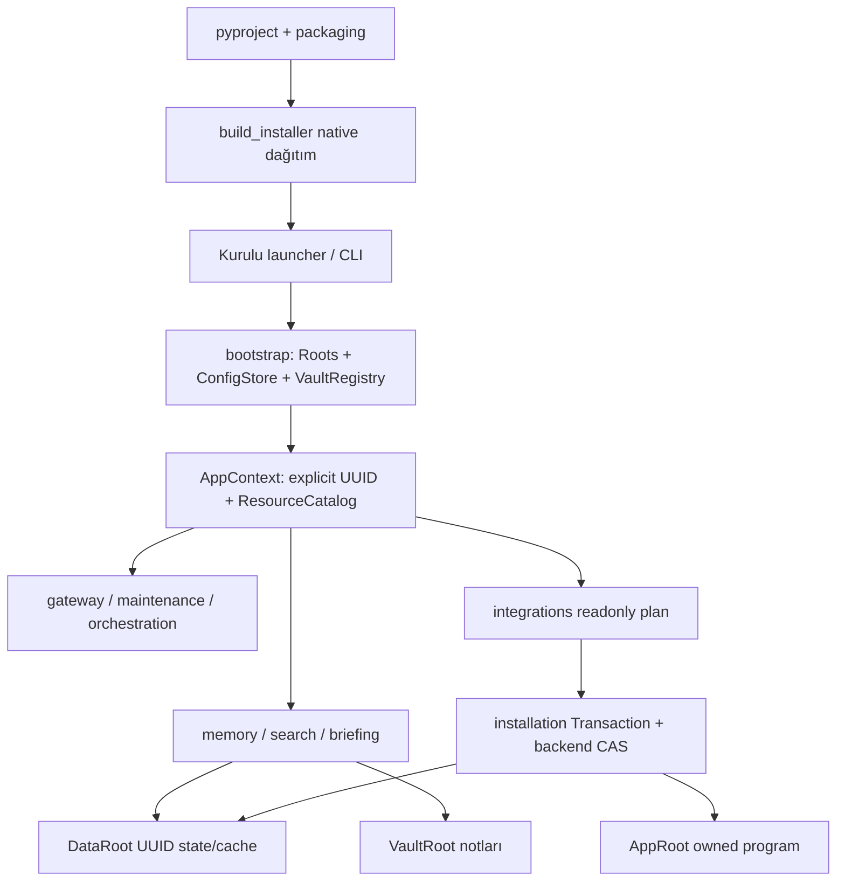

# Respected Brain — Ayrıntılı Depo ve Mimari Atlası

> Bu belge `tools/repository_map.py` tarafından `docs/repository_inventory.json` içindeki gözden geçirilmiş açıklamalardan üretilir. Doğrudan bu Markdown dosyasını düzenlemeyin.

**Kapsam:** 270 proje dosyası. Git indeksindeki dosyalar ve henüz eklenmemiş, ignore edilmeyen proje dosyaları dahildir. Bağımlılık/üretim önbellekleri ayrı kategoriler olarak açıklanır.

## Nasıl okunur ve nereden başlanır

Bu atlas kaynak deposunun tek ayrıntılı dosya haritasıdır. Kullanıcı ürünü kuracaksa `README.md → docs/guides/SETUP.md → ilgili platform rehberi`; geliştirici davranışı anlayacaksa `docs/superpowers/specs/2026-10-03-modular-foundation-design.md → operations eki → aşağıdaki dosya kayıtları` rotasını izler. İlk kez kod okunuyorsa `pyproject.toml → src/respectedbrain/__main__.py → cli.py → bootstrap.py → core/context.py` akışı giriş sağlar.

Dosya ağaçta yoksa önce Git indeksini ve `.gitignore` kuralını kontrol edin. Bu atlas depo dışındaki kurulu uygulamayı veya kişinin gerçek vault içeriğini taramaz. Kaynak depoda canlı kişisel hafıza, kimlik bilgisi ve günlük bulunmamalıdır. Büyük tek atlas, kullanıcı açıkça bütün dosyaları tek belgede istediği için repository artifact olarak tutulur; vault note bölme kuralı kişisel bilgi note'larına uygulanır.

## Üç kök: kaynak, kurulu program ve kullanıcı hafızası

| Alan | Windows varsayılanı / kaynak yolu | Sahibi ve içerik |
| --- | --- | --- |
| Kaynak checkout | Bu Git deposu | `src/`, `packaging/`, `tools/`, `tests/`, `docs/`; geliştirici düzenler. Canlı program dizini değildir. |
| AppRoot | `%LOCALAPPDATA%\Programs\RespectedBrain` | Frozen `respectedbrain.exe`, `app/` bundled runtime/paket/resources, owned `uninstall/`. Program dosyaları hash/mode manifest'iyle yönetilir. |
| DataRoot | `%LOCALAPPDATA%\RespectedBrain` | `config.json`, `install-manifest.json`, `logs/`, `backups/`, UUID'ye bağlı `vaults/<UUID>/state`, `cache`, `overrides`. Teknik durumu uygulama sürümünden ayırır. |
| VaultRoot | Kullanıcının seçtiği herhangi bir mutlak yol | İnsan notları: daily, knowledge, Companion, projeler, Templates, `.obsidian` ve taşınabilir `.respected.json`. Adının RespectedOS olması gerekmez. |

Furkan'ın `C:\Users\Furkan\Documents\RespectedOS` kasası bir kullanıcı seçimi örneğidir; bu atlası üretmek veya kaynak kodu geliştirmek o kasayı taşımak, silmek ya da üzerine kurulum yapmak değildir. Windows Documents Known Folder yönlendirilmiş olabilir. Linux/macOS default'ları `core.paths.resolve_roots` ve `bootstrap.application_roots` içinde platforma göre çözülür; bunları Windows diziniyle karıştırmayın.

Kasa marker'ı UUID/pure-vault schema taşır; makine yolu registry/config'te yaşar. Aynı UUID'li iki canlı kasa çakışır. Setup yeni boş kasayı bir defa üretir; update/repair mevcut insan notlarını template ile yenilemez. Uninstall vault'u hedeflemez. Açık `--purge-data` yalnız kanıtlı owned teknik veriyi yönetir; bilinmeyen dosyalar veya user edit'leri otomatik owned sayılmaz.

## Mimari katmanlar ve bağımlılık yönü

| Katman | Kaynak dizini | Ne yapar? | Ne ile konuşur? |
| --- | --- | --- | --- |
| Dağıtım tanımı | pyproject, packaging, tools/build_installer | Tek src paketini native launcher ve OS installer'a dönüştürür. | resources, CLI, payload manifest |
| Giriş ve composition | __main__, cli, bootstrap | Komut/GUI seçeneklerini parse eder; explicit roots/UUID/context seçer. | ConfigStore, VaultRegistry, feature servisleri |
| Temel sözleşme | core | Pure paths/context, resources, atomic config, errors, lock ve platform uyarlaması. | stdlib/OS; feature implementasyonu import etmez |
| Kimlik ve haritalar | vault | Register/select UUID ve kompakt note/skill maps. | core, resources, VaultRoot note adları |
| Model çalıştırıcı | providers | Yerel CLI, response/fallback/policy ve Windows/WSL environment. | AppContext config, subprocess; API key store tutmaz |
| Hafıza | memory, search, briefing | Transcript summary/upsert, compile, event projection, FTS ve günlük brifing. | ModelService, AppContext, DataRoot state ve VaultRoot notes |
| Ajan/OS adaptörleri | integrations | Provider schemas, MCP, global managed block ve scheduler/shortcut plan/CAS I/O. | core context ve immutable kaynaklar; installation WAL ile apply |
| İşlem sınırı | installation | Hash sahipliği, setup/update/repair/uninstall/migration, journal/recovery. | payload + backend + quiesce; note'ları owned app dosyası saymaz |
| Ürün araçları | maintenance, orchestration, gateway | Sağlık/ingestion/backup, explicit code worktree ve yerel HTTP dashboard. | Bound feature services; code project ile vault'u ayırır |
| Salt okunur içerik | resources | Defaults, UI, instructions, provider adapters, skills, new-vault seed. | ResourceCatalog; DataRoot UUID override ayrı önceliktedir |

Kaynakta emekli kök `runtime/`, `installer/`, `template/` ve `setup.py/setup/setup.command` girişleri bulunmaz. `resources/vault-template/` paket içindeki seed'dir; ayrı motor değildir. İşlevsiz eski `.claude/hooks/` shell/PowerShell kopyaları kaldırılmıştır; güncel rendering native installed `respectedbrain hook` komutları üretir. Legacy okuma kodu eski canlı kurulum için kalır; bu kaynak yerleşiminin eski ağaçlara dönmesi anlamına gelmez.



Sürümün tek paket kaynağı `pyproject.toml` ve kurulu metadata'dan sunulan `__version__` değeridir. Çekirdek runtime zorunlu üçüncü taraf Python bağımlılığı içermez; kaynak geliştirme Python >=3.10, native build araçları dev optional dependency'dir. Restic ve provider CLI'ları kullanılan özellik için harici araçlardır.

## Önemli çalışma akışları

1. **Komut:** module/console/frozen launcher → CLI → bootstrap → kayıtlı UUID AppContext → tek feature servisi. Hook ve MCP protokol stdout'ı bilgi mesajıyla kirletilmez.
2. **Oturum:** provider hook → bridge/notify normalization → lifecycle context/count/turn → detached package flush → transcript extraction/model summary validation → locked daily upsert → immutable event → Companion projection. Teknik idempotency/state vault note'undan ayrıdır.
3. **Derleme:** compile changed daily hashes → UUID cache isolated stage → allowlisted knowledge çıktıları → concurrent source/live revalidation → atomic promotion → ingest receipt/health. Modelin stage dışı write'ı veya aynı anda değişmiş note overwrite'i reddedilir.
4. **Sabah:** UUID scheduler installed launcher'ı çalıştırır → run_if_due 08:00/gün/lock gate → validated briefing → yalnız Dashboard managed section. Provider scheduler'da sabitlenmez, config'ten okunur.
5. **Kurulum/bakım:** payload manifest/hash doğrulama → sahiplik/kök ve external readonly plan → writer quiescence → durable WAL before-image → apply/checkpoint/health → commit manifest. Hata/crash recovery compare-and-swap rollback uygular; kullanıcı sonradan değiştirmişse korur.
6. **Eski geçiş:** readonly LegacyInventory + hash'li MigrationPlan → açık apply ve source/target/external tekrar proof → owned app aktivasyonu ve kişisel override/state taşıma → kanıtlı cleanup. Unknown eski dosya kalır, eski uninstaller çalıştırılmaz.
7. **Kod işçisi:** explicit code project ve owned dosya kapsamı → isolated worktree baseline → worker → acceptance/scope → patch evidence → açık apply/reject. Worker ana checkout'u veya note kasasını çalışma alanı yapmaz.

## Yerel ve ignore edilen artifact’ler

Aşağıdaki kategoriler dosya bazında atlas kapsamı dışındadır. Bunlar kaynak sayfası değildir; her checkout'ta bulunmaları gerekmez. `.gitignore` ve üretim komutları kategorinin yetkili tanımıdır. Üçüncü taraf runtime/venv içindeki binlerce dosyayı proje implementasyonu gibi belgelemek amaç değildir.

| Yerel konum/tür | Kaynak mı? | Nereden gelir / nasıl düşünülür? |
| --- | --- | --- |
| `.git/` veya worktree `.git` pointer | Hayır | Commit/index/ref/object metadata; elle silinmez. Index staged deletion envanter kapsamını belirler. |
| `.venv/`, `venv/`, `env/` | Hayır | pip/development Python ortamı; üçüncü taraf interpreter/site-packages. Yeni checkout'ta yeniden oluşturulur. |
| `__pycache__/`, pyc, unittest/pytest/coverage/typecheck caches | Hayır | Import/test/tool hızlandırma ve raporları; kaynakla karıştırılmaz. |
| `build/` | Hayır | PyInstaller/setuptools ara tree, spec/work/intermediate dosyaları; tools/build_installer oluşturur. |
| `dist/` | Hayır | Native RespectedBrain veya .app tree, distribution.json hashes, installer/archive/wheel çıktıları. Kaynak değişince yeniden üretip verify edin. |
| `release-assets/`, `release-stage/`, kök setup.exe | Hayır | Yayın üretimi/staging çıktıları; ordinary source commit'e eklenmez. |
| `*.egg-info/` | Hayır | Editable install metadata; paket version/console script çözümü içindir, generated'dır. |
| `.superpowers/sdd/<plan>/` | Hayır | Bu planın ledger/brief/profil/timing/review scratch alanı. Sibling plan kayıtlarına dokunulmaz. |
| tmp, logs, *.tmp/*.log, *.bak/*.orig/*.yedek | Hayır | Yerel geçici tanı/rollback/backup; yedeği doğrulamadan silme gerekçesi değildir. |
| `.env`, keys/certs, token/auth/local-settings JSON | Hayır | Secret ve kişisel auth; atlas bunların içeriğini okumaz/yayımlamaz. |
| state/cache/DB/sqlite ve eski .beyin teknik çıktıları | Hayır | Kurulu ürünün teknik durumu normalde DataRoot'tadır; legacy örnekler yalnız migration/test uyumluluğudur. |
| `.obsidian/workspace*`, editor local settings, OS garbage | Hayır | Cihaz/oturum arayüz durumu; package seed CSS ile ayrı tutulur. |

Kaynağa yeni eklenen ignore edilmeyen proje dosyası otomatik keşfedilir. Ignore edilen yeni bir artifact kategorisi mimari olarak anlamlı hale gelirse bu tabloyu JSON section'ında aynı görev içinde güncelleyin. İstenmeyen ignore dosyası Git'e force-add edilirse bilinen dependency/build ağaçları yine kapsam dışıdır; kaynak dosyaları yanlış bir kategoriye saklamayın.

## Değişiklik için gezinme rehberi

| Yapılacak iş / sorun | İlk dosyalar | Kanıt ve etkilediği sınır |
| --- | --- | --- |
| CLI/GUI seçimi kayboluyor | cli.py, installation/wizard.py, setup.py | wizard_options_test, wizard_test; explicit false/package/profile |
| Kasa/ayar yolu veya UUID yanlış | bootstrap.py, core/paths.py, core/config.py, vault/registry.py | foundation_paths/vault_registry; üç kök/identity |
| Flush/summary kaybı veya tekrar | memory/flush.py, lifecycle.py, events.py | turn_log_pipeline/output_normalization/event_log; durable daily/projection |
| Compiler yanlış note yazıyor | memory/compile.py | foundation_memory/adversarial/knowledge_domain; allowlist/concurrent edits |
| Model/fallback/WSL | providers/runner.py, core/platform.py | adversarial/runtime_platform/multiai; auth/output sınırlaması |
| Hook/global/MCP/editor bağlantısı | integrations/rendering.py, global_config.py, hooks/, mcp/ | foundation_integrations/profile_render/mcp_registration; kullanıcı ayar koruması |
| Brifing/scheduler | briefing/service.py, scheduling/service.py, backend.py | morning_briefing/briefing_schedule; günde tek çıktı/native task |
| Setup/update/migration/uninstall | installation/{setup,update,migration,ownership,transaction,windows}.py | foundation_*; hash/mode/WAL/recovery/user-note koruması |
| Arama/graph/recall | search/engine.py, memory/graph/, bounded_recall.py | graph_and_session/smart_tools/mcp_and_features; index/cache/prompt bütçesi |
| Web görünümü/yerel API | gateway/server.py, resources/gateway/web/index.html | foundation_services/maintenance_orchestration; explicit UUID/context |
| Yeni seed/talimat/skill | resources/, core/resources.py, pyproject.toml package-data | package_contract/foundation_packaged_commands; immutable seed/override ayrımı |
| Native package veya yayın | packaging/, tools/build_installer.py, verify_distribution.py, workflows | distribution/native_install/smoke; platform üzerinde gerçek binary kanıtı |
| Depo büyüdü veya file moved | repository_inventory.json, tools/repository_map.py | repository_map_test ve --check; güncel tek dosya atlası |

Testlerin ayrıntılı açıklaması aşağıdaki her dosya kaydında bulunur. Python discovery için `python -m unittest discover -s tests -p '*test*.py'`; bütün native/shell/host kapıları için önce package build/verify sonra `python tests/run_all.py` kullanılır. Mevcut Windows çalıştırması diğer platformları doğrulamaz. Tarihli verification/audit belgelerini bugünkü canlı kurulum durumu olarak kopyalamayın.

## Eksiksiz kaynak ağacı

```text
secondbrain/
├── .gitattributes
├── .github/
│   └── workflows/
│       ├── ci.yml
│       └── release.yml
├── .gitignore
├── .vscode/
│   ├── extensions.json
│   └── settings.json
├── LICENSE
├── README.md
├── docs/
│   ├── ARCHITECTURE.md
│   ├── REPOSITORY_AUDIT.md
│   ├── REPOSITORY_MAP.md
│   ├── SECURITY.md
│   ├── SPECIFICATION.md
│   ├── TEST-MATRIX.md
│   ├── guides/
│   │   ├── BOOTSTRAP.md
│   │   ├── MULTI_AI.md
│   │   ├── SETUP-WINDOWS.md
│   │   ├── SETUP.md
│   │   ├── UNINSTALL.md
│   │   └── UPDATE.md
│   ├── history/
│   │   └── 2026-10-03/
│   │       ├── ARCHITECTURE.md
│   │       ├── README-part-01.md
│   │       ├── README-part-02.md
│   │       ├── README.md
│   │       ├── SPECIFICATION.md
│   │       └── guides/
│   │           ├── BOOTSTRAP.md
│   │           ├── MULTI_AI.md
│   │           ├── SETUP-WINDOWS.md
│   │           ├── SETUP-part-01.md
│   │           ├── SETUP-part-02.md
│   │           ├── SETUP.md
│   │           ├── UNINSTALL.md
│   │           └── UPDATE.md
│   ├── repository_inventory.json
│   └── superpowers/
│       ├── plans/
│       │   ├── 2026-10-03-modular-foundation-core.md
│       │   ├── 2026-10-03-modular-foundation-delivery.md
│       │   ├── 2026-10-03-modular-foundation-services.md
│       │   ├── 2026-10-03-modular-foundation.md
│       │   ├── 2026-10-04-installer-atlas-release.md
│       │   └── 2026-10-04-source-cleanup.md
│       ├── specs/
│       │   ├── 2026-10-03-modular-foundation-design.md
│       │   └── 2026-10-03-modular-foundation-operations.md
│       └── verification/
│           ├── 2026-10-04-modular-foundation.md
│           └── 2026-10-04-source-cleanup.md
├── packaging/
│   ├── entrypoint.py
│   ├── linux/
│   │   └── setup.sh
│   ├── macos/
│   │   └── setup.command
│   └── windows/
│       └── respected_setup.iss
├── pyproject.toml
├── src/
│   └── respectedbrain/
│       ├── __init__.py
│       ├── __main__.py
│       ├── bootstrap.py
│       ├── briefing/
│       │   ├── __init__.py
│       │   └── service.py
│       ├── cli.py
│       ├── core/
│       │   ├── __init__.py
│       │   ├── config.py
│       │   ├── context.py
│       │   ├── coordination.py
│       │   ├── errors.py
│       │   ├── legacy_names.py
│       │   ├── locking.py
│       │   ├── paths.py
│       │   ├── platform.py
│       │   └── resources.py
│       ├── gateway/
│       │   ├── __init__.py
│       │   └── server.py
│       ├── installation/
│       │   ├── __init__.py
│       │   ├── common.py
│       │   ├── deferred.py
│       │   ├── legacy.py
│       │   ├── migration.py
│       │   ├── operations.py
│       │   ├── ownership.py
│       │   ├── payload.py
│       │   ├── repair.py
│       │   ├── setup.py
│       │   ├── transaction.py
│       │   ├── uninstall.py
│       │   ├── update.py
│       │   ├── windows.py
│       │   └── wizard.py
│       ├── integrations/
│       │   ├── __init__.py
│       │   ├── backend.py
│       │   ├── global_config.py
│       │   ├── hooks/
│       │   │   ├── __init__.py
│       │   │   ├── bridge.py
│       │   │   └── codex_notify.py
│       │   ├── legacy_registration.py
│       │   ├── mcp/
│       │   │   ├── __init__.py
│       │   │   └── server.py
│       │   ├── rendering.py
│       │   └── scheduling/
│       │       ├── __init__.py
│       │       └── service.py
│       ├── maintenance/
│       │   ├── __init__.py
│       │   ├── _atomic.py
│       │   ├── architect_scan.py
│       │   ├── backup/
│       │   │   ├── __init__.py
│       │   │   ├── backup_restic.py
│       │   │   └── publish_git_snapshot.py
│       │   ├── ingestion/
│       │   │   ├── __init__.py
│       │   │   ├── defuddle.py
│       │   │   ├── mine_agent_history.py
│       │   │   └── url_safety.py
│       │   ├── repair_daily.py
│       │   ├── smart_merge.py
│       │   ├── tiling_check.py
│       │   └── vault_linter.py
│       ├── memory/
│       │   ├── __init__.py
│       │   ├── bounded_recall.py
│       │   ├── compile.py
│       │   ├── events.py
│       │   ├── flush.py
│       │   ├── graph/
│       │   │   ├── __init__.py
│       │   │   ├── graph_analysis.py
│       │   │   └── graphrag.py
│       │   ├── lifecycle.py
│       │   ├── session_brain.py
│       │   └── session_viz.py
│       ├── orchestration/
│       │   ├── __init__.py
│       │   ├── antigravity_orchestrator.py
│       │   ├── orchestrate.py
│       │   └── runner.py
│       ├── providers/
│       │   ├── __init__.py
│       │   └── runner.py
│       ├── resources/
│       │   ├── __init__.py
│       │   ├── defaults.json
│       │   ├── gateway/
│       │   │   └── web/
│       │   │       └── index.html
│       │   ├── instructions/
│       │   │   └── default.md
│       │   ├── integrations/
│       │   │   ├── .agents/
│       │   │   │   ├── hooks.json
│       │   │   │   └── rules/
│       │   │   │       ├── beyin.md
│       │   │   │       ├── software-quality-1.md
│       │   │   │       └── software-quality-2.md
│       │   │   ├── .claude/
│       │   │   │   └── settings.json
│       │   │   ├── .codex/
│       │   │   │   └── hooks.json
│       │   │   ├── .cursor/
│       │   │   │   ├── hooks.json
│       │   │   │   └── rules/
│       │   │   │       ├── beyin.mdc
│       │   │   │       ├── software-quality-1.mdc
│       │   │   │       └── software-quality-2.mdc
│       │   │   ├── .gemini/
│       │   │   │   ├── GEMINI.md
│       │   │   │   └── settings.json
│       │   │   ├── AGENTS.md
│       │   │   └── CLAUDE.md
│       │   ├── skills/
│       │   │   ├── ajan-gecmis-tara/
│       │   │   │   └── SKILL.md
│       │   │   ├── beyin-doktor/
│       │   │   │   └── SKILL.md
│       │   │   ├── beyin-meydan-oku/
│       │   │   │   └── SKILL.md
│       │   │   ├── beyin-oruntu/
│       │   │   │   └── SKILL.md
│       │   │   ├── gecmis-import/
│       │   │   │   └── SKILL.md
│       │   │   ├── inbox-duzenle/
│       │   │   │   └── SKILL.md
│       │   │   ├── kod-orkestrasyon/
│       │   │   │   └── SKILL.md
│       │   │   ├── obsidian-layout/
│       │   │   │   └── SKILL.md
│       │   │   ├── otonom-arastirma/
│       │   │   │   └── SKILL.md
│       │   │   └── yazilim-kalite/
│       │   │       └── SKILL.md
│       │   └── vault-template/
│       │       ├── .gitignore
│       │       ├── .obsidian/
│       │       │   └── snippets/
│       │       │       └── secondbrain-layout.css
│       │       ├── .respected.json
│       │       ├── daily/
│       │       │   └── .gitkeep
│       │       ├── knowledge/
│       │       │   ├── concepts/
│       │       │   │   └── .gitkeep
│       │       │   ├── connections/
│       │       │   │   └── .gitkeep
│       │       │   ├── index.md
│       │       │   └── log.md
│       │       ├── 🎯 100-Command-Center/
│       │       │   ├── Briefings/
│       │       │   │   └── .gitkeep
│       │       │   ├── Dashboard.md
│       │       │   ├── Skills-Map.md
│       │       │   └── Vault-Map.md
│       │       ├── 🏰 300-Projects/
│       │       │   └── .gitkeep
│       │       ├── 📋 Templates/
│       │       │   ├── Base.base
│       │       │   ├── Canvas.canvas
│       │       │   └── Note.md
│       │       ├── 📥 000-Inbox/
│       │       │   └── Dump/
│       │       │       └── .gitkeep
│       │       ├── 📦 900-Archive/
│       │       │   └── .gitkeep
│       │       ├── 🔮 850-Companion/
│       │       │   ├── Core.md
│       │       │   ├── Journal.md
│       │       │   ├── Kurallar.md
│       │       │   ├── Last-Session.md
│       │       │   ├── Threads.md
│       │       │   └── events/
│       │       │       ├── .gitkeep
│       │       │       └── archive/
│       │       │           └── .gitkeep
│       │       ├── 🛠️ 600-Arsenal/
│       │       │   └── .gitkeep
│       │       └── 🧠 500-Knowledge/
│       │           └── .gitkeep
│       ├── search/
│       │   ├── __init__.py
│       │   └── engine.py
│       └── vault/
│           ├── __init__.py
│           ├── maps.py
│           └── registry.py
├── tests/
│   ├── __init__.py
│   ├── adversarial_quality_test.py
│   ├── antigravity_orchestrator_test.py
│   ├── any_to_any_orchestrator_test.py
│   ├── auto_updater_test.py
│   ├── backup_and_snapshot_test.py
│   ├── boundary_regression_test.py
│   ├── briefing_schedule_test.py
│   ├── briefing_schedule_windows_test.ps1
│   ├── e2e_fresh_install_linux_test.py
│   ├── event_log_test.py
│   ├── foundation_cli_test.py
│   ├── foundation_deferred_test.py
│   ├── foundation_distribution_test.py
│   ├── foundation_features_test.py
│   ├── foundation_inno_service_test.py
│   ├── foundation_install_support.py
│   ├── foundation_integrations_test.py
│   ├── foundation_locking_test.py
│   ├── foundation_maintenance_orchestration_test.py
│   ├── foundation_memory_test.py
│   ├── foundation_migration_apply_test.py
│   ├── foundation_migration_preview_test.py
│   ├── foundation_native_install_test.py
│   ├── foundation_operations_test.py
│   ├── foundation_packaged_commands_test.py
│   ├── foundation_paths_test.py
│   ├── foundation_posix_distribution_test.py
│   ├── foundation_posix_install_test.py
│   ├── foundation_services_test.py
│   ├── foundation_setup_test.py
│   ├── foundation_support.py
│   ├── foundation_transactions_test.py
│   ├── foundation_uninstall_proof_test.py
│   ├── foundation_writer_coordination_test.py
│   ├── global_brand_migration_test.py
│   ├── graph_and_session_test.py
│   ├── hooks_test.sh
│   ├── hybrid_wsl_smoke.ps1
│   ├── install_windows_test.ps1
│   ├── knowledge_domain_test.py
│   ├── lifecycle_test.py
│   ├── maps_test.py
│   ├── mcp_and_features_test.py
│   ├── mcp_registration_test.py
│   ├── morning_briefing_test.py
│   ├── multiai_test.py
│   ├── naming_contract_test.py
│   ├── orchestration_recovery_test.py
│   ├── output_normalization_test.py
│   ├── package_contract_test.py
│   ├── profile_render_test.py
│   ├── regression_matrix_test.py
│   ├── repair_daily_test.py
│   ├── repository_map_test.py
│   ├── run_all.py
│   ├── runtime_layout_test.py
│   ├── runtime_platform_test.py
│   ├── scenario_matrix_test.py
│   ├── scripts_test.py
│   ├── smart_tools_test.py
│   ├── smoke/
│   │   ├── README.md
│   │   ├── linux.sh
│   │   ├── macos.sh
│   │   ├── platform_smoke.py
│   │   ├── windows-native.ps1
│   │   └── wsl.sh
│   ├── source_cleanup_test.py
│   ├── transaction_performance_test.py
│   ├── turn_log_pipeline_test.py
│   ├── uninstall_test.py
│   ├── update_cli_test.py
│   ├── update_respected_test.py
│   ├── upstream_sync_test.sh
│   ├── vault_hygiene_test.py
│   ├── vault_registry_test.py
│   ├── windows_launchers_test.ps1
│   ├── windows_native_test.py
│   ├── wizard_options_test.py
│   ├── wizard_test.py
│   └── zero_trust_security_test.py
└── tools/
    ├── build_installer.py
    ├── repository_map.py
    ├── upstream_sync.sh
    └── verify_distribution.py
```

## Dosya dosya sorumluluk ve ilişkiler

Her kayıt bir dosyayı açıklar; boş `.gitkeep` ve paket `__init__.py` dosyaları da dahildir. Aşağıdaki yollar depo köküne göredir. Tarihsel belgeler canlı davranışın yetkili kaynağı değildir.

### Depo kökü

#### [`.gitattributes`](../.gitattributes)

**Rol:** Depo sözleşmesi.  
**Amaç / sorumluluk:** Metin dosyalarının satır sonlarını türlerine göre LF/CRLF olarak sabitler, ikili dosyalara metin dönüşümünü kapatır ve dağıtım export sınırlarını tanımlar.

**İlişkiler ve sınır:** Shell shebang'leri, Windows PowerShell ve tarihsel belge bütünlüğünü Git checkout/commit sırasında korur.

### .github/workflows

#### [`.github/workflows/ci.yml`](../.github/workflows/ci.yml)

**Rol:** Depo sözleşmesi.  
**Amaç / sorumluluk:** Windows, Linux ve macOS üzerinde native dağıtım üretir, doğrular, regresyon ve host smoke kapılarını çalıştırır; PR/main değişikliklerinin kalite kapısıdır.

**İlişkiler ve sınır:** tools/build_installer.py, verify_distribution.py ve tests komutlarını bağlar; atlas --check kaynak/inceleme drift'ini yakalar.

#### [`.github/workflows/release.yml`](../.github/workflows/release.yml)

**Rol:** Depo sözleşmesi.  
**Amaç / sorumluluk:** v* etiketi veya elle tetikleme için üç platformun native yayın paketlerini üretir ve sürüm etiketini paket metadata'sıyla eşleştirir.

**İlişkiler ve sınır:** PyInstaller/Inno çıktılarını doğruladıktan sonra release artifact'lerini hazırlar; kaynaktan wheel ile native paketi ayırır.

### Depo kökü

#### [`.gitignore`](../.gitignore)

**Rol:** Depo sözleşmesi.  
**Amaç / sorumluluk:** Kimlik bilgileri, kişisel ayarlar, teknik state, veritabanı, sanal ortam ve build çıktılarının Git'e girmesini engeller; paketlenmiş başlangıç kaynaklarını dışlamaz.

**İlişkiler ve sınır:** Git keşif aracı --exclude-standard ile bu kuralları kullanır; vault-template/.gitignore yeni kullanıcı kasası için ayrı kurallardır.

### .vscode

#### [`.vscode/extensions.json`](../.vscode/extensions.json)

**Rol:** Depo sözleşmesi.  
**Amaç / sorumluluk:** Python/Pylance, PowerShell, EditorConfig ve GitHub Actions eklentilerini geliştiriciye önerir.

**İlişkiler ve sınır:** VS Code'un geliştirme ortamını kolaylaştırır; runtime bağımlılığı veya otomatik eklenti kurulumu değildir.

#### [`.vscode/settings.json`](../.vscode/settings.json)

**Rol:** Depo sözleşmesi.  
**Amaç / sorumluluk:** UTF-8 ve dosya sonu politikasını, unittest keşfini, Python analiz arama yollarını ve izleyici dışlamalarını ayarlar.

**İlişkiler ve sınır:** src paketi ve tests dizinindeki geliştirme deneyimini etkiler; ürünün kurulu yollarını belirlemez.

### Depo kökü

#### [`LICENSE`](../LICENSE)

**Rol:** Depo sözleşmesi.  
**Amaç / sorumluluk:** MIT kullanım, değiştirme ve dağıtma iznini ve sorumluluk sınırlamasını tutar; özgün atfın korunmasını gerektirir.

**İlişkiler ve sınır:** README lisans bağlantısını verir; kaynak ve dağıtımda atıf gereği sürer.

#### [`README.md`](../README.md)

**Rol:** Depo sözleşmesi.  
**Amaç / sorumluluk:** Ürünün amacını, üç ayrı kurulum konumunu, native kurulum/build komutlarını ve temel veri koruma davranışlarını açıklayan ilk giriş sayfasıdır.

**İlişkiler ve sınır:** Güncel guides ve yetkili modular-foundation sözleşmelerine yönlendirir; bu atlas ayrıntılı dosya rehberidir.

### docs

#### [`docs/ARCHITECTURE.md`](../docs/ARCHITECTURE.md)

**Rol:** Güncel belge ve yönlendirici.  
**Amaç / sorumluluk:** Modüler temel ve işletim ekini yetkili mimari kaynak olarak işaretler; src katmanlarının ve üç kökün kısa girişini verir.

**İlişkiler ve sınır:** Ayrıntılı davranış specs belgelerinde, dosya rolleri REPOSITORY_MAP.md içinde; eski ARCHITECTURE tarihsel arşivdedir.

#### [`docs/REPOSITORY_AUDIT.md`](../docs/REPOSITORY_AUDIT.md)

**Rol:** Depo sözleşmesi.  
**Amaç / sorumluluk:** Bu değişiklikte dosya/reference/paket kapsamı incelemesini, düzeltilmiş bulguları, performans ve test kanıtını ve açık doğrulama sınırlarını kaydeder.

**İlişkiler ve sınır:** Atlas yapıyı anlatır; audit yürütülmüş incelemenin kanıtıdır; tarihi ve bağlamı dışında canlı platform garantisi vermez.

#### [`docs/REPOSITORY_MAP.md`](../docs/REPOSITORY_MAP.md)

**Rol:** Depo sözleşmesi.  
**Amaç / sorumluluk:** Depo ağacını, mimari katmanları, tüm dosyaları, kurulum köklerini, yerel artifact türlerini ve bakım kurallarını tek ayrıntılı belgede birleştirir.

**İlişkiler ve sınır:** JSON envanterinden deterministic üretilir; README buraya yönlendirir; doğrudan düzenleme --check render drift üretir.

#### [`docs/SECURITY.md`](../docs/SECURITY.md)

**Rol:** Güncel belge ve yönlendirici.  
**Amaç / sorumluluk:** Güncel provider argv izin farklarını, isolated staging ile OS sandbox ayrımını, SSRF DNS rebinding sınırını, snapshot secret guard kapsamını ve package hash ile publisher signature ayrımını kaynak/test referanslarıyla açıklar.

**İlişkiler ve sınır:** zero_trust/adversarial/boundary testleri uygulanabilir kanıt üretir; yalnız politika metni PASS sayılmaz.

#### [`docs/SPECIFICATION.md`](../docs/SPECIFICATION.md)

**Rol:** Güncel belge ve yönlendirici.  
**Amaç / sorumluluk:** Schema3 UUID, tek paket sürümü ve ownership/operations yetkili sözleşmelerine yönlendiren davranış giriş sayfasıdır.

**İlişkiler ve sınır:** pyproject ve runtime __version__ birlikte doğrulanır; güncel gerçek specs/operations'tadır.

#### [`docs/TEST-MATRIX.md`](../docs/TEST-MATRIX.md)

**Rol:** Güncel belge ve yönlendirici.  
**Amaç / sorumluluk:** Platform/provider otomatik kapılarını tarihli fiziksel host kanıtından ayırır; eski Eylül sonuçlarını tarihsel damgalar, güncel modular verification ve gerçek smoke girişlerine yönlendirir.

**İlişkiler ve sınır:** Tarihli durum kaydıdır; yeni CI veya yeni host çalıştırması doğrulanmadıkça eski kanıt bugünkü platform sonucu değildir.

### docs/guides

#### [`docs/guides/BOOTSTRAP.md`](../docs/guides/BOOTSTRAP.md)

**Rol:** Güncel belge ve yönlendirici.  
**Amaç / sorumluluk:** Native kurulum sonrası UUID listeleme, maps ve Companion kişisel Core/Kurallar başlangıç adımlarını anlatır.

**İlişkiler ve sınır:** SETUP rehberi ve packaged vault-template genesis notlarıyla bağlanır; kurulu launcher ile kaynak checkout ayrımını korur.

#### [`docs/guides/MULTI_AI.md`](../docs/guides/MULTI_AI.md)

**Rol:** Güncel belge ve yönlendirici.  
**Amaç / sorumluluk:** Beş ajan için tek talimat/skill kaynağı, UUID overrides, optional global/MCP/schedule/shortcut bayrakları ve repair davranışını açıklar.

**İlişkiler ve sınır:** integrations.rendering/backend bu seçenekleri uygular; talimat kaynağı resources/instructions/default.md'dir.

#### [`docs/guides/SETUP-WINDOWS.md`](../docs/guides/SETUP-WINDOWS.md)

**Rol:** Güncel belge ve yönlendirici.  
**Amaç / sorumluluk:** Windows native Inno program/vault seçimlerini, ayrı LocalAppData köklerini ve shared service/health/shell uninstall sınırını anlatır.

**İlişkiler ve sınır:** respected_setup.iss kullanıcı kabuğu; installation/windows ve setup ortak sahiplik davranışıdır.

#### [`docs/guides/SETUP.md`](../docs/guides/SETUP.md)

**Rol:** Güncel belge ve yönlendirici.  
**Amaç / sorumluluk:** Her platform için native paket gereksinimini, kaynak geliştirme Python sınırını ve explicit setup/GUI seçeneklerini açıklar.

**İlişkiler ve sınır:** README kök ayrımı, Windows eki ve package build komutlarına yönlendirir; end user sistem Python'u kurmak zorunda değildir.

#### [`docs/guides/UNINSTALL.md`](../docs/guides/UNINSTALL.md)

**Rol:** Güncel belge ve yönlendirici.  
**Amaç / sorumluluk:** Owned unchanged dosya/link kaldırılması, changed-file conflict, varsayılan DataRoot koruma ve yalnız explicit purge-data sınırını açıklar.

**İlişkiler ve sınır:** installation.uninstall ortak davranışı uygular; vault note'ları hiçbir uninstall/purge hedefi değildir.

#### [`docs/guides/UPDATE.md`](../docs/guides/UPDATE.md)

**Rol:** Güncel belge ve yönlendirici.  
**Amaç / sorumluluk:** Verified-package update, pending receipt ve eski düzen için salt okunur migrate preview/explicit apply akışını gösterir.

**İlişkiler ve sınır:** installation.update/deferred/migration hash ve recovery sözleşmesini uygular; eski uninstaller çalıştırılmaz.

### docs/history/2026-10-03

#### [`docs/history/2026-10-03/ARCHITECTURE.md`](../docs/history/2026-10-03/ARCHITECTURE.md)

**Rol:** Kayıpsız tarihsel belge.  
**Amaç / sorumluluk:** Eski engine/template kaynak düzeninin katmanlarını, hafıza lifecycle/fallback/platform tasarımını kayıpsız saklar.

**İlişkiler ve sınır:** 2026-10-03 öncesi yerleşimin karar/kanıt arşividir; güncel README/guides ve modular-foundation specs kullanılmalıdır. İçindeki emekli komut/yollar canlı kurulum yönlendirmesi değildir.

#### [`docs/history/2026-10-03/README-part-01.md`](../docs/history/2026-10-03/README-part-01.md)

**Rol:** Kayıpsız tarihsel belge.  
**Amaç / sorumluluk:** Eski README ürün/kurulum seçenekleri, MCP, özetleme, update/migration ve yöntem karşılaştırması metninin ilk bölümünü saklar.

**İlişkiler ve sınır:** 2026-10-03 öncesi yerleşimin karar/kanıt arşividir; güncel README/guides ve modular-foundation specs kullanılmalıdır. İçindeki emekli komut/yollar canlı kurulum yönlendirmesi değildir.

#### [`docs/history/2026-10-03/README-part-02.md`](../docs/history/2026-10-03/README-part-02.md)

**Rol:** Kayıpsız tarihsel belge.  
**Amaç / sorumluluk:** Eski README mimari akış, maliyet/sınırlar, ajan uyumluluğu, SSS, attribution/lisans ve İngilizce girişin devamını saklar.

**İlişkiler ve sınır:** 2026-10-03 öncesi yerleşimin karar/kanıt arşividir; güncel README/guides ve modular-foundation specs kullanılmalıdır. İçindeki emekli komut/yollar canlı kurulum yönlendirmesi değildir.

#### [`docs/history/2026-10-03/README.md`](../docs/history/2026-10-03/README.md)

**Rol:** Kayıpsız tarihsel belge.  
**Amaç / sorumluluk:** 25 KB üstündeki tarihsel README tam metnini iki bölüme bağlar ve birleştirilmiş kaynak SHA256 doğrulamasını korur.

**İlişkiler ve sınır:** 2026-10-03 öncesi yerleşimin karar/kanıt arşividir; güncel README/guides ve modular-foundation specs kullanılmalıdır. İçindeki emekli komut/yollar canlı kurulum yönlendirmesi değildir.

#### [`docs/history/2026-10-03/SPECIFICATION.md`](../docs/history/2026-10-03/SPECIFICATION.md)

**Rol:** Kayıpsız tarihsel belge.  
**Amaç / sorumluluk:** Eski runtime manifest/version/migration ve managed dosya kategorilerinin teknik sözleşmesini kayıpsız saklar.

**İlişkiler ve sınır:** 2026-10-03 öncesi yerleşimin karar/kanıt arşividir; güncel README/guides ve modular-foundation specs kullanılmalıdır. İçindeki emekli komut/yollar canlı kurulum yönlendirmesi değildir.

### docs/history/2026-10-03/guides

#### [`docs/history/2026-10-03/guides/BOOTSTRAP.md`](../docs/history/2026-10-03/guides/BOOTSTRAP.md)

**Rol:** Kayıpsız tarihsel belge.  
**Amaç / sorumluluk:** Eski AI-native installer preflight, parametre/komut ve global/MCP/shortcut/schedule kurulum doğrulama rehberini saklar.

**İlişkiler ve sınır:** 2026-10-03 öncesi yerleşimin karar/kanıt arşividir; güncel README/guides ve modular-foundation specs kullanılmalıdır. İçindeki emekli komut/yollar canlı kurulum yönlendirmesi değildir.

#### [`docs/history/2026-10-03/guides/MULTI_AI.md`](../docs/history/2026-10-03/guides/MULTI_AI.md)

**Rol:** Kayıpsız tarihsel belge.  
**Amaç / sorumluluk:** Eski ortak kasaya çoklu AI bağlantıları, eski sürüm tamamlayıcı kurulumu ve background compiler tercih açıklamasını saklar.

**İlişkiler ve sınır:** 2026-10-03 öncesi yerleşimin karar/kanıt arşividir; güncel README/guides ve modular-foundation specs kullanılmalıdır. İçindeki emekli komut/yollar canlı kurulum yönlendirmesi değildir.

#### [`docs/history/2026-10-03/guides/SETUP-WINDOWS.md`](../docs/history/2026-10-03/guides/SETUP-WINDOWS.md)

**Rol:** Kayıpsız tarihsel belge.  
**Amaç / sorumluluk:** Eski Windows native/WSL kurulum gereksinim ve launcher dizin rehberini karşılaştırma için saklar.

**İlişkiler ve sınır:** 2026-10-03 öncesi yerleşimin karar/kanıt arşividir; güncel README/guides ve modular-foundation specs kullanılmalıdır. İçindeki emekli komut/yollar canlı kurulum yönlendirmesi değildir.

#### [`docs/history/2026-10-03/guides/SETUP-part-01.md`](../docs/history/2026-10-03/guides/SETUP-part-01.md)

**Rol:** Kayıpsız tarihsel belge.  
**Amaç / sorumluluk:** Eski agent runbook'un Mode A fresh-install, kullanıcı interview, prerequisites, platform/global/schedule/Git/desktop ve optional mem0 kurulum fazlarını tam metin olarak saklar.

**İlişkiler ve sınır:** 2026-10-03 öncesi yerleşimin karar/kanıt arşividir; güncel README/guides ve modular-foundation specs kullanılmalıdır. İçindeki emekli komut/yollar canlı kurulum yönlendirmesi değildir.

#### [`docs/history/2026-10-03/guides/SETUP-part-02.md`](../docs/history/2026-10-03/guides/SETUP-part-02.md)

**Rol:** Kayıpsız tarihsel belge.  
**Amaç / sorumluluk:** Eski agent runbook'un Phase 8 verification, Mode B update/preview/apply, global erişim, demo lifecycle ve timing/quota açıklamalarını tam metin devamı olarak saklar.

**İlişkiler ve sınır:** 2026-10-03 öncesi yerleşimin karar/kanıt arşividir; güncel README/guides ve modular-foundation specs kullanılmalıdır. İçindeki emekli komut/yollar canlı kurulum yönlendirmesi değildir.

#### [`docs/history/2026-10-03/guides/SETUP.md`](../docs/history/2026-10-03/guides/SETUP.md)

**Rol:** Kayıpsız tarihsel belge.  
**Amaç / sorumluluk:** 25 KB barajındaki eski kurulum tam metnini bölümlere bağlayan kaynak bütünlüğü/gezinti indeksidir.

**İlişkiler ve sınır:** 2026-10-03 öncesi yerleşimin karar/kanıt arşividir; güncel README/guides ve modular-foundation specs kullanılmalıdır. İçindeki emekli komut/yollar canlı kurulum yönlendirmesi değildir.

#### [`docs/history/2026-10-03/guides/UNINSTALL.md`](../docs/history/2026-10-03/guides/UNINSTALL.md)

**Rol:** Kayıpsız tarihsel belge.  
**Amaç / sorumluluk:** Eski remover dosya/kayıt kategorileri ve kullanıcı veri koruma akışını tarihsel karşılaştırma için saklar.

**İlişkiler ve sınır:** 2026-10-03 öncesi yerleşimin karar/kanıt arşividir; güncel README/guides ve modular-foundation specs kullanılmalıdır. İçindeki emekli komut/yollar canlı kurulum yönlendirmesi değildir.

#### [`docs/history/2026-10-03/guides/UPDATE.md`](../docs/history/2026-10-03/guides/UPDATE.md)

**Rol:** Kayıpsız tarihsel belge.  
**Amaç / sorumluluk:** Eski source/runtime update ve migration preview/apply davranışını tarihsel karşılaştırma için saklar.

**İlişkiler ve sınır:** 2026-10-03 öncesi yerleşimin karar/kanıt arşividir; güncel README/guides ve modular-foundation specs kullanılmalıdır. İçindeki emekli komut/yollar canlı kurulum yönlendirmesi değildir.

### docs

#### [`docs/repository_inventory.json`](../docs/repository_inventory.json)

**Rol:** Depo sözleşmesi.  
**Amaç / sorumluluk:** Her proje dosyasının gözden geçirilmiş Türkçe sorumluluğunu, ilişkilerini ve kaynak içerik SHA256 inceleme damgasını tutar; atlasın giriş bölümleri de burada yaşar.

**İlişkiler ve sınır:** repository_map.py otomatik keşif yapar; yeni kodun açıklamasını insan/ajan doldurur; JSON kendisini hash'lememek için generated damgasındadır.

### docs/superpowers/plans

#### [`docs/superpowers/plans/2026-10-03-modular-foundation-core.md`](../docs/superpowers/plans/2026-10-03-modular-foundation-core.md)

**Rol:** Güncel belge ve yönlendirici.  
**Amaç / sorumluluk:** Görev 1–5 için tek paket/resources, pure roots/context, config/UUID registry, hafıza/provider ve arama/brifing/maps uygulama adımlarını tutar.

**İlişkiler ve sınır:** Ana planın core eki; src/core/memory/providers/search/vault değişiklik sırasını ve test hedeflerini bağlar.

#### [`docs/superpowers/plans/2026-10-03-modular-foundation-delivery.md`](../docs/superpowers/plans/2026-10-03-modular-foundation-delivery.md)

**Rol:** Güncel belge ve yönlendirici.  
**Amaç / sorumluluk:** Görev 11–14 için readonly legacy preview, hash-controlled migration, native build/CI ve gerçek bilgisayar devreye alma kapılarını tutar.

**İlişkiler ve sınır:** Ana planın teslim eki; kişisel vault'a geçiş kanıt/onay sırası kaynak uygulamasından ayrı tutulur.

#### [`docs/superpowers/plans/2026-10-03-modular-foundation-services.md`](../docs/superpowers/plans/2026-10-03-modular-foundation-services.md)

**Rol:** Güncel belge ve yönlendirici.  
**Amaç / sorumluluk:** Görev 6–10 için gateway/maintenance/orchestration, tek CLI, entegrasyonlar, WAL setup ve update/repair/uninstall adımlarını tutar.

**İlişkiler ve sınır:** Ana planın service eki; explicit AppContext ve installation/integration ortak davranış sınırını uygulamaya bağlar.

#### [`docs/superpowers/plans/2026-10-03-modular-foundation.md`](../docs/superpowers/plans/2026-10-03-modular-foundation.md)

**Rol:** Güncel belge ve yönlendirici.  
**Amaç / sorumluluk:** Modüler dönüşümün ana yürütme sırası, global sınırlar, görev ekleri, kullanıcı devreye alma kararı ve son yürütme/temizlik kaydını tutar.

**İlişkiler ve sınır:** Core/services/delivery ekleri ayrıntılı iş adımlarıdır; specs tasarımı yetkili belirler; verification sonuç kanıtını tutar.

#### [`docs/superpowers/plans/2026-10-04-installer-atlas-release.md`](../docs/superpowers/plans/2026-10-04-installer-atlas-release.md)

**Rol:** Güncel belge ve yönlendirici.  
**Amaç / sorumluluk:** GUI seçim düzeltmesi, measured transaction throughput, ayrıntılı atlas/audit ve doğrulanmış GitHub publication işlerinin plan/kısıt/kanıt sırasını tutar.

**İlişkiler ve sınır:** wizard_options_test, transaction_performance_test ve atlas gate bu görevin kapılarıdır; canlı AppData/vault deploy kapsam dışıdır.

#### [`docs/superpowers/plans/2026-10-04-source-cleanup.md`](../docs/superpowers/plans/2026-10-04-source-cleanup.md)

**Rol:** Güncel belge ve yönlendirici.  
**Amaç / sorumluluk:** Emekli runtime/installer/template kaynak girişlerinin kapanışı, korunacak compatibility ve yerel yedek sınırları için son temizlik yürütme kaydıdır.

**İlişkiler ve sınır:** source_cleanup_test ve source-cleanup verification ile doğrulanır; docs/history metinleri kayıpsız korunur.

### docs/superpowers/specs

#### [`docs/superpowers/specs/2026-10-03-modular-foundation-design.md`](../docs/superpowers/specs/2026-10-03-modular-foundation-design.md)

**Rol:** Güncel belge ve yönlendirici.  
**Amaç / sorumluluk:** Yetkili modüler tasarım sözleşmesi: AppRoot/DataRoot/VaultRoot, sahiplik, src modülleri, UUID/config ve dependency sırasını tanımlar.

**İlişkiler ve sınır:** operations eki yaşam döngüsü/migration kabul kriterlerini ayrıntılar; ARCHITECTURE/SPECIFICATION buraya yönlendirir.

#### [`docs/superpowers/specs/2026-10-03-modular-foundation-operations.md`](../docs/superpowers/specs/2026-10-03-modular-foundation-operations.md)

**Rol:** Güncel belge ve yönlendirici.  
**Amaç / sorumluluk:** Tek CLI/entegrasyon, template/kişisel override, setup/update/repair/uninstall ve eski kurulum migration güvenlik/kabul davranışını tanımlar.

**İlişkiler ve sınır:** Design sözleşmesinin işletim ekidir; installation/integrations testleri bu kuralları executable hale getirir.

### docs/superpowers/verification

#### [`docs/superpowers/verification/2026-10-04-modular-foundation.md`](../docs/superpowers/verification/2026-10-04-modular-foundation.md)

**Rol:** Güncel belge ve yönlendirici.  
**Amaç / sorumluluk:** Modüler temel için çalıştırılmış test/build/native senaryo, read-only canlı preview, netleşmiş sözleşme ve kalan platform sınırlarını tarihli kaydeder.

**İlişkiler ve sınır:** Plan yürütmesinin kanıtıdır; kaynak ve testin bugün yeniden çalıştırılmasının yerine geçmez.

#### [`docs/superpowers/verification/2026-10-04-source-cleanup.md`](../docs/superpowers/verification/2026-10-04-source-cleanup.md)

**Rol:** Güncel belge ve yönlendirici.  
**Amaç / sorumluluk:** Son source cleanup'ın kaynak/yayın kontrollerini, gerçek komut sonuçlarını, yerel recovery backup ve birleştirme sınırlarını tarihli kaydeder.

**İlişkiler ve sınır:** source-cleanup planı ve source_cleanup_test ile bağlanır; recoverable tarih arşivi silme için izin değildir.

### packaging

#### [`packaging/entrypoint.py`](../packaging/entrypoint.py)

**Rol:** Depo sözleşmesi.  
**Amaç / sorumluluk:** PyInstaller frozen executable için yalnız respectedbrain.cli.main fonksiyonunu çağıran küçük giriş noktasıdır.

**İlişkiler ve sınır:** Kaynakta python -m respectedbrain ve kurulu console script ile aynı dispatcher'ı paylaşır.

### packaging/linux

#### [`packaging/linux/setup.sh`](../packaging/linux/setup.sh)

**Rol:** Depo sözleşmesi.  
**Amaç / sorumluluk:** Arşivdeki native Linux launcher'ını bulur ve argümanları ortak setup komutuna aktarır.

**İlişkiler ve sınır:** Dağıtım executable'ını çağırır; sistem Python'una veya vault içinde motor kopyasına ihtiyaç duymaz.

### packaging/macos

#### [`packaging/macos/setup.command`](../packaging/macos/setup.command)

**Rol:** Depo sözleşmesi.  
**Amaç / sorumluluk:** macOS .app içindeki frozen launcher'a setup argümanlarını ileten çift tıklanabilir shell girişidir.

**İlişkiler ve sınır:** RespectedBrain.app paketini kullanır; installation.setup ortak servisi veri/kurulum davranışını taşır.

### packaging/windows

#### [`packaging/windows/respected_setup.iss`](../packaging/windows/respected_setup.iss)

**Rol:** Depo sözleşmesi.  
**Amaç / sorumluluk:** Inno Setup kabuğunda program/vault dizinlerini ve seçenekleri sunar, payload'u stage eder ve ortak servise iletir; Apps kaldırıcı kaydını sınırlar.

**İlişkiler ve sınır:** installation.windows shell sahipliğini mühürler; installation.setup/update/uninstall transaction ve kayıt işlemlerini yönetir.

### Depo kökü

#### [`pyproject.toml`](../pyproject.toml)

**Rol:** Depo sözleşmesi.  
**Amaç / sorumluluk:** respectedbrain 0.0.1 paketini, Python >=3.10 sınırını, sıfır zorunlu üçüncü taraf bağımlılığını, geliştirme araçlarını ve console script'i tanımlar; resources dosyalarını açıkça paketler.

**İlişkiler ve sınır:** Setuptools src yerleşimini kurar; respectedbrain.cli:main kurulu giriş olur; build_installer sürümü buradan edinir.

### src/respectedbrain

#### [`src/respectedbrain/__init__.py`](../src/respectedbrain/__init__.py)

**Rol:** Uygulama giriş noktası.  
**Amaç / sorumluluk:** Kurulu paket metadata'sından __version__ değerini sunar; import ederken kullanıcı ayarına veya vault'a erişmez.

**İlişkiler ve sınır:** pyproject.toml paket sürümünü sağlar; CLI/gateway/MCP aynı sürümü kullanır.

#### [`src/respectedbrain/__main__.py`](../src/respectedbrain/__main__.py)

**Rol:** Uygulama giriş noktası.  
**Amaç / sorumluluk:** python -m respectedbrain çalıştırmasını CLI main fonksiyonuna yönlendirir ve süreç çıkış kodunu korur.

**İlişkiler ve sınır:** Kurulu respectedbrain console script ve packaging/entrypoint.py ile aynı dispatcher sözleşmesidir.

#### [`src/respectedbrain/bootstrap.py`](../src/respectedbrain/bootstrap.py)

**Rol:** Uygulama giriş noktası.  
**Amaç / sorumluluk:** Açık uygulama/veri köklerini çözer, config ve kayıtlı UUID kasa üzerinden AppContext oluşturur; frozen/source launcher argv'sini seçer.

**İlişkiler ve sınır:** core.paths, ConfigStore ve vault.registry birleşim noktasıdır; özellik servisleri kendileri CWD'den kasa aramaz.

### src/respectedbrain/briefing

#### [`src/respectedbrain/briefing/__init__.py`](../src/respectedbrain/briefing/__init__.py)

**Rol:** Python paket sınırı.  
**Amaç / sorumluluk:** briefing altındaki günlük morning briefing servisini tek import namespace altında toplar; kullanıcı dosyasına erişmeden paket import edilebilmesini sağlar.

**İlişkiler ve sınır:** Alt modüller explicit AppContext/roots ile çalışır; initializer kurulum, süreç başlatma veya state yaratma işlemi yapmaz. Setuptools namespace=false paket keşfi için __init__.py gereklidir.

#### [`src/respectedbrain/briefing/service.py`](../src/respectedbrain/briefing/service.py)

**Rol:** Bağlamla çalışan ürün servisi.  
**Amaç / sorumluluk:** Yerel gün başına 08:00 sonrası en fazla bir doğrulanmış sabah brifingi oluşturur; açık işler/Journal/daily bağlamını okuyup Dashboard managed bölümünü günceller.

**İlişkiler ve sınır:** ModelService ve compile_pending kullanılır; UUID state/lock/cached stage DataRoot'tadır; schedule aynı run_if_due girişini çağırır.

### src/respectedbrain

#### [`src/respectedbrain/cli.py`](../src/respectedbrain/cli.py)

**Rol:** Uygulama giriş noktası.  
**Amaç / sorumluluk:** vault/configure/setup/migrate/update/repair/uninstall ve memory/search/maps/gateway/maintenance/orchestration komutlarını tek parser/dispatcher'da toplar; GUI seçeneklerini servise aktarır.

**İlişkiler ve sınır:** bootstrap seçili bağlamı hazırlar; FoundationError ve OperationResult durumları süreç koduna çevrilir; hook/MCP stdout protokolünü korur.

### src/respectedbrain/core

#### [`src/respectedbrain/core/__init__.py`](../src/respectedbrain/core/__init__.py)

**Rol:** Python paket sınırı.  
**Amaç / sorumluluk:** core altındaki ortak errors/paths/context/config/resource/lock sözleşmelerini tek import namespace altında toplar; kullanıcı dosyasına erişmeden paket import edilebilmesini sağlar.

**İlişkiler ve sınır:** Alt modüller explicit AppContext/roots ile çalışır; initializer kurulum, süreç başlatma veya state yaratma işlemi yapmaz. Setuptools namespace=false paket keşfi için __init__.py gereklidir.

#### [`src/respectedbrain/core/config.py`](../src/respectedbrain/core/config.py)

**Rol:** Paylaşılan çekirdek sözleşme.  
**Amaç / sorumluluk:** Schema 3 config'i doğrular, paket default'larıyla okur ve kilit altında read-modify-write + atomik replace ile kayıp güncellemeyi önler.

**İlişkiler ve sınır:** DataRoot/config.json hedefidir; VaultRegistry ve configure tercihleri aynı store'u kullanır; installation WAL bunu sahiplik bağlamında yazar.

#### [`src/respectedbrain/core/context.py`](../src/respectedbrain/core/context.py)

**Rol:** Paylaşılan çekirdek sözleşme.  
**Amaç / sorumluluk:** AppContext içinde yollar/kaynaklar/ayarları ve ModelService/ModelResult arayüzlerini açık dataclass/Protocol sözleşmesi olarak tanımlar.

**İlişkiler ve sınır:** ModelRunner bu arayüzü uygular; memory, briefing, search ve gateway seçilmiş UUID bağlamını argümanla alır.

#### [`src/respectedbrain/core/coordination.py`](../src/respectedbrain/core/coordination.py)

**Rol:** Paylaşılan çekirdek sözleşme.  
**Amaç / sorumluluk:** Yazıcıların paylaşımlı lease almasını ve kurulum aktivasyonunun yeni yazıcıları dışlayarak quiescence kazanmasını sağlar; iç içe servis çağrılarını aynı lease'te tutar.

**İlişkiler ve sınır:** guarded_writer ürün servislerini sarar; NativeBackend.quiesce ve Transaction aktivasyonu koordineli tutar.

#### [`src/respectedbrain/core/errors.py`](../src/respectedbrain/core/errors.py)

**Rol:** Paylaşılan çekirdek sözleşme.  
**Amaç / sorumluluk:** Kök/kasa seçimi, kimlik çakışması, state çelişkisi, sahiplik çatışması ve meşgul yazıcı için ortak typed exception'ları tanımlar.

**İlişkiler ve sınır:** CLI anlamlı hata koduna çevirir; core'dan özellik paketine ters bağımlılık oluşturmaz.

#### [`src/respectedbrain/core/legacy_names.py`](../src/respectedbrain/core/legacy_names.py)

**Rol:** Paylaşılan çekirdek sözleşme.  
**Amaç / sorumluluk:** Eski marka/marker/hook adlarını tek uyumluluk modülünde yeniden kurar; yalnız migration ve eski format okuma için kabul edilen adları sınırlar.

**İlişkiler ve sınır:** global_config, memory.events/briefing/maps ve legacy migration eski kayıtları tanır; naming_contract_test yeni yüzeylere sızmayı yakalar.

#### [`src/respectedbrain/core/locking.py`](../src/respectedbrain/core/locking.py)

**Rol:** Paylaşılan çekirdek sözleşme.  
**Amaç / sorumluluk:** Explicit yazma sırasında Windows ve POSIX için cross-process exclusive/shared dosya kilitlerini ve timeout/BusyError davranışını sağlar.

**İlişkiler ve sınır:** ConfigStore, registry, günlük yazıcıları ve kurulum transaction'ları contention güvenliği için kullanır.

#### [`src/respectedbrain/core/paths.py`](../src/respectedbrain/core/paths.py)

**Rol:** Paylaşılan çekirdek sözleşme.  
**Amaç / sorumluluk:** Roots ve AppPaths ile AppRoot/DataRoot/VaultRoot ayrışmasını, mutlak yolları ve geçerli UUID'yi doğrular; state/cache/overrides/log/backup yollarını türetir.

**İlişkiler ve sınır:** bootstrap kökleri burada çözer; vault.registry kasa kaydını bağlar; diğer servislerin teknik verisi vault dışında UUID'ye bağlanır.

#### [`src/respectedbrain/core/platform.py`](../src/respectedbrain/core/platform.py)

**Rol:** Paylaşılan çekirdek sözleşme.  
**Amaç / sorumluluk:** Known Folders, Windows/POSIX düşük seviye kilit, detached/hidden subprocess, WSL ortak temp, exclusive claim ve link/reparse içermeyen path containment uyarlamalarını sunar.

**İlişkiler ve sınır:** Dosya/süreç OS farklarını memory/provider/install servislerinden ayırır; import sırasında sistem keşfi yapmaz.

#### [`src/respectedbrain/core/resources.py`](../src/respectedbrain/core/resources.py)

**Rol:** Paylaşılan çekirdek sözleşme.  
**Amaç / sorumluluk:** importlib.resources üzerinden salt okunur paket içeriğini okur/listeler; gerektiğinde geçici bir ağaca materialize eder ve path escape'i reddeder.

**İlişkiler ve sınır:** ConfigStore default'ları, setup vault seed'i, entegrasyon rendering ve gateway UI dosyaları ResourceCatalog kullanır; checkout'a bağlı değildir.

### src/respectedbrain/gateway

#### [`src/respectedbrain/gateway/__init__.py`](../src/respectedbrain/gateway/__init__.py)

**Rol:** Python paket sınırı.  
**Amaç / sorumluluk:** gateway altındaki yerel HTTP kontrol merkezini tek import namespace altında toplar; kullanıcı dosyasına erişmeden paket import edilebilmesini sağlar.

**İlişkiler ve sınır:** Alt modüller explicit AppContext/roots ile çalışır; initializer kurulum, süreç başlatma veya state yaratma işlemi yapmaz. Setuptools namespace=false paket keşfi için __init__.py gereklidir.

#### [`src/respectedbrain/gateway/server.py`](../src/respectedbrain/gateway/server.py)

**Rol:** Bağlamla çalışan ürün servisi.  
**Amaç / sorumluluk:** localhost:8520 üzerinde stdlib HTTP server ile provider sağlık/ayarlar, hafıza, arama, quick capture ve orkestrasyon işlemlerini API olarak sunar.

**İlişkiler ve sınır:** Paket gateway/web/index.html UI'dır; ModelRunner/SearchEngine/ConfigStore ve explicit-context servislerine bağlanır; uygulama yetkileri vault containment ile sınırlıdır.

### src/respectedbrain/installation

#### [`src/respectedbrain/installation/__init__.py`](../src/respectedbrain/installation/__init__.py)

**Rol:** Python paket sınırı.  
**Amaç / sorumluluk:** installation altındaki ownership-aware setup/update/repair/uninstall/migration servislerini tek import namespace altında toplar; kullanıcı dosyasına erişmeden paket import edilebilmesini sağlar.

**İlişkiler ve sınır:** Alt modüller explicit AppContext/roots ile çalışır; initializer kurulum, süreç başlatma veya state yaratma işlemi yapmaz. Setuptools namespace=false paket keşfi için __init__.py gereklidir.

#### [`src/respectedbrain/installation/common.py`](../src/respectedbrain/installation/common.py)

**Rol:** Sahiplik kontrollü yaşam döngüsü.  
**Amaç / sorumluluk:** Kurulu IntegrationProfile ve AppContext oluşturur; Linux'un zorunlu PATH launcher'ını optional entegrasyonlardan bağımsız transaction ile kurar.

**İlişkiler ve sınır:** setup/update/repair/migration ortak bağlam kullanır; integrations.backend ve rendering launcher/UUID'yi tüketir.

#### [`src/respectedbrain/installation/deferred.py`](../src/respectedbrain/installation/deferred.py)

**Rol:** Sahiplik kontrollü yaşam döngüsü.  
**Amaç / sorumluluk:** Çalışmakta olan executable'ın kendisini değiştirme/kaldırma işini doğrulanmış OS temp kopyasına erteler; parent PID ve request hash kontrolüyle sürdürür.

**İlişkiler ve sınır:** CLI pending OperationResult verir; resume_operation ortak update/uninstall servisini çağırır; son receipt tamamlanmayı kanıtlar.

#### [`src/respectedbrain/installation/legacy.py`](../src/respectedbrain/installation/legacy.py)

**Rol:** Sahiplik kontrollü yaşam döngüsü.  
**Amaç / sorumluluk:** Eski düz/yuvalı/vault içindeki yerleşimleri dosya oluşturmadan tarar; config/state/kişisel overrides ve kanıtlı kayıtları envanterler.

**İlişkiler ve sınır:** migration.plan_migration LegacyInventory'yi kullanır; safe_path ve manifest hash'leri bilinmeyen kullanıcı dosyasına sahiplik atamaz.

#### [`src/respectedbrain/installation/migration.py`](../src/respectedbrain/installation/migration.py)

**Rol:** Sahiplik kontrollü yaşam döngüsü.  
**Amaç / sorumluluk:** Yan etkisiz serializable geçiş planında kaynak/hedef/hash, öncelikli ayarlar, UUID, kişisel overrides ve dış kayıt değişikliklerini açıklar; apply tekrar doğrulayıp WAL ile aktive eder.

**İlişkiler ve sınır:** legacy envanteri, integrations readonly preview, payload validation ve Transaction birleşir; note'lar ve bilinmeyen eski dosyalar korunur, eski uninstaller çalıştırılmaz.

#### [`src/respectedbrain/installation/operations.py`](../src/respectedbrain/installation/operations.py)

**Rol:** Sahiplik kontrollü yaşam döngüsü.  
**Amaç / sorumluluk:** Mevcut manifest köklerini doğrular, paket aktivasyonunu ve optional bağlantı değişikliklerini ortak kurallarla planlar; yeni sahiplik manifest'ini türetir.

**İlişkiler ve sınır:** update/repair/uninstall aynı ownership/integration sözleşmesini paylaşır; servisler arasında ayrı sahiplik mantığı oluşmaz.

#### [`src/respectedbrain/installation/ownership.py`](../src/respectedbrain/installation/ownership.py)

**Rol:** Sahiplik kontrollü yaşam döngüsü.  
**Amaç / sorumluluk:** OwnedFile/OwnershipManifest kayıtlarını, SHA256/mode doğrulamasını, güvenli containment'i ve byte snapshot encode/decode işlevlerini tanımlar.

**İlişkiler ve sınır:** Transaction compare-and-swap rollback yapar; setup/update/uninstall yalnız kaydı ve mevcut içeriği eşleşen program dosyasını yönetir.

#### [`src/respectedbrain/installation/payload.py`](../src/respectedbrain/installation/payload.py)

**Rol:** Sahiplik kontrollü yaşam döngüsü.  
**Amaç / sorumluluk:** distribution.json schema/platform/launcher/dosya hash'lerini doğrular ve aktive edilmiş launcher health komutunu gerçek süreç olarak çalıştırır.

**İlişkiler ve sınır:** setup/update/migration güvenilmeyen paketi aktivasyondan önce sınar; verify_distribution daha geniş frozen smoke kapısıdır.

#### [`src/respectedbrain/installation/repair.py`](../src/respectedbrain/installation/repair.py)

**Rol:** Sahiplik kontrollü yaşam döngüsü.  
**Amaç / sorumluluk:** Doğrulanmış kurulu uygulamanın istenen provider/MCP/schedule/shortcut bağlantılarını yeniden planlar ve transaction ile düzeltir.

**İlişkiler ve sınır:** Note/template üretmez; ownership manifest ve payload health korunur; kurulu preference'ları kullanır.

#### [`src/respectedbrain/installation/setup.py`](../src/respectedbrain/installation/setup.py)

**Rol:** Sahiplik kontrollü yaşam döngüsü.  
**Amaç / sorumluluk:** Native paketi doğrular; yalnız boş yeni vault'u kaynak template'den kişiselleştirir, UUID/config/app dosyalarını ve seçilen bağlantıları ortak transaction içinde kurar.

**İlişkiler ve sınır:** wizard ve CLI aynı setup servisini çağırır; tekrar kurulum insan notlarını yenilemez; health başarısızsa owned değişiklikler geri alınır.

#### [`src/respectedbrain/installation/transaction.py`](../src/respectedbrain/installation/transaction.py)

**Rol:** Sahiplik kontrollü yaşam döngüsü.  
**Amaç / sorumluluk:** Dosya ve dış kayıt değişiklikleri için dayanıklı write-ahead JSON journal, before-image, hash/mode proof, checkpoint/commit/rollback ve restart recovery sağlar.

**İlişkiler ve sınır:** Config atomik yazıcıları, safe_path ve backend.restore kullanılır; kullanıcı sonradan değiştirmişse compare-and-swap geri alma dosyasını ezmez.

#### [`src/respectedbrain/installation/uninstall.py`](../src/respectedbrain/installation/uninstall.py)

**Rol:** Sahiplik kontrollü yaşam döngüsü.  
**Amaç / sorumluluk:** Yalnız hash/mode'u kayıtla eşleşen uygulama dosyalarını kaldırır ve unchanged managed bağlantıları eski baseline'a döndürür; DataRoot varsayılan korunur.

**İlişkiler ve sınır:** --purge-data owned teknik veriyi sınırlar; vault note'ları manifest sahipliği dışındadır; Transaction crash recovery sağlar.

#### [`src/respectedbrain/installation/update.py`](../src/respectedbrain/installation/update.py)

**Rol:** Sahiplik kontrollü yaşam döngüsü.  
**Amaç / sorumluluk:** Yeni doğrulanmış payload'u aktive eder, kayıtlı UUID/ayarlar/optional bağlantıları korur ve health gate'ten sonra manifest'i commit eder.

**İlişkiler ve sınır:** operations ve Transaction kullanır; kullanıcı note'larına template uygulamaz; aktif Windows executable için deferred akışı üst katmanda seçilir.

#### [`src/respectedbrain/installation/windows.py`](../src/respectedbrain/installation/windows.py)

**Rol:** Sahiplik kontrollü yaşam döngüsü.  
**Amaç / sorumluluk:** Inno staging, uninstaller/registry proof, geçici helper ve finalize sonrası shell log hash mühürleme sınırını yönetir.

**İlişkiler ve sınır:** respected_setup.iss bu servisleri çağırır; ortak Transaction owned shell bytes'larını korur; kilitli .dat dosyası için prelaunch attestation gerekir.

#### [`src/respectedbrain/installation/wizard.py`](../src/respectedbrain/installation/wizard.py)

**Rol:** Sahiplik kontrollü yaşam döngüsü.  
**Amaç / sorumluluk:** Tkinter kurulum arayüzünde vault/package/profile/provider ve optional seçimleri toplar; explicit false değerlerini korur, seçili kayıtlı vault'un profilini kullanır ve eylem anında hedef değiştirilmişse görünmeyen profile alanlarını yeniden seçer.

**İlişkiler ve sınır:** ConfigStore kayıtlı varsayılanları sağlar; CLI --gui başlangıç değerlerini taşır; GUI kendi installer mantığını uygulamaz.

### src/respectedbrain/integrations

#### [`src/respectedbrain/integrations/__init__.py`](../src/respectedbrain/integrations/__init__.py)

**Rol:** Python paket sınırı.  
**Amaç / sorumluluk:** integrations altındaki readonly external plan ve native backend sınırını tek import namespace altında toplar; kullanıcı dosyasına erişmeden paket import edilebilmesini sağlar.

**İlişkiler ve sınır:** Alt modüller explicit AppContext/roots ile çalışır; initializer kurulum, süreç başlatma veya state yaratma işlemi yapmaz. Setuptools namespace=false paket keşfi için __init__.py gereklidir.

#### [`src/respectedbrain/integrations/backend.py`](../src/respectedbrain/integrations/backend.py)

**Rol:** Ajan ve işletim sistemi bağlantısı.  
**Amaç / sorumluluk:** ExternalChange/IntegrationProfile ve IntegrationBackend Protocol sözleşmesini tanımlar; NativeBackend dosya, registry, shortcut ve scheduler kayıtlarını exact snapshot/CAS ile okur-yazar/geri alır.

**İlişkiler ve sınır:** Rendering ve scheduling plan üretir; Transaction apply_external journal'lar; Windows task XML canonicalization gerçek farkları korur.

#### [`src/respectedbrain/integrations/global_config.py`](../src/respectedbrain/integrations/global_config.py)

**Rol:** Ajan ve işletim sistemi bağlantısı.  
**Amaç / sorumluluk:** Managed talimat blokları, Codex TOML notify ve provider hook JSON merge'lerini saf algoritmalarla birleştirir; bilinmeyen kullanıcı alanlarını korur.

**İlişkiler ve sınır:** rendering planı bu merge sonuçlarını external change olarak verir; legacy_registration eski managed kayıtları kanıtlı ayırır.

### src/respectedbrain/integrations/hooks

#### [`src/respectedbrain/integrations/hooks/__init__.py`](../src/respectedbrain/integrations/hooks/__init__.py)

**Rol:** Python paket sınırı.  
**Amaç / sorumluluk:** integrations/hooks altındaki provider hook normalization ve notify adapter'larını tek import namespace altında toplar; kullanıcı dosyasına erişmeden paket import edilebilmesini sağlar.

**İlişkiler ve sınır:** Alt modüller explicit AppContext/roots ile çalışır; initializer kurulum, süreç başlatma veya state yaratma işlemi yapmaz. Setuptools namespace=false paket keşfi için __init__.py gereklidir.

#### [`src/respectedbrain/integrations/hooks/bridge.py`](../src/respectedbrain/integrations/hooks/bridge.py)

**Rol:** Ajan ve işletim sistemi bağlantısı.  
**Amaç / sorumluluk:** Beş provider'ın giriş JSON ve lifecycle olaylarını normalize eder, açık transcript/session kimliğini güvenli çözer ve provider'a uygun yanıt protokolünü üretir.

**İlişkiler ve sınır:** memory.lifecycle tek politika kaynağıdır; içinde-vault/WSL eşleşmesi yanlış depoya yazmayı engeller; CLI hook stdout'ı kirlendirmez.

#### [`src/respectedbrain/integrations/hooks/codex_notify.py`](../src/respectedbrain/integrations/hooks/codex_notify.py)

**Rol:** Ajan ve işletim sistemi bağlantısı.  
**Amaç / sorumluluk:** Codex completion bildirimi ve opaque JSON argümanını koruyarak lifecycle turn flush'u tetikler; önceki notify handler zincirini aynı argv ile sürdürür.

**İlişkiler ve sınır:** rendering/global_config managed notify kaydını oluşturur; UUID DataRoot state chain'i saklar; writer lease reentrant/background işlerini korur.

### src/respectedbrain/integrations

#### [`src/respectedbrain/integrations/legacy_registration.py`](../src/respectedbrain/integrations/legacy_registration.py)

**Rol:** Ajan ve işletim sistemi bağlantısı.  
**Amaç / sorumluluk:** Eski global talimat/hook/notify kayıtlarından sadece doğrulanmış owned bölümleri kaldırmak veya taşımak için salt okunur değişiklik planı kurar.

**İlişkiler ve sınır:** NativeBackend'in inspect_legacy_registrations sonuçlarını ve global_config ownership kurallarını kullanır; unrelated kullanıcı handler'larını silmez.

### src/respectedbrain/integrations/mcp

#### [`src/respectedbrain/integrations/mcp/__init__.py`](../src/respectedbrain/integrations/mcp/__init__.py)

**Rol:** Python paket sınırı.  
**Amaç / sorumluluk:** integrations/mcp altındaki package-owned stdio MCP protokol servisini tek import namespace altında toplar; kullanıcı dosyasına erişmeden paket import edilebilmesini sağlar.

**İlişkiler ve sınır:** Alt modüller explicit AppContext/roots ile çalışır; initializer kurulum, süreç başlatma veya state yaratma işlemi yapmaz. Setuptools namespace=false paket keşfi için __init__.py gereklidir.

#### [`src/respectedbrain/integrations/mcp/server.py`](../src/respectedbrain/integrations/mcp/server.py)

**Rol:** Ajan ve işletim sistemi bağlantısı.  
**Amaç / sorumluluk:** Seçili vault için stdio JSON-RPC MCP tool manifest'i ve güvenli read/search/remember/capture/expand işlemlerini sunar; stdout sadece protokoldür.

**İlişkiler ve sınır:** SearchEngine yerel indeks sağlar; safe resolve traversal/reparse sınırını korur; CLI mcp ve editor registration aynı installed launcher'ı kullanır.

### src/respectedbrain/integrations

#### [`src/respectedbrain/integrations/rendering.py`](../src/respectedbrain/integrations/rendering.py)

**Rol:** Ajan ve işletim sistemi bağlantısı.  
**Amaç / sorumluluk:** Profile/launcher/UUID üzerinden native hook argv, proje/global talimatlar, skill kopyaları ve editor MCP ayarlarını salt okunur planlar; kullanıcı override'ına öncelik verir.

**İlişkiler ve sınır:** ResourceCatalog kaynak içeriktir; backend ExternalChange çıktısıdır; setup/repair/migration transaction ile uygular; direkt kasa engine'i çalıştırmaz.

### src/respectedbrain/integrations/scheduling

#### [`src/respectedbrain/integrations/scheduling/__init__.py`](../src/respectedbrain/integrations/scheduling/__init__.py)

**Rol:** Python paket sınırı.  
**Amaç / sorumluluk:** integrations/scheduling altındaki UUID launcher tabanlı native brifing schedule planlarını tek import namespace altında toplar; kullanıcı dosyasına erişmeden paket import edilebilmesini sağlar.

**İlişkiler ve sınır:** Alt modüller explicit AppContext/roots ile çalışır; initializer kurulum, süreç başlatma veya state yaratma işlemi yapmaz. Setuptools namespace=false paket keşfi için __init__.py gereklidir.

#### [`src/respectedbrain/integrations/scheduling/service.py`](../src/respectedbrain/integrations/scheduling/service.py)

**Rol:** Ajan ve işletim sistemi bağlantısı.  
**Amaç / sorumluluk:** UUID ve kurulu launcher'a bağlı Windows task XML, Linux systemd service/timer, macOS launchd plist ve WSL task planlarını üretir.

**İlişkiler ve sınır:** Provider seçimi runtime config'ten gelir; NativeBackend aktivasyon/restore işini yapar; readonly preview hiçbir task kaydetmez.

### src/respectedbrain/maintenance

#### [`src/respectedbrain/maintenance/__init__.py`](../src/respectedbrain/maintenance/__init__.py)

**Rol:** Kasa bakım ve içe alma aracı.  
**Amaç / sorumluluk:** Bakım aracı adını explicit AppContext ile modüle dispatch eder; mutable_target vault uyuşmazlığı ve AppRoot/başka kasa yazma hedefini engeller.

**İlişkiler ve sınır:** CLI maintenance altkomutlarının ortak sınırıdır; guarded_writer tüm bakım mutasyonlarını admission protokolüne bağlar.

#### [`src/respectedbrain/maintenance/_atomic.py`](../src/respectedbrain/maintenance/_atomic.py)

**Rol:** Kasa bakım ve içe alma aracı.  
**Amaç / sorumluluk:** Stage ve hedef başka volume'da olduğunda güvenli temp kopya + atomik son replace yapar; EXDEV hatasını note kaybı olmadan ele alır.

**İlişkiler ve sınır:** smart_merge, repair_daily ve mine_agent_history DataRoot staging'den vault note'una yazarken kullanır.

#### [`src/respectedbrain/maintenance/architect_scan.py`](../src/respectedbrain/maintenance/architect_scan.py)

**Rol:** Kasa bakım ve içe alma aracı.  
**Amaç / sorumluluk:** Açık kod projesindeki dil/modül/entrypoint/dependency/CI sinyallerini ve seçilmiş Git mimari kararlarını raporlar; AI-first Markdown çıkarır.

**İlişkiler ve sınır:** selected_vault/mutable_target çıktı sınırını korur; kod deposunu kasa diye seçmez; bu repository atlas üreticisinden ayrı kullanıcı aracıdır.

### src/respectedbrain/maintenance/backup

#### [`src/respectedbrain/maintenance/backup/__init__.py`](../src/respectedbrain/maintenance/backup/__init__.py)

**Rol:** Python paket sınırı.  
**Amaç / sorumluluk:** maintenance/backup altındaki opt-in restic/private Git backup araçlarını tek import namespace altında toplar; kullanıcı dosyasına erişmeden paket import edilebilmesini sağlar.

**İlişkiler ve sınır:** Alt modüller explicit AppContext/roots ile çalışır; initializer kurulum, süreç başlatma veya state yaratma işlemi yapmaz. Setuptools namespace=false paket keşfi için __init__.py gereklidir.

#### [`src/respectedbrain/maintenance/backup/backup_restic.py`](../src/respectedbrain/maintenance/backup/backup_restic.py)

**Rol:** Kasa bakım ve içe alma aracı.  
**Amaç / sorumluluk:** Açık opt-in restic vault yedeğini prerequisite/hedef containment denetiminden geçirir; snapshot doğrulaması için geçici restore kanıtı kurabilir.

**İlişkiler ve sınır:** Restic dış CLI gerektirir; UUID DataRoot cache stage kullanır; uygulama veya vault içine backup repository açmaz.

#### [`src/respectedbrain/maintenance/backup/publish_git_snapshot.py`](../src/respectedbrain/maintenance/backup/publish_git_snapshot.py)

**Rol:** Kasa bakım ve içe alma aracı.  
**Amaç / sorumluluk:** Opt-in özel Git snapshot'ında secret guard, interval receipt ve divergence kontrolü yapar; yalnız güvenli durumda commit/push üretir.

**İlişkiler ve sınır:** Açık kullanıcı yayımlama tercihi gerektirir; state DataRoot'ta, notes vault'tadır; backend engine source dağıtımı değildir.

### src/respectedbrain/maintenance/ingestion

#### [`src/respectedbrain/maintenance/ingestion/__init__.py`](../src/respectedbrain/maintenance/ingestion/__init__.py)

**Rol:** Python paket sınırı.  
**Amaç / sorumluluk:** maintenance/ingestion altındaki web ve ajan transcript içe alma araçlarını tek import namespace altında toplar; kullanıcı dosyasına erişmeden paket import edilebilmesini sağlar.

**İlişkiler ve sınır:** Alt modüller explicit AppContext/roots ile çalışır; initializer kurulum, süreç başlatma veya state yaratma işlemi yapmaz. Setuptools namespace=false paket keşfi için __init__.py gereklidir.

#### [`src/respectedbrain/maintenance/ingestion/defuddle.py`](../src/respectedbrain/maintenance/ingestion/defuddle.py)

**Rol:** Kasa bakım ve içe alma aracı.  
**Amaç / sorumluluk:** Stdlib HTMLParser ile reklam/menu/script/style gürültüsünü çıkarıp Markdown üretir; URL fetch ve tüm redirect hedeflerini SSRF filtresinden geçirir.

**İlişkiler ve sınır:** url_safety URL doğrular; selected_vault/mutable_target hedefi korur; dış içerik yalnız veri olarak işlenir.

#### [`src/respectedbrain/maintenance/ingestion/mine_agent_history.py`](../src/respectedbrain/maintenance/ingestion/mine_agent_history.py)

**Rol:** Kasa bakım ve içe alma aracı.  
**Amaç / sorumluluk:** Yerel Claude/Antigravity/Codex transcript'lerini keşfedip normalize ederek daily veya Dump'a import eder; state idempotency duplicate'leri engeller.

**İlişkiler ve sınır:** UUID DataRoot state import receipt tutar; _atomic note yazar; ajan-gecmis-tara skill bu public bakım komutunu kullanır.

#### [`src/respectedbrain/maintenance/ingestion/url_safety.py`](../src/respectedbrain/maintenance/ingestion/url_safety.py)

**Rol:** Kasa bakım ve içe alma aracı.  
**Amaç / sorumluluk:** URL scheme/port/host/IP/DNS üzerinde private/loopback/metadata ve obfuscated adresleri reddeder; canonical text/hash ile tekrar içeriğini karşılaştırır.

**İlişkiler ve sınır:** defuddle redirects dahil bu güvenlik sınırını çağırır; otonom-arastirma skill URL güvenlik komutundan yararlanır.

### src/respectedbrain/maintenance

#### [`src/respectedbrain/maintenance/repair_daily.py`](../src/respectedbrain/maintenance/repair_daily.py)

**Rol:** Kasa bakım ve içe alma aracı.  
**Amaç / sorumluluk:** Daily session bloklarını exact/near-duplicate kümeleriyle inceler, daha zengin özeti tutarak önceden timestamp'li backup alır; farklı oturumları korur.

**İlişkiler ve sınır:** _atomic cross-volume replace sağlar; CLI maintenance repair-daily seçili vault'u bağlar; flush upsert sonrası geçmiş tamir aracıdır.

#### [`src/respectedbrain/maintenance/smart_merge.py`](../src/respectedbrain/maintenance/smart_merge.py)

**Rol:** Kasa bakım ve içe alma aracı.  
**Amaç / sorumluluk:** İki note frontmatter/tags/aliases/timeline'ını birleştirir, kaynak yerine redirect bırakır ve wikilink hedeflerini günceller; self-merge'ü reddeder.

**İlişkiler ve sınır:** _atomic güvenli yazma sağlar; source note'u sessiz silmez; tiling_check merge adayı raporlayabilir.

#### [`src/respectedbrain/maintenance/tiling_check.py`](../src/respectedbrain/maintenance/tiling_check.py)

**Rol:** Kasa bakım ve içe alma aracı.  
**Amaç / sorumluluk:** Token/Jaccard overlap ile vault içindeki anlamsal tekrar note çiftlerini ve benzerlik skorlarını raporlar; threshold doğrular.

**İlişkiler ve sınır:** smart_merge açık uygulama aracıdır; bu tarama tek başına note birleştirmez; selected_vault explicit hedefi belirler.

#### [`src/respectedbrain/maintenance/vault_linter.py`](../src/respectedbrain/maintenance/vault_linter.py)

**Rol:** Kasa bakım ve içe alma aracı.  
**Amaç / sorumluluk:** Broken wikilink/yetim/frontmatter/dash adları ve dated freshness iddialarını deterministik denetler; açık fix seçimiyle dosya adı dash'ini düzeltir.

**İlişkiler ve sınır:** maintenance dispatcher UUID kasa sınırını bağlar; graph analysis daha derin yapısal analiz sağlar; beyin-doktor sağlık iş akışında kullanır.

### src/respectedbrain/memory

#### [`src/respectedbrain/memory/__init__.py`](../src/respectedbrain/memory/__init__.py)

**Rol:** Python paket sınırı.  
**Amaç / sorumluluk:** memory altındaki flush/compile/lifecycle ve bounded recall hafıza servislerini tek import namespace altında toplar; kullanıcı dosyasına erişmeden paket import edilebilmesini sağlar.

**İlişkiler ve sınır:** Alt modüller explicit AppContext/roots ile çalışır; initializer kurulum, süreç başlatma veya state yaratma işlemi yapmaz. Setuptools namespace=false paket keşfi için __init__.py gereklidir.

#### [`src/respectedbrain/memory/bounded_recall.py`](../src/respectedbrain/memory/bounded_recall.py)

**Rol:** Bağlamla çalışan ürün servisi.  
**Amaç / sorumluluk:** Anlamlı prompt için en fazla birkaç nottan dar karakter bütçeli hafıza ipucu seçer; kısa/slash/selamlama sorgusunda ve hatada sessiz boş yanıt verir.

**İlişkiler ve sınır:** SearchEngine FTS sonucu kullanılır; lifecycle bağlam enjeksiyonuna hafif recall sağlar; note gövdelerini bütçesiz prompt'a taşımaz.

#### [`src/respectedbrain/memory/compile.py`](../src/respectedbrain/memory/compile.py)

**Rol:** Bağlamla çalışan ürün servisi.  
**Amaç / sorumluluk:** Değişmiş daily log'ları UUID cache altında izole stage'e kopyalar, modele derletir, yalnız allowlist içindeki knowledge çıktılarını doğrulayıp atomik promote eder.

**İlişkiler ve sınır:** ModelService kaynak günlükleri işler; source/live hash doğrulaması eşzamanlı note değişikliğini korur; durable ingest state tekrar işlemeyi engeller.

#### [`src/respectedbrain/memory/events.py`](../src/respectedbrain/memory/events.py)

**Rol:** Bağlamla çalışan ürün servisi.  
**Amaç / sorumluluk:** Provider bağımsız immutable session handoff JSON olayları kaydeder, eski olayları arşivler ve Last-Session/Threads projeksiyonunu read-merge korumasıyla üretir.

**İlişkiler ve sınır:** flush oturum özetini olaylaştırır; mevcut insan thread'leri boş model çıktısıyla silinmez; genesis migration eski Companion metnini korur.

#### [`src/respectedbrain/memory/flush.py`](../src/respectedbrain/memory/flush.py)

**Rol:** Bağlamla çalışan ürün servisi.  
**Amaç / sorumluluk:** Provider transcript JSONL'ini turn bütçesiyle ayıklar, beş bölümlü özeti doğrular/tek schema repair dener ve daily session bloğunu kilitli idempotent upsert ile yazar.

**İlişkiler ve sınır:** ModelRunner, events ve lifecycle çağırır; UUID state tekrar sayacı/hashes/health tutar; catch-up eski tamamlanmış session/day işlerini bulur.

### src/respectedbrain/memory/graph

#### [`src/respectedbrain/memory/graph/__init__.py`](../src/respectedbrain/memory/graph/__init__.py)

**Rol:** Python paket sınırı.  
**Amaç / sorumluluk:** memory/graph altındaki wikilink graph ve GraphRAG sayfa seçimini tek import namespace altında toplar; kullanıcı dosyasına erişmeden paket import edilebilmesini sağlar.

**İlişkiler ve sınır:** Alt modüller explicit AppContext/roots ile çalışır; initializer kurulum, süreç başlatma veya state yaratma işlemi yapmaz. Setuptools namespace=false paket keşfi için __init__.py gereklidir.

#### [`src/respectedbrain/memory/graph/graph_analysis.py`](../src/respectedbrain/memory/graph/graph_analysis.py)

**Rol:** Bağlamla çalışan ürün servisi.  
**Amaç / sorumluluk:** Markdown wikilink grafından hubs, bridge betweenness, yetimler, broken link ve synthesis gaps hesaplar; cross-link önerisi veya açık apply üretir.

**İlişkiler ve sınır:** Vault note'larını tarar; graphrag aynı bağlantı kavramlarını soru seçiminde kullanır; CLI graph ve maintenance sağlık araçlarına rapor sağlar.

#### [`src/respectedbrain/memory/graph/graphrag.py`](../src/respectedbrain/memory/graph/graphrag.py)

**Rol:** Bağlamla çalışan ürün servisi.  
**Amaç / sorumluluk:** Frontmatter özetleri ve wikilink'lerden bellek içi indeks kurar; query'de az sayıda should_read sayfası/index_only önerisi ve BFS bağlantı yolu çıkarır.

**İlişkiler ve sınır:** graph_analysis yapısal sağlık içindir; bu modül prompt maliyetini sınırlayan sayfa seçimi yapar; explicit vault kullanır.

### src/respectedbrain/memory

#### [`src/respectedbrain/memory/lifecycle.py`](../src/respectedbrain/memory/lifecycle.py)

**Rol:** Bağlamla çalışan ürün servisi.  
**Amaç / sorumluluk:** start/prompt/turn/end/precompact/postcompact olaylarında sınırlı Companion/maps/daily bağlamını oluşturur, prompt sayacı ve reflection debt'i yönetir, flush/compile child işlerini başlatır.

**İlişkiler ve sınır:** hooks.bridge normalize eder; packaged launcher argv kullanır; UUID state/cache vault içinde değildir; reentrant hook sonsuz döngüsünü engeller.

#### [`src/respectedbrain/memory/session_brain.py`](../src/respectedbrain/memory/session_brain.py)

**Rol:** Bağlamla çalışan ürün servisi.  
**Amaç / sorumluluk:** Ham oturum geçmişini vault'u büyütmeden seçili UUID sidecar indeksine alır; TF-IDF benzeri terim ağırlığı ve recency decay ile geçmiş konuşma arar.

**İlişkiler ve sınır:** AppContext teknik konumu sağlar; maintenance history kaynaklarından bağımsız query servisi; session_viz bu indeksi görselleştirir.

#### [`src/respectedbrain/memory/session_viz.py`](../src/respectedbrain/memory/session_viz.py)

**Rol:** Bağlamla çalışan ürün servisi.  
**Amaç / sorumluluk:** SessionBrain sidecar index'ini tek HTML ağ görselleştirmesine dönüştürür; zaman kaydırıcı ve arama için node/edge verisi üretir.

**İlişkiler ve sınır:** session_brain çıktısını okur; HTML'yi explicit cache/output hedefine yazar; harici vis.js görünümü tarayıcıda yüklenir.

### src/respectedbrain/orchestration

#### [`src/respectedbrain/orchestration/__init__.py`](../src/respectedbrain/orchestration/__init__.py)

**Rol:** Python paket sınırı.  
**Amaç / sorumluluk:** orchestration altındaki isolated code worktree worker servislerini tek import namespace altında toplar; kullanıcı dosyasına erişmeden paket import edilebilmesini sağlar.

**İlişkiler ve sınır:** Alt modüller explicit AppContext/roots ile çalışır; initializer kurulum, süreç başlatma veya state yaratma işlemi yapmaz. Setuptools namespace=false paket keşfi için __init__.py gereklidir.

#### [`src/respectedbrain/orchestration/antigravity_orchestrator.py`](../src/respectedbrain/orchestration/antigravity_orchestrator.py)

**Rol:** Bağlamla çalışan ürün servisi.  
**Amaç / sorumluluk:** Antigravity worker için tek yazıcı kilidi, bounded brief, sahip olunan dosya lane'i, dirty input overlay, scope kontrolü, acceptance komutları ve redacted patch kanıtı yönetir.

**İlişkiler ve sınır:** runner.validate_project kod/vault sınırını korur; ana checkout worker tarafından doğrudan değiştirilmez; hata lane'i inceleme için tutulur.

#### [`src/respectedbrain/orchestration/orchestrate.py`](../src/respectedbrain/orchestration/orchestrate.py)

**Rol:** Bağlamla çalışan ürün servisi.  
**Amaç / sorumluluk:** Any-to-Any runner.run fonksiyonunu programatik kullanım için dışa açan ince uyumluluk girişidir.

**İlişkiler ve sınır:** CLI ve gateway esas davranış için runner'a gider; ayrı worker yaşam döngüsü uygulamaz.

#### [`src/respectedbrain/orchestration/runner.py`](../src/respectedbrain/orchestration/runner.py)

**Rol:** Bağlamla çalışan ürün servisi.  
**Amaç / sorumluluk:** Açık kod projesinde izole Git worktree worker'ları başlatır, owned run metadata/diff'ini DataRoot'ta saklar ve açık apply/reject ile yamayı yönetir.

**İlişkiler ve sınır:** Provider CLI argv seçimi, writer lease ve validate_project kasa/kod ayrımı sağlar; gateway aynı kayıtlı project/run servislerini çağırır.

### src/respectedbrain/providers

#### [`src/respectedbrain/providers/__init__.py`](../src/respectedbrain/providers/__init__.py)

**Rol:** Python paket sınırı.  
**Amaç / sorumluluk:** providers altındaki yerel model CLI/fallback servislerini tek import namespace altında toplar; kullanıcı dosyasına erişmeden paket import edilebilmesini sağlar.

**İlişkiler ve sınır:** Alt modüller explicit AppContext/roots ile çalışır; initializer kurulum, süreç başlatma veya state yaratma işlemi yapmaz. Setuptools namespace=false paket keşfi için __init__.py gereklidir.

#### [`src/respectedbrain/providers/runner.py`](../src/respectedbrain/providers/runner.py)

**Rol:** Bağlamla çalışan ürün servisi.  
**Amaç / sorumluluk:** Config'e göre yerel Claude/Codex/Antigravity/Gemini/Cursor CLI'larını shell kullanmadan çalıştırır; response çıkarımı, retryable fallback, Windows/WSL environment ve bounded health raporu uygular.

**İlişkiler ve sınır:** ModelRunner ModelService Protocol'ünü karşılar; flush/compile/briefing kullanır; ProviderStatus kısa instance cache ile gateway durumunu sağlar.

### src/respectedbrain/resources

#### [`src/respectedbrain/resources/__init__.py`](../src/respectedbrain/resources/__init__.py)

**Rol:** Python paket sınırı.  
**Amaç / sorumluluk:** resources altındaki salt okunur defaults/instructions/integration/skill/vault seed kaynaklarını tek import namespace altında toplar; kullanıcı dosyasına erişmeden paket import edilebilmesini sağlar.

**İlişkiler ve sınır:** Alt modüller explicit AppContext/roots ile çalışır; initializer kurulum, süreç başlatma veya state yaratma işlemi yapmaz. Setuptools namespace=false paket keşfi için __init__.py gereklidir.

#### [`src/respectedbrain/resources/defaults.json`](../src/respectedbrain/resources/defaults.json)

**Rol:** Değişmez paket kaynağı.  
**Amaç / sorumluluk:** summary_provider=auto, beş provider priority, fallback=true ve dört integration=false başlangıç tercihlerini içerir.

**İlişkiler ve sınır:** ConfigStore eksik user config alanlarını buradan tamamlar; wizard explicit false'u default üzerine korur.

### src/respectedbrain/resources/gateway/web

#### [`src/respectedbrain/resources/gateway/web/index.html`](../src/respectedbrain/resources/gateway/web/index.html)

**Rol:** Değişmez paket kaynağı.  
**Amaç / sorumluluk:** Yerel kontrol merkezinin tek HTML/CSS/JavaScript arayüzüdür: provider durum/ayar, memory/health, arama ve worktree diff işlemlerini sunar.

**İlişkiler ve sınır:** gateway.server statik kaynağı ResourceCatalog'dan servis eder; UI /api uçları üzerinden explicit context işlemlerini çağırır; vendor uygulama kopyası değildir.

### src/respectedbrain/resources/instructions

#### [`src/respectedbrain/resources/instructions/default.md`](../src/respectedbrain/resources/instructions/default.md)

**Rol:** Değişmez paket kaynağı.  
**Amaç / sorumluluk:** OS/companion/user placeholder'larıyla tek canonical ajan talimatını, vault rota/hafıza/kural/epistemik hijyen ve native launcher sınırını tanımlar.

**İlişkiler ve sınır:** rendering kişiselleştirir, UUID overrides varsa öncelik verir; AGENTS/CLAUDE/GEMINI/Cursor adapters bu kaynaktan türetilir.

### src/respectedbrain/resources/integrations/.agents

#### [`src/respectedbrain/resources/integrations/.agents/hooks.json`](../src/respectedbrain/resources/integrations/.agents/hooks.json)

**Rol:** Paketlenmiş ajan adapter kaynağı.  
**Amaç / sorumluluk:** Antigravity PreInvocation/start ve Stop/turn JSON hook tanımlarını UUID placeholder'lı public launcher komutlarıyla verir.

**İlişkiler ve sınır:** rendering final launcher/UUID'ye bağlar; bridge antigravity girdisini lifecycle'a normalize eder.

### src/respectedbrain/resources/integrations/.agents/rules

#### [`src/respectedbrain/resources/integrations/.agents/rules/beyin.md`](../src/respectedbrain/resources/integrations/.agents/rules/beyin.md)

**Rol:** Paketlenmiş ajan adapter kaynağı.  
**Amaç / sorumluluk:** Antigravity'nin Markdown rule formatında canonical hafıza/rota/kural talimatının varsayılan türetilmiş halini tutar.

**İlişkiler ve sınır:** instructions/default.md authoritative kaynaktır; rendering kişisel içerik ve seçili identity ile yeniden üretir.

#### [`src/respectedbrain/resources/integrations/.agents/rules/software-quality-1.md`](../src/respectedbrain/resources/integrations/.agents/rules/software-quality-1.md)

**Rol:** Paketlenmiş ajan adapter kaynağı.  
**Amaç / sorumluluk:** AI yazılım kalite kurallarının 1–13 bölümünü; review, test/hata/regresyon ve çalışma disiplinini Markdown olarak sağlar.

**İlişkiler ve sınır:** İkinci bölümle birlikte dağıtılır; Antigravity rule formatıdır; yazilim-kalite skill aynı kalite iş akışına yönlendirir.

#### [`src/respectedbrain/resources/integrations/.agents/rules/software-quality-2.md`](../src/respectedbrain/resources/integrations/.agents/rules/software-quality-2.md)

**Rol:** Paketlenmiş ajan adapter kaynağı.  
**Amaç / sorumluluk:** AI kalite kurallarının 14–26 bölümünü ve Golden Standard completion gate'i sağlar.

**İlişkiler ve sınır:** İlk bölümün devamıdır; büyük değişiklik etki analizi ve gerçek test kanıtı sınırlarını tamamlar.

### src/respectedbrain/resources/integrations/.claude

#### [`src/respectedbrain/resources/integrations/.claude/settings.json`](../src/respectedbrain/resources/integrations/.claude/settings.json)

**Rol:** Paketlenmiş ajan adapter kaynağı.  
**Amaç / sorumluluk:** Claude SessionStart/UserPromptSubmit/Stop/SessionEnd/compact hook event yapısını native public launcher ve UUID placeholder ile tanımlar.

**İlişkiler ve sınır:** rendering runtime launcher komutlarını doldurur; Stop turn logging async olabilir; legacy shell wrapper'larına modern kurulum bağlanmaz.

### src/respectedbrain/resources/integrations/.codex

#### [`src/respectedbrain/resources/integrations/.codex/hooks.json`](../src/respectedbrain/resources/integrations/.codex/hooks.json)

**Rol:** Paketlenmiş ajan adapter kaynağı.  
**Amaç / sorumluluk:** Codex native hook event schema'sında start/prompt/end/compact lifecycle launcher komutlarını tanımlar.

**İlişkiler ve sınır:** Per-turn completion global Codex notify üzerinden codex_notify adapter'ına gider; rendering current UUID/launcher'ı sağlar.

### src/respectedbrain/resources/integrations/.cursor

#### [`src/respectedbrain/resources/integrations/.cursor/hooks.json`](../src/respectedbrain/resources/integrations/.cursor/hooks.json)

**Rol:** Paketlenmiş ajan adapter kaynağı.  
**Amaç / sorumluluk:** Cursor version=1 hook schema'sında sessionStart/beforeSubmitPrompt/sessionEnd/afterAgentResponse olaylarını public CLI'ya bağlar.

**İlişkiler ve sınır:** bridge cursor event'lerini normalize eder; rendering generated proje/global kayıtları CAS ile uygular.

### src/respectedbrain/resources/integrations/.cursor/rules

#### [`src/respectedbrain/resources/integrations/.cursor/rules/beyin.mdc`](../src/respectedbrain/resources/integrations/.cursor/rules/beyin.mdc)

**Rol:** Paketlenmiş ajan adapter kaynağı.  
**Amaç / sorumluluk:** Cursor alwaysApply frontmatter'ıyla canonical hafıza talimatının editor rule adapter'ını sağlar.

**İlişkiler ve sınır:** instructions/default.md ve kişisel UUID override authoritative kaynaktır; içerik bağımsız bir OS hafıza kopyası değildir.

#### [`src/respectedbrain/resources/integrations/.cursor/rules/software-quality-1.mdc`](../src/respectedbrain/resources/integrations/.cursor/rules/software-quality-1.mdc)

**Rol:** Paketlenmiş ajan adapter kaynağı.  
**Amaç / sorumluluk:** Cursor alwaysApply rule olarak kalite maddeleri 1–13'ü sağlar.

**İlişkiler ve sınır:** .agents Markdown ilk bölümünün Cursor metadata adapter'ıdır; ikinci bölümle birlikte okunur.

#### [`src/respectedbrain/resources/integrations/.cursor/rules/software-quality-2.mdc`](../src/respectedbrain/resources/integrations/.cursor/rules/software-quality-2.mdc)

**Rol:** Paketlenmiş ajan adapter kaynağı.  
**Amaç / sorumluluk:** Cursor alwaysApply rule olarak kalite maddeleri 14–26 ve final verification gate'i sağlar.

**İlişkiler ve sınır:** İlk bölümün devamıdır; metadata Cursor'a otomatik uygulama bildirir.

### src/respectedbrain/resources/integrations/.gemini

#### [`src/respectedbrain/resources/integrations/.gemini/GEMINI.md`](../src/respectedbrain/resources/integrations/.gemini/GEMINI.md)

**Rol:** Paketlenmiş ajan adapter kaynağı.  
**Amaç / sorumluluk:** Gemini talimat formatında canonical shared hafıza/kural metninin varsayılan türetilmiş içeriğini sağlar.

**İlişkiler ve sınır:** rendering kurulu UUID context'iyle üretir; instructions default ve override önceliği korunur.

#### [`src/respectedbrain/resources/integrations/.gemini/settings.json`](../src/respectedbrain/resources/integrations/.gemini/settings.json)

**Rol:** Paketlenmiş ajan adapter kaynağı.  
**Amaç / sorumluluk:** Gemini SessionStart/BeforeAgent/AfterAgent/SessionEnd/compact hook şemasını name/timeout-ms alanlarıyla sağlar.

**İlişkiler ve sınır:** AfterAgent turn logging'e bağlanır; bridge Gemini protocol JSON'u üretir; diğer provider timeout biriminden farklıdır.

### src/respectedbrain/resources/integrations

#### [`src/respectedbrain/resources/integrations/AGENTS.md`](../src/respectedbrain/resources/integrations/AGENTS.md)

**Rol:** Paketlenmiş ajan adapter kaynağı.  
**Amaç / sorumluluk:** Codex ve AGENTS tüketen araçlar için canonical hafıza talimatının varsayılan adapter belgesidir.

**İlişkiler ve sınır:** Kişisel Core/Kurallar gerçek vault'tadır; paket seed kullanıcı notu değildir; rendering placeholder/override çözümünü yapar.

#### [`src/respectedbrain/resources/integrations/CLAUDE.md`](../src/respectedbrain/resources/integrations/CLAUDE.md)

**Rol:** Paketlenmiş ajan adapter kaynağı.  
**Amaç / sorumluluk:** Claude Code için canonical hafıza talimatının varsayılan adapter belgesidir.

**İlişkiler ve sınır:** settings.json hook'ları lifecycle bağlamı taşır; rules içeriği tek instructions kaynağından üretilir.

### src/respectedbrain/resources/skills/ajan-gecmis-tara

#### [`src/respectedbrain/resources/skills/ajan-gecmis-tara/SKILL.md`](../src/respectedbrain/resources/skills/ajan-gecmis-tara/SKILL.md)

**Rol:** Kurulabilir ajan becerisi.  
**Amaç / sorumluluk:** Yerel ajan geçmişini CLI maintenance mine-agent-history ile güvenli/idempotent daily/Dump aktarımına yönlendirir.

**İlişkiler ve sınır:** ResourceCatalog ve rendering.skill_writes kaynak metni kişisel UUID override önceliğiyle ajan skill hedefine planlar; public native launcher komutları ayrı sistem Python/kaynak checkout gerektirmez.

### src/respectedbrain/resources/skills/beyin-doktor

#### [`src/respectedbrain/resources/skills/beyin-doktor/SKILL.md`](../src/respectedbrain/resources/skills/beyin-doktor/SKILL.md)

**Rol:** Kurulabilir ajan becerisi.  
**Amaç / sorumluluk:** UUID config/hook/flush/compile/brifing/maps tazeliği ve vault hijyeni için salt okunur teşhis, kanıt ve sınırlı onarım sırası verir.

**İlişkiler ve sınır:** ResourceCatalog ve rendering.skill_writes kaynak metni kişisel UUID override önceliğiyle ajan skill hedefine planlar; public native launcher komutları ayrı sistem Python/kaynak checkout gerektirmez.

### src/respectedbrain/resources/skills/beyin-meydan-oku

#### [`src/respectedbrain/resources/skills/beyin-meydan-oku/SKILL.md`](../src/respectedbrain/resources/skills/beyin-meydan-oku/SKILL.md)

**Rol:** Kurulabilir ajan becerisi.  
**Amaç / sorumluluk:** Bir kararı geçmiş hata/karar/kanıt notları ve kod mimari taramasıyla eleştirel sınamaya yönlendirir.

**İlişkiler ve sınır:** ResourceCatalog ve rendering.skill_writes kaynak metni kişisel UUID override önceliğiyle ajan skill hedefine planlar; public native launcher komutları ayrı sistem Python/kaynak checkout gerektirmez.

### src/respectedbrain/resources/skills/beyin-oruntu

#### [`src/respectedbrain/resources/skills/beyin-oruntu/SKILL.md`](../src/respectedbrain/resources/skills/beyin-oruntu/SKILL.md)

**Rol:** Kurulabilir ajan becerisi.  
**Amaç / sorumluluk:** Son daily akışı ve Threads açık işlerinden tekrar eden sürtünme/darboğaz örüntülerini çıkarma yöntemini verir.

**İlişkiler ve sınır:** ResourceCatalog ve rendering.skill_writes kaynak metni kişisel UUID override önceliğiyle ajan skill hedefine planlar; public native launcher komutları ayrı sistem Python/kaynak checkout gerektirmez.

### src/respectedbrain/resources/skills/gecmis-import

#### [`src/respectedbrain/resources/skills/gecmis-import/SKILL.md`](../src/respectedbrain/resources/skills/gecmis-import/SKILL.md)

**Rol:** Kurulabilir ajan becerisi.  
**Amaç / sorumluluk:** Eski ChatGPT/Claude export'larını aylık/bounded daily import parçalarına ayırma, dry-run/idempotency, checkpoint ve güvenli content koruma algoritmasını verir.

**İlişkiler ve sınır:** ResourceCatalog ve rendering.skill_writes kaynak metni kişisel UUID override önceliğiyle ajan skill hedefine planlar; public native launcher komutları ayrı sistem Python/kaynak checkout gerektirmez.

### src/respectedbrain/resources/skills/inbox-duzenle

#### [`src/respectedbrain/resources/skills/inbox-duzenle/SKILL.md`](../src/respectedbrain/resources/skills/inbox-duzenle/SKILL.md)

**Rol:** Kurulabilir ajan becerisi.  
**Amaç / sorumluluk:** Dump ham notlarını readonly triyaj ile sınıflandırıp görev/proje/kalıcı bilgiye taşıma ve kaynak koruma adımlarını verir.

**İlişkiler ve sınır:** ResourceCatalog ve rendering.skill_writes kaynak metni kişisel UUID override önceliğiyle ajan skill hedefine planlar; public native launcher komutları ayrı sistem Python/kaynak checkout gerektirmez.

### src/respectedbrain/resources/skills/kod-orkestrasyon

#### [`src/respectedbrain/resources/skills/kod-orkestrasyon/SKILL.md`](../src/respectedbrain/resources/skills/kod-orkestrasyon/SKILL.md)

**Rol:** Kurulabilir ajan becerisi.  
**Amaç / sorumluluk:** Any-to-Any worker'ı explicit code project/worktree ownership ile çalıştırma, patch/acceptance inceleme ve açık apply sırasını verir.

**İlişkiler ve sınır:** ResourceCatalog ve rendering.skill_writes kaynak metni kişisel UUID override önceliğiyle ajan skill hedefine planlar; public native launcher komutları ayrı sistem Python/kaynak checkout gerektirmez.

### src/respectedbrain/resources/skills/obsidian-layout

#### [`src/respectedbrain/resources/skills/obsidian-layout/SKILL.md`](../src/respectedbrain/resources/skills/obsidian-layout/SKILL.md)

**Rol:** Kurulabilir ajan becerisi.  
**Amaç / sorumluluk:** Obsidian snippet/tema değişikliklerinde sistem CSS kaynağı ile kişisel custom.css ayrımını ve görsel doğrulamayı yönlendirir.

**İlişkiler ve sınır:** ResourceCatalog ve rendering.skill_writes kaynak metni kişisel UUID override önceliğiyle ajan skill hedefine planlar; public native launcher komutları ayrı sistem Python/kaynak checkout gerektirmez.

### src/respectedbrain/resources/skills/otonom-arastirma

#### [`src/respectedbrain/resources/skills/otonom-arastirma/SKILL.md`](../src/respectedbrain/resources/skills/otonom-arastirma/SKILL.md)

**Rol:** Kurulabilir ajan becerisi.  
**Amaç / sorumluluk:** Web araştırmasında kaynak doğrulama/SSRF/içerik canonical hash ve kalıcı note epistemik kayıt iş akışını verir.

**İlişkiler ve sınır:** ResourceCatalog ve rendering.skill_writes kaynak metni kişisel UUID override önceliğiyle ajan skill hedefine planlar; public native launcher komutları ayrı sistem Python/kaynak checkout gerektirmez.

### src/respectedbrain/resources/skills/yazilim-kalite

#### [`src/respectedbrain/resources/skills/yazilim-kalite/SKILL.md`](../src/respectedbrain/resources/skills/yazilim-kalite/SKILL.md)

**Rol:** Kurulabilir ajan becerisi.  
**Amaç / sorumluluk:** Adversarial review, etki/failure analizi, gerçek test/platform kanıtı ve completion gate kalite adımlarını verir.

**İlişkiler ve sınır:** ResourceCatalog ve rendering.skill_writes kaynak metni kişisel UUID override önceliğiyle ajan skill hedefine planlar; public native launcher komutları ayrı sistem Python/kaynak checkout gerektirmez.

### src/respectedbrain/resources/vault-template

#### [`src/respectedbrain/resources/vault-template/.gitignore`](../src/respectedbrain/resources/vault-template/.gitignore)

**Rol:** Yeni boş kasa başlangıç kaynağı.  
**Amaç / sorumluluk:** Yeni kasanın secrets, local agent settings, eski runtime cache, DB/backup ve editor state dosyalarını snapshot Git'inden dışlayan seed kurallardır.

**İlişkiler ve sınır:** Repo .gitignore geliştirme içindir; bu dosya yalnız yeni empty vault yaratımında kopyalanır; mevcut kullanıcı kuralları update'te yenilenmez.

### src/respectedbrain/resources/vault-template/.obsidian/snippets

#### [`src/respectedbrain/resources/vault-template/.obsidian/snippets/secondbrain-layout.css`](../src/respectedbrain/resources/vault-template/.obsidian/snippets/secondbrain-layout.css)

**Rol:** Yeni boş kasa başlangıç kaynağı.  
**Amaç / sorumluluk:** Obsidian tree/tab/callout/property/graph görünümü için temel CSS snippet seed'ini sağlar; kişisel custom.css önerisini içerir.

**İlişkiler ve sınır:** obsidian-layout skill kişisel değişikliği ayrı snippet'e koyar; kaynakta bulunması Obsidian'ın otomatik etkinleştirmesi değildir.

### src/respectedbrain/resources/vault-template

#### [`src/respectedbrain/resources/vault-template/.respected.json`](../src/respectedbrain/resources/vault-template/.respected.json)

**Rol:** Yeni boş kasa başlangıç kaynağı.  
**Amaç / sorumluluk:** Schema3 pure_vault başlangıç marker'ı taşır; şablonda makine yolu veya gerçek UUID yoktur.

**İlişkiler ve sınır:** VaultRegistry/setup gerçek UUID ekler; marker taşınabilir identity, DataRoot config makine path registry'sidir.

### src/respectedbrain/resources/vault-template/daily

#### [`src/respectedbrain/resources/vault-template/daily/.gitkeep`](../src/respectedbrain/resources/vault-template/daily/.gitkeep)

**Rol:** Boş dizin paketleme işaretçisi.  
**Amaç / sorumluluk:** Oturum özetlerinin tarihli daily/YYYY-MM-DD.md akışına yazılacağı klasörü sürüm kontrolünde tutar.

**İlişkiler ve sınır:** Git boş klasör saklamadığı için bu küçük placeholder gereklidir; pyproject package-data içinde açıkça bulunur ve setup yalnız yeni kasa genesis'inde kopyalar. Çalışan kod veya kullanıcı içeriği değildir.

### src/respectedbrain/resources/vault-template/knowledge/concepts

#### [`src/respectedbrain/resources/vault-template/knowledge/concepts/.gitkeep`](../src/respectedbrain/resources/vault-template/knowledge/concepts/.gitkeep)

**Rol:** Boş dizin paketleme işaretçisi.  
**Amaç / sorumluluk:** Compiler'ın domain/concept kalıcı bilgi makaleleri yazacağı boş klasörü paket içinde korur.

**İlişkiler ve sınır:** Git boş klasör saklamadığı için bu küçük placeholder gereklidir; pyproject package-data içinde açıkça bulunur ve setup yalnız yeni kasa genesis'inde kopyalar. Çalışan kod veya kullanıcı içeriği değildir.

### src/respectedbrain/resources/vault-template/knowledge/connections

#### [`src/respectedbrain/resources/vault-template/knowledge/connections/.gitkeep`](../src/respectedbrain/resources/vault-template/knowledge/connections/.gitkeep)

**Rol:** Boş dizin paketleme işaretçisi.  
**Amaç / sorumluluk:** Compiler'ın kavram bağlantı/sentez note'ları yazacağı boş klasörü korur.

**İlişkiler ve sınır:** Git boş klasör saklamadığı için bu küçük placeholder gereklidir; pyproject package-data içinde açıkça bulunur ve setup yalnız yeni kasa genesis'inde kopyalar. Çalışan kod veya kullanıcı içeriği değildir.

### src/respectedbrain/resources/vault-template/knowledge

#### [`src/respectedbrain/resources/vault-template/knowledge/index.md`](../src/respectedbrain/resources/vault-template/knowledge/index.md)

**Rol:** Yeni boş kasa başlangıç kaynağı.  
**Amaç / sorumluluk:** Derlenmiş concepts için Makale/Alan/Özet/Kaynak/Güncellendi sütunlu başlangıç indeksi sağlar.

**İlişkiler ve sınır:** memory.compile domain çıktılarını ve machine-written indeks güncellemesini yapar; bu seed mevcut indeksi update'te ezmez.

#### [`src/respectedbrain/resources/vault-template/knowledge/log.md`](../src/respectedbrain/resources/vault-template/knowledge/log.md)

**Rol:** Yeni boş kasa başlangıç kaynağı.  
**Amaç / sorumluluk:** Compiler'ın işlediği günlük ve üretilen note'lar için append derleme günlüğünün başlığını sağlar.

**İlişkiler ve sınır:** memory.compile allowed output kapsamındadır; technical ingest claim/state bundan ayrı DataRoot'tadır.

### src/respectedbrain/resources/vault-template/🎯 100-Command-Center/Briefings

#### [`src/respectedbrain/resources/vault-template/🎯 100-Command-Center/Briefings/.gitkeep`](../src/respectedbrain/resources/vault-template/🎯%20100-Command-Center/Briefings/.gitkeep)

**Rol:** Boş dizin paketleme işaretçisi.  
**Amaç / sorumluluk:** 08:00 sonrası gün başına YYYY-MM-DD.md brifing çıktısı klasörünü paket içinde korur.

**İlişkiler ve sınır:** Git boş klasör saklamadığı için bu küçük placeholder gereklidir; pyproject package-data içinde açıkça bulunur ve setup yalnız yeni kasa genesis'inde kopyalar. Çalışan kod veya kullanıcı içeriği değildir.

### src/respectedbrain/resources/vault-template/🎯 100-Command-Center

#### [`src/respectedbrain/resources/vault-template/🎯 100-Command-Center/Dashboard.md`](../src/respectedbrain/resources/vault-template/🎯%20100-Command-Center/Dashboard.md)

**Rol:** Yeni boş kasa başlangıç kaynağı.  
**Amaç / sorumluluk:** Kişisel OS/user/tarih placeholder'lı yeni kasa ana sayfasını, hızlı rota linkleri ve owned briefing marker bölümünü sağlar.

**İlişkiler ve sınır:** setup placeholder çözer; briefing.service yalnız managed brifing bloğunu yeniler; kullanıcı Dashboard gövdesi korunur.

#### [`src/respectedbrain/resources/vault-template/🎯 100-Command-Center/Skills-Map.md`](../src/respectedbrain/resources/vault-template/🎯%20100-Command-Center/Skills-Map.md)

**Rol:** Yeni boş kasa başlangıç kaynağı.  
**Amaç / sorumluluk:** Canonical becerilerin trigger/amaç tablosunun ilk generated map seed'ini sağlar.

**İlişkiler ve sınır:** vault.maps skills frontmatter ve UUID overrides'tan yeniden üretir; kullanıcı handwritten çakışması marker ile korunur.

#### [`src/respectedbrain/resources/vault-template/🎯 100-Command-Center/Vault-Map.md`](../src/respectedbrain/resources/vault-template/🎯%20100-Command-Center/Vault-Map.md)

**Rol:** Yeni boş kasa başlangıç kaynağı.  
**Amaç / sorumluluk:** Yeni kasanın yapısal klasör/note wikilink girişlerini tek kompakt generated map seed'inde sağlar.

**İlişkiler ve sınır:** vault.maps gerçek seçili kasa dosya adlarından yeniler; repository atlas kaynak ağacını, bu dosya kullanıcı note ağacını anlatır.

### src/respectedbrain/resources/vault-template/🏰 300-Projects

#### [`src/respectedbrain/resources/vault-template/🏰 300-Projects/.gitkeep`](../src/respectedbrain/resources/vault-template/🏰%20300-Projects/.gitkeep)

**Rol:** Boş dizin paketleme işaretçisi.  
**Amaç / sorumluluk:** Kullanıcının proje ana note ve mimari kararlarına ayrılmış boş klasörü korur.

**İlişkiler ve sınır:** Git boş klasör saklamadığı için bu küçük placeholder gereklidir; pyproject package-data içinde açıkça bulunur ve setup yalnız yeni kasa genesis'inde kopyalar. Çalışan kod veya kullanıcı içeriği değildir.

### src/respectedbrain/resources/vault-template/📋 Templates

#### [`src/respectedbrain/resources/vault-template/📋 Templates/Base.base`](../src/respectedbrain/resources/vault-template/📋%20Templates/Base.base)

**Rol:** Yeni boş kasa başlangıç kaynağı.  
**Amaç / sorumluluk:** Obsidian Bases için aktif knowledge/project note filtreleri, tazelik formülü, gösterilecek properties ve tablo view tanımını sağlar.

**İlişkiler ve sınır:** Note frontmatter status/type/updated alanlarıyla çalışır; Obsidian .base veri formatıdır, Python servisi değildir.

#### [`src/respectedbrain/resources/vault-template/📋 Templates/Canvas.canvas`](../src/respectedbrain/resources/vault-template/📋%20Templates/Canvas.canvas)

**Rol:** Yeni boş kasa başlangıç kaynağı.  
**Amaç / sorumluluk:** Obsidian Canvas JSON'unda başlangıç proje/mimari düğümleri, Dashboard ve knowledge linkleri ve bağlantılar sağlar.

**İlişkiler ve sınır:** İnsan görsel note düzeni için seed'dir; gateway HTML arayüzü veya session_viz ağından ayrıdır.

#### [`src/respectedbrain/resources/vault-template/📋 Templates/Note.md`](../src/respectedbrain/resources/vault-template/📋%20Templates/Note.md)

**Rol:** Yeni boş kasa başlangıç kaynağı.  
**Amaç / sorumluluk:** Yeni note frontmatter'ında scope/confidence/provenance/supersedes, bitemporal valid_at/recorded_at ve timeline alanlarını verir.

**İlişkiler ve sınır:** MCP remember/compile ve insan note'ları epistemik sözleşmeye uyar; Kurallar bu metadata disiplinine yönlendirir.

### src/respectedbrain/resources/vault-template/📥 000-Inbox/Dump

#### [`src/respectedbrain/resources/vault-template/📥 000-Inbox/Dump/.gitkeep`](../src/respectedbrain/resources/vault-template/📥%20000-Inbox/Dump/.gitkeep)

**Rol:** Boş dizin paketleme işaretçisi.  
**Amaç / sorumluluk:** Komutsuz ham yakalama/quick-capture/triyaj girdilerinin boş başlangıç klasörünü korur.

**İlişkiler ve sınır:** Git boş klasör saklamadığı için bu küçük placeholder gereklidir; pyproject package-data içinde açıkça bulunur ve setup yalnız yeni kasa genesis'inde kopyalar. Çalışan kod veya kullanıcı içeriği değildir.

### src/respectedbrain/resources/vault-template/📦 900-Archive

#### [`src/respectedbrain/resources/vault-template/📦 900-Archive/.gitkeep`](../src/respectedbrain/resources/vault-template/📦%20900-Archive/.gitkeep)

**Rol:** Boş dizin paketleme işaretçisi.  
**Amaç / sorumluluk:** Biten veya park edilmiş insan note'larının boş arşiv klasörünü korur.

**İlişkiler ve sınır:** Git boş klasör saklamadığı için bu küçük placeholder gereklidir; pyproject package-data içinde açıkça bulunur ve setup yalnız yeni kasa genesis'inde kopyalar. Çalışan kod veya kullanıcı içeriği değildir.

### src/respectedbrain/resources/vault-template/🔮 850-Companion

#### [`src/respectedbrain/resources/vault-template/🔮 850-Companion/Core.md`](../src/respectedbrain/resources/vault-template/🔮%20850-Companion/Core.md)

**Rol:** Yeni boş kasa başlangıç kaynağı.  
**Amaç / sorumluluk:** Companion/user kimlik, dil/ton ve kullanıcı bağlamı placeholder'larıyla kalıcı ilişki çapası oluşturur.

**İlişkiler ve sınır:** setup genesis kişiselleştirir; lifecycle başlangıçta okur; ürün update'i kişinin gerçek Core metnini yenilemez.

#### [`src/respectedbrain/resources/vault-template/🔮 850-Companion/Journal.md`](../src/respectedbrain/resources/vault-template/🔮%20850-Companion/Journal.md)

**Rol:** Yeni boş kasa başlangıç kaynağı.  
**Amaç / sorumluluk:** Companion'ın zaman içindeki gözlem/düşünce günlüğüne ilk tarihli genesis girişini sağlar.

**İlişkiler ve sınır:** lifecycle ve morning briefing son güncel Journal bölümünü bağlama alır; mevcut insan metni korunur.

#### [`src/respectedbrain/resources/vault-template/🔮 850-Companion/Kurallar.md`](../src/respectedbrain/resources/vault-template/🔮%20850-Companion/Kurallar.md)

**Rol:** Yeni boş kasa başlangıç kaynağı.  
**Amaç / sorumluluk:** Kullanıcı tercihleri, otomatik dağıtım/hijyen ve smart-tool yönergeleri için yeni kasa bağlayıcı kural seed'i sağlar.

**İlişkiler ve sınır:** lifecycle başlangıç satırlarını okur; Note.md epistemik alanlarıyla ilişkilidir; package update kişisel düzeltmeleri ezmez.

#### [`src/respectedbrain/resources/vault-template/🔮 850-Companion/Last-Session.md`](../src/respectedbrain/resources/vault-template/🔮%20850-Companion/Last-Session.md)

**Rol:** Yeni boş kasa başlangıç kaynağı.  
**Amaç / sorumluluk:** Yeni kurulum genesis handoff özetini ve geçmiş oturum bölümünün ilk boş halini sağlar.

**İlişkiler ve sınır:** memory.events sonraki immutable session event'lerinden projection üretir; lifecycle oturumlar arasında bridge olarak okur.

#### [`src/respectedbrain/resources/vault-template/🔮 850-Companion/Threads.md`](../src/respectedbrain/resources/vault-template/🔮%20850-Companion/Threads.md)

**Rol:** Yeni boş kasa başlangıç kaynağı.  
**Amaç / sorumluluk:** Açık/karar bekleyen/tamamlanan konuların ilk genesis note'unu sağlar.

**İlişkiler ve sınır:** memory.events read-merge ile aktif thread durumlarını projekte eder; empty model threads mevcut insan işini silmez.

### src/respectedbrain/resources/vault-template/🔮 850-Companion/events

#### [`src/respectedbrain/resources/vault-template/🔮 850-Companion/events/.gitkeep`](../src/respectedbrain/resources/vault-template/🔮%20850-Companion/events/.gitkeep)

**Rol:** Boş dizin paketleme işaretçisi.  
**Amaç / sorumluluk:** memory.events immutable handoff JSON olaylarının başlangıç klasörünü korur.

**İlişkiler ve sınır:** Git boş klasör saklamadığı için bu küçük placeholder gereklidir; pyproject package-data içinde açıkça bulunur ve setup yalnız yeni kasa genesis'inde kopyalar. Çalışan kod veya kullanıcı içeriği değildir.

### src/respectedbrain/resources/vault-template/🔮 850-Companion/events/archive

#### [`src/respectedbrain/resources/vault-template/🔮 850-Companion/events/archive/.gitkeep`](../src/respectedbrain/resources/vault-template/🔮%20850-Companion/events/archive/.gitkeep)

**Rol:** Boş dizin paketleme işaretçisi.  
**Amaç / sorumluluk:** Event rotation'ın eski handoff JSON'larını kayıpsız taşıyacağı arşiv klasörünü korur.

**İlişkiler ve sınır:** Git boş klasör saklamadığı için bu küçük placeholder gereklidir; pyproject package-data içinde açıkça bulunur ve setup yalnız yeni kasa genesis'inde kopyalar. Çalışan kod veya kullanıcı içeriği değildir.

### src/respectedbrain/resources/vault-template/🛠️ 600-Arsenal

#### [`src/respectedbrain/resources/vault-template/🛠️ 600-Arsenal/.gitkeep`](../src/respectedbrain/resources/vault-template/🛠️%20600-Arsenal/.gitkeep)

**Rol:** Boş dizin paketleme işaretçisi.  
**Amaç / sorumluluk:** Araç/kişi/kaynak referans note'ları için boş başlangıç klasörünü korur.

**İlişkiler ve sınır:** Git boş klasör saklamadığı için bu küçük placeholder gereklidir; pyproject package-data içinde açıkça bulunur ve setup yalnız yeni kasa genesis'inde kopyalar. Çalışan kod veya kullanıcı içeriği değildir.

### src/respectedbrain/resources/vault-template/🧠 500-Knowledge

#### [`src/respectedbrain/resources/vault-template/🧠 500-Knowledge/.gitkeep`](../src/respectedbrain/resources/vault-template/🧠%20500-Knowledge/.gitkeep)

**Rol:** Boş dizin paketleme işaretçisi.  
**Amaç / sorumluluk:** İnsan yazımı kalıcı bilgi note'larına ayrılmış boş klasörü korur; machine concepts knowledge/ alanından ayrıdır.

**İlişkiler ve sınır:** Git boş klasör saklamadığı için bu küçük placeholder gereklidir; pyproject package-data içinde açıkça bulunur ve setup yalnız yeni kasa genesis'inde kopyalar. Çalışan kod veya kullanıcı içeriği değildir.

### src/respectedbrain/search

#### [`src/respectedbrain/search/__init__.py`](../src/respectedbrain/search/__init__.py)

**Rol:** Python paket sınırı.  
**Amaç / sorumluluk:** search altındaki SQLite FTS5 indeks/search servisini tek import namespace altında toplar; kullanıcı dosyasına erişmeden paket import edilebilmesini sağlar.

**İlişkiler ve sınır:** Alt modüller explicit AppContext/roots ile çalışır; initializer kurulum, süreç başlatma veya state yaratma işlemi yapmaz. Setuptools namespace=false paket keşfi için __init__.py gereklidir.

#### [`src/respectedbrain/search/engine.py`](../src/respectedbrain/search/engine.py)

**Rol:** Bağlamla çalışan ürün servisi.  
**Amaç / sorumluluk:** SQLite FTS5/BM25 note indeksi kurar, değişmiş dosyaları artımlı işler ve kategori/search/backlink sonuçları üretir.

**İlişkiler ve sınır:** Database seçili UUID DataRoot cache'inde; MCP/gateway/bounded_recall aynı SearchEngine'i kullanır; vault note'ları kaynak veridir.

### src/respectedbrain/vault

#### [`src/respectedbrain/vault/__init__.py`](../src/respectedbrain/vault/__init__.py)

**Rol:** Python paket sınırı.  
**Amaç / sorumluluk:** vault altındaki kalıcı UUID ve note yapı haritalama servislerini tek import namespace altında toplar; kullanıcı dosyasına erişmeden paket import edilebilmesini sağlar.

**İlişkiler ve sınır:** Alt modüller explicit AppContext/roots ile çalışır; initializer kurulum, süreç başlatma veya state yaratma işlemi yapmaz. Setuptools namespace=false paket keşfi için __init__.py gereklidir.

#### [`src/respectedbrain/vault/maps.py`](../src/respectedbrain/vault/maps.py)

**Rol:** Bağlamla çalışan ürün servisi.  
**Amaç / sorumluluk:** Vault dosya adları ve skill frontmatter'ından deterministik Vault-Map/Skills-Map üretir; note gövdesi okumaz ve owned marker collision/reparse hedefini reddeder.

**İlişkiler ve sınır:** ResourceCatalog ve UUID overrides skill önceliği sağlar; lifecycle bağlamında kompakt giriş noktaları kullanılır; repository atlasından farklıdır.

#### [`src/respectedbrain/vault/registry.py`](../src/respectedbrain/vault/registry.py)

**Rol:** Bağlamla çalışan ürün servisi.  
**Amaç / sorumluluk:** .respected.json kalıcı UUID ile kasayı register/list/discover/select eder; explicit path/id, config/env seçim önceliğini uygular ve kimlik çakışmasını reddeder.

**İlişkiler ve sınır:** DataRoot config kasaların makine yollarını tutar; taşınabilir marker makine yolu taşımaz; build_context Roots/AppPaths/ResourceCatalog'u birleştirir.

### tests

#### [`tests/__init__.py`](../tests/__init__.py)

**Rol:** Test altyapısı veya native kabul girişi.  
**Amaç / sorumluluk:** Test helper modüllerinin paket halinde import edilebilmesini sağlar; ürün import'ları kurulu respectedbrain paketini kullanır.

**İlişkiler ve sınır:** python -m unittest tests.* ve ortak foundation fixture import'larını mümkün kılar.

#### [`tests/adversarial_quality_test.py`](../tests/adversarial_quality_test.py)

**Rol:** Davranış/regresyon testi.  
**Amaç / sorumluluk:** Provider fallback tükenmesi/timeout/auth error kategorileri, Windows görünmez süreçleri ve compiler concurrent-edit allowlist güvenliğini sınar. Odak örnekleri: `test_auto_fallback_exhaustion_returns_last_provider_error`, `test_auto_fallback_handles_timeout_and_advances_to_next_candidate`, `test_auto_fallback_handles_oserror_exec_error_and_advances`.

**İlişkiler ve sınır:** unittest keşfi tests/run_all.py ve CI tarafından yapılır; production servisleri geçici fixture kökleriyle sınanır, kişisel vault kullanılmaz. Doğrudan sınadığı ürün import noktaları: `respectedbrain.providers`, `respectedbrain.memory`, `respectedbrain.core`.

#### [`tests/antigravity_orchestrator_test.py`](../tests/antigravity_orchestrator_test.py)

**Rol:** Davranış/regresyon testi.  
**Amaç / sorumluluk:** Worker lane izolasyonu, sahiplik kapsamı, kilit, tek süreç çalıştırma, hata/redaction, acceptance timeout ve ana checkout'a dokunmadan patch export sözleşmesini sınar. Odak örnekleri: `test_policy_defines_guarded_single_writer_defaults`, `test_worker_templates_define_bounded_handoff_sections`, `test_load_policy_and_resolve_expanded_executable_candidate`.

**İlişkiler ve sınır:** unittest keşfi tests/run_all.py ve CI tarafından yapılır; production servisleri geçici fixture kökleriyle sınanır, kişisel vault kullanılmaz. Doğrudan sınadığı ürün import noktaları: `respectedbrain.orchestration`, `respectedbrain.core.context`, `respectedbrain.core.paths`, `respectedbrain.core.resources`.

#### [`tests/any_to_any_orchestrator_test.py`](../tests/any_to_any_orchestrator_test.py)

**Rol:** Davranış/regresyon testi.  
**Amaç / sorumluluk:** Any-to-Any run slug'ını, gerçek Git worktree izolasyonunu ve worker patch toplama davranışını sınar. Odak örnekleri: `test_slugify`, `test_worktree_isolation_setup`, `test_patch_collection`.

**İlişkiler ve sınır:** unittest keşfi tests/run_all.py ve CI tarafından yapılır; production servisleri geçici fixture kökleriyle sınanır, kişisel vault kullanılmaz. Doğrudan sınadığı ürün import noktaları: `respectedbrain.orchestration.runner`.

#### [`tests/auto_updater_test.py`](../tests/auto_updater_test.py)

**Rol:** Davranış/regresyon testi.  
**Amaç / sorumluluk:** Verified-package update'in yalnız public CLI kullanmasını ve hata exit kodunu korumasını; emekli force/check bayraklarının uygulanmamasını sınar. Odak örnekleri: `test_explicit_verified_package_update_preserves_exit_status`, `test_old_force_check_options_are_not_silently_applied`.

**İlişkiler ve sınır:** unittest keşfi tests/run_all.py ve CI tarafından yapılır; production servisleri geçici fixture kökleriyle sınanır, kişisel vault kullanılmaz. Doğrudan sınadığı ürün import noktaları: `respectedbrain`.

#### [`tests/backup_and_snapshot_test.py`](../tests/backup_and_snapshot_test.py)

**Rol:** Davranış/regresyon testi.  
**Amaç / sorumluluk:** Restic prerequisite/hedef/preview kapıları ve Git secret/nonrepo/divergence korumasını yerel fixture'larla sınar. Odak örnekleri: `test_restic_preflight_checks_binary_presence`, `test_restic_target_safety_aborts_when_inside_vault`, `test_restic_target_safety_passes_when_outside_vault`.

**İlişkiler ve sınır:** unittest keşfi tests/run_all.py ve CI tarafından yapılır; production servisleri geçici fixture kökleriyle sınanır, kişisel vault kullanılmaz. Doğrudan sınadığı ürün import noktaları: `respectedbrain.maintenance.backup`.

#### [`tests/boundary_regression_test.py`](../tests/boundary_regression_test.py)

**Rol:** Davranış/regresyon testi.  
**Amaç / sorumluluk:** Vault içi stage/backup, corrupt config, unknown bytecode ve custom preference migration sınırlarında kullanıcı verisinin korunmasını sınar. Odak örnekleri: `test_staging_inside_vault_is_rejected_before_model_call`, `test_migration_preserves_unknown_tracked_bytecode_and_gitignore`, `test_migration_preserves_custom_preferences_and_uses_installed_launcher`.

**İlişkiler ve sınır:** unittest keşfi tests/run_all.py ve CI tarafından yapılır; production servisleri geçici fixture kökleriyle sınanır, kişisel vault kullanılmaz. Doğrudan sınadığı ürün import noktaları: `respectedbrain.core.config`, `respectedbrain.core.errors`, `respectedbrain.core.paths`, `respectedbrain.integrations.backend`, `respectedbrain.installation.migration`, `respectedbrain.installation.transaction`, `respectedbrain.memory`, `respectedbrain.integrations`.

#### [`tests/briefing_schedule_test.py`](../tests/briefing_schedule_test.py)

**Rol:** Davranış/regresyon testi.  
**Amaç / sorumluluk:** Dört native/WSL scheduler planının launcher/UUID sözleşmesini, readonly preview, dosya-aktivasyon sırası ve CAS rollback davranışını sınar. Odak örnekleri: `test_windows_native_task_is_missed_run_safe_and_provider_free`, `test_wsl_linux_and_macos_call_the_same_uuid_worker`, `test_plan_pins_explicit_launcher_without_pinning_provider`.

**İlişkiler ve sınır:** unittest keşfi tests/run_all.py ve CI tarafından yapılır; production servisleri geçici fixture kökleriyle sınanır, kişisel vault kullanılmaz. Doğrudan sınadığı ürün import noktaları: `respectedbrain.integrations.backend`, `respectedbrain.integrations.scheduling`, `respectedbrain.installation.transaction`, `respectedbrain.core.errors`.

#### [`tests/briefing_schedule_windows_test.ps1`](../tests/briefing_schedule_windows_test.ps1)

**Rol:** Test altyapısı veya native kabul girişi.  
**Amaç / sorumluluk:** Native task/shortcut/registry roundtrip ve schedule regresyonlarını explicit Python ile çalıştırır; geçici kayıtların finally cleanup'ı testlere aittir.

**İlişkiler ve sınır:** foundation_integrations_test'in gerçek Windows backend kanıtını ve briefing_schedule_test'i çağırır; run_all Windows kabul kapısıdır.

#### [`tests/e2e_fresh_install_linux_test.py`](../tests/e2e_fresh_install_linux_test.py)

**Rol:** Davranış/regresyon testi.  
**Amaç / sorumluluk:** POSIX source CLI ile kayıtlı fixture kasa ve beş provider hook lifecycle akışını gerçek subprocess olarak uçtan uca sınar. Odak örnekleri: `test_standalone_source_lifecycle_for_all_providers`.

**İlişkiler ve sınır:** unittest keşfi tests/run_all.py ve CI tarafından yapılır; production servisleri geçici fixture kökleriyle sınanır, kişisel vault kullanılmaz. Doğrudan sınadığı ürün import noktaları: `respectedbrain.core.resources`, `respectedbrain.core.config`, `respectedbrain.vault.registry`, `respectedbrain.core.paths`.

#### [`tests/event_log_test.py`](../tests/event_log_test.py)

**Rol:** Davranış/regresyon testi.  
**Amaç / sorumluluk:** Immutable event üretimi, rotation, genesis migration ve boş/yenilenmiş thread projeksiyonunda önceki insan hafızasının korunmasını sınar. Odak örnekleri: `test_record_event_creates_immutable_json_file`, `test_projection_generates_last_session_and_threads`, `test_initial_migration_preserves_existing_last_session_and_threads`.

**İlişkiler ve sınır:** unittest keşfi tests/run_all.py ve CI tarafından yapılır; production servisleri geçici fixture kökleriyle sınanır, kişisel vault kullanılmaz. Doğrudan sınadığı ürün import noktaları: `respectedbrain.memory`.

#### [`tests/foundation_cli_test.py`](../tests/foundation_cli_test.py)

**Rol:** Davranış/regresyon testi.  
**Amaç / sorumluluk:** Module/console girişlerinin aynı dispatcher olmasını, explicit vault seçimini ve hook/MCP protokol stdout'ının korunmasını sınar. Odak örnekleri: `test_module_and_entrypoint_dispatch_identically`, `test_vault_selector_validation`, `test_existing_features_have_one_dispatcher`.

**İlişkiler ve sınır:** unittest keşfi tests/run_all.py ve CI tarafından yapılır; production servisleri geçici fixture kökleriyle sınanır, kişisel vault kullanılmaz. Doğrudan sınadığı ürün import noktaları: `respectedbrain.cli`, `respectedbrain.installation.transaction`.

#### [`tests/foundation_deferred_test.py`](../tests/foundation_deferred_test.py)

**Rol:** Davranış/regresyon testi.  
**Amaç / sorumluluk:** Aktif executable update/uninstall'ın OS temp helper'a pending olarak ertelenmesini ve değişmiş request'in aktivasyondan önce durmasını sınar. Odak örnekleri: `test_active_executable_uses_os_temp_and_reports_pending`, `test_tampered_request_stops_before_any_activation`.

**İlişkiler ve sınır:** unittest keşfi tests/run_all.py ve CI tarafından yapılır; production servisleri geçici fixture kökleriyle sınanır, kişisel vault kullanılmaz. Doğrudan sınadığı ürün import noktaları: `respectedbrain.installation.deferred`, `respectedbrain.core.errors`.

#### [`tests/foundation_distribution_test.py`](../tests/foundation_distribution_test.py)

**Rol:** Davranış/regresyon testi.  
**Amaç / sorumluluk:** Üretilmiş native payload'un checkout/Python olmadan çalışmasını, Inno AppRoot/vault ayrımını ve değişmiş dağıtım hash reddini sınar. Odak örnekleri: `test_frozen_runs_without_checkout_or_python`, `test_inno_does_not_reuse_old_vault_as_app_dir`, `test_distribution_tampering_fails_before_launcher`.

**İlişkiler ve sınır:** unittest keşfi tests/run_all.py ve CI tarafından yapılır; production servisleri geçici fixture kökleriyle sınanır, kişisel vault kullanılmaz. Doğrudan sınadığı ürün import noktaları: `respectedbrain.installation.payload`, `respectedbrain.core.errors`.

#### [`tests/foundation_features_test.py`](../tests/foundation_features_test.py)

**Rol:** Davranış/regresyon testi.  
**Amaç / sorumluluk:** Arama/brifing/maps servislerinin aynı UUID technical data kullanmasını, erken saat readonly ve user-owned Dashboard çakışmasını sınar. Odak örnekleri: `test_index_and_briefing_use_same_uuid_data`, `test_briefing_before_eight_is_read_only`, `test_skills_map_uses_uuid_overrides_without_touching_package`.

**İlişkiler ve sınır:** unittest keşfi tests/run_all.py ve CI tarafından yapılır; production servisleri geçici fixture kökleriyle sınanır, kişisel vault kullanılmaz. Doğrudan sınadığı ürün import noktaları: `respectedbrain.search.engine`, `respectedbrain.briefing`, `respectedbrain.vault.maps`.

#### [`tests/foundation_inno_service_test.py`](../tests/foundation_inno_service_test.py)

**Rol:** Davranış/regresyon testi.  
**Amaç / sorumluluk:** Inno'nun yalnız stage kabuğu kalmasını, uninstaller/registry sahipliğini ve health başarısızlığında shell baseline rollback'ini sınar. Odak örnekleri: `test_shell_preparation_refuses_unowned_files_and_registry_without_writes`, `test_registration_and_uninstaller_are_owned_by_shared_setup`, `test_failed_health_restores_pre_shell_uninstaller_bytes_and_registry`.

**İlişkiler ve sınır:** unittest keşfi tests/run_all.py ve CI tarafından yapılır; production servisleri geçici fixture kökleriyle sınanır, kişisel vault kullanılmaz. Doğrudan sınadığı ürün import noktaları: `respectedbrain.core.paths`, `respectedbrain.installation.ownership`, `respectedbrain.installation.windows`, `respectedbrain.core.errors`, `respectedbrain.integrations.backend`.

#### [`tests/foundation_install_support.py`](../tests/foundation_install_support.py)

**Rol:** Test altyapısı veya native kabul girişi.  
**Amaç / sorumluluk:** Gerçek hash manifest'ine sahip küçük disposable native payload fixture'larını seed eder; unit testlerde executable health çağrısı ayrı kontrol edilir.

**İlişkiler ve sınır:** setup/update/migration/transaction testleri bu ortak byte fixture'ını kullanır; gerçek native sağlık distribution/native install testlerinde sınanır. Doğrudan sınadığı ürün import noktaları: `respectedbrain`.

#### [`tests/foundation_integrations_test.py`](../tests/foundation_integrations_test.py)

**Rol:** Davranış/regresyon testi.  
**Amaç / sorumluluk:** Provider hooks/notify/MCP/task/shortcut/registry plan ve CAS davranışlarında bilinmeyen kullanıcı alanları/notify zinciri/skill sahipliğinin korunmasını sınar. Odak örnekleri: `test_disabled_options_produce_no_new_registration`, `test_native_hooks_and_notify_preserve_existing_user_data`, `test_native_mcp_preserves_unknown_servers_and_settings`.

**İlişkiler ve sınır:** unittest keşfi tests/run_all.py ve CI tarafından yapılır; production servisleri geçici fixture kökleriyle sınanır, kişisel vault kullanılmaz. Doğrudan sınadığı ürün import noktaları: `respectedbrain.core.context`, `respectedbrain.core.paths`, `respectedbrain.core.resources`, `respectedbrain.core.errors`, `respectedbrain.integrations.backend`, `respectedbrain.integrations.rendering`, `respectedbrain.integrations.scheduling.service`, `respectedbrain.integrations.hooks.codex_notify`, `respectedbrain.integrations.hooks.bridge`, `respectedbrain.installation.ownership`, `respectedbrain.installation.transaction`.

#### [`tests/foundation_locking_test.py`](../tests/foundation_locking_test.py)

**Rol:** Davranış/regresyon testi.  
**Amaç / sorumluluk:** Başka süreççe kilitli, henüz boş lock dosyasının byte yazmak yerine BusyError üretmesini koruyan Windows contention regresyonudur. Odak örnekleri: `test_empty_locked_file_reports_busy_instead_of_writing_locked_byte`.

**İlişkiler ve sınır:** unittest keşfi tests/run_all.py ve CI tarafından yapılır; production servisleri geçici fixture kökleriyle sınanır, kişisel vault kullanılmaz. Doğrudan sınadığı ürün import noktaları: `respectedbrain.core.errors`, `respectedbrain.core.locking`.

#### [`tests/foundation_maintenance_orchestration_test.py`](../tests/foundation_maintenance_orchestration_test.py)

**Rol:** Davranış/regresyon testi.  
**Amaç / sorumluluk:** Bakım ve kod worktree servislerinin seçilmiş context sınırını, cross-volume note replace'i, DataRoot receipt ve code-project/vault ayrımını sınar. Odak örnekleri: `test_tools_use_selected_vault_without_app_or_other_vault_writes`, `test_explicit_tool_vault_mismatch_fails_before_mutation`, `test_orchestration_project_is_not_vault_and_logs_are_data`.

**İlişkiler ve sınır:** unittest keşfi tests/run_all.py ve CI tarafından yapılır; production servisleri geçici fixture kökleriyle sınanır, kişisel vault kullanılmaz. Doğrudan sınadığı ürün import noktaları: `respectedbrain.core.context`, `respectedbrain.core.paths`, `respectedbrain.core.resources`.

#### [`tests/foundation_memory_test.py`](../tests/foundation_memory_test.py)

**Rol:** Davranış/regresyon testi.  
**Amaç / sorumluluk:** İki vault'un state izolasyonu, provider config, flush/compile restart idempotency, strict allowlist ve import sırasında yan etki olmamasını sınar. Odak örnekleri: `test_two_vaults_share_package_not_session_state`, `test_compile_claim_and_flush_idempotency_survive_restart`, `test_provider_preferences_come_from_user_config`.

**İlişkiler ve sınır:** unittest keşfi tests/run_all.py ve CI tarafından yapılır; production servisleri geçici fixture kökleriyle sınanır, kişisel vault kullanılmaz. Doğrudan sınadığı ürün import noktaları: `respectedbrain.core.context`, `respectedbrain.core.paths`, `respectedbrain.core.resources`.

#### [`tests/foundation_migration_apply_test.py`](../tests/foundation_migration_apply_test.py)

**Rol:** Davranış/regresyon testi.  
**Amaç / sorumluluk:** Gerçek WAL migration'ın her fazında failure/concurrent edit/hardlink/external drift inject ederek rollback ve insan note/ayar korumasını sınar. Odak örnekleri: `test_migration_preserves_notes_preferences_and_overrides`, `test_each_phase_failure_rolls_back`, `test_reapply_does_not_duplicate_sessions`.

**İlişkiler ve sınır:** unittest keşfi tests/run_all.py ve CI tarafından yapılır; production servisleri geçici fixture kökleriyle sınanır, kişisel vault kullanılmaz. Doğrudan sınadığı ürün import noktaları: `respectedbrain.core.config`, `respectedbrain.core.paths`, `respectedbrain.integrations.backend`, `respectedbrain.installation.ownership`, `respectedbrain.installation.legacy`, `respectedbrain.core.coordination`.

#### [`tests/foundation_migration_preview_test.py`](../tests/foundation_migration_preview_test.py)

**Rol:** Davranış/regresyon testi.  
**Amaç / sorumluluk:** Legacy flat/nested/in-vault envanterin salt okunur kalmasını, config/override önceliğini, hash proof ve conflicting state/reparse reddini sınar. Odak örnekleri: `test_dry_run_has_zero_side_effects`, `test_flat_nested_and_in_vault_legacy_inventory`, `test_config_precedence_and_custom_overrides`.

**İlişkiler ve sınır:** unittest keşfi tests/run_all.py ve CI tarafından yapılır; production servisleri geçici fixture kökleriyle sınanır, kişisel vault kullanılmaz. Doğrudan sınadığı ürün import noktaları: `respectedbrain.core.paths`, `respectedbrain.integrations.backend`, `respectedbrain.installation.legacy`.

#### [`tests/foundation_native_install_test.py`](../tests/foundation_native_install_test.py)

**Rol:** Davranış/regresyon testi.  
**Amaç / sorumluluk:** Gerçek frozen/Inno kurulum, kullanımda executable update, başarısız health rollback ve managed uninstall senaryolarını native Windows'ta sınar. Odak örnekleri: `test_executable_in_use_update_and_health_rollback`, `test_readonly_app_root_writes_cache_only_to_data`, `test_actual_inno_install_update_and_owned_uninstall`.

**İlişkiler ve sınır:** unittest keşfi tests/run_all.py ve CI tarafından yapılır; production servisleri geçici fixture kökleriyle sınanır, kişisel vault kullanılmaz. Doğrudan sınadığı ürün import noktaları: `respectedbrain.installation.payload`, `respectedbrain.installation.ownership`.

#### [`tests/foundation_operations_test.py`](../tests/foundation_operations_test.py)

**Rol:** Davranış/regresyon testi.  
**Amaç / sorumluluk:** Update/repair/uninstall ortak servislerinde note/disabled option koruması, manifest proof, integration baseline restore ve failure rollback'i sınar. Odak örnekleri: `test_operations_preserve_notes_and_disabled_flags`, `test_failed_update_restores_app_config_and_external_records`, `test_uninstall_preserves_data_by_default_and_unknown_files`.

**İlişkiler ve sınır:** unittest keşfi tests/run_all.py ve CI tarafından yapılır; production servisleri geçici fixture kökleriyle sınanır, kişisel vault kullanılmaz. Doğrudan sınadığı ürün import noktaları: `respectedbrain.core.config`, `respectedbrain.installation.setup`, `respectedbrain.installation.update`, `respectedbrain.installation.repair`, `respectedbrain.installation.uninstall`, `respectedbrain.core.paths`, `respectedbrain.vault.registry`, `respectedbrain.integrations.backend`, `respectedbrain.installation.ownership`, `respectedbrain.installation.transaction`.

#### [`tests/foundation_packaged_commands_test.py`](../tests/foundation_packaged_commands_test.py)

**Rol:** Davranış/regresyon testi.  
**Amaç / sorumluluk:** Paket içindeki kullanıcı rehberlerinin emekli engine yollarını çalıştırmamasını, public CLI komut örneklerini ve UUID/state teşhis sözleşmesini sınar. Odak örnekleri: `test_installed_guides_do_not_execute_retired_vault_or_checkout_engines`, `test_native_examples_parse_against_public_cli_and_known_maintenance_tools`, `test_instructions_explain_registered_identity_and_separate_state`.

**İlişkiler ve sınır:** unittest keşfi tests/run_all.py ve CI tarafından yapılır; production servisleri geçici fixture kökleriyle sınanır, kişisel vault kullanılmaz. Doğrudan sınadığı ürün import noktaları: `respectedbrain.cli`, `respectedbrain.core.resources`, `respectedbrain.maintenance`.

#### [`tests/foundation_paths_test.py`](../tests/foundation_paths_test.py)

**Rol:** Davranış/regresyon testi.  
**Amaç / sorumluluk:** Windows redirected Documents ve diğer OS root default'larını, explicit override önceliğini, ayrık AppRoot/DataRoot/VaultRoot ve UUID doğrulamasını sınar. Odak örnekleri: `test_redirected_documents_and_separate_roots`, `test_other_platform_roots`, `test_overrides_do_not_use_legacy_runtime_dir`.

**İlişkiler ve sınır:** unittest keşfi tests/run_all.py ve CI tarafından yapılır; production servisleri geçici fixture kökleriyle sınanır, kişisel vault kullanılmaz. Doğrudan sınadığı ürün import noktaları: `respectedbrain.core`, `respectedbrain.core.errors`.

#### [`tests/foundation_posix_distribution_test.py`](../tests/foundation_posix_distribution_test.py)

**Rol:** Davranış/regresyon testi.  
**Amaç / sorumluluk:** POSIX executable mode korunması/rollback'ini ve PyInstaller iç symlink/framework normalleştirmesinde escape/cycle reddini sınar. Odak örnekleri: `test_replace_journals_source_and_original_modes`, `test_write_keeps_existing_file_permissions`, `test_rollback_preserves_concurrent_permission_edit`.

**İlişkiler ve sınır:** unittest keşfi tests/run_all.py ve CI tarafından yapılır; production servisleri geçici fixture kökleriyle sınanır, kişisel vault kullanılmaz. Doğrudan sınadığı ürün import noktaları: `respectedbrain.core.errors`, `respectedbrain.installation.transaction`.

#### [`tests/foundation_posix_install_test.py`](../tests/foundation_posix_install_test.py)

**Rol:** Davranış/regresyon testi.  
**Amaç / sorumluluk:** Linux zorunlu owned launcher'ı ve mode proof, optional flags, schedule, native wrapper ve geçiş sonrası kayıtların güvenli davranışını sınar. Odak örnekleri: `test_unknown_distribution_manifest_is_never_overwritten`, `test_default_linux_profile_persists_resolved_platform`, `test_posix_schedule_files_are_kept_when_global_is_disabled`.

**İlişkiler ve sınır:** unittest keşfi tests/run_all.py ve CI tarafından yapılır; production servisleri geçici fixture kökleriyle sınanır, kişisel vault kullanılmaz. Doğrudan sınadığı ürün import noktaları: `respectedbrain.core.config`, `respectedbrain.core.paths`, `respectedbrain.vault.registry`, `respectedbrain.installation.setup`, `respectedbrain.installation.update`, `respectedbrain.installation.repair`, `respectedbrain.installation.uninstall`, `respectedbrain.installation.ownership`, `respectedbrain.installation.operations`, `respectedbrain.integrations.backend`, `respectedbrain.installation.migration`.

#### [`tests/foundation_services_test.py`](../tests/foundation_services_test.py)

**Rol:** Davranış/regresyon testi.  
**Amaç / sorumluluk:** Gateway ayar değişikliklerinin legacy tree olmadan kullanıcı ConfigStore'una kaydolmasını sınar. Odak örnekleri: `test_gateway_config_is_user_config_even_without_legacy_tree`.

**İlişkiler ve sınır:** unittest keşfi tests/run_all.py ve CI tarafından yapılır; production servisleri geçici fixture kökleriyle sınanır, kişisel vault kullanılmaz. Doğrudan sınadığı ürün import noktaları: `respectedbrain.gateway.server`, `respectedbrain.core.config`.

#### [`tests/foundation_setup_test.py`](../tests/foundation_setup_test.py)

**Rol:** Davranış/regresyon testi.  
**Amaç / sorumluluk:** Yeni kurulumun pure vault üretmesini, dolu unregistered hedef reddini, repeat/user note korumasını, health/busy gate ve GUI/CLI ortak servisini sınar. Odak örnekleri: `test_fresh_setup_is_pure_vault`, `test_nonempty_unregistered_target_is_untouched`, `test_manifest_does_not_own_user_notes_and_repeat_preserves_edits`.

**İlişkiler ve sınır:** unittest keşfi tests/run_all.py ve CI tarafından yapılır; production servisleri geçici fixture kökleriyle sınanır, kişisel vault kullanılmaz. Doğrudan sınadığı ürün import noktaları: `respectedbrain.core.paths`, `respectedbrain.core.config`, `respectedbrain.installation.setup`, `respectedbrain.installation.ownership`, `respectedbrain.installation`, `respectedbrain.installation.transaction`.

#### [`tests/foundation_support.py`](../tests/foundation_support.py)

**Rol:** Test altyapısı veya native kabul girişi.  
**Amaç / sorumluluk:** Geçici ayrık AppRoot/DataRoot/vault context'i, JSON seed, byte snapshot/note hash ve public CLI subprocess yardımcıları sağlar.

**İlişkiler ve sınır:** Foundation ve diğer unittest'lerde kullanıcı dosyası mutasyonu olmadan boundary assertion kurulmasını kolaylaştırır. Doğrudan sınadığı ürün import noktaları: `respectedbrain.core.context`, `respectedbrain.core.paths`, `respectedbrain.core.resources`, `respectedbrain.core.config`, `respectedbrain.vault.registry`.

#### [`tests/foundation_transactions_test.py`](../tests/foundation_transactions_test.py)

**Rol:** Davranış/regresyon testi.  
**Amaç / sorumluluk:** WAL dosya/external byte rollback, crash restart recovery, process operation kilidi, writer quiescence ve changed-file sahiplik reddini sınar. Odak örnekleri: `test_fault_rolls_back_exact_file_and_external_bytes`, `test_rollback_preserves_concurrent_user_edit_and_new_sentinel`, `test_restart_recovery_restores_only_unchanged_outputs`.

**İlişkiler ve sınır:** unittest keşfi tests/run_all.py ve CI tarafından yapılır; production servisleri geçici fixture kökleriyle sınanır, kişisel vault kullanılmaz. Doğrudan sınadığı ürün import noktaları: `respectedbrain.core.errors`, `respectedbrain.installation.transaction`, `respectedbrain.installation.ownership`.

#### [`tests/foundation_uninstall_proof_test.py`](../tests/foundation_uninstall_proof_test.py)

**Rol:** Davranış/regresyon testi.  
**Amaç / sorumluluk:** Inno locked .dat için prelaunch attestation'ın ancak aynı manifest/hash ile geçerli olmasını ve değiştirilmiş proof reddini sınar. Odak örnekleri: `test_locked_dat_requires_unchanged_prelaunch_proof`, `test_changed_dat_or_manifest_cannot_use_old_attestation`.

**İlişkiler ve sınır:** unittest keşfi tests/run_all.py ve CI tarafından yapılır; production servisleri geçici fixture kökleriyle sınanır, kişisel vault kullanılmaz. Doğrudan sınadığı ürün import noktaları: `respectedbrain.core.errors`, `respectedbrain.installation.ownership`, `respectedbrain.installation.windows`.

#### [`tests/foundation_writer_coordination_test.py`](../tests/foundation_writer_coordination_test.py)

**Rol:** Davranış/regresyon testi.  
**Amaç / sorumluluk:** Maps/background orchestration dahil yazıcı lease'lerinin overlap yaparken activation'ı dışlamasını ve nested servislerin aynı lease'i paylaşmasını sınar. Odak örnekleri: `test_standalone_maps_obeys_operation_admission`, `test_live_writer_blocks_installation_and_operation_blocks_new_writer`, `test_nested_services_share_one_lease`.

**İlişkiler ve sınır:** unittest keşfi tests/run_all.py ve CI tarafından yapılır; production servisleri geçici fixture kökleriyle sınanır, kişisel vault kullanılmaz. Doğrudan sınadığı ürün import noktaları: `respectedbrain.core.coordination`, `respectedbrain.core.errors`, `respectedbrain.installation.transaction`, `respectedbrain.core.locking`, `respectedbrain.vault.maps`, `respectedbrain.orchestration.runner`.

#### [`tests/global_brand_migration_test.py`](../tests/global_brand_migration_test.py)

**Rol:** Davranış/regresyon testi.  
**Amaç / sorumluluk:** Eski global marka kayıtlarının readonly preview ve idempotent apply ile dönüşmesini; collision/unknown rule/backup korumasını sınar. Odak örnekleri: `test_preview_is_read_only_and_apply_migrates_all_legacy_identities_idempotently`, `test_current_and_legacy_blocks_collide_without_mutation`, `test_unverified_legacy_cursor_rule_fails_closed`.

**İlişkiler ve sınır:** unittest keşfi tests/run_all.py ve CI tarafından yapılır; production servisleri geçici fixture kökleriyle sınanır, kişisel vault kullanılmaz. Doğrudan sınadığı ürün import noktaları: `respectedbrain.core.legacy_names`, `respectedbrain.integrations.rendering`, `respectedbrain.integrations.backend`, `respectedbrain.installation.transaction`.

#### [`tests/graph_and_session_test.py`](../tests/graph_and_session_test.py)

**Rol:** Davranış/regresyon testi.  
**Amaç / sorumluluk:** Wikilink graph hubs/orphans/synthesis/cross-link, GraphRAG ranking/BFS ve SessionBrain ingest/query/HTML görselleştirme davranışlarını sınar. Odak örnekleri: `test_graph_construction_and_orphans`, `test_hub_and_degree`, `test_synthesis_gaps`.

**İlişkiler ve sınır:** unittest keşfi tests/run_all.py ve CI tarafından yapılır; production servisleri geçici fixture kökleriyle sınanır, kişisel vault kullanılmaz. Doğrudan sınadığı ürün import noktaları: `respectedbrain.memory.graph.graph_analysis`, `respectedbrain.memory.graph.graphrag`, `respectedbrain.memory.session_brain`, `respectedbrain.memory.session_viz`.

#### [`tests/hooks_test.sh`](../tests/hooks_test.sh)

**Rol:** Test altyapısı veya native kabul girişi.  
**Amaç / sorumluluk:** Bash girişinde sekiz explicit-context Python hook regresyonunu çalıştırır: protocol, provider normalization, Antigravity/Codex transcript güvenliği, shared lifecycle ve Windows/WSL vault path eşleşmesi.

**İlişkiler ve sınır:** foundation_integrations_test ve multiai_test gerçek ürün köprülerini geçici fixture/mock provider ile sınar; shell compatibility engine'i çalıştırmaz. Bash bulunan tests/run_all host'larında çağrılır.

#### [`tests/hybrid_wsl_smoke.ps1`](../tests/hybrid_wsl_smoke.ps1)

**Rol:** Test altyapısı veya native kabul girişi.  
**Amaç / sorumluluk:** Windows host'tan ayrı Linux package ile geçici WSL iş alanı yaratıp hybrid turn flush/kurulum smoke'u çalıştırır; provider ortamını explicit aktarır.

**İlişkiler ve sınır:** RESPECTED_WSL_PACKAGE opt-in ön koşuldur; saf Windows ve saf Linux smoke kanıtından ayrı hibrit host kanıtı üretir.

#### [`tests/install_windows_test.ps1`](../tests/install_windows_test.ps1)

**Rol:** Test altyapısı veya native kabul girişi.  
**Amaç / sorumluluk:** dist/RespectedBrain distribution manifest'i eksikse durur; explicit Python ile gerçek Inno/kurulum kabul testlerini çalıştırır ve failure exit kodunu korur.

**İlişkiler ve sınır:** foundation_native_install_test gerçek installer/executable-in-use/health rollback sınırını sınar; tests/run_all Windows kabul kapısıdır. Dağıtımın geniş frozen doğrulaması run_all başlangıcında ayrıca yapılır.

#### [`tests/knowledge_domain_test.py`](../tests/knowledge_domain_test.py)

**Rol:** Davranış/regresyon testi.  
**Amaç / sorumluluk:** Compiler'ın domain etiket/index formatını ve knowledge/concepts altında nested domain çıktılarını güvenli promote etmesini sınar. Odak örnekleri: `test_compile_prompt_specifies_domain_tagging_and_index_structure`, `test_template_index_markdown_has_domain_column`, `test_allowed_output_file_permits_nested_domain_concepts`.

**İlişkiler ve sınır:** unittest keşfi tests/run_all.py ve CI tarafından yapılır; production servisleri geçici fixture kökleriyle sınanır, kişisel vault kullanılmaz. Doğrudan sınadığı ürün import noktaları: `respectedbrain.memory`, `respectedbrain.core.resources`.

#### [`tests/lifecycle_test.py`](../tests/lifecycle_test.py)

**Rol:** Davranış/regresyon testi.  
**Amaç / sorumluluk:** Start context sırası/bütçesi, her 15 prompt'taki hatırlatma, concurrent sayaç, reflection end ve precompact davranışını sınar. Odak örnekleri: `test_atomic_write_retries_a_transient_replace_denial`, `test_start_builds_ordered_context_and_initializes_only_its_session`, `test_start_caps_large_context_without_losing_protected_sections`.

**İlişkiler ve sınır:** unittest keşfi tests/run_all.py ve CI tarafından yapılır; production servisleri geçici fixture kökleriyle sınanır, kişisel vault kullanılmaz. Doğrudan sınadığı ürün import noktaları: `respectedbrain.memory`.

#### [`tests/maps_test.py`](../tests/maps_test.py)

**Rol:** Davranış/regresyon testi.  
**Amaç / sorumluluk:** Gövdeleri okumadan deterministik map, skill frontmatter, atomic replacement, legacy marker migration ve user/reparse hedef korumasını sınar. Odak örnekleri: `test_refresh_writes_visible_deterministic_maps_without_reading_note_bodies`, `test_skills_map_uses_only_canonical_skill_frontmatter`, `test_map_replacement_leaves_no_temporary_file`.

**İlişkiler ve sınır:** unittest keşfi tests/run_all.py ve CI tarafından yapılır; production servisleri geçici fixture kökleriyle sınanır, kişisel vault kullanılmaz. Doğrudan sınadığı ürün import noktaları: `respectedbrain.vault`.

#### [`tests/mcp_and_features_test.py`](../tests/mcp_and_features_test.py)

**Rol:** Davranış/regresyon testi.  
**Amaç / sorumluluk:** FTS index/query/category ve MCP context/capture/remember/expand araçlarının traversal/epistemik sözleşmesini; history/template/skill özelliklerini sınar. Odak örnekleri: `test_indexing_and_search`, `test_incremental_skip`, `test_category_filter`.

**İlişkiler ve sınır:** unittest keşfi tests/run_all.py ve CI tarafından yapılır; production servisleri geçici fixture kökleriyle sınanır, kişisel vault kullanılmaz. Doğrudan sınadığı ürün import noktaları: `respectedbrain.integrations.mcp.server`, `respectedbrain.maintenance.ingestion.mine_agent_history`, `respectedbrain.search.engine`, `respectedbrain.briefing.service`, `respectedbrain.memory`.

#### [`tests/mcp_registration_test.py`](../tests/mcp_registration_test.py)

**Rol:** Davranış/regresyon testi.  
**Amaç / sorumluluk:** Editor MCP JSON merge'ünün existing servers/unknown settings korumasını, disabled/corrupt readonly davranışını ve Antigravity çift kaydını sınar. Odak örnekleri: `test_update_mcp_json_preserves_existing_servers`, `test_register_all_editors_in_fake_environment`, `test_disabled_client_registration_leaves_every_user_file_unchanged`.

**İlişkiler ve sınır:** unittest keşfi tests/run_all.py ve CI tarafından yapılır; production servisleri geçici fixture kökleriyle sınanır, kişisel vault kullanılmaz. Doğrudan sınadığı ürün import noktaları: `respectedbrain.integrations.rendering`, `respectedbrain.core.errors`.

#### [`tests/morning_briefing_test.py`](../tests/morning_briefing_test.py)

**Rol:** Davranış/regresyon testi.  
**Amaç / sorumluluk:** 08:00 gate, tek brifing/day/concurrency, model validation, Dashboard byte koruması ve link/encoding hatalarında fail-closed davranışını sınar. Odak örnekleri: `test_before_eight_is_a_read_only_noop`, `test_success_writes_real_time_required_sections_and_preserves_dashboard`, `test_model_stage_uses_selected_uuid_cache`.

**İlişkiler ve sınır:** unittest keşfi tests/run_all.py ve CI tarafından yapılır; production servisleri geçici fixture kökleriyle sınanır, kişisel vault kullanılmaz. Doğrudan sınadığı ürün import noktaları: `respectedbrain.briefing`, `respectedbrain.core.context`.

#### [`tests/multiai_test.py`](../tests/multiai_test.py)

**Rol:** Davranış/regresyon testi.  
**Amaç / sorumluluk:** Beş provider render output ve bridge normalization/transcript seçimini, WSL context/notify/fallback uyarlamalarını ve generated drift'i sınar. Odak örnekleri: `test_generated_files_have_no_drift`, `test_all_provider_configs_point_to_bridge`, `test_fresh_generated_adapters_expose_only_the_current_product_identity`.

**İlişkiler ve sınır:** unittest keşfi tests/run_all.py ve CI tarafından yapılır; production servisleri geçici fixture kökleriyle sınanır, kişisel vault kullanılmaz. Doğrudan sınadığı ürün import noktaları: `respectedbrain.integrations.backend`, `respectedbrain.integrations`, `respectedbrain.integrations.hooks`, `respectedbrain.providers`, `respectedbrain.core.config`.

#### [`tests/naming_contract_test.py`](../tests/naming_contract_test.py)

**Rol:** Davranış/regresyon testi.  
**Amaç / sorumluluk:** Güncel marka ve schema3/version sözleşmesini, izinli legacy isimlerin tek modülde kalmasını ve güncel public rehber native sınırını sınar. Odak örnekleri: `test_repository_current_surfaces_have_no_unallowlisted_legacy_brand`, `test_current_public_guides_use_the_modular_native_contract`, `test_scanner_reports_legacy_brand_only_outside_the_allowlist`.

**İlişkiler ve sınır:** unittest keşfi tests/run_all.py ve CI tarafından yapılır; production servisleri geçici fixture kökleriyle sınanır, kişisel vault kullanılmaz. Doğrudan sınadığı ürün import noktaları: `respectedbrain.core`, `respectedbrain`.

#### [`tests/orchestration_recovery_test.py`](../tests/orchestration_recovery_test.py)

**Rol:** Davranış/regresyon testi.  
**Amaç / sorumluluk:** Provider success prose/error ayrımı, öldürmeyen PID probe ve parent çıktıktan sonra tamamlanan detached worker süreçlerini sınar. Odak örnekleri: `test_success_prose_is_not_a_provider_error`, `test_structured_error_is_still_classified`, `test_pid_probe_does_not_kill_process`.

**İlişkiler ve sınır:** unittest keşfi tests/run_all.py ve CI tarafından yapılır; production servisleri geçici fixture kökleriyle sınanır, kişisel vault kullanılmaz.

#### [`tests/output_normalization_test.py`](../tests/output_normalization_test.py)

**Rol:** Davranış/regresyon testi.  
**Amaç / sorumluluk:** Flush model chatter/fence temizliği ve beş başlık sözleşmesini; tek schema retry ile düzelme veya fail-closed durmasını sınar. Odak örnekleri: `test_clean_summary_is_preserved`, `test_flush_bos_is_preserved`, `test_preamble_is_stripped_cleanly`.

**İlişkiler ve sınır:** unittest keşfi tests/run_all.py ve CI tarafından yapılır; production servisleri geçici fixture kökleriyle sınanır, kişisel vault kullanılmaz. Doğrudan sınadığı ürün import noktaları: `respectedbrain.memory`.

#### [`tests/package_contract_test.py`](../tests/package_contract_test.py)

**Rol:** Davranış/regresyon testi.  
**Amaç / sorumluluk:** Paket kaynaklarının checkout olmadan erişilmesini, import yan etkisizliğini, resource path escape reddini ve temporary materialization'ı sınar. Odak örnekleri: `test_resources_and_import_are_independent_of_checkout`, `test_resource_names_cannot_escape_package`, `test_materialized_template_is_temporary_and_complete`.

**İlişkiler ve sınır:** unittest keşfi tests/run_all.py ve CI tarafından yapılır; production servisleri geçici fixture kökleriyle sınanır, kişisel vault kullanılmaz. Doğrudan sınadığı ürün import noktaları: `respectedbrain.core.resources`.

#### [`tests/profile_render_test.py`](../tests/profile_render_test.py)

**Rol:** Davranış/regresyon testi.  
**Amaç / sorumluluk:** Native/portable/WSL argv quoting, absolute launcher, explicit UUID ve renderer readonly/deterministic çıktılarını sınar. Odak örnekleri: `test_native_bridge_argv_preserves_a_spaced_windows_vault_as_one_argument`, `test_native_antigravity_hook_uses_stable_absolute_executable`, `test_portable_global_bridge_uses_explicit_uuid`.

**İlişkiler ve sınır:** unittest keşfi tests/run_all.py ve CI tarafından yapılır; production servisleri geçici fixture kökleriyle sınanır, kişisel vault kullanılmaz. Doğrudan sınadığı ürün import noktaları: `respectedbrain.integrations.backend`, `respectedbrain.integrations`, `respectedbrain.core.errors`, `respectedbrain.installation.common`, `respectedbrain.core.paths`.

#### [`tests/regression_matrix_test.py`](../tests/regression_matrix_test.py)

**Rol:** Davranış/regresyon testi.  
**Amaç / sorumluluk:** Claude/Codex/Cursor/Antigravity akışları, recursion/WSL, günlük repair/idempotency ve lifecycle catch-up için 20 stabilizasyon senaryosunu sınar. Odak örnekleri: `test_01_claude_normal_flow`, `test_02_claude_precompact_flow`, `test_03_codex_normal_flow`.

**İlişkiler ve sınır:** unittest keşfi tests/run_all.py ve CI tarafından yapılır; production servisleri geçici fixture kökleriyle sınanır, kişisel vault kullanılmaz. Doğrudan sınadığı ürün import noktaları: `respectedbrain.memory`, `respectedbrain.integrations.hooks`, `respectedbrain.providers`, `respectedbrain.core`, `respectedbrain.briefing`, `respectedbrain.maintenance`, `respectedbrain.core.context`.

#### [`tests/repair_daily_test.py`](../tests/repair_daily_test.py)

**Rol:** Davranış/regresyon testi.  
**Amaç / sorumluluk:** Exact/near duplicate daily blokları, ayrı oturum koruması, backup ve batch/date/help CLI exit davranışlarını sınar. Odak örnekleri: `test_repair_daily_file_not_found`, `test_repair_daily_file_single_block_creates_backup_and_returns_unmodified`, `test_repair_daily_file_exact_duplicate_blocks`.

**İlişkiler ve sınır:** unittest keşfi tests/run_all.py ve CI tarafından yapılır; production servisleri geçici fixture kökleriyle sınanır, kişisel vault kullanılmaz. Doğrudan sınadığı ürün import noktaları: `respectedbrain.maintenance`.

#### [`tests/repository_map_test.py`](../tests/repository_map_test.py)

**Rol:** Davranış/regresyon testi.  
**Amaç / sorumluluk:** Gerçek geçici Git index ile missing/ghost/duplicate/stale hash/CRLF/new NEEDS_REVIEW/staged deletion ve Markdown drift kapılarını sınar. Odak örnekleri: `test_new_nonignored_file_is_missing_but_build_output_is_excluded`, `test_ghost_entry_is_rejected`, `test_duplicate_entry_is_rejected`.

**İlişkiler ve sınır:** unittest keşfi tests/run_all.py ve CI tarafından yapılır; production servisleri geçici fixture kökleriyle sınanır, kişisel vault kullanılmaz.

#### [`tests/run_all.py`](../tests/run_all.py)

**Rol:** Test altyapısı veya native kabul girişi.  
**Amaç / sorumluluk:** Önce native distribution kapısını zorunlu tutar, sonra Python/native PowerShell/Bash ve host smoke'u tek raporda çalıştırır; yapılmayan platformları NOT VERIFIED tutar.

**İlişkiler ve sınır:** build_installer çıktısı ön koşuldur; verify_distribution, smoke/platform_smoke ve native script'lerin exit kodları ortak sonuç belirler.

#### [`tests/runtime_layout_test.py`](../tests/runtime_layout_test.py)

**Rol:** Davranış/regresyon testi.  
**Amaç / sorumluluk:** Emekli source girişlerinin yerine public CLI dispatch/UUID/exit ve pure-vault render sınırını; import yan etkisizliğini sınar. Odak örnekleri: `test_public_commands_preserve_selected_uuid_and_exit_status`, `test_setup_accepts_explicit_vault_and_gui_mode`, `test_importing_package_services_has_no_home_io_or_process_side_effect`.

**İlişkiler ve sınır:** unittest keşfi tests/run_all.py ve CI tarafından yapılır; production servisleri geçici fixture kökleriyle sınanır, kişisel vault kullanılmaz. Doğrudan sınadığı ürün import noktaları: `respectedbrain`, `respectedbrain.integrations.rendering`, `respectedbrain.core.resources`.

#### [`tests/runtime_platform_test.py`](../tests/runtime_platform_test.py)

**Rol:** Davranış/regresyon testi.  
**Amaç / sorumluluk:** Gerçek lock/claim contention, detached/hidden süreç seçenekleri, WSL temp ve symlink/traversal containment platform primitive'lerini sınar. Odak örnekleri: `test_nonblocking_lock_reports_contention`, `test_exclusive_claim_has_a_single_winner`, `test_detached_process_options_match_the_host`.

**İlişkiler ve sınır:** unittest keşfi tests/run_all.py ve CI tarafından yapılır; production servisleri geçici fixture kökleriyle sınanır, kişisel vault kullanılmaz. Doğrudan sınadığı ürün import noktaları: `respectedbrain.core`.

#### [`tests/scenario_matrix_test.py`](../tests/scenario_matrix_test.py)

**Rol:** Davranış/regresyon testi.  
**Amaç / sorumluluk:** Advertised platform/provider hook event render matrisi ve run_all raporunun çalışmayan host'ları verified saymamasını sınar. Odak örnekleri: `test_orchestrator_never_calls_skipped_hosts_golden`, `test_every_advertised_target_renders_real_provider_adapters`, `test_gemini_project_adapter_uses_after_agent_and_strict_json_schema`.

**İlişkiler ve sınır:** unittest keşfi tests/run_all.py ve CI tarafından yapılır; production servisleri geçici fixture kökleriyle sınanır, kişisel vault kullanılmaz. Doğrudan sınadığı ürün import noktaları: `respectedbrain.integrations.backend`, `respectedbrain.integrations`.

#### [`tests/scripts_test.py`](../tests/scripts_test.py)

**Rol:** Davranış/regresyon testi.  
**Amaç / sorumluluk:** Transcript cap/modern Codex extraction, flush/compile cache staging, summary validation ve durable günlük pipeline güvenlik regresyonlarını sınar. Odak örnekleri: `test_engines_do_not_import_posix_locking_directly`, `test_flush_temp_directory_uses_uuid_cache_parent`, `test_compile_stage_uses_uuid_cache_parent_and_remains_external`.

**İlişkiler ve sınır:** unittest keşfi tests/run_all.py ve CI tarafından yapılır; production servisleri geçici fixture kökleriyle sınanır, kişisel vault kullanılmaz. Doğrudan sınadığı ürün import noktaları: `respectedbrain.memory`, `respectedbrain.providers.runner`, `respectedbrain.core.config`, `respectedbrain.core.context`.

#### [`tests/smart_tools_test.py`](../tests/smart_tools_test.py)

**Rol:** Davranış/regresyon testi.  
**Amaç / sorumluluk:** Bounded Recall abstention/bütçe/FTS hataları, smart note merge metadata/redirect ve mimari scanner/freshness/canonical hash davranışlarını sınar. Odak örnekleri: `test_abstention_gate_on_short_or_conversational_prompts`, `test_abstention_gate_passes_substantive_prompts`, `test_bounded_recall_produces_budgeted_output`.

**İlişkiler ve sınır:** unittest keşfi tests/run_all.py ve CI tarafından yapılır; production servisleri geçici fixture kökleriyle sınanır, kişisel vault kullanılmaz. Doğrudan sınadığı ürün import noktaları: `respectedbrain.maintenance.ingestion`, `respectedbrain.maintenance`, `respectedbrain.memory`, `respectedbrain.core.resources`, `respectedbrain.search.engine`.

### tests/smoke

#### [`tests/smoke/README.md`](../tests/smoke/README.md)

**Rol:** Test altyapısı veya native kabul girişi.  
**Amaç / sorumluluk:** Fiziksel host smoke komutlarını ve JSON overall=VERIFIED + exit 0 kanıt ölçütünü açıklar.

**İlişkiler ve sınır:** platform_smoke.py ve platform wrapper'ları geçici HOME/vault kullanır; test raporu gerçek kişisel profile erişmez.

#### [`tests/smoke/linux.sh`](../tests/smoke/linux.sh)

**Rol:** Test altyapısı veya native kabul girişi.  
**Amaç / sorumluluk:** Linux host'ta python3 ile platform_smoke.py runner'ını aynı argümanlarla çalıştırır.

**İlişkiler ve sınır:** Runner çıktısı Linux fiziksel smoke kanıtıdır; farklı OS'ta dosyanın bulunması kanıt değildir.

#### [`tests/smoke/macos.sh`](../tests/smoke/macos.sh)

**Rol:** Test altyapısı veya native kabul girişi.  
**Amaç / sorumluluk:** macOS host'ta python3 ile platform_smoke.py runner'ına argümanları aktarır.

**İlişkiler ve sınır:** Runner frozen .app ve macOS kayıt davranışını sınar; CI macOS runner üzerinde kullanır.

#### [`tests/smoke/platform_smoke.py`](../tests/smoke/platform_smoke.py)

**Rol:** Test altyapısı veya native kabul girişi.  
**Amaç / sorumluluk:** Geçici HOME/AppRoot/DataRoot/vault üzerinde native kurulum, beş adapter, turn upsert, iki update ve managed uninstall kontrollerini süre/platform kanıt JSON'una döker.

**İlişkiler ve sınır:** Linux/macOS/WSL/Windows wrapper'ları aynı runner'ı çalıştırır; run_all yalnız çalıştığı gerçek host'u verified sayar. Doğrudan sınadığı ürün import noktaları: `respectedbrain.installation.payload`, `respectedbrain.core.config`, `respectedbrain.core.paths`, `respectedbrain.vault.registry`, `respectedbrain.integrations.backend`, `respectedbrain.integrations.rendering`, `respectedbrain.installation.transaction`, `respectedbrain.installation.operations`, `respectedbrain.installation.ownership`.

#### [`tests/smoke/windows-native.ps1`](../tests/smoke/windows-native.ps1)

**Rol:** Test altyapısı veya native kabul girişi.  
**Amaç / sorumluluk:** Store alias olmayan çalışan Python'u seçip platform_smoke.py native runner'ını çağırır ve exit durumunu korur.

**İlişkiler ve sınır:** Geçici Windows kabul akışına girer; uygulamanın son kullanıcı için Python gerektirdiği anlamına gelmez, test harness Python kullanır.

#### [`tests/smoke/wsl.sh`](../tests/smoke/wsl.sh)

**Rol:** Test altyapısı veya native kabul girişi.  
**Amaç / sorumluluk:** WSL içindeki python3 ile aynı platform_smoke.py runner'ını çağırır.

**İlişkiler ve sınır:** WSL_DISTRO_NAME ile host kanıtı saf Linux'tan ayrılır; hybrid_wsl_smoke ayrı Windows/WSL yoludur.

### tests

#### [`tests/source_cleanup_test.py`](../tests/source_cleanup_test.py)

**Rol:** Davranış/regresyon testi.  
**Amaç / sorumluluk:** Emekli runtime/installer/template kaynak girişlerinin yokluğunu ve release workflow'un native build/verify sınırını korur. Odak örnekleri: `test_retired_source_entrypoints_are_absent`, `test_release_builds_and_verifies_native_distributions`.

**İlişkiler ve sınır:** unittest keşfi tests/run_all.py ve CI tarafından yapılır; production servisleri geçici fixture kökleriyle sınanır, kişisel vault kullanılmaz.

#### [`tests/transaction_performance_test.py`](../tests/transaction_performance_test.py)

**Rol:** Davranış/regresyon testi.  
**Amaç / sorumluluk:** Transaction throughput regresyonunda çok dosyalı write-ahead kayıtların gereksiz tam journal snapshot sayısını sınırlar; durable recovery ve aynı byte/mode davranışını korur. Odak örnekleri: `test_write_uses_one_durable_snapshot_per_file_with_existing_parent`, `test_before_image_and_expected_output_are_durable_before_mutation`, `test_nested_directory_creation_uses_one_durable_directory_plan`.

**İlişkiler ve sınır:** unittest keşfi tests/run_all.py ve CI tarafından yapılır; production servisleri geçici fixture kökleriyle sınanır, kişisel vault kullanılmaz. Doğrudan sınadığı ürün import noktaları: `respectedbrain.installation`.

#### [`tests/turn_log_pipeline_test.py`](../tests/turn_log_pipeline_test.py)

**Rol:** Davranış/regresyon testi.  
**Amaç / sorumluluk:** Aynı session upsert, 24 process günlük writer, midnight/late revision, notify opaque chaining ve failed-session catch-up retry davranışlarını sınar. Odak örnekleri: `test_later_turn_replaces_the_same_session_without_touching_human_text`, `test_two_sessions_survive_concurrent_updates_without_truncation`, `test_twenty_four_processes_share_one_daily_without_lost_updates`.

**İlişkiler ve sınır:** unittest keşfi tests/run_all.py ve CI tarafından yapılır; production servisleri geçici fixture kökleriyle sınanır, kişisel vault kullanılmaz. Doğrudan sınadığı ürün import noktaları: `respectedbrain.memory`, `respectedbrain.integrations.hooks`.

#### [`tests/uninstall_test.py`](../tests/uninstall_test.py)

**Rol:** Davranış/regresyon testi.  
**Amaç / sorumluluk:** Owned unchanged global/MCP/task/shortcut restore, bilinmeyen/değişmiş kayıt koruması ve explicit data purge sırasında vault'un korunmasını sınar. Odak örnekleri: `test_remove_global_integrations_restores_user_configs_exactly`, `test_notify_without_previous_chain_removes_only_owned_registration`, `test_notify_restores_opaque_original_outer_notifier_and_removes_owned_chain`.

**İlişkiler ve sınır:** unittest keşfi tests/run_all.py ve CI tarafından yapılır; production servisleri geçici fixture kökleriyle sınanır, kişisel vault kullanılmaz. Doğrudan sınadığı ürün import noktaları: `respectedbrain.core.config`, `respectedbrain.vault.registry`, `respectedbrain.installation.uninstall`, `respectedbrain.installation.ownership`, `respectedbrain.integrations.backend`, `respectedbrain`.

#### [`tests/update_cli_test.py`](../tests/update_cli_test.py)

**Rol:** Davranış/regresyon testi.  
**Amaç / sorumluluk:** Update için explicit verified package, tek seçilmiş UUID dispatch ve hata exit durumunun başarıya çevrilmemesini sınar. Odak örnekleri: `test_update_requires_explicit_verified_package_without_vault_discovery`, `test_update_main_dispatches_selected_uuid_and_package_once`, `test_update_failure_exit_status_is_not_rewritten_to_success`.

**İlişkiler ve sınır:** unittest keşfi tests/run_all.py ve CI tarafından yapılır; production servisleri geçici fixture kökleriyle sınanır, kişisel vault kullanılmaz. Doğrudan sınadığı ürün import noktaları: `respectedbrain.installation.transaction`, `respectedbrain`.

#### [`tests/update_respected_test.py`](../tests/update_respected_test.py)

**Rol:** Davranış/regresyon testi.  
**Amaç / sorumluluk:** Eski update senaryolarını hash-proved migration üzerinden sınar; marker/state/custom data, link/overlap ve unknown old artifact korumasını sınar. Odak örnekleri: `test_preview_is_read_only`, `test_failed_gate_rolls_back_managed_files_and_keeps_old_marker`, `test_apply_preserves_personal_data_and_activates_only_after_gates`.

**İlişkiler ve sınır:** unittest keşfi tests/run_all.py ve CI tarafından yapılır; production servisleri geçici fixture kökleriyle sınanır, kişisel vault kullanılmaz. Doğrudan sınadığı ürün import noktaları: `respectedbrain.core.config`, `respectedbrain.core.paths`, `respectedbrain.core.resources`, `respectedbrain.installation.migration`, `respectedbrain.integrations.backend`, `respectedbrain.core.errors`.

#### [`tests/upstream_sync_test.sh`](../tests/upstream_sync_test.sh)

**Rol:** Test altyapısı veya native kabul girişi.  
**Amaç / sorumluluk:** Yerel bare remote'lar ile upstream check/merge, kirli checkout reddi, invalid mode ve backup branch davranışlarını gerçek Git üzerinden sınar.

**İlişkiler ve sınır:** tools/upstream_sync.sh internet/prod remote olmadan çalıştırılır; Bash kapısıdır.

#### [`tests/vault_hygiene_test.py`](../tests/vault_hygiene_test.py)

**Rol:** Davranış/regresyon testi.  
**Amaç / sorumluluk:** SSRF host/port/scheme, HTML cleanup/redirect, wiki lint/tiling, native kaynak-skill-template ve fail-closed fetch hijyenini sınar. Odak örnekleri: `test_safe_public_urls`, `test_blocks_localhost_and_loopback`, `test_blocks_private_subnets`.

**İlişkiler ve sınır:** unittest keşfi tests/run_all.py ve CI tarafından yapılır; production servisleri geçici fixture kökleriyle sınanır, kişisel vault kullanılmaz. Doğrudan sınadığı ürün import noktaları: `respectedbrain.maintenance.ingestion.url_safety`, `respectedbrain.maintenance.ingestion.defuddle`, `respectedbrain.maintenance.vault_linter`, `respectedbrain.maintenance.tiling_check`, `respectedbrain`, `respectedbrain.core.resources`, `respectedbrain.integrations.scheduling.service`, `respectedbrain.maintenance.ingestion`.

#### [`tests/vault_registry_test.py`](../tests/vault_registry_test.py)

**Rol:** Davranış/regresyon testi.  
**Amaç / sorumluluk:** Yanlış CWD fallback, UUID taşınma/kopya çakışması, explicit selector, readonly discovery ve concurrent config kayıp-güncelleme korumasını sınar. Odak örnekleri: `test_selector_priority_and_invalid_explicit_path`, `test_move_and_copy_uuid`, `test_concurrent_config_edits_survive`.

**İlişkiler ve sınır:** unittest keşfi tests/run_all.py ve CI tarafından yapılır; production servisleri geçici fixture kökleriyle sınanır, kişisel vault kullanılmaz. Doğrudan sınadığı ürün import noktaları: `respectedbrain.core.config`, `respectedbrain.vault.registry`, `respectedbrain.core.errors`, `respectedbrain.core.paths`.

#### [`tests/windows_launchers_test.ps1`](../tests/windows_launchers_test.ps1)

**Rol:** Test altyapısı veya native kabul girişi.  
**Amaç / sorumluluk:** dist/RespectedBrain distribution manifest'i eksikse durur; frozen launcher'ı ve Windows native lifecycle/process testlerini çalıştırır.

**İlişkiler ve sınır:** verify_distribution.py ve windows_native_test çağrıları kaynak CLI testinden farklı olarak dağıtım kanıtı sağlar.

#### [`tests/windows_native_test.py`](../tests/windows_native_test.py)

**Rol:** Davranış/regresyon testi.  
**Amaç / sorumluluk:** Gerçek Windows hook subprocess'leri, fallback CLI stub, catch-up, compile cache, directory junction reddi ve transactional update'i sınar. Odak örnekleri: `test_all_provider_manifests_use_native_absolute_commands`, `test_start_prompt_end_and_precompact_run_in_separate_processes`, `test_provider_first_retryable_failure_uses_the_next_real_cli_stub`.

**İlişkiler ve sınır:** unittest keşfi tests/run_all.py ve CI tarafından yapılır; production servisleri geçici fixture kökleriyle sınanır, kişisel vault kullanılmaz. Doğrudan sınadığı ürün import noktaları: `respectedbrain.core.resources`, `respectedbrain.core.paths`, `respectedbrain.core.config`, `respectedbrain.vault.registry`, `respectedbrain.integrations.backend`, `respectedbrain.integrations.rendering`, `respectedbrain.memory.lifecycle`, `respectedbrain.providers`, `respectedbrain.memory.flush`, `respectedbrain.memory`, `respectedbrain.vault.maps`, `respectedbrain.installation.setup`, `respectedbrain.installation.update`.

#### [`tests/wizard_options_test.py`](../tests/wizard_options_test.py)

**Rol:** Davranış/regresyon testi.  
**Amaç / sorumluluk:** Explicit GUI vault/package/profile ve false integration seçeneklerini; kayıtlı/fresh hedef ve action-time path değişikliğinde doğru hidden profile seçimini, explicit empty değerleri ve update package picker sınırını headless gerçek Tcl değişkenleriyle sınar.

**İlişkiler ve sınır:** unittest keşfi tests/run_all.py ve CI tarafından yapılır; production servisleri geçici fixture kökleriyle sınanır, kişisel vault kullanılmaz. Doğrudan sınadığı ürün import noktaları: `respectedbrain`, `respectedbrain.core.config`, `respectedbrain.core.paths`, `respectedbrain.installation`, `respectedbrain.installation.transaction`.

#### [`tests/wizard_test.py`](../tests/wizard_test.py)

**Rol:** Davranış/regresyon testi.  
**Amaç / sorumluluk:** Wizard ve source launcher'ın shared setup kullanmasını; genesis placeholders, repeat/vault koruması, provider priority/failfast ve native MCP bağlantılarını sınar. Odak örnekleri: `test_automated_install_creates_complete_vault_and_resolves_placeholders`, `test_fresh_native_install_renders_hooks_for_final_registered_uuid`, `test_install_refuses_non_empty_unregistered_directory`.

**İlişkiler ve sınır:** unittest keşfi tests/run_all.py ve CI tarafından yapılır; production servisleri geçici fixture kökleriyle sınanır, kişisel vault kullanılmaz. Doğrudan sınadığı ürün import noktaları: `respectedbrain.core.config`, `respectedbrain.vault.registry`, `respectedbrain.installation`, `respectedbrain.installation.setup`, `respectedbrain.installation.transaction`, `respectedbrain`.

#### [`tests/zero_trust_security_test.py`](../tests/zero_trust_security_test.py)

**Rol:** Davranış/regresyon testi.  
**Amaç / sorumluluk:** SSRF obfuscation, nonrepo/divergence fail-closed, MCP traversal/device/size, YAML escape ve HTML boyut/tiling threshold sınırlarını saldırgan fixture'larla sınar. Odak örnekleri: `test_url_safety_nul_byte`, `test_url_safety_malformed_bracket`, `test_url_safety_fail_closed_unresolvable_when_required`.

**İlişkiler ve sınır:** unittest keşfi tests/run_all.py ve CI tarafından yapılır; production servisleri geçici fixture kökleriyle sınanır, kişisel vault kullanılmaz. Doğrudan sınadığı ürün import noktaları: `respectedbrain.maintenance.ingestion.url_safety`, `respectedbrain.maintenance.backup.publish_git_snapshot`, `respectedbrain.integrations.mcp.server`, `respectedbrain.maintenance.ingestion.mine_agent_history`, `respectedbrain.maintenance.smart_merge`, `respectedbrain.maintenance.tiling_check`, `respectedbrain.maintenance.ingestion.defuddle`.

### tools

#### [`tools/build_installer.py`](../tools/build_installer.py)

**Rol:** Depo sözleşmesi.  
**Amaç / sorumluluk:** PyInstaller ile platformun kendi çalışma ortamını taşıyan uygulamayı üretir, iç symbolic link'leri güvenli şekilde normalleştirir, dağıtım hash manifest'i ve native kurulum kabuğunu hazırlar.

**İlişkiler ve sınır:** pyproject/resources/packaging girdidir; dist çıktıdır; validate_package ve verify_distribution üretilen dosyaların bütünlüğünü denetler.

#### [`tools/repository_map.py`](../tools/repository_map.py)

**Rol:** Depo sözleşmesi.  
**Amaç / sorumluluk:** Git indeksini ve ignore edilmeyen yeni dosyaları keşfeder; açıklamaların rol/amaç/ilişkiler alanlarını ve inceleme hash'ini kontrol edip tek Türkçe atlas üretir.

**İlişkiler ve sınır:** repository_inventory.json anlamsal kaynak, REPOSITORY_MAP.md çıktıdır; repository_map_test ve CI eksik/ghost/çift/eski açıklama/render drift kapılarını doğrular.

#### [`tools/upstream_sync.sh`](../tools/upstream_sync.sh)

**Rol:** Depo sözleşmesi.  
**Amaç / sorumluluk:** Upstream remote'u fetch eder; check salt okunur fark gösterir, merge yalnız temiz ağaçta geri dönüş dalı kurup commitsiz birleştirme başlatır.

**İlişkiler ve sınır:** tests/upstream_sync_test.sh yerel bare Git fixture'larıyla kirli ağaç ve hata davranışlarını korur; ürün runtime'ı değildir.

#### [`tools/verify_distribution.py`](../tools/verify_distribution.py)

**Rol:** Depo sözleşmesi.  
**Amaç / sorumluluk:** Kaynak checkout ve sistem Python'u bulunmayan PATH altında frozen launcher sürümü, kaynak erişimi, geçici UUID kasa, hook ve MCP protokolünü gerçek süreçlerle sınar.

**İlişkiler ve sınır:** installation.payload doğrulamasını kullanır; native build/release ve tests/run_all için ilk geçiş kapısıdır.

## Haritayı güncel tutma sözleşmesi

Yeni dosya keşfi otomatiktir; yeni kodun doğru anlamsal açıklaması otomatik olarak bilinemeyeceği için insan/ajan incelemesi gerekir. `--update` yeni kayıtları `NEEDS_REVIEW` olarak ekler ve indeksten silinenleri çıkarır. Dosya değişikliği açıklamanın artık doğru olduğuna dair yeniden inceleme gerektirir; LF/CRLF dönüşümü değişiklik sayılmaz.

```sh
python tools/repository_map.py --update
# JSON içindeki NEEDS_REVIEW alanlarını gerçek rol/amaç/ilişkilerle doldur.
python tools/repository_map.py --accept-reviewed path/to/changed.py
python tools/repository_map.py --write
python tools/repository_map.py --check
python -m unittest tests.repository_map_test -v
```

`--accept-reviewed` yalnız açıklaması incelenmiş açık bir yolun içerik hash'ini günceller; içerik açıklaması üretmez. Aynı komutta birden fazla seçenek verilebilir. `--write` keşfedilmiş eksikleri görünür biçimde üretebilir ama `--check` her `NEEDS_REVIEW` kaydını reddeder. CI kapısı eksik/fazla/çift kayıtları, kayıp dosyaları, eski açıklama hash'lerini ve Markdown üretim farkını hata kodu 1 ile durdurur. Staged deletion Git indeksinden kalktığı için envanterden çıkar; yalnız diskten silinmiş izlenen dosya hata olarak kalır.

JSON envanteri ve üretilmiş Markdown kendi kendini hash'leme döngüsünü önlemek için `generated` damgası taşır. JSON açıklamalarındaki değişiklik yine Markdown üretim karşılaştırmasıyla yakalanır. Diğer dosyalar SHA256 inceleme damgasıyla bağlıdır. Hash, açıklamanın doğru olduğunu matematiksel olarak kanıtlamaz; açıklamayı yazan kişi kodu ve ilişkileri okumakla sorumludur.

Her dosya ekleme/silme/yeniden adlandırma ve davranış değişikliğinde bu güncelleme aynı iş içinde yapılır. CI çalışması dosyaya yazmaz. `--root` yalnız farklı bir kaynak checkout'u denetlemek içindir; kurulu AppRoot, DataRoot veya kişisel vault üzerinde bu aracı çalıştırmayın.
