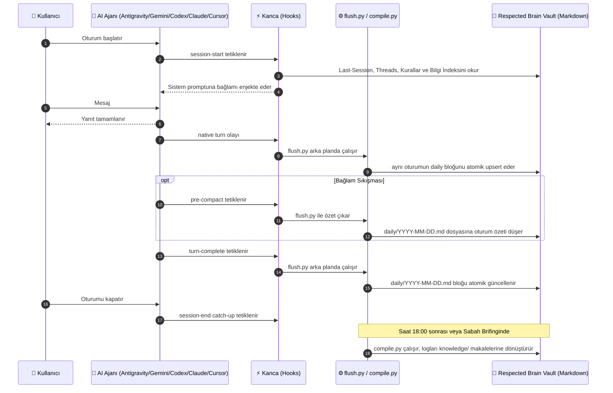
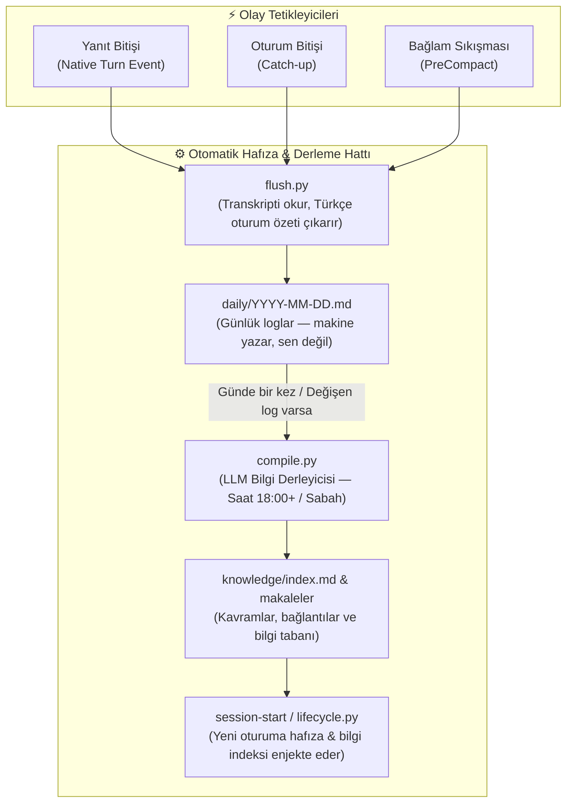

## Mimari





Yazma tarafı makineye ait, ilişki katmanı sana ait: ortağın hâlâ `Last-Session.md` ve `Threads.md`
dosyalarını kendi eliyle günceller. Makine katmanı onun yerine geçmez, altını doldurur.

### Dürüst Sınırlar: Ne Yapar, Ne Yapmaz?

| Ne Yapar? (Tasarım Hedefi) | Ne Yapmaz? (Dürüst Sınırlar) |
| :--- | :--- |
| **Tam Yerel ve Açık Format:** Notların %100 düz Markdown dosyalarıdır; Obsidian veya herhangi bir metin editörüyle sonsuza kadar okunabilir. | **Kapalı Kutu / SaaS Yok:** Gizli bir bulut sunucusuna veya ücretli üçüncü parti bellek platformuna bağımlı kılmaz. |
| **Damıtılmış İş Bağlamı:** Oturumlardan kararları, kuralları, aktif konuları ve bilgi ağını aktarır. | **Bağlamı Şişirmez:** 100.000 tokenlik ham sohbet dökümünü bir sonraki oturuma yığarak modeli yavaşlatmaz ve kota yakmaz. |
| **Sıfır Bağımlılık (Zero-Dep Core):** Dış Python kütüphaneleri (`pip install` dahi gerekmez) istemez; standart Python 3 ile çalışır. | **Ağır Vektör DB Şartı Koşmaz:** Ağır embedding modelleri ve GPU gerektirmez; SQLite FTS5 ve Karpathy LLM derleyicisi kullanır. |
| **Çoklu AI Özgürlüğü:** Antigravity ile başla, Codex ile devam et, Gemini veya Claude ile test yaz. Hepsi aynı hafızaya konuşur. | **Ham UI geçmişini taşımaz:** Araçlar arasında taşınan şey damıtılmış iş bağlamıdır; sağlayıcı hesabının özel sohbet ekranı değildir. |

### Agent uyumluluk tablosu

| Agent | Ortak talimat | Skill kaynağı | Oturum kancaları | Arka plan özetleyici |
| --- | --- | --- | --- | --- |
| Antigravity | `.agents/rules/beyin.md` | `.agents/skills/` | `PreInvocation`, `Stop` (turn) | `agy` |
| Gemini CLI | `.gemini/GEMINI.md` | `.gemini/skills/` (global) | `SessionStart`, `BeforeAgent`, `AfterAgent` (turn), `PreCompress`, `SessionEnd` | `gemini` |
| Codex | `AGENTS.md` | `.agents/skills/` | `notify` (turn) + başlangıç/prompt/pre-compact/kapanış | `codex exec` |
| Cursor | `.cursor/rules/beyin.mdc` + `AGENTS.md` | `.agents/skills/` | `afterAgentResponse` (turn) + başlangıç/prompt/pre-compact/kapanış | `cursor-agent -p` |
| Claude Code | `CLAUDE.md` | `.claude/skills/` | `Stop` (async turn) + başlangıç/prompt/pre-compact/kapanış | `claude -p` |

Talimat ve skill içerikleri `.beyin/` altındaki tek kaynaktan üretilir; yani beş ayrı kopyayı
elle güncellemezsin. Dosya adları ve kanca olayları agentların kendi formatları farklı olduğu için
aynı değildir, fakat verdikleri hafıza davranışı ortaktır.

## Ne alıyorsun

```
{Ad}OS/
├── 📥 000-Inbox/Dump/        # ham yakalama
├── 🎯 100-Command-Center/    # Dashboard
├── 🏰 300-Projects/          # proje başına bir klasör
├── 🧠 500-Knowledge/         # insanın yazdığı notlar
├── 🛠️ 600-Arsenal/           # araçlar, kişiler, kaynaklar
├── 🔮 850-Companion/         # ortağın kalıcı hafızası (+ Kurallar.md)
├── daily/                    # makine yazar: günlük loglar
├── knowledge/                # makine derler: makaleler + bağlantılar + indeks
├── 📦 900-Archive/
├── 📋 Templates/
├── .beyin/                   # tek kaynak: talimatlar, skill'ler, ortak adaptör
├── .claude/                  # ortak çekirdek runtime + Claude adapteri (uyumluluk yolu)
├── .codex/                   # Codex hook'ları
├── .cursor/                  # Cursor rules ve hook'ları
└── .agents/                  # Antigravity rules, skill ve hook'ları
```

- **İsmini sen koyduğun bir AI ortağı.** Varsayılan dili Türkçe.
- **Süreklilik motoru.** Sıfır bağımlılıklı kancalar her açılışta hafızayı bağlama koyar,
  her tamamlanan yanıttan sonra oturum bloğunu diskte atomik olarak günceller.
- **Dosya tabanlı hafıza.** API anahtarı yok, ücretli servis yok, her şey senin diskinde.
- **Opsiyonel semantik hafıza.** [mem0](https://mem0.ai) ücretsiz katmanı üstüne anlamsal arama
  ekler, temel sürümü tamamen ücretsiz ve kredi kartı istemez. İstemezsen sistem eksiksiz çalışır.
- **Tek tık başlatıcı.** macOS'ta masaüstünde 🧠 ikonlu bir uygulama vault'u anında açar. Linux'ta
  yerine bir `.desktop` kısayolu yazılır (test edilmedi).

## Maliyet, dürüst hâliyle

Ekstra bir API anahtarı gerekmez; arka plan özetleyici ve derleyici seçilen yerel CLI'ın mevcut
oturumunu/aboneliğini kullanır. Hangi sağlayıcı özeti çıkarırsa kullanım onun kotasına yazılır.
Birden fazla CLI kuruluysa geçici limitlerde otomatik fallback yapılabilir.

## Gereksinimler

Zorunlu, her platformda: desteklenen yerel AI CLI'lardan en az biri (`claude`, `codex`, `agy`,
`gemini`, `cursor-agent`), [Obsidian](https://obsidian.md) ve Python 3. POSIX/WSL komutu `python3`, native
Windows hook komutu kurulumda doğrulanan mutlak Python executable olur. Python opsiyonel değil: günlük log da bilgi derlemesi de onun
üstünde çalışır.

| Platform | Durum | Ne çalışır, ne çalışmaz |
| --- | --- | --- |
| macOS | **fiziksel 0.0.1 smoke bekliyor** | `.webloc`, LaunchAgent ve tüm adaptör sözleşmeleri otomatik testlidir; fiziksel kanıt `tests/smoke/macos.sh` ile alınır. |
| Linux | **host smoke raporuna göre** | XDG `.desktop`, portable runtime ve provider adaptörleri `tests/smoke/linux.sh` ile doğrulanır. |
| Saf WSL | **fiziksel WSL2 doğrulandı** | portable Python motoru, hook ve upstream-sync paketleri doğrudan WSL2 içinde geçti. |
| Windows + WSL | **fiziksel hibrit smoke doğrulandı** | Windows hook'u `wsl.exe` ile `/mnt/c/...` vault'taki turn flush'ı çalıştırdı. |
| Windows native | **fiziksel smoke doğrulandı** | gerçek Windows dosya sistemi üzerinde install → turn upsert → iki update → uninstall zinciri geçti. |

Masaüstü kısayolu macOS'ta standart `.webloc`, Linux'ta XDG `.desktop`, Windows'ta `.url` kullanır.
Güncel kanıt ve açık kalan fiziksel hostlar [docs/TEST-MATRIX.md](docs/TEST-MATRIX.md) içindedir.

## Sık sorulan sorular

### Vault'un adı `respectedOS` olmak zorunda mı?

Hayır. Bu yalnız bir kullanıcının kişisel seçimidir. Kurulumda verilen herhangi bir klasör adı ve
mutlak yol kullanılabilir. İçerideki `🔮 850-Companion` klasörü ise runtime sözleşmesinin sabit
parçasıdır; AI ortağının görünen adı dosyaların içindedir.

### Her agentın hesabına ayrıca giriş gerekir mi?

Yalnız kullanmak istediğin sağlayıcıların yerel CLI'larına giriş gerekir. En az bir desteklenen CLI
yeterlidir; otomatik fallback için birden fazlasının kurulu ve giriş yapılmış olması gerekir.

### Aynı anda iki agent kullanabilir miyim?

Evet. Günlük yazımı kilit ve tekrar kontrolüyle korunur. Yine de aynı dosyayı iki agentın aynı anda
düzenlemesi normal git/uygulama çakışması yaratabilir; bu hafıza sisteminden bağımsızdır.

### Bilgisayar kendi kendine agent veya komut penceresi açar mı?

Hayır. Arka plan işlemleri tamamen konsolsuz ve sessiz çalışır. Günlük özet her tamamlanan turn
sonrasında aynı oturum bloğuna yazılır; bilgi derlemesi ise sabah 08.00 zamanlayıcısında brifing öncesinde ve
oturum başlangıçlarında kaçırılan günler için tamamlanmış-gün catch-up olarak çalışır.

## Bir şey ters giderse

Vault klasöründe kullandığın ajana `beyin doktor` yaz. Kancalar, scriptler, python3, yerel AI CLI,
günlük log tazeliği, son derleme durumu, iCloud çakışma dosyaları ve git durumu tek tabloda gelir,
her kırmızı satırın altında düzeltme komutu yazar.

---

## Credits

Bilgi derleme mimarisi Andrej Karpathy'nin LLM bilgi tabanı desenine dayanır:
https://gist.github.com/karpathy/442a6bf555914893e9891c11519de94f

Respected Brain, [Avenox Beyin](https://github.com/avenoxai/avenoxbeyin) projesinin MIT lisanslı
geçmişinden doğdu; commit geçmişini ve lisans atfını koruyarak artık bağımsız geliştiriliyor.

## Lisans

MIT, [LICENSE](LICENSE) dosyasına bak. PR'lar açık.

---

## In English (short version)

**Respected Brain** is an independently developed, provider-neutral Obsidian second brain for Claude Code, Codex, Cursor,
Antigravity, and Gemini CLI. It keeps one canonical instruction and skill source, then generates each agent's
native rules and hooks. Native completed-turn events atomically upsert conversations into `daily/`;
the selected local CLI (`claude`, `codex`, `agy`, `gemini`, or `cursor-agent`) compiles those logs into linked articles under
`knowledge/`. The next session starts with that knowledge index already in context.

Install: `git clone https://github.com/respected0/respectedbrain.git && cd respectedbrain`, then ask
your coding agent to read and follow `docs/guides/SETUP.md`. Already running a pre-0.0.1 vault?
Use `python3 runtime/scripts/update_respected.py "/path/to/vault" --apply` to update to `v0.0.1`.
Fresh vaults are initialized directly from `template/` or via `setup` (`setup.exe` / `setup` / `setup.py`).
Updates are additive only, your memory files are never touched, the settings merge is idempotent, and
updater actions are verified before execution. Two things to keep in mind: the memory folder uses the
fixed `🔮 850-Companion` path, and version stamps are written only after every validation gate passes.

Platform honesty: Windows Native, physical WSL2, and the hybrid Windows→WSL bridge have current
physical-host evidence. macOS remains `NOT VERIFIED` until the packaged external smoke runner passes.
A provider-neutral global installer can connect any named vault to Claude, Codex, Cursor,
Antigravity, and Gemini across unrelated code repositories while preserving an existing Codex notify chain.

Users may switch coding agents without migrating the vault. `auto` prefers the agent that emitted
the hook; a persistent first-choice summarizer can be selected with `set_summary_provider.py`, and
retryable quota/timeout/5xx failures fall back to another installed authenticated CLI.

No extra API key is required: background work uses an authenticated local AI CLI. The core uses
the Python standard library; POSIX keeps thin Bash compatibility launchers. Knowledge-compilation
architecture credit:
Andrej Karpathy's LLM knowledge base pattern,
https://gist.github.com/karpathy/442a6bf555914893e9891c11519de94f. The project began from the
MIT-licensed history of Avenox Beyin and preserves that attribution and commit history.
